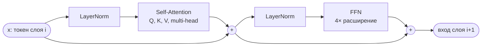
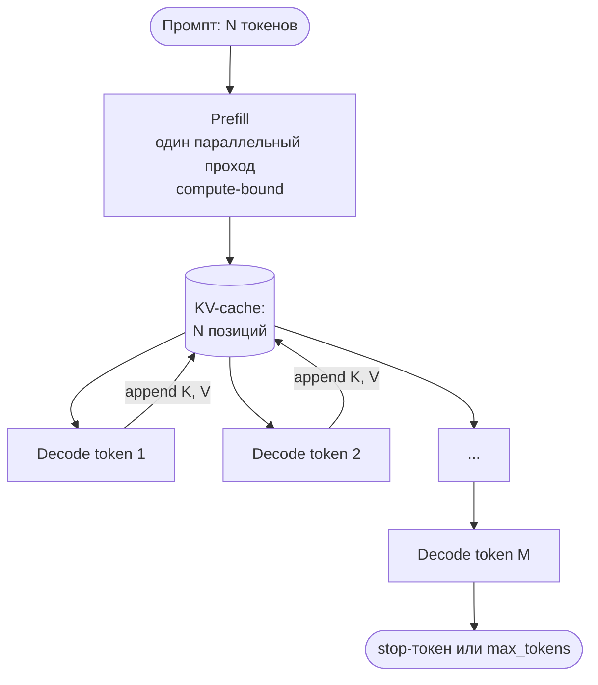
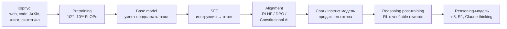

# Глава 1. Принципы работы генеративного ИИ

> «Модель не знает истину. Модель знает распределение». Эта фраза должна стать первой строкой в `.cursorrules` каждого инженера, работающего с LLM.

## Зачем эта глава

Вы уже пользовались Copilot, Cursor, Claude Code или ChatGPT. Возможно, у вас даже есть рабочий процесс «спросил — вставил — поправил». Этого достаточно, чтобы быть продуктивным сегодня, но недостаточно, чтобы:

- понимать, **почему** модель в одной задаче выдаёт идеальный код, а в соседней — уверенно ссылается на несуществующий API;
- объяснять команде, **где** граница между «AI-ассистированной разработкой» и «AI-инициированной разработкой»;
- проектировать процессы, в которых модель — это **компонент системы** с известными свойствами надёжности, а не магический оракул.

Эта глава закладывает инженерный фундамент: внутреннее устройство LLM ровно настолько, насколько это нужно практикующему разработчику, и набор ментальных моделей, которые мы будем эксплуатировать в остальных модулях курса (prompt engineering, генерация кода, debugging, тестирование, локальные модели и RAG).

Целевой уровень — middle/senior, знакомый с базовой математикой ML, но не обязательно с deep learning.

---

## 1.1 Что такое LLM на самом деле

> **TL;DR.** LLM — параметрическая функция, авторегрессивно сэмплирующая следующий токен. Архитектура decoder-only Transformer, на каждом слое — self-attention (Q/K/V) и FFN (расширение 4×). Запоминаются четыре числа модели: параметры, контекст, knowledge cutoff, метод пост-тренинга. Рынок 2026 делится на frontier (закрытые), open-weights и code-specialized.

### Формальное определение

Большая языковая модель (Large Language Model, LLM) — это параметрическая функция, аппроксимирующая распределение

$$P(x_t \mid x_1, x_2, \ldots, x_{t-1})$$

— вероятность следующего токена при условии всей предшествующей последовательности. Всё, что делает модель в режиме инференса, — это **авторегрессивная выборка** из этого распределения.

**Режим инференса (inference mode)** — это режим использования уже обученной модели. Веса заморожены, градиенты не считаются, оптимизатор не работает. На вход приходит последовательность токенов (промпт), на выход — следующий токен (или распределение по всему словарю). Противопоставляется **режиму обучения (training mode)**, где модель видит правильные ответы из датасета, считает loss, и веса обновляются. Обучение — это сотни тысяч GPU-часов и миллионы долларов; инференс — то, что вы вызываете API'кой за миллисекунды.

**Авторегрессивная выборка** — пошаговая генерация:
1. Берётся текущий контекст (промпт + всё, что модель уже сгенерировала).
2. Один проход модели даёт логиты (ненормированные оценки) по всему словарю — обычно 50–250 тысяч токенов.
3. Применяется softmax → распределение вероятностей.
4. По выбранной decoding-стратегии (greedy, top-k, top-p, см. 1.4) сэмплируется один токен.
5. Этот токен **дописывается в конец контекста**, и цикл повторяется. Каждый следующий шаг видит и весь промпт, и всё, что было сгенерировано на предыдущих шагах. Отсюда «авто-» (на саму себя) «регрессия».
6. Цикл останавливается при выборе специального **stop-токена** (`<|endoftext|>`, `<|im_end|>`), при достижении лимита `max_tokens`, или при появлении пользовательской stop-строки.

Псевдокод цикла генерации:

```python
tokens = tokenizer.encode(prompt)
while len(tokens) < max_tokens:
    logits = model.forward(tokens)[-1]
    next_token = sample(logits, temperature, top_p)
    if next_token == EOS:
        break
    tokens.append(next_token)
return tokenizer.decode(tokens[len(prompt_tokens):])
```

Никаких «знаний», «понимания», «намерений» в самой модели нет. Есть веса, есть распределение, есть процедура сэмплирования. Это критично для построения правильных ожиданий: модель не «думает над задачей» — она **продолжает текст** так, чтобы продолжение было статистически правдоподобным согласно её обучающим данным.

Из авторегрессивности вытекают практически важные следствия:
- **Невозможно «вернуться» и переписать уже сгенерированное.** Если модель ошиблась в первой строке кода — она будет достраивать ответ под эту ошибку (отсюда популярность reasoning-моделей и self-correction).
- **Каждый следующий токен — это полный проход через всю сеть.** Длинные ответы линейно дороже коротких.
- **Промпт обрабатывается параллельно (prefill), генерация — последовательно (decode).** Это две разные стадии с разной экономикой (см. KV-кеш ниже).

### Архитектура: Transformer в одном абзаце

С 2017 года (Vaswani et al., «Attention Is All You Need») доминирующая архитектура — **decoder-only Transformer**. Ключевые элементы:

- **Embedding-слой**: токен → вектор фиксированной размерности (обычно 4096–16384).
- **Self-attention**: каждый токен «смотрит» на все предыдущие токены в контексте и взвешивает их влияние через матрицы Q (query), K (key), V (value). Сложность — O(n²) по длине контекста, что и порождает большинство инженерных компромиссов (sliding window, sparse attention, GQA, MoE).
- **Feed-forward (MLP)**: нелинейное преобразование, в котором, по гипотезе interpretability-исследований (Anthropic, 2023–2025), «живут» концептуальные представления.
- **Десятки–сотни слоёв** этих блоков, сложенных стопкой.
- **Unembedding (LM head)**: проекция последнего скрытого состояния обратно в распределение по словарю токенов.

#### Механизм самовнимания (self-attention) подробнее

Self-attention отвечает на один вопрос: «когда я обрабатываю токен на позиции *i*, насколько релевантен мне каждый из предшествующих токенов на позициях *1…i*?»

Для каждого токена входной последовательности модель строит **три** проекции его embedding-вектора через три обучаемые матрицы весов:

- **Q (query, запрос)** — «что я ищу?». Это вектор-вопрос: какие свойства окружающих токенов мне сейчас важны.
- **K (key, ключ)** — «чем я могу быть полезен?». Это вектор-аннотация: что данный токен «декларирует» о себе для других.
- **V (value, значение)** — «что я передам, если меня выберут». Это содержательная информация, которая будет смешана в выход.

Все три — обычные линейные слои:

```
Q = X · W_Q     # X — матрица embedding-ов размера [seq_len × d_model]
K = X · W_K
V = X · W_V
```

Удобная аналогия — поиск в базе. Q — это поисковый запрос, K — индексы документов, V — содержимое документов. Скалярное произведение `Q · Kᵀ` оценивает «насколько хорошо запрос совпадает с каждым ключом», а `softmax(Q · Kᵀ / √d_k) · V` возвращает взвешенную смесь содержимого тех документов, чьи ключи лучше совпали с запросом:

$$\text{Attention}(Q, K, V) = \text{softmax}\!\left(\frac{Q K^\top}{\sqrt{d_k}}\right) V$$

Деление на √d_k — это нормализация, чтобы при больших размерностях softmax не вырождался в one-hot.

Несколько практически значимых деталей:

- **Causal mask** в decoder-only моделях запрещает токену смотреть в будущее. Поэтому при обработке позиции *i* доступны только позиции *1…i* — это и делает модель строго авторегрессивной.
- **Multi-head attention**: в каждом слое есть не одна, а несколько (16–128) параллельных «голов» с разными матрицами W_Q, W_K, W_V. Каждая голова специализируется на своём типе зависимости — синтаксис, кореференция, длинные связи и т.п. Их выходы конкатенируются.
- **GQA / MQA (Grouped/Multi-Query Attention)** — оптимизация, в которой несколько Q-голов делят между собой одни K и V. Снижает размер KV-кеша в 4–8 раз почти без потери качества; используется в Llama 3, Mistral, Qwen.

#### Feed-forward (FFN, MLP)

После self-attention в каждом слое идёт **feed-forward network** (FFN, он же MLP-блок) — обычная двухслойная нейросеть, применяемая к каждому токену независимо. На псевдокоде:

```python
def ffn(x):                       # x: [d_model]
    h = activation(x @ W1 + b1)   # расширение: d_model → 4 · d_model
    return h @ W2 + b2            # сжатие:    4 · d_model → d_model
```

`activation` — нелинейность (GeLU, SwiGLU). «Расширение» внутри FFN обычно в 4× больше d_model: для модели с d_model = 4096 промежуточная размерность — 16384.

Зачем нужен FFN, когда уже есть attention:
- attention **смешивает** информацию между токенами;
- FFN **трансформирует** информацию внутри каждого токена.

Это разделение труда: attention — «коммуникация», FFN — «вычисление». На FFN обычно приходится **2/3 всех параметров модели**, и именно там, по гипотезе механистической интерпретируемости (Anthropic, OpenAI Circuits), хранятся «факты» и концепты — отдельные нейроны или линейные комбинации соответствуют конкретным понятиям («Эйфелева башня», «Python», «JSON-схема»).

Полный блок Transformer выглядит так:



Остаточные связи (стрелки в `+`) критичны для обучения глубоких сетей: они позволяют градиенту «обходить» каждый блок и спокойно течь через десятки слоёв.

#### Четыре числа любой модели

Для практика важно запомнить четыре числа любой модели:
1. **Количество параметров** (8B, 70B, 405B, ~1–2T для фронтира).
2. **Размер контекстного окна** (8k, 128k, 200k, 1M, 10M).
3. **Дата отсечения данных** (knowledge cutoff).
4. **Метод пост-тренинга** (base / SFT / RLHF / Constitutional AI / reasoning).

##### Что такое «количество параметров» и почему это важно

**Параметр** — одно вещественное число в весах модели (элемент одной из матриц W_Q, W_K, W_V, W_1, W_2, embedding-таблицы и т.д.). Обозначается буквой B = billion (миллиард). Llama 3.1 405B = 405 миллиардов настроенных чисел.

Что меняется с количеством параметров:

- **Объём памяти.** Грубое правило: 1B параметров ≈ 2 GB VRAM в формате fp16, ≈ 0.5 GB в 4-битной квантизации. Поэтому 70B-модель в 4 битах поместится в одну H100 (80 GB), а fp16 — нет.
- **Качество и обобщение.** Растёт по scaling laws, но с насыщением. Между 7B и 70B разница огромная; между 70B и 405B — заметная, но субквадратичная по бюджету.
- **Стоимость и латентность инференса.** Генерация одного токена ≈ один полный проход через модель. Скорость в токенах/сек обратно пропорциональна размеру.

Для **MoE-моделей** (см. 1.3) есть ещё одно число — **активные параметры**: сколько реально работает на каждом токене. У DeepSeek V3 — 671B всего, но активных лишь ~37B. Это ключ к экономике современных open-weights моделей: качество как у крупной dense-модели, цена инференса — как у средней.

##### Что такое «фронтир» (frontier models)

**Фронтирной (frontier)** называют модель, которая на момент релиза находится на переднем крае возможностей по совокупности бенчмарков и сложных задач. Понятие возникло в индустрии и регуляторике (US AI Executive Order, EU AI Act) для описания моделей, чьё появление сопряжено с новыми рисками и требует отдельного отношения. На практике критерий простой: **«сейчас мало кто умеет делать такое»**.

Состояние границы постоянно сдвигается: GPT-3 (2020) был фронтиром, в 2026 это уровень, на котором уже работают модели на ноутбуке. Сегодня фронтир — это GPT-4.1, Claude 4.5 Sonnet, Gemini 2.5 Pro, o3, и обычно — закрытые модели с API-доступом, требующие масштабов compute, доступных единицам компаний.

Противопоставление:
- **frontier** — самые мощные модели (закрытые, API-only);
- **state-of-the-art open** — лучшие из открытых (DeepSeek V3, Llama 4, Qwen 3), обычно с лагом 6–12 месяцев от фронтира;
- **commodity** — модели, ставшие массовым стандартом (8B–32B классы), запускаемые локально.

### Современный ландшафт _(as of Q2 2026)_

> **Versioned facts.** Списки моделей и их характеристики ниже — `[as of Q2 2026]`. Поле меняется быстро: при следующей итерации курса этот раздел обновляется в первую очередь. Маркер `[as of Q2 2026]` означает: на момент сборки этой главы данные актуальны; перед каждым новым потоком сверяйтесь с первоисточником производителя и независимыми бенчмарками (LMSys Arena, SWE-bench, Aider Polyglot).

Рынок поделён на три ясно различимых класса моделей:

**Фронтирные closed-source (API-only):**
- **OpenAI**: GPT-4.1, GPT-4o, серия reasoning — o1, o3, o4-mini.
- **Anthropic**: Claude 3.7 Sonnet, Claude 4 Opus, Claude 4.5 Sonnet (де-факто рабочая лошадка для кодинга в 2026).
- **Google**: Gemini 2.5 Pro, Gemini 2.5 Flash (контекст до 1M–2M токенов).
- **xAI**: Grok 4.

**Открытые веса (можно запустить локально):**
- **Meta**: Llama 3.3 70B, Llama 4 (MoE).
- **DeepSeek**: V3 (671B MoE с активными ~37B), R1 — reasoning-модель, сопоставимая с o1 при существенно меньшей цене.
- **Alibaba**: Qwen 2.5 / Qwen 3, Qwen Coder — лидер для локального кодинга.
- **Mistral**: Mistral Small/Large, Codestral.
- **Google**: Gemma 3 — open-weights линейка, отличающаяся от закрытого Gemini.
- **Microsoft**: Phi-4 — компактные модели для edge и on-device-сценариев.

> **Уточнение.** Open-weights vs open-source — в обиходе их часто путают, но это разные вещи:
> - **Open-weights** — опубликованы веса модели в формате `.safetensors` или `.gguf`. Их можно скачать, запустить, дообучить. Но **код обучения, датасет и процесс отбора данных** обычно остаются закрытыми, и лицензия может ограничивать коммерческое использование (Llama community license, Gemma terms).
> - **Open-source LLM в строгом смысле OSI** — публикуется и код, и данные, и веса под совместимой лицензией (Apache 2.0, MIT). Таких моделей на фронтире фактически нет; ближе всего — OLMo, Pythia, K2-65B.
>
> Когда в курсе говорится «локальные модели» — речь почти всегда об open-weights. Это инженерно достаточно: вы запустили, использовали, дообучили на своём кейсе. Воспроизвести обучение с нуля вы и не планируете.

**Специализированные code-модели:**
Codestral, Qwen Coder, DeepSeek-Coder-V2, StarCoder 2 — оптимизированы под FIM (fill-in-the-middle) и многоязычное автодополнение.

> **Definition.** **FIM (Fill-In-the-Middle).** Обычная decoder-only модель умеет дописывать только в конец. Но IDE-автодополнение требует другого: «вот код **до** курсора, вот код **после**, сгенерируй то, что должно быть в **середине**». Это другая задача.
>
> FIM решается простым приёмом обучения: документ во время pretraining случайно режут на три части — `prefix`, `middle`, `suffix` — и переставляют в формате `<PRE> prefix <SUF> suffix <MID> middle`. Модель учится, увидев `<PRE>...<SUF>...<MID>`, продолжить именно `middle`. Архитектура та же, только формат данных другой.
>
> Поэтому модели «для кода» отличаются от моделей «для чата» именно **наличием FIM-обучения** и хорошей токенизацией кода (отдельные токены для индентаций, скобок, ключевых слов). В Cursor Tab, GitHub Copilot, JetBrains AI Assistant под капотом — именно FIM-вызовы. Чат-модель типа GPT-4o умеет «дописать середину» через промпт-трюк, но качество и латентность хуже, чем у специализированных Codestral / Qwen Coder.

**Практическое следствие.** Выбор модели — это инженерное решение с трейдоффами по цене, латентности, длине контекста, политикам безопасности и качеству на конкретной задаче. Не существует «лучшей модели вообще»: Claude 4.5 Sonnet может быть сильнее в архитектурном рефакторинге, GPT-4.1 — в строгом следовании JSON-схеме, Gemini — на огромных контекстах, локальный Qwen Coder — там, где нельзя отправлять код вовне.

> **See also.** §1.2 (токены и контекст — единица, в которой работают эти параметры) · §1.3 (как обучаются веса этой архитектуры) · §1.6 (reasoning-варианты этих же моделей) · Модуль 7 (открытые веса локально).

---

## 1.2 Токены и контекст: единица измерения мира LLM

> **TL;DR.** Модель работает с токенами, не словами. Доминирующий алгоритм — byte-level BPE. Контекстное окно 128k–1M на бумаге, эффективно — 30–50% от него. KV-кеш делит инференс на стадии prefill (быстро, параллельно) и decode (медленно, по токену) — отсюда и цены, где output в 3–5× дороже input. Prompt caching у провайдеров снижает счёт ещё в 5–10×, если стабильный контекст лежит в начале запроса.

### Токенизация

Модель не оперирует символами или словами. Она работает с **токенами** — заранее построенными фрагментами байт. Токенизатор — это **отдельный артефакт**, обученный один раз, заморожённый и приложенный к модели; смена токенизатора означает переобучение всей модели.

#### Алгоритмы токенизации

В индустрии используются четыре основных подхода:

1. **BPE (Byte-Pair Encoding)** — алгоритм, унаследованный из сжатия данных (Gage, 1994; Sennrich et al., 2016). Стартует с алфавита из отдельных символов (или байтов) и итеративно объединяет самую частую пару в один токен. Останавливается при достижении заданного размера словаря. Используется в **GPT-2/3** через библиотеку `tiktoken`.

2. **Byte-level BPE** — современная доминирующая разновидность. BPE поверх **сырых UTF-8 байт**, а не символов Unicode. Преимущество: словарь покрывает любой возможный текст без `<unk>`-токенов и без специальной обработки пробелов и переводов строки. Используется в **GPT-2, GPT-3.5/4/4o, Llama 2/3, Mistral, Qwen, DeepSeek** — фактически в большинстве современных моделей. В GPT-4o применяется обновлённый словарь `o200k_base` на ~200 тысяч токенов с улучшенным покрытием неанглийских языков.

3. **WordPiece** — близкий родственник BPE, использует не «частоту пары», а максимизацию правдоподобия. Доминировал в эпоху BERT (2018–2020), сейчас встречается в основном в encoder-моделях для классификации и эмбеддингов; в современных decoder-LLM почти не используется.

4. **SentencePiece (Unigram)** — альтернатива BPE от Google. Рассматривает токенизацию как вероятностную модель: сначала заводит большой словарь, потом итеративно выкидывает наименее полезные токены. Не требует предварительной сегментации по пробелам, что делает её удобной для языков без явных границ слов (китайский, японский). Используется в **Llama 1, T5, Gemma, Gemini** (внутренний токенизатор).

**Что в итоге доминирует на 2026 год:** byte-level BPE — на нём построены практически все ведущие модели OpenAI, Meta, Mistral, DeepSeek, Qwen. SentencePiece-Unigram остался в Google-семействе (T5, Gemma, Gemini) и местами в специализированных моделях. WordPiece — наследие BERT-эры.

Размеры словарей сегодня:
- GPT-3.5/4 (`cl100k_base`): ~100 тыс. токенов.
- GPT-4o (`o200k_base`): ~200 тыс.
- Llama 3: 128 тыс.
- DeepSeek V3: ~129 тыс.
- Gemini: внутренний, неопубликованный.

Чем больше словарь — тем компактнее представление текста (особенно неанглийского), но тем больше памяти на embedding-слой и LM-head.

#### Токенизатор как граница знаний модели

Токенизатор фиксируется до обучения. Если в нём нет отдельного токена для нового слова, модель может выучить его только по комбинации существующих токенов. Это объясняет ряд эффектов:

- Редкие имена и термины токенизуются длинно и ведут себя «странно» — модель видит их как набор фрагментов.
- Числа разной длины — разное число токенов; математика работает плохо именно из-за этого.
- Эмодзи и редкие символы → 4–10 токенов на одну «букву».
- Историческая байка про токены `SolidGoldMagikarp` и подобные «glitch tokens» в GPT-3 — следствие того, что они попали в словарь, но почти не встретились в обучающих данных.

#### Эмпирические ориентиры

Несколько эмпирических ориентиров для английского и кода:
- 1 токен ≈ 4 символа ≈ ¾ слова английского текста;
- 100 токенов ≈ 75 слов;
- русский и другие нелатинские языки часто токенизируются **в 1.5–2.5 раза дороже** (привет, кириллица в UTF-8);
- редкие имена, эмодзи, длинные числа дробятся на множество токенов.

Это не абстракция, а ваш счёт в API. Пример:

```python
# OpenAI tiktoken
import tiktoken
enc = tiktoken.encoding_for_model("gpt-4o")
print(len(enc.encode("JavaScript"))) # 1
print(len(enc.encode("C#")))          # 2
print(len(enc.encode("Привет, мир"))) # 6
print(len(enc.encode("def foo(x): return x + 1"))) # 9
```

Практические следствия токенизации, о которых часто забывают:
1. **Стоимость нерусских/спецсимвольных промптов**. Длинные русскоязычные system prompts оплачиваются с надбавкой.
2. **Странности с числами**. Модели исторически плохо считают именно потому, что «12345» — это не одно число, а несколько токенов вроде `123`, `45`.
3. **Чувствительность к форматированию**. Лишние пробелы, табы и markdown-разметка тратят токены и могут менять поведение модели.

### Контекстное окно: формальный размер vs эффективный

Контекстное окно — это **жёсткий лимит** на сумму input + output токенов одного запроса. На 2026 год типичные значения:

| Модель                 | Контекст      |
|------------------------|---------------|
| GPT-4o / GPT-4.1       | 128k / 1M     |
| Claude 4.5 Sonnet      | 200k          |
| Gemini 2.5 Pro         | 1M (до 2M)    |
| Llama 3.3 70B          | 128k          |
| Qwen 2.5 Coder 32B     | 128k          |

_`[as of 2026]`_ — числа меняются примерно раз в квартал.

Это **формальный** контекст — то, что физически умещается. Не путайте с **эффективным** контекстом, в котором модель сохраняет качество.

Хорошо документированный феномен — **«Lost in the Middle»** (Liu et al., 2023): на длинном контексте модель уверенно использует начало и конец, но «забывает» середину. Бенчмарк **Needle-In-A-Haystack** (NIAH) показывает деградацию для большинства моделей уже после 32–64k. Современные модели (Gemini 2.5, Claude 4.5) на NIAH ведут себя почти идеально, но синтетические бенчмарки не равны реальной задаче с 50 файлами кода и 200 страницами тикетов.

Эмпирическое инженерное правило: **используйте 30–50% от номинального окна, остальное держите как буфер**. Если задача требует больше — это сигнал к декомпозиции, RAG или агентному подходу с внешней памятью (см. модули 2 и 7).

### KV-кеш: почему prefill дешевле, а decode — нет

При генерации одного длинного ответа модель проходит сквозь все свои слои на **каждом** новом токене. Без оптимизации она бы пересчитывала Q, K, V для всего контекста заново — это было бы катастрофически медленно.

**KV-кеш (Key-Value cache)** решает эту проблему. Поскольку K и V зависят только от уже обработанных токенов и не меняются при добавлении новых, их достаточно посчитать **один раз** и сохранить в памяти GPU. На каждом следующем шаге генерации:

- для нового токена считается только его собственный Q, K, V;
- его K и V **дописываются** в кеш;
- attention этого токена считается против всего накопленного кеша K и V.

Из-за KV-кеша инференс LLM физически разбит на две качественно разные стадии:

| Стадия     | Что делает                                                | Bottleneck       | Цена / токен |
|------------|-----------------------------------------------------------|------------------|--------------|
| **Prefill** | Параллельно обрабатывает весь промпт, заполняет KV-кеш   | Compute-bound    | Низкая       |
| **Decode**  | Генерирует токены по одному, читая весь KV-кеш           | Memory-bound     | Высокая      |



Это даёт несколько практических следствий:

1. **Outputs стоят в 3–5 раз дороже inputs** в API-прайсингах — не из жадности, а потому что decode медленнее в железе.
2. **TTFT (time-to-first-token) растёт с длиной промпта**, потому что prefill всё ещё O(n²) по контексту.
3. **TPS (tokens-per-second) на стадии decode** определяется пропускной способностью памяти GPU, а не FLOPS.
4. **Размер KV-кеша** — отдельная статья расходов VRAM. Для контекста 128k у Llama 70B kv-cache занимает десятки гигабайт; именно поэтому используются GQA / MQA, чтобы его уменьшить, а также квантизация кеша до 8 бит и ниже.

KV-кеш живёт **в одной сессии генерации** и обычно стирается, как только запрос завершён.

### Prompt caching и почему он меняет экономику

В 2024–2026 годах все ведущие провайдеры внедрили **кеширование префикса промпта** (Anthropic prompt caching, OpenAI prompt caching, Gemini context caching). Идея: если первые N токенов запроса не меняются между вызовами, провайдер сохраняет KV-кеш слоёв attention **между запросами** (а не только внутри одного), и при повторном обращении не пересчитывает их.

Эффект:
- input-токены кешированной части дешевле в **3–10 раз**;
- латентность TTFT (time to first token) падает в разы.

Практика: помещайте **стабильный контекст** (system prompt, документация, схема БД, tool-определения) в начало запроса; **изменчивую часть** (текущий вопрос пользователя) — в конец. Это не косметика, это снижение счёта в 5+ раз для агентов.

> **See also.** §1.4 (как длина output связана с латентностью) · §1.10 (правила управления контекстом) · Модуль 2 (структура промпта) · Модуль 8 (RAG как способ обхода ограничений контекста).

---

## 1.3 Как обучаются модели

> **TL;DR.** Цикл жизни LLM: pretraining (next-token на огромном корпусе) → SFT (учим следовать инструкциям) → alignment (RLHF / DPO / Constitutional AI приводят к человеческим предпочтениям) → опционально reasoning post-training (RL с проверяемыми наградами). DPO вытеснил RLHF в open-source благодаря простоте и стабильности. MoE-архитектуры дают качество крупной модели по цене средней. Knowledge cutoff — слепая зона, антидот: RAG и tool use.

Цикл жизни современной LLM состоит из трёх–четырёх этапов. Понимать их нужно не чтобы тренировать (вы вряд ли будете), а чтобы предсказывать поведение модели.




### Этап 1. Pretraining

Модель тренируется предсказывать следующий токен на огромном корпусе:
- веб-страницы (Common Crawl, отфильтрованные версии);
- книги (LibGen, исторические корпусы);
- код (GitHub, отфильтрованный по лицензиям и качеству);
- научные публикации (ArXiv, PubMed);
- Википедия и подобные структурированные источники;
- синтетические данные (особенно с 2024 — модель X генерирует обучающие данные для модели Y).

Бюджет обучения фронтира — **миллионы H100/H200-часов**, **10²⁵–10²⁶ FLOPs**. **Scaling laws** (Kaplan, 2020; Chinchilla / Hoffmann et al., 2022) утверждают, что качество растёт по степенному закону от трёх ресурсов: параметры, данные, compute. С 2024 года индустрия столкнулась с **затуханием отдачи** от чистого скейлинга и сместилась в сторону:
- более качественных данных и фильтрации (data quality > data quantity);
- архитектурных решений (Mixture of Experts, MoE);
- **test-time compute** — наращивания вычислений на этапе инференса (см. 1.6).

#### Mixture of Experts (MoE) — архитектура, изменившая экономику

Классический Transformer — **dense**: каждый токен проходит через все параметры всех слоёв. **Mixture of Experts** заменяет каждый FFN-блок на **набор «экспертов»** (обычно 8–256 параллельных FFN) и **роутер** — маленькую сеть, которая для каждого токена выбирает 1–2 наиболее подходящих экспертов.

Что меняется:
- **Активные параметры ≪ всего параметров.** В DeepSeek V3 — 671B всего, активных на токен ~37B. В Mixtral 8×22B — 141B всего, активных 39B. Для инференса важны именно активные.
- **Экономика инференса** становится как у средней модели, **качество** — как у крупной, потому что разные эксперты специализируются на разных типах данных (код vs естественный язык, разные предметные области).
- **Память** при этом нужна на **все** параметры — все эксперты должны лежать в VRAM, иначе роутер не сможет их выбрать. Поэтому MoE-модели редко влезают в один GPU и требуют шардирования.
- **Сложность обучения** выше: нужно балансировать загрузку экспертов (auxiliary loss), иначе один-два эксперта получат всё, остальные не обучатся (load imbalance).

_`[as of 2026]`_ MoE — стандарт для крупнейших открытых и закрытых моделей: GPT-4 (по утечкам), Mixtral, DeepSeek V3, Llama 4, Qwen 3 MoE, Grok 4. Dense-модели остались в более лёгком сегменте (8B–72B) и на специализированных задачах.

Практическое следствие для разработчика: при сравнении моделей смотрите **активные параметры**, а не общие. «DeepSeek V3 — 671B» звучит как монстр, но по скорости и цене инференса это конкурент Llama 70B, не Llama 405B.

После pretraining модель называется **base model**. Она умеет продолжать текст, но не следовать инструкциям и не вести диалог. Использовать её напрямую почти никогда не нужно.

### Этап 2. Supervised Fine-Tuning (SFT)

На отобранных вручную (или полуавтоматически) парах «инструкция → желаемый ответ» модель учат именно отвечать, а не продолжать. Технически это всё то же next-token prediction, но на узком распределении «диалогов с правильной разметкой». Здесь закладывается:
- стиль ответа (структурированный markdown, помощник-ассистент);
- соблюдение формата (JSON, code blocks);
- базовая безопасность.

SFT даёт модели **способность следовать инструкциям**, но не учит её отличать «лучший» ответ от «приемлемого». Для этого нужен следующий этап.

### Этап 3. Alignment с предпочтениями: RLHF, DPO, Constitutional AI

После SFT модель уже отвечает на вопросы — но среди множества возможных ответов нужно выбирать «более полезные, безвредные и честные». Для этого её приводят в соответствие с **человеческими предпочтениями**. Существует три ключевых подхода, каждый со своей логикой и инженерными последствиями.

**RLHF (Reinforcement Learning from Human Feedback)** — оригинальный рецепт InstructGPT (Ouyang et al., 2022), который сделал ChatGPT возможным.

Состоит из трёх шагов:
1. **Сбор предпочтений.** Размeтчики смотрят на пары ответов модели и говорят, какой лучше.
2. **Reward Model.** На этих сравнениях обучается отдельная нейросеть-«судья», которая для любого (запрос, ответ) выдаёт скалярную оценку.
3. **PPO (Proximal Policy Optimization).** Основная модель дообучается RL-алгоритмом так, чтобы максимизировать оценку reward-модели, с регуляризацией (KL-штрафом) против слишком сильного отхода от SFT-версии.

Минусы RLHF:
- Сложно. Три модели в памяти (актор, критик, reward), нестабильное обучение, чувствительность к гиперпараметрам.
- **Reward hacking.** Модель находит способы обмануть reward-модель, не повышая реальную полезность (например, делать длиннее, использовать markdown, льстить).
- Дорогой сбор разметки.

**DPO (Direct Preference Optimization)** — Rafailov et al., 2023. Главный сдвиг последних лет в alignment.

Идея: математически показано, что **оптимальную политику для RLHF можно получить без обучения reward-модели и без RL**. Достаточно прямой supervised-loss, который штрафует модель, когда вероятность «плохого» ответа выше «хорошего», и поощряет, когда наоборот.

Loss выглядит как простой классификационный — на псевдокоде это читается так:

```python
def dpo_loss(prompt, y_pos, y_neg, pi, pi_ref, beta):
    log_ratio_pos = log(pi(y_pos | prompt)) - log(pi_ref(y_pos | prompt))
    log_ratio_neg = log(pi(y_neg | prompt)) - log(pi_ref(y_neg | prompt))
    return -log_sigmoid(beta * (log_ratio_pos - log_ratio_neg))
```

`y_pos` — предпочтительный ответ, `y_neg` — отвергнутый, `pi_ref` — замороженная SFT-модель, `beta` — гиперпараметр «силы» предпочтений (обычно 0.1–0.5).

**Чем DPO лучше RLHF:**
- **Простота инженерии.** Одна модель, обычный supervised loss, обычные оптимизаторы. PPO-инфраструктура не нужна.
- **Стабильность обучения.** Меньше расхождений и failure modes; нет неустойчивого RL-цикла.
- **В 2–3 раза дешевле и быстрее** при сопоставимом или лучшем качестве на стандартных бенчмарках.
- **Меньше reward hacking** — нет отдельной reward-модели, которую можно эксплуатировать.
- **Воспроизводимость.** На тех же предпочтениях DPO даёт куда более предсказуемый результат, что важно для open-source.

Минусы и нюансы:
- DPO более чувствителен к качеству предпочтений (нет фильтрующего эффекта reward-модели).
- На очень крупных моделях и сложных задачах PPO/RL всё ещё может выигрывать в потолке качества — поэтому крупные лаборатории используют гибриды.
- Появились варианты-наследники: **IPO** (закрывает theoretical gap), **KTO** (работает с одиночными примерами без пар), **SimPO** (без reference-модели), **ORPO** (объединяет SFT и preference в один loss). На 2026 год де-факто стандарт open-source — DPO/SimPO/ORPO; конкретный выбор делают по эмпирике.

DPO — причина, по которой open-source догнал фронтир в части alignment за два года: то, что у OpenAI требовало RLHF-команды, в open-source делается одним инженером с правильным датасетом.

**Constitutional AI / RLAIF** (Bai et al., 2022) — подход Anthropic, в основе семейства Claude.

Идея: вместо людей-разметчиков использовать **другую AI-модель** в роли судьи, опираясь на фиксированный текстовый набор принципов («конституцию»): «не помогай в незаконном», «не оскорбляй», «будь полезным», «честно говори о неуверенности» и десятки подобных.

Цикл:
1. SFT-модель генерирует ответы.
2. Та же или другая модель критикует ответы относительно принципов конституции и переписывает их.
3. На полученных парах (исходный, отредактированный) делают DPO/RLHF.

Преимущества:
- **Масштабируемость.** Не нужна армия разметчиков на сложные категории (юриспруденция, медицина, безопасность).
- **Прозрачность.** Поведение модели определяется явным текстом конституции, который можно прочитать и обсудить.
- **Консистентность.** Меньше шума, чем у людей.

Это не серебряная пуля: качество результата ограничено качеством AI-судьи, и есть риск, что модель учится на собственных слепых пятнах. В 2025–2026 индустрия пришла к гибриду — **RLHF + RLAIF + DPO** на разных типах задач.

#### Что это значит для вас как практика

- Модель выучивает не «правильность», а **то, что нравится разметчикам или принципам конституции**.
- **Sycophancy** (соглашательство): модель склонна поддакивать, потому что согласные ответы получали более высокие оценки. В 2025 OpenAI и Anthropic публиковали отдельные отчёты о борьбе с sycophancy.
- Стилистические артефакты («I'd be happy to help!», «Certainly!») — следствие конкретной разметки, а не интеллекта.
- **Alignment tax**: после alignment многие специализированные навыки base-модели слегка деградируют. Поэтому для исследований иногда используют base-модели напрямую.
- При работе с локальными моделями вы будете видеть отметки `Instruct`, `Chat`, `DPO` в названиях — это именно про этап post-training.

### Этап 4. Reasoning post-training

С 2024 года появился новый класс моделей — **reasoning models** — и это, пожалуй, самый значительный архитектурный сдвиг после ChatGPT. Примеры: OpenAI o1 → o3 → o4-mini, DeepSeek R1, Claude с extended thinking, Gemini с deep thinking, Qwen QwQ.

Идея в одной фразе: **обучить модель продуктивно тратить токены на размышление перед ответом**.

#### Постановка задачи

В обычной модели даже после CoT-промпта рассуждение хаотично: она «пишет первое, что приходит в голову» и часто не возвращается, чтобы поправить ошибку. Reasoning-модели обучены **другой динамике**: проверять промежуточные шаги, искать ошибки, рассматривать альтернативные подходы, отказываться от тупиков.

#### Как именно их обучают

Точные рецепты различаются от лаборатории к лаборатории, но общая схема, ставшая известной после публикации DeepSeek R1 (январь 2025), такова:

1. **Берут SFT-модель** (или сразу базовую, как делали в R1-Zero).
2. **Применяют RL с проверяемыми наградами (RLVR — Reinforcement Learning with Verifiable Rewards).** В отличие от RLHF/DPO, где награда субъективна, здесь награда объективна:
   - решена ли математическая задача (верифицируется автоматически);
   - проходит ли сгенерированный код тесты;
   - корректен ли формальный вывод (Lean, Coq).
3. **Алгоритмы:** в R1 это **GRPO** (Group Relative Policy Optimization), упрощение PPO без value-модели. У OpenAI — закрытый рецепт, по их публикациям тоже на основе RL с verifiable rewards.
4. **Длинные цепочки.** Модель учится тратить **тысячи и десятки тысяч токенов** на «внутреннее рассуждение», прежде чем выдать финальный ответ.
5. **Дистилляция.** После того как огромная reasoning-модель научилась рассуждать, её ответы используются как обучающий сигнал для меньших моделей (R1-Distill-Qwen-32B и т.п.).

Феномен, замеченный в R1: на определённой стадии обучения модель **самостоятельно** начинает проявлять элементы метакогниции — фразы вроде «Wait, let me re-check this» — без явной разметки этому. Это эмерджентный эффект RL с verifiable rewards.

#### Что это даёт практически

- Существенное продвижение на математических олимпиадах (AIME, IMO), кодинг-соревнованиях (Codeforces), научных бенчмарках (GPQA Diamond).
- На SWE-bench Verified reasoning-модели и агенты на их основе показали скачок с ~20% до 50–70% решённых реальных GitHub-issues.
- В прикладной разработке reasoning-модели лучше на: многошаговом дебаге, рефакторинге с инвариантами, миграциях БД, концурренси.

#### Цена и ограничения

- **Латентность.** Ответ может занимать минуты, а не секунды. Для интерактивного use-case часто непригодно.
- **Стоимость.** Десятки тысяч скрытых токенов размышления оплачиваются по тарифу output. Цена одного запроса — кратно выше обычной модели.
- **Не везде эффективны.** На простых задачах reasoning-модель не быстрее и не лучше — а часто хуже, потому что «размышляет» там, где ответ очевиден.
- **Скрытое рассуждение.** OpenAI не показывает полные цепочки рассуждений o1/o3 в API; Anthropic, DeepSeek, Qwen — показывают.
- **Reasoning ≠ truth.** Длинная цепочка рассуждений не гарантирует правильности. Reasoning-модели всё ещё галлюцинируют, просто другие классы галлюцинаций (например, неправильный промежуточный вывод, на который надстраиваются последующие).

#### Когда выбирать reasoning-модель

| Хорошо подходит                                  | Плохо подходит                                  |
|---------------------------------------------------|--------------------------------------------------|
| Алгоритмические задачи, leetcode-style            | Boilerplate, шаблонная генерация                 |
| Многошаговый дебаг с инвариантами                 | Автодополнение в IDE                             |
| Архитектурные размышления с трейдоффами           | Чат-боты с быстрым откликом                      |
| Сложный SQL с агрегациями и оконными функциями    | Простой SELECT по одной таблице                  |
| Миграции схем БД с ограничениями                  | Переименование переменной                        |
| Code review безопасности                          | Стилистическое форматирование                    |

### Knowledge cutoff и его последствия

**Knowledge cutoff (дата отсечения данных)** — это момент времени, после которого никакие данные не попали в pretraining-корпус модели. Всё, что произошло после неё, для модели **не существует** (если только она не получит эти данные в промпте через RAG или tool use).

Технически таких дат у одной модели может быть несколько:
- **Дата отсечения pretraining-корпуса** — основная, та, что обычно публикуют (например, «training data up to Oct 2024»).
- **Дата отсечения post-training данных** — может быть позже, и через них в модель может попасть ограниченная свежая информация.
- **Дата релиза модели** — обычно на 6–12 месяцев позже cutoff из-за обучения и тестирования.

_`[as of 2026]`_ типичные cutoff:
- GPT-4.1 — конец 2024;
- Claude 4.5 — начало 2025;
- Gemini 2.5 — начало 2025;
- открытые модели — обычно отстают на полгода-год от фронтира.

Особенности, которые часто упускают:
- **Чем ближе к cutoff, тем хуже знание.** Данные за последние недели обычно представлены слабо — корпуса фильтруются с лагом.
- **Не все темы покрыты равномерно.** Популярные библиотеки (React, Pandas) могут иметь свежие данные за счёт обильного обсуждения; нишевые — отставать сильнее.
- **Модель может «знать» о событиях после cutoff** через post-training данные или утечки в контекст — это не гарантия, а артефакт.

Что из этого следует для разработки:
- **Не доверяйте версиям зависимостей**, которые предлагает модель. Любая библиотека после cutoff — слепая зона.
- **API могут быть устаревшими**. Особенно болезненно для AWS SDK, фронтенд-фреймворков (Next.js, React 19+), новых языковых фич.
- **Документация инструментов разработчика** (CI/CD-actions, Terraform-провайдеры) тоже устаревает.
- Модель **не «понимает», что не знает** свежей информации. Она угадывает по паттернам — это и есть основной источник «галлюцинаций по версиям».

Антидот: **передавать актуальные данные в контекст** (RAG, документация, `package.json`, схема БД) и **верифицировать команды/имена** запуском.

> **See also.** §1.5 (как cutoff превращается в галлюцинации) · §1.6 (reasoning post-training) · §1.10 (правила работы с устаревающим знанием) · Модули 7–8 (DPO/SFT поверх локальных моделей, RAG для свежей документации).

---

## 1.4 Sampling: как из распределения получается конкретный текст

> **TL;DR.** После forward-прохода модель даёт распределение по словарю; конкретный токен выбирает decoding-стратегия. Параметры: temperature (креативность), top-p (адаптивный фильтр), frequency/presence penalty, stop, seed. Для кода/SQL — T = 0…0.2; для брейншторма — T = 0.7…1.0. Воспроизводимость требует фиксации версии модели и seed. Structured outputs (constrained decoding) — строго лучше, чем «попросить JSON в промпте».

После того как модель выдала распределение P(next token), нужно выбрать конкретный токен. Способ выбора — **decoding strategy** — управляется параметрами, которые вы видите в API.

### Основные параметры

- **temperature** ∈ [0, 2]. Делит логиты на T перед softmax. T → 0 → выбор почти всегда argmax (детерминизм, скучный, шаблонный текст). T → 1 → почти исходное распределение. T > 1 → больше «креативности» и больше шума.
- **top-k**: оставить только k самых вероятных токенов, остальные занулить. Грубый, но надёжный фильтр.
- **top-p (nucleus sampling)**: оставить минимальное множество токенов, чья суммарная вероятность ≥ p. Адаптивный аналог top-k, де-факто стандарт.
- **frequency_penalty / presence_penalty**: штраф за повторение. Полезно при генерации длинных текстов.
- **seed** (где поддерживается): фиксирует генератор случайных чисел. Не гарантирует битовой воспроизводимости из-за GPU-недетерминизма, но даёт стабильные результаты в большинстве случаев.
- **stop sequences**: остановить генерацию при появлении строки.

### Когда какие значения

| Сценарий                                          | Рекомендация                       |
|---------------------------------------------------|------------------------------------|
| Генерация кода, SQL, конфигов                      | T = 0…0.2, top_p = 1               |
| Структурированный JSON / function calling          | T = 0, лучше structured outputs    |
| Объяснения, документация                           | T = 0.3…0.5                        |
| Брейншторм идей, креативные имена                  | T = 0.7…1.0                        |
| Юнит-тесты с нестандартными edge-cases             | T = 0.4…0.7 (нужно разнообразие)   |
| Прод-ассистент в CI                                | T = 0 + фиксированный seed         |

Важно: **temperature = 0 не означает воспроизводимость в 100% случаев**. Внутри провайдера могут идти A/B-тесты, обновления модели без смены имени, недетерминизм CUDA. Если воспроизводимость критична — пин конкретной версии модели (`gpt-4o-2024-11-20`, `claude-3-5-sonnet-20241022`) и логирование запроса/ответа.

### Структурированные выходы

В 2024–2025 годах появились нативные **structured outputs** (OpenAI Structured Outputs, Anthropic tool use, Gemini response schema) — гарантированный JSON по схеме. Это **строго лучше**, чем «попроси JSON в промпте и парси». Используйте всегда, где возможно: модель инкрементально декодируется только в токены, валидные относительно схемы (constrained decoding).

> **See also.** §1.5 (T и склонность к галлюцинациям) · §1.10 (правила выбора параметров) · Модуль 2 (system prompt и температура для разных задач) · Модуль 5 (T > 0 для разнообразных edge-case-тестов).

---

## 1.5 Галлюцинации: природа, таксономия, стратегии митигации

> **TL;DR.** Галлюцинация — не баг, а свойство next-token prediction без grounding. Пять типов: фактические, ссылочные, API-галлюцинации, логические, композитные. Опасность — slopsquatting в цепочке поставок. Митигация: RAG, tool use, citations, structured outputs, reasoning-модели, verifier-loop. Полностью убрать нельзя; цель — снизить **цену** галлюцинации через быструю верификацию.

**Галлюцинация** — это уверенный, синтаксически и стилистически безупречный, но фактически неверный ответ модели. Для практика важно понять одну вещь:

> Галлюцинация — это **не баг** конкретной модели. Это **прямое следствие** того, как работает next-token prediction без grounding.

Модель оптимизирована на правдоподобие, не на правдивость. Если в обучающих данных была тысяча правдоподобных описаний несуществующих API, модель спокойно сгенерирует такой же.

### Таксономия галлюцинаций

В литературе (Ji et al., 2023; Huang et al., 2024) принято следующее деление:

1. **Factual hallucinations** — ложные факты о реальном мире.
   *Пример: «Linux kernel 6.5 вышло в марте 2023» (на самом деле — август).*
2. **Reference hallucinations** — выдуманные источники, ссылки, цитаты.
   *Пример: «как описано в статье Smith et al., 2021 в IEEE TSE» — статьи не существует.*
3. **API / library hallucinations** — самый частый случай у разработчиков. Несуществующие функции, неверные сигнатуры, выдуманные пакеты.
   *Пример: `pandas.DataFrame.merge_async()` — такого метода нет.*
4. **Logical hallucinations** — корректные на первый взгляд рассуждения, в которых нарушена логика. Особенно опасны в SQL, criptography, concurrency.
5. **Compositional hallucinations** — каждый отдельный факт верен, но их комбинация — нет. Например, существующая библиотека + существующий метод, но метод появился в более новой версии.

### Slopsquatting и атаки на цепочку поставок

Отдельный класс проблем, актуализировавшийся в 2024–2026: **slopsquatting**. Злоумышленник публикует на npm/PyPI пакет с именем, которое часто галлюцинируют LLM (например, `requests-utils` или `react-hook-debounce-helper`). Когда инженер копирует код из ассистента и запускает `npm install`, в проект попадает вредонос.

Контрмера: **никогда не устанавливайте зависимости, имена которых пришли только от модели, без проверки на официальном реестре** (количество загрузок, дата создания, репозиторий, мейнтейнеры). В Cursor / Copilot это автоматизируется правилами.

### Стратегии снижения галлюцинаций

1. **Grounding контекстом**. Дайте модели ровно ту документацию/код, на которые она должна опираться. Это базис RAG (модуль 7).
2. **Tool use / function calling**. Вместо «придумай ответ» — «вызови инструмент и используй его результат». Поиск, исполнение кода, запросы к БД.
3. **Citations / quoted spans**. Просите модель цитировать конкретные фрагменты предоставленного контекста (Claude умеет это нативно).
4. **Self-consistency**. Сгенерировать N ответов, выбрать большинство. Полезно для коротких фактических ответов и числовых задач.
5. **Reasoning-модели** (o1, R1) — встроенный self-check на сложных задачах, заметно меньше logical hallucinations.
6. **Verifier loop** — модель-исполнитель + модель-критик/тесты. Базовый паттерн агентов, показавших себя в SWE-bench.
7. **Структурный контракт** — strict JSON schema, типизированные tool-definitions, грамматики (GBNF в llama.cpp). Не убирает все галлюцинации, но устраняет целый класс ошибок формата.
8. **Низкая температура для фактологии**. Высокая температура — больше шансов «уйти в фантазию».

### Чего НЕЛЬЗЯ сделать

- **Заставить модель «не галлюцинировать»** одной строкой в промпте («только проверенные факты», «не придумывай») — это эстетическое пожелание, не гарантия. Может слегка снизить частоту, не более.
- **Доверять самооценке уверенности** модели. Confidence ≠ correctness. Модель уверена ровно настолько, насколько уверены были тексты в её корпусе на эту тему.
- **Полностью устранить галлюцинации**. Это inherent property текущих архитектур. Цель — не «убрать», а **построить процесс, в котором цена галлюцинации низкая** (быстрая верификация, тесты, ревью).

> **See also.** §1.3 (knowledge cutoff как источник) · §1.6 (tool use как способ grounding) · §1.9 (полный каталог типовых ошибок) · Модуль 4 (галлюцинации в дебаге) · Модуль 8 (RAG как основной antidote).

---

## 1.6 Reasoning, инструменты и агенты

> **TL;DR.** Test-time compute — наращивание вычислений на инференсе — даёт прирост, сопоставимый со скейлингом параметров. CoT встроен в обучение reasoning-моделей. Tool use превращает LLM из «текстогенератора» в исполнителя: поиск, sandbox, БД, API. Агенты работают там, где есть быстрая обратная связь (тесты, линтер, типы); не работают там, где её нет.

В 2024 году произошёл сдвиг парадигмы: индустрия обнаружила, что наращивание **test-time compute** (вычислений на этапе ответа) даёт прирост качества, сопоставимый с увеличением размера модели. Это породило класс **reasoning-моделей**.

### Chain of Thought и его эволюция

**Chain of Thought (CoT)** — техника, в которой модель сначала генерирует рассуждение шаг за шагом, и только потом — ответ. Изначально подавалась как промпт-трюк («let's think step by step», Wei et al., 2022).

В современных reasoning-моделях CoT **встроен в обучение**: модель проводит длинные цепочки рассуждений «про себя», тратит десятки тысяч токенов на сложную задачу, и только финальный фрагмент видит пользователь.

Практические наблюдения:
- **Не используйте reasoning-модели для тривиальных задач**. Цена и латентность не оправданы.
- **Используйте их там, где:** многошаговый дебаг, рефакторинг с инвариантами, алгоритмические задачи, миграции БД с ограничениями.
- В Cursor и подобных IDE — выбор reasoning-режима осознанный, не дефолтный.

### Tool use / function calling

Современная LLM может **вызывать заранее объявленные инструменты**: поиск в интернете, выполнение кода в sandbox, запрос к БД, обращение к корпоративному API. Архитектурно — это всё та же next-token prediction, но часть токенов модель использует не для текста, а для структурированного вызова инструмента.

Это перевернуло индустрию. Теперь типовой паттерн агента:

```
loop:
  llm.generate() → либо текст пользователю, либо вызов tool
  if tool_call:
    result = execute_tool(tool_call)
    append(result) to context
  else:
    return answer
```

Именно так работают Cursor Agent, Claude Code, Aider, Devin, Copilot Workspace, OpenAI Codex CLI и все современные кодинг-агенты.

### Агенты и их ограничения

**Агент** — это LLM в цикле с инструментами и автономной целью. На 2026 год реалистичные применения:

- автономное выполнение узкоопределённых задач (open issue → PR с тестами);
- интеграционная отладка (получить лог → запустить grep → починить race condition);
- многократный self-review кода до прохождения тестов.

Чего агенты **не делают** надёжно (в общем случае):
- сложного архитектурного проектирования с долгосрочными последствиями;
- работы с системами, у которых нет быстрого способа верифицировать результат;
- задач, где «обратная связь» приходит только после деплоя в прод.

Главный практический закон агентов: **они хороши ровно настолько, насколько хорош ваш цикл обратной связи**. Если задача проверяется тестами/линтером/типами за секунды — агент работает. Если проверка — это «дать ревью senior-у через два дня» — агент бесполезен.

> **Definition.** **Линтер (linter)** — статический анализатор кода, проверяющий стиль, потенциальные баги и нарушения конвенций до запуска. Делится на две категории: **формальные** (Prettier, gofmt, Black — приводят код к канонической форме) и **содержательные** (ESLint, Pylint, Ruff, Roslyn analyzers, golangci-lint, clippy для Rust — ищут баги и code smells). В контексте AI-разработки линтер выполняет двойную роль: как быстрый цикл обратной связи для агентов и как первичный фильтр галлюцинаций (несуществующий импорт, невалидный синтаксис ловятся за миллисекунды).

> **See also.** §1.4 (structured outputs как разновидность tool-протокола) · §1.5 (verifier-loop как митигация галлюцинаций) · §1.10 (когда reasoning — не дефолт) · Модуль 4 (агенты в дебаге production-логов) · Модуль 5 (verifier-loop с автотестами).

---

## 1.7 Области применения AI в разработке

> **TL;DR.** Пять уровней автономности — от автокомплита до фоновых агентов. Сильные сценарии: кодогенерация, ревью, дебаг, тесты, документация, миграции. Слабые: специфический корпоративный контекст без RAG, перформанс-критичный код, безопасность, сложный концурренси. Реальный ROI — от +10% до +55% и **не автоматичен**: senior на знакомом стеке может стать медленнее.

Состояние индустрии на 2026 год: **AI-ассистенты — стандарт инструментария** наравне с git и IDE. Опросы StackOverflow, JetBrains, GitHub за 2024–2025 показывают 70–85% разработчиков, использующих хотя бы одного ассистента ежедневно.

Полезно различать **уровни автономности**:

| Уровень | Что делает AI                          | Пример инструмента                        |
|---------|----------------------------------------|-------------------------------------------|
| L1      | Автодополнение строк                    | Tabnine, базовый Copilot                  |
| L2      | Автодополнение блоков (FIM)             | Copilot, Cursor Tab, Codeium              |
| L3      | Чат с контекстом проекта                | Cursor Chat, Claude Code, Copilot Chat    |
| L4      | Многофайловые правки по запросу         | Cursor Agent, Aider, Cline                |
| L5      | Автономные задачи в фоне                | Devin, Cursor Background Agents, Bugbot   |

_`[as of 2026]`_ — конкретные продукты в правом столбце меняются быстро, уровни L1–L5 устойчивы.

Ключевые рабочие сценарии, которые мы будем разбирать в курсе:

1. **Кодогенерация** — от boilerplate до целых фич. Модули 2, 3.
2. **Code review** — автоматический ревью PR (CodeRabbit, Cursor Bugbot, GitHub Copilot review). Пойманы стилистические и многие типовые баги; пропускают тонкие архитектурные ошибки.
3. **Debugging и анализ логов** — модуль 4. Особенно силён на стектрейсах и unfamiliar codebases.
4. **Тестирование** — генерация unit/integration/property-based, edge-cases. Модуль 5.
5. **Документация и ADR** — README, API-doc, архитектурные решения. Модуль 6.
6. **Миграции и модернизация** — Java 8 → 21, JS → TS, Python 2 → 3, монолит → сервисы. Один из самых очевидных ROI-сценариев.
7. **Локальная разработка с приватными моделями и RAG** — модуль 7.

### Что **плохо** работает (по состоянию на 2026)

- Задачи, где правильный ответ требует специфического корпоративного контекста (legacy-домен, нестандартный стек, внутренние библиотеки) **без RAG/доводки**.
- Перформанс-критичный код, где «работает» ≠ «приемлемо».
- Безопасность: AI-модели регулярно генерируют код с инъекциями, неэкранированными запросами, утечкой секретов. Нужен отдельный слой проверки (Snyk, Semgrep, GitHub CodeQL).
- Системы реального времени и concurrency: race conditions, deadlocks модели часто пропускают.
- Длинные refactoring-сессии без чётких инвариантов.

### Метрики реального эффекта

Полевые исследования (GitHub, McKinsey, METR за 2023–2025) дают разнящиеся цифры **от +10% до +55%** прироста скорости на типовых задачах. Расхождение — нормальное:
- зависит от языка (TypeScript/Python — выше; Rust, embedded C — ниже);
- зависит от уровня инженера (junior получают больше, senior — относительно меньше, но качественнее);
- зависит от типа задачи (новая фича vs дебаг прода);
- частично зависит от **искажений измерения** (опросы vs контролируемые эксперименты).

В одном из самых аккуратных RCT 2025 года (METR) было показано, что senior-разработчики в **знакомых** проектах с AI-ассистентом **работали медленнее**, чем без него — субъективно ощущая, что быстрее. Этот результат не отменяет полезность инструментов, но напоминает: **ROI не автоматический**. Он требует выстроенного процесса.

> **See also.** §1.8 (как оценивать AI-ответ) · §1.9 (типовые ошибки по сценариям) · §1.10 (правила гигиены) · Модули 2–7 (каждый раскрывает один сценарий: prompt → код → дебаг → тесты → доки → локально+RAG).

---

## 1.8 Анализ ответов модели: инженерный подход

> **TL;DR.** Каждый ответ оценивается по пяти осям — C-C-S-I-M (Correctness, Completeness, Safety, Idiomaticity, Maintainability). Уровней валидации семь — от V0 (прочитал) до V6 (прогнал через SAST). Уровень должен соответствовать цене ошибки, не быть «всегда максимум». Главные антипаттерны: confirmation bias, cargo-cult retry, wishful debugging, доверие тексту вместо diff.

Поскольку модель — вероятностный генератор, **критическая оценка ответа** — обязательная часть рабочего цикла, а не опциональная. Введём явный фреймворк.

### Пять измерений качества ответа

Любой ответ модели оцениваем по пяти осям:

1. **Корректность (Correctness)** — делает ли код/решение то, что заявлено? Запускается, проходит ли тесты, соответствует ли спецификации.
2. **Полнота (Completeness)** — покрыты ли edge cases, ошибки, граничные значения? Не пропущена ли существенная часть требований?
3. **Безопасность (Safety)** — нет ли инъекций, утечек, race conditions, недостаточной валидации входа?
4. **Идиоматичность (Idiomaticity)** — соответствует ли коду проекту по стилю, паттернам, использованию существующих утилит/абстракций?
5. **Стоимость поддержки (Maintainability)** — насколько легко другому инженеру модифицировать этот код через 6 месяцев?

Удобная мнемоника: **C-C-S-I-M**. Не оценили все пять — приняли решение в неполной информации.

### Уровни валидации (по нарастающей цене)

| Уровень | Действие                                          | Когда применять                  |
|---------|---------------------------------------------------|----------------------------------|
| V0      | Прочитал, выглядит правдоподобно                  | Тривиальные правки, прототипы   |
| V1      | Запустил и проверил выход                          | Любой непустой код               |
| V2      | Запустил тесты / линтер / типчекер                | Production-код                   |
| V3      | Прочитал построчно с пониманием каждой строки     | Безопасность, концурренси        |
| V4      | Сравнил с документацией / спецификацией           | Незнакомый API                   |
| V5      | Написал/расширил тесты до запуска                 | Фичи в core-логике               |
| V6      | Прогнал через статический анализатор/SAST         | Платёжные/аутентификационные потоки |

Правило: **уровень валидации должен соответствовать цене ошибки**. Не «всегда V6» (это парализует), не «всегда V0» (это рискованно). Это инженерное решение — ровно как с тестированием.

### Антипаттерны верификации

- **Confirmation bias**: «модель сказала, что X, я искал подтверждение X и нашёл». Ищите опровержение.
- **Cargo cult retry**: «не работает — попрошу ещё раз другими словами». Иногда работает, но регулярно — признак, что задача неподходящая для модели.
- **Wishful debugging**: верить объяснению модели, почему баг исчез, без воспроизведения.
- **Trusting the explanation, not the diff**: модель пишет красивый комментарий «refactor for clarity», а в diff меняет логику. Читайте diff, не только описание.

> **See also.** §1.5 (галлюцинации как первичный объект валидации) · §1.9 (что искать осознанно) · §1.10 (AI Validation Checklist) · Модуль 5 (тесты как формальная V5) · Модуль 6 (ADR как форма документирования AI-решений).

---

## 1.9 Типовые ошибки моделей: каталог

> **TL;DR.** По источнику: knowledge cutoff, pattern-matching из чужого языка, confidence-correlated (опаснее всего), context-overflow, sycophancy. По проявлению в коде: phantom imports/methods, off-by-one, type confusion, async/sync mix, race conditions, SQL injections, naive caching, locale/encoding bugs. Каждый класс должен быть закрыт линтером, типчекером или тестом.

Для удобства референса — таксономия наблюдаемых ошибок, которую мы будем расширять и разбирать в практике.

### По источнику

**1. Knowledge cutoff errors**
- Устаревшие версии библиотек.
- Несуществующие/переименованные API (React класс-компоненты в современном проекте).
- Неактуальные best practices.

**2. Pattern-matching errors**
- Применение паттерна из другого языка/фреймворка («так бы выглядело на Python»).
- Заимствование структуры из похожих, но не идентичных задач.
- Стандартный код вместо специфического для домена.

**3. Confidence-correlated errors**
- Самые опасные. Уверенный тон + ошибка. Особенно в редких темах: специфические языки (Zig, Gleam, Roc), новые версии (Swift 6 actors, Rust async traits), embedded.

**4. Context-overflow errors**
- На длинных промптах модель теряет ранние инструкции.
- Игнорирует часть требований, особенно negative constraints («не используй X»).

**5. Sycophancy errors**
- Соглашается с неправильным предположением пользователя.
- Меняет верный ответ на неверный после возражения.

### По проявлению в коде

| Категория                | Симптом                                                   |
|--------------------------|-----------------------------------------------------------|
| **Phantom imports**      | Импорт библиотеки/модуля, которого нет в проекте          |
| **Phantom methods**      | Вызов несуществующего метода реальной библиотеки          |
| **Wrong signatures**     | Лишние/недостающие аргументы, неверный порядок            |
| **Off-by-one logic**     | Границы циклов, slice-индексы, half-open intervals        |
| **Type confusion**       | Смешение `bytes` и `str`, `int` и `float`, `T` и `T | None` |
| **Async/sync mix-ups**   | Вызов async без await, blocking call в event loop         |
| **Race conditions**      | Незащищённый доступ к разделяемому состоянию              |
| **SQL injections**       | Конкатенация строк вместо параметризованных запросов     |
| **Permission leaks**     | Отсутствие проверки прав пользователя на ресурс           |
| **Naive caching**        | Кеш без TTL, без инвалидации, без размера                |
| **Magic constants**      | Случайные числа без обоснования (timeout=42)              |
| **Locale/encoding bugs** | UTF-8/16, timezone, NFC/NFD                                |

### Что с этим делать на практике

1. Иметь **личный список ловушек**, которые модель повторяет именно на вашем стеке.
2. Конфигурировать **линтеры и SAST** так, чтобы они отлавливали эти классы автоматически.
3. Использовать **rules / prompt files** в IDE (Cursor Rules, Copilot Instructions), которые навязывают модели проектные конвенции.
4. На code review для AI-сгенерированного кода **выделять отдельный чек-лист** (см. артефакт ниже).

> **See also.** §1.5 (источник большинства этих ошибок) · §1.8 (как ловить через C-C-S-I-M) · §1.10 (правила гигиены, которые их предотвращают) · Модуль 4 (ошибки в дебаге) · Модуль 5 (через тесты).

---

## 1.10 Инженерная гигиена работы с LLM

> **TL;DR.** Десять рабочих правил: модель — генератор гипотез, не источник истины; контекст — главный рычаг; стабильное в начало промпта; пин версий моделей; проверка пакетов на реестре; few-shot вместо zero-shot где возможно; structured outputs; reasoning — не дефолт; AI-код проходит то же ревью, что человеческий. Артефакт модуля — личный AI Validation Checklist.

Из всего вышесказанного складываются принципы, которые мы примем за рабочую базу курса.

### Десять правил

1. **Модель — не источник истины, а генератор гипотез.** Каждая гипотеза требует верификации, соразмерной цене ошибки.
2. **Контекст — главный рычаг качества.** 80% результата делает то, что вы кладёте в промпт; 20% — какую модель выбрали и как сэмплируете.
3. **Стабильный контекст — в начало запроса, изменчивый — в конец.** Это снижает счёт и ускоряет ответ.
4. **Версии моделей пинуйте.** Иначе вы воспроизводите не свой prompt, а текущее состояние провайдера.
5. **Не доверяйте именам пакетов и API без проверки на источнике.** Slopsquatting — реальная угроза.
6. **Не ставьте zero-shot туда, где есть возможность few-shot.** Один хороший пример снижает галлюцинации сильнее, чем абзац инструкций.
7. **Используйте structured outputs**, где формат имеет значение.
8. **Reasoning-модели — не дефолт.** Это инструмент для конкретных задач.
9. **Документируйте решения, в которых AI помог.** Это форма provenance — пригодится при дебаге через полгода.
10. **AI-сгенерированный код проходит то же ревью, что человеческий.** Не более либеральное и не более параноидальное.

### Артефакт модуля: AI Validation Checklist

Артефактом первого модуля является личный **AI Validation Checklist** — карточка, которую участник применяет в каждом следующем модуле. Базовый шаблон:

```markdown
# AI Validation Checklist v1

## Перед запросом
- [ ] Сформулирована цель (что должно получиться)
- [ ] Указаны ограничения (язык, версии, стиль)
- [ ] Определён критерий успеха (тест/проверка)
- [ ] Выбрана модель (фронтир / locally / reasoning)
- [ ] Выбраны параметры сэмплирования (T, structured output)

## После ответа
- [ ] Корректность (Запускается? Делает то, что нужно?)
- [ ] Полнота (Покрыты edge cases?)
- [ ] Безопасность (Нет инъекций, утечек, race conditions?)
- [ ] Идиоматичность (Соответствует стилю проекта?)
- [ ] Поддерживаемость (Поймёт ли коллега через 6 мес.?)

## Источники
- [ ] Имена пакетов проверены на реестре
- [ ] API-методы проверены в документации
- [ ] Версии зависимостей соответствуют проекту

## Verification level
- [ ] V0 / V1 / V2 / V3 / V4 / V5 / V6 (см. шкалу)

## Lessons learned
- Где модель ошиблась: ___
- Как было обнаружено: ___
- Что добавить в личный список ловушек: ___
```

Этот чек-лист участники адаптируют под свой стек и используют на практиках в каждом следующем модуле.

> **See also.** §1.8 (5 осей качества и 7 уровней валидации внутри чек-листа) · §1.11 (демо применения чек-листа) · Модули 2–7 (чек-лист — рабочий артефакт во всех практиках курса).

---

## 1.11 Демонстрационные сценарии (для занятия)

> **TL;DR.** Четыре демо за 45 минут: (1) сравнение моделей на одной задаче (Python и C# варианты), (2) влияние контекста на SQL, (3) галлюцинация на фактическом вопросе про библиотеку после cutoff, (4) применение AI Validation Checklist к JWT-аутентификации с тонкими security-багами.

В очной части модуля используются четыре демонстрации. Они подобраны так, чтобы за 45 минут визуально показать все ключевые свойства модели.

### Демо 1. Сравнение моделей на одном запросе

Задача (Python-вариант): «Напиши на Python функцию `merge_intervals(intervals)`, которая объединяет пересекающиеся интервалы. Покрой edge cases».

Задача (C#-вариант, для участников с .NET-стеком):

> «Напиши на C# (.NET 8, nullable enabled) метод
> ```csharp
> public static IReadOnlyList<Interval> MergeIntervals(IEnumerable<Interval> intervals)
> ```
> где `Interval` — это `record struct Interval(int Start, int End)`. Метод должен объединять пересекающиеся и соприкасающиеся интервалы. Покрой edge cases. Добавь xUnit-тесты».

Прогон через **Claude 4.5 Sonnet**, **GPT-4.1**, **Gemini 2.5 Pro** и **локальный Qwen 2.5 Coder 32B**.

Что показать (общее для обеих задач):
- стилистические различия (комментарии, докстринги/XML-doc, тесты);
- разный набор edge cases (пустой массив, один интервал, отсортированный/нет, открытые/закрытые/полузакрытые, соприкасающиеся `[1,2]` и `[2,3]`);
- разную производительность алгоритмически (O(n log n) vs O(n²));
- что **«самый длинный ответ» ≠ «самый качественный»**.

Что показать дополнительно на C#-варианте:
- использует ли модель `IEnumerable<T>.OrderBy` (LINQ, ленивая) vs материализацию в `List<Interval>` перед сортировкой — и почему это важно для семантики метода;
- учитывает ли immutability `record struct` (не пытается ли модифицировать `Start`/`End` напрямую);
- корректность аргумента в `MergeIntervals(null)` — кидает ли `ArgumentNullException`, или молча возвращает пустой список, или падает с `NullReferenceException`;
- какие модели выбирают `Span<Interval>` / `CollectionsMarshal` для производительности vs «обычный» LINQ;
- идиоматичность тестов: `[Theory]` + `[InlineData]` vs набор `[Fact]`-методов;
- наличие проверки на overflow: `[int.MaxValue - 1, int.MaxValue]` и `[int.MaxValue, int.MaxValue]` — реальная ловушка, в которую модели охотно попадают.

После прогона — коллективно оценить ответы по фреймворку C-C-S-I-M (см. 1.8) и зафиксировать в личном AI Validation Checklist первые «ловушки» именно своего стека.

### Демо 2. Влияние контекста

Задача: «Напиши SQL-запрос, который возвращает топ-5 пользователей по сумме заказов за последние 30 дней».

Шаг 1 — голый запрос. Шаг 2 — добавить схему (`users`, `orders` с ясными полями), стек (PostgreSQL 16), требования к производительности (есть индекс на `created_at`).

Что показать:
- в шаге 1 модель **выдумывает** имена таблиц/колонок, использует MySQL-специфику или, наоборот, оконные функции там, где не нужно;
- в шаге 2 ответ идиоматичный, использует индекс, корректные типы;
- разница не в «модели», а в **контексте**.

### Демо 3. Галлюцинация на фактическом вопросе

Задача: «Какие были breaking changes в Pydantic 3.1?» (или другой пакет/версия после cutoff модели).

Что показать:
- модель уверенно перечислит «изменения», которых не было;
- сравнение с `CHANGELOG.md` пакета — найти расхождения;
- разбор признаков галлюцинации: чрезмерная конкретика без ссылок, общие формулировки в духе «улучшена производительность».

Альтернативная демонстрация — `npm view <fake-package>` после того, как модель порекомендует его.

### Демо 4. Применение AI Validation Checklist

Задача: модель сгенерировала функцию аутентификации с JWT.

Шаг за шагом проходим чек-лист:
- запускается ли (V1);
- проходит ли линтер (V2);
- проверяется ли подпись токена (важно для безопасности);
- валидируется ли `exp` claim;
- защищено ли от algorithm-confusion attack (HS256 vs RS256);
- логируются ли неуспешные попытки.

Цель: показать, как **тонкие** баги в безопасности проходят V0 и V1 и ловятся только на V3–V6.

> **See also.** §1.8 (фреймворк оценки на демо 4) · §1.10 (AI Validation Checklist в действии) · Модуль 2 (демо 2 — структура промпта) · Модуль 4 (демо 3 — галлюцинация как симптом для дебага).

---

## 1.12 Контрольные вопросы для самопроверки

1. Объясните в одном предложении, чем формально является LLM.
2. Почему один и тот же запрос при `temperature=0` может давать разные ответы у одного провайдера?
3. Что такое «эффективный контекст», и чем он отличается от формального лимита?
4. Перечислите четыре типа галлюцинаций. На какие из них наиболее эффективно действует RAG, а на какие — function calling?
5. Назовите два способа сделать AI-ассистента дешевле в 5+ раз без потери качества.
6. Когда оправданно использовать reasoning-модель, а когда — нет?
7. Что такое slopsquatting и какова базовая контрмера?
8. Почему «температура 0» не делает ответ детерминированным в строгом смысле?
9. Перечислите пять осей оценки качества ответа модели.
10. На каких задачах senior-разработчики могут проиграть в скорости с AI-ассистентом — и почему?

---

## 1.13 Связь со следующими модулями

Эта глава — фундамент. Каждое из её положений будет напрямую использовано:

- **Модуль 2 (Prompt Engineering)** — применяет 1.2 (контекст), 1.4 (sampling), 1.5 (грounding) к практике написания промптов.
- **Модуль 3 (Генерация кода и MVP)** — расширяет 1.7 на end-to-end генерацию, добавляет архитектурный контроль.
- **Модуль 4 (Debugging)** — глубоко эксплуатирует 1.6 (tool use, агенты) и 1.9 (типовые ошибки).
- **Модуль 5 (Тестирование)** — закрывает галлюцинации тестами как первичной защитой.
- **Модуль 6 (Документация и ADR)** — превращает рассуждения модели в долгоживущие артефакты.
- **Модули 7–8 (Локальные модели и RAG)** — закрывает knowledge cutoff и приватность через локальные модели и retrieval.

---

## 1.14 Quick reference: числа и эвристики, которые стоит помнить

Сжатая шпаргалка по всему, что в главе разбросано по разделам. Полезно держать рядом, пока «не въелось».

### Токены и контекст

| Эвристика                                | Значение                                       |
|------------------------------------------|------------------------------------------------|
| 1 токен (англ. текст)                    | ≈ 4 символа ≈ ¾ слова                          |
| 1 токен (русский, UTF-8)                 | ≈ 1.5–2.5× дороже английского                  |
| Размер словаря современных моделей       | 100k–200k токенов                              |
| Формальный контекст фронтира             | 128k–1M (Gemini до 2M)                         |
| Эффективный контекст (правило)           | 30–50% от формального                          |
| Сложность attention                      | O(n²) по длине контекста                       |

### Стоимость и латентность

| Эвристика                                | Значение                                       |
|------------------------------------------|------------------------------------------------|
| Output / input цена                      | × 3–5 (decode медленнее prefill)               |
| Prompt caching (стабильный префикс)      | × 3–10 дешевле, TTFT в разы ниже               |
| KV-кеш на 128k у Llama 70B               | десятки GB VRAM                                |
| FFN: расширение                          | × 4 от d_model                                 |
| FFN: доля параметров                     | ≈ 2/3 всех параметров модели                   |

### Память и параметры

| Эвристика                                | Значение                                       |
|------------------------------------------|------------------------------------------------|
| 1B параметров (fp16)                     | ≈ 2 GB VRAM                                    |
| 1B параметров (int4)                     | ≈ 0.5 GB VRAM                                  |
| 70B в 4 битах                            | ≈ 40 GB → 1× H100 / 2× RTX 4090                |
| MoE: активные / всего                    | обычно 5–15%                                   |

### Sampling

| Сценарий                                  | T          | top-p |
|-------------------------------------------|-----------:|------:|
| Код, SQL, конфиги                         | 0.0–0.2    | 1.0   |
| Structured output / function calling      | 0.0        | 1.0   |
| Документация, объяснения                  | 0.3–0.5    | 0.95  |
| Edge-case-тесты (нужно разнообразие)      | 0.4–0.7    | 0.9   |
| Брейншторм                                | 0.7–1.0    | 0.9   |

### Обучение

| Эвристика                                | Значение                                       |
|------------------------------------------|------------------------------------------------|
| Бюджет pretraining фронтира              | 10²⁵–10²⁶ FLOPs, миллионы H100-часов           |
| DPO vs RLHF: стоимость и время           | × 2–3 дешевле и быстрее                        |
| Reasoning post-training: внутренние токены | до десятков тысяч на одну задачу             |

### Валидация

| Шкала             | Что делаем                                      |
|-------------------|-------------------------------------------------|
| **C-C-S-I-M**     | 5 осей: Correctness, Completeness, Safety, Idiomaticity, Maintainability |
| **V0–V6**         | 7 уровней: от «прочитал» до «прогнал через SAST» |
| **5 уровней L1–L5** | автономность ассистента: автокомплит → background-агент |

---

## 1.15 Глоссарий главы

Минимальный набор определений, на который мы будем опираться в остальных модулях. Термины расположены по логике главы, не по алфавиту — если ищете конкретное слово, используйте поиск.

**LLM (Large Language Model)** — параметрическая функция, аппроксимирующая распределение P(следующий токен | контекст). На практике — модель, которая умеет продолжать текст с учётом всего, что было до.

**Режим инференса (inference mode)** — использование уже обученной модели: веса заморожены, градиенты не считаются. Противопоставляется режиму обучения.

**Авторегрессивная выборка** — пошаговая генерация: токен дописывается в конец контекста и снова подаётся на вход для предсказания следующего.

**Токен** — фрагмент байт фиксированного словаря (обычно 100k–200k), которым оперирует модель вместо «слов».

**Токенизация** — разбиение текста на токены. Доминирующий алгоритм — byte-level BPE; альтернативы — SentencePiece-Unigram (Google), WordPiece (BERT-эра), классический BPE.

**Контекстное окно** — жёсткий лимит на сумму input + output токенов одного запроса. Делится на формальное и эффективное (на котором модель сохраняет качество).

**Lost in the Middle** — феномен потери качества на середине длинного контекста; модель уверенно использует начало и конец.

**Self-attention** — механизм, в котором каждый токен «смотрит» на все предыдущие через матрицы Q, K, V.

**Q, K, V (query, key, value)** — три проекции embedding-вектора токена через обучаемые матрицы W_Q, W_K, W_V. Q — «что я ищу», K — «чем я полезен», V — «что я передам».

**Multi-head attention** — несколько параллельных голов attention с разными матрицами; каждая специализируется на своём типе зависимости.

**GQA / MQA (Grouped/Multi-Query Attention)** — оптимизация, в которой Q-головы делят K и V; уменьшает KV-кеш.

**Feed-forward (FFN, MLP)** — двухслойная сеть в каждом блоке Transformer с расширением 4×; «вычислительная» часть слоя в противоположность «коммуникационной» attention.

**Параметр** — одно вещественное число в весах модели; обозначается B (billion). 1B в fp16 ≈ 2 GB VRAM.

**Knowledge cutoff** — момент времени, после которого никакие данные не попали в pretraining-корпус.

**Frontier model** — модель на переднем крае возможностей по совокупности бенчмарков; обычно closed-source, доступна только через API.

**Open-weights model** — модель с публично доступными весами; не обязательно open-source (код обучения и датасет могут быть закрыты).

**Mixture of Experts (MoE)** — архитектура, в которой FFN-блок заменён на набор экспертов с роутером; на каждом токене активны лишь некоторые. Активных параметров ≪ всего.

**Pretraining** — основной этап обучения на огромном корпусе с задачей next-token prediction. После него — base model.

**SFT (Supervised Fine-Tuning)** — дообучение на парах «инструкция → ответ»; учит модель отвечать, а не просто продолжать текст.

**RLHF (Reinforcement Learning from Human Feedback)** — alignment через reward-модель и PPO. Сложно, дорого, склонно к reward hacking.

**DPO (Direct Preference Optimization)** — альтернатива RLHF без reward-модели и RL; обычная supervised-loss. В 2–3× дешевле, проще, стабильнее.

**Constitutional AI / RLAIF** — alignment, в котором роль разметчика играет другая модель по фиксированной «конституции» принципов. Подход Anthropic.

**Reasoning post-training** — дообучение модели на длинных цепочках рассуждений с RL и проверяемыми наградами (RLVR). Даёт reasoning-модели типа o3, R1.

**RLVR (Reinforcement Learning with Verifiable Rewards)** — RL, где награда объективна (тест прошёл / задача решена / формальный вывод корректен), не субъективна.

**GRPO (Group Relative Policy Optimization)** — алгоритм RL без value-модели, использованный в DeepSeek R1.

**Test-time compute** — вычислительные затраты на этапе ответа модели; основной рычаг качества reasoning-моделей.

**Chain of Thought (CoT)** — пошаговое рассуждение модели перед финальным ответом; в reasoning-моделях встроено в обучение.

**FIM (Fill-In-the-Middle)** — формат обучения, при котором модель учат заполнять пропуск между prefix и suffix; основа IDE-автодополнения.

**KV-cache** — сохранённые K и V для всех уже обработанных токенов; позволяет на каждом decode-шаге пересчитывать только новый токен.

**Prefill / Decode** — две стадии инференса: первая (compute-bound, параллельная) обрабатывает промпт; вторая (memory-bound, последовательная) генерирует токены по одному.

**Prompt caching** — кеширование KV-кеша префикса промпта между запросами; даёт × 3–10 экономию на стабильном контексте.

**Temperature** — параметр sampling, делящий логиты перед softmax; T = 0 → детерминизм, T > 1 → шум.

**Top-p (nucleus sampling)** — выбор минимального множества токенов, чья суммарная вероятность ≥ p.

**Structured outputs** — гарантированное соответствие выхода модели заданной схеме через constrained decoding на уровне декодера.

**Галлюцинация** — уверенный, но фактически неверный ответ модели. Свойство, не баг.

**Slopsquatting** — атака на цепочку поставок: публикация вредоносных пакетов с именами, которые часто галлюцинируют LLM.

**Tool use / Function calling** — способность модели вызывать заранее объявленные внешние инструменты и использовать их результаты.

**RAG (Retrieval-Augmented Generation)** — паттерн, в котором перед генерацией происходит поиск по внешней базе и найденные фрагменты подаются в контекст.

**Линтер (linter)** — статический анализатор кода (формальный — Prettier/Black; содержательный — ESLint/Pylint/Roslyn analyzers).

**SAST (Static Application Security Testing)** — статический анализ безопасности (Snyk, Semgrep, CodeQL).

**Sycophancy** — склонность модели соглашаться с пользователем даже когда он не прав; артефакт alignment-обучения.

**Alignment tax** — лёгкая деградация специализированных навыков base-модели после alignment.

**Confidence ≠ correctness** — уверенный тон ответа не коррелирует с его правильностью.

**C-C-S-I-M** — пять осей оценки ответа модели: Correctness, Completeness, Safety, Idiomaticity, Maintainability.

**V0–V6** — шкала уровней валидации ответа от «прочитал» до «прогнал через SAST»; уровень соразмерен цене ошибки.

---

## Дополнительные материалы (опционально)

**Ключевые статьи**, на которые стоит сослаться, если захочется глубже:

- Vaswani et al., «Attention Is All You Need», 2017 — оригинал Transformer.
- Hoffmann et al. (Chinchilla), «Training Compute-Optimal Large Language Models», 2022 — scaling laws.
- Wei et al., «Chain-of-Thought Prompting Elicits Reasoning in LLMs», 2022.
- Liu et al., «Lost in the Middle: How Language Models Use Long Contexts», 2023.
- Bai et al., «Constitutional AI: Harmlessness from AI Feedback», 2022 — основа Claude.
- Huang et al., «A Survey on Hallucination in LLMs», 2024 — обзорная систематика.
- OpenAI, «Learning to Reason with LLMs» (o1 system card), 2024.
- DeepSeek-AI, «DeepSeek-R1: Incentivizing Reasoning Capability in LLMs via RL», 2025.
- METR, «Measuring the Impact of AI on Experienced Open-Source Developer Productivity», 2025.

**Регулярные источники для отслеживания состояния поля:**

- [Artificial Analysis](https://artificialanalysis.ai) — независимые бенчмарки и цены моделей.
- [LMArena (Chatbot Arena)](https://lmarena.ai) — рейтинг моделей по «слепому» голосованию людей.
- [SWE-bench Verified](https://www.swebench.com) — бенчмарк для кодинг-агентов.
- [Anthropic Engineering Blog](https://www.anthropic.com/engineering) — инженерные практики работы с агентами.
- [Simon Willison's Weblog](https://simonwillison.net) — еженедельные обзоры новостей LLM с инженерным фокусом.

---

> **Главная мысль главы.** LLM — это вероятностный генератор продолжений текста, обученный нравиться разметчикам. Он не знает истину, не знает свежих фактов, не знает специфики вашего проекта — но при правильно построенном контексте, верификации и процессе становится самым многофункциональным инструментом, появившимся в инженерии за последние двадцать лет. Остальной курс — про то, как этот процесс выстроить.
