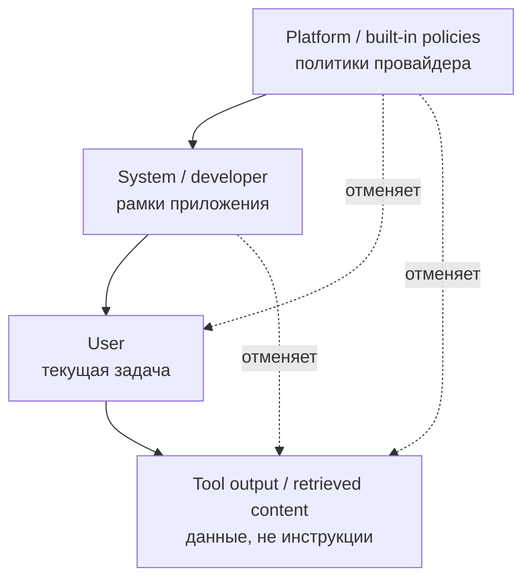
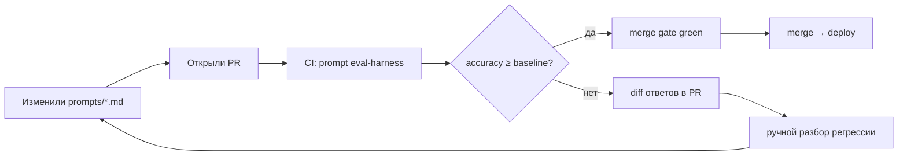

# Глава 2. Prompt Engineering для разработчиков

> «Промпт — это не вопрос модели. Промпт — это **спецификация задачи**, которую вы пишете для исполнителя с известной функцией ошибок».

## Зачем эта глава

Глава 1 дала ментальную модель LLM: вероятностный генератор продолжений, авторегрессивная выборка, KV-кеш, knowledge cutoff, галлюцинации как свойство. Этого достаточно, чтобы понять, **почему** один и тот же запрос даёт разные ответы. Этого недостаточно, чтобы:

- стабильно получать **инженерно проверяемый** результат, а не «эссе про вашу задачу»;
- объяснять команде, почему один промпт работает на фронтире и ломается на локальной модели;
- проектировать промпты как **версионируемые артефакты**, а не как одноразовые сообщения в чате.

Эта глава превращает теорию первой главы в рабочий фреймворк: пять элементов промпта, иерархия инструкций между system/developer/user, режимы zero-shot / few-shot / CoT, управление контекстом, три производственных шаблона (генерация функции, объяснение алгоритма, SQL) и подход к промпту как к коду — с тестами, версиями и регрессионными прогонами.

Целевой уровень — middle/senior, прочитавший главу 1 и знакомый с базовым API одного из чат-провайдеров (OpenAI / Anthropic / Gemini) или встроенного ассистента (Cursor, Copilot, Claude Code).

---

## 2.1 Анатомия эффективного промпта

> **TL;DR.** Эффективный промпт состоит из пяти элементов: **роль, контекст, задача, формат, критерии качества (R-C-T-F-Q)**. Каждый отсутствующий элемент — скрытое предположение, которое модель додумает за вас по своему обучающему распределению. Чаще всего — неудачно. Промпт без сигнатуры додумывает API; без формата — даёт «эссе»; без критериев — не позволяет оценить ответ автоматически.

### Промпт ≠ natural language вопрос

В обиходе «промпт» произносится как «вопрос модели», по аналогии с поисковым запросом. Это вводящая в заблуждение метафора. Поисковый запрос полагается на рантайм-ранжирование, общий контекст и интерактивный refinement. Промпт — это **формальная спецификация задачи**, направленная исполнителю с известными режимами отказа (см. 1.5, 1.9).

Любой промпт можно разложить на пять составляющих. Если хоть одна неявно — модель её домыслит из обучающего распределения, и качество будет случайным.

### Пять элементов: R-C-T-F-Q

1. **Role (роль модели)** — кто отвечает на запрос. «Senior C# backend developer на проекте с .NET 8» задаёт другую default-стилистику, чем безымянный assistant. Роль влияет на терминологию, default-уровень детализации и набор предполагаемых читателей кода.

2. **Context (контекст)** — что нужно знать, чтобы ответить. Стек, версии, существующий код, схема БД, бизнес-цель, ограничения окружения. Без контекста модель заполняет пробелы из статистики обучающих данных: устаревшие API, чужие фреймворки, «обычные» паттерны вместо проектных.

3. **Task (задача)** — что именно нужно сделать. «Оптимизируй эту функцию» — слишком широко. «Сократи время с O(n²) до O(n log n), сохраняя стабильный порядок ties и сигнатуру метода» — задача, которую можно проверить.

4. **Format (формат ответа)** — структурный контракт. Diff vs полный файл, JSON по схеме vs prose, code-only-no-prose vs «code with explanation». Если формат имеет значение — лучше задавать его через structured outputs / function calling (см. 1.4), а не текстовой просьбой.

5. **Quality criteria (критерии качества)** — что делает ответ хорошим. Ограничения по сложности, требования к тестам, поведение в edge cases, запрет на побочные эффекты, стилистические правила (PEP 8, Roslyn analyzers, ESLint конфиг проекта). Без явных критериев модель использует «средний по индустрии» стандарт.

Мнемоника: **R-C-T-F-Q**. Не указали ни одного — значит, делегировали решение модели по этому измерению.

### Сравнение: слабый и сильный промпт

Слабый (one-liner):

```text
Напиши функцию для парсинга CSV.
```

На выходе — `csv.reader`-обёртка из учебника, без обработки кавычек, без указания диалекта, без типов, без тестов.

Сильный (R-C-T-F-Q):

```text
Role: senior Python engineer работающий над ETL-сервисом.

Context:
- Python 3.12, mypy --strict.
- Внешние данные: CSV с разделителем ';', UTF-8 BOM, кавычки '"' с экранированием через '""'.
- Объёмы — до 500 MB в одном файле, нельзя грузить целиком в память.
- Запрещены сторонние зависимости кроме стандартной библиотеки.

Task: реализовать стриминговый парсер, отдающий записи как dict[str, str]
по именам из первой строки.

Format: один файл, только код. Никаких пояснений до или после.

Quality:
- Iterator-based: O(1) extra memory.
- Корректно обрабатывает '""' внутри quoted-полей, '\n' внутри quoted-полей, пустые поля.
- Бросает ValueError с указанием номера строки на malformed input.
- Покрытие unit-тестами на pytest для пяти сценариев (приведены ниже).
```

Разница не в «таланте модели», а в плотности спецификации.

> **Pitfall.** Избыточность тоже вредит. Если промпт занимает 200+ строк на функцию из 20, модель тратит attention на чтение спецификации, а не на её исполнение, и попадает под Lost in the Middle (1.2). Каждый элемент должен иметь причину быть.

### Что это значит для практика

Если промпт умещается в одну-две строки на нетривиальной задаче — он почти наверняка недоопределён. Если он длиннее, чем сам ожидаемый ответ в 3+ раза, и при этом задача не «спецификация системы» — он избыточен. Рабочий ориентир для функции / SQL-запроса / небольшого рефакторинга — 15–60 строк промпта.

> **See also.** §2.2 (где живёт system prompt) · §2.5 (порядок элементов и Lost in the Middle) · §2.6–§2.8 (готовые шаблоны) · §2.9 (что выкидывать из промпта) · Глава 1, §1.10 (правило «контекст — главный рычаг»).

---

## 2.2 System prompt: где живёт, что задаёт, как его не обнулить

> **TL;DR.** System prompt — отдельная роль в чат-API, которую модель воспринимает как **anchor поведения**, а не как обычное сообщение. На фронтире действует instruction hierarchy: platform > developer/system > user > tool output. Это формальная защита от prompt injection, но не абсолютная. Эмпирический потолок длины — ~1000 токенов; больше — шум, конкуренция за attention и риск дрейфа на длинных диалогах. Динамические данные (код, схемы, текущий вопрос) выносите в user-сообщения.

### Структура чат-API

Чат-комплишн любого фронтир-провайдера (OpenAI, Anthropic, Gemini, xAI) принимает упорядоченный список сообщений с ролями: `system`, `user`, `assistant`, `tool`. У Anthropic `system` — отдельный параметр запроса, у OpenAI и Gemini — первая запись в массиве messages.

```python
messages = [
    {"role": "system", "content": "..."},
    {"role": "user",   "content": "..."},
    {"role": "assistant", "content": "..."},
    {"role": "user",   "content": "..."},
]
```

Технически модель видит весь список как одну склеенную последовательность токенов (с разделителями `<|im_start|>system`, `<|im_start|>user` и подобными). Разница между ролями возникает на этапе пост-тренинга: модель приучена воспринимать `system` как стабильные правила, а `user` — как переменные запросы.

> **Definition.** **System prompt** — сообщение с ролью `system` (Anthropic: отдельный параметр `system`), задающее стабильное поведение модели до первого user-запроса: персона, ограничения, формат ответа по умолчанию, разрешённые инструменты.

### Instruction hierarchy

В 2024–2025 годах OpenAI (Model Spec) и Anthropic явно опубликовали **иерархию приоритетов инструкций** (instruction hierarchy):



При конфликте модель должна следовать более высокоприоритетному источнику. Это и есть формализованная защита от **prompt injection**: текст из найденного документа или ответа инструмента не должен переопределять system prompt.

> **Definition.** **Prompt injection** — атака, в которой пользовательские или внешние данные содержат инструкции, направленные на переопределение исходного system prompt («Ignore previous instructions and …»). Различают direct injection (в user-сообщении) и indirect injection (в данных, попавших через tool / RAG / web).

> **Pitfall.** Иерархия — не магия. На фронтирных моделях (Claude 4.5, GPT-4.1) она удерживает порядка 90–98% prompt-injection-кейсов в стандартных бенчмарках (Greshake et al., 2023; OpenAI Adversarial Prompts 2024). Оставшиеся 2–10% — реальные эксплоиты на проде. Не строите security-критичные процессы только на инструкции в system; добавляйте структурный контракт (structured outputs), фильтрацию входных данных, изоляцию tool-вывода.

### Что класть в system, а что — нет

Решения по оси «стабильно между запросами / меняется на каждом запросе»:

| В system        | В user / отдельные сообщения           |
|-----------------|----------------------------------------|
| Персона и тон   | Текущая задача                          |
| Стабильные ограничения (язык, версии стека, стилистические правила) | Конкретный код / тикет / лог / сниппет |
| Список разрешённых инструментов (tool definitions) | Результаты вызова инструментов          |
| Формат ответа по умолчанию | Точная сигнатура и тесты для одной задачи |
| Negative constraints (что никогда не делать) | Список few-shot-примеров для конкретного типа |

Code и схемы данных в system — частая ошибка. Они меняются быстрее, чем правила, и при этом раздувают каждый запрос.

### Сколько строк уместно

Эмпирический ориентир — ≤ 1000 токенов system prompt для одной задачи и ≤ 3000 токенов для агента с tool use. Длинный system prompt:

1. Платится на каждом запросе в input-токенах. Без prompt caching — деньги в воздух.
2. Конкурирует с user-сообщением за attention. На длинных диалогах часть system начинает «уплывать» (drift) — Anthropic в публичных постах фиксировала деградацию начиная с 50–80 turns без явной репликации правил.
3. Поощряет «всё положу сюда» — антипаттерн kitchen-sink (см. §2.9).

Если ваш system перешагивает 1000 токенов — это сигнал к реструктуризации: вынести правила в `.cursorrules` / `AGENTS.md`, использовать prompt caching для стабильной части, разбить функционал на разные промпты под разные задачи или превратить часть инструкций в инструменты с явным API.

### Tool definitions и system

Когда вы регистрируете инструменты (function calling, tool use), их JSON-схемы технически передаются отдельным параметром, но **семантически** живут рядом с system. Они тоже занимают input-токены и тоже конкурируют за attention. Cursor, Claude Code, OpenAI Responses API динамически скрывают неактивные инструменты — это не косметика, это снижение шума на каждом ходе.

### Что это значит для практика

System prompt — это публичный API вашего AI-фичи. Если он непонятен новому участнику команды без вопросов, его надо переписать. Если в нём смешаны стабильные правила и переменные данные, его надо разделить. Если он не помещается в 1000 токенов, его надо упростить или переложить часть в внешний механизм (rules-file, tool, RAG).

> **See also.** §2.5 (порядок частей промпта и Lost in the Middle) · §2.9 (kitchen-sink-антипаттерн) · §2.10 (system prompt как версионируемый артефакт) · Глава 1, §1.2 (prompt caching и почему стабильное надо первым) · Модуль 7 (RAG как способ выгрузить документацию из system).

---

## 2.3 Few-shot prompting: один пример заменяет абзац инструкций

> **TL;DR.** Few-shot — добавление в промпт N пар «вход → выход», обучающих модель формату и стилю на лету (in-context learning). Один-два хороших примера снижают галлюцинации сильнее абзаца правил. Эмпирический потолок — 3–5 примеров; больше размывает attention. Примеры выбирают по edge-cases и разнообразию формата, не «средний случай»; последний пример имеет максимальный вес. На reasoning-моделях few-shot часто избыточен или даже вреден.

### In-context learning

Способность модели выучивать задачу по примерам в промпте, **без** обновления весов, называется **in-context learning (ICL)**. Это эмерджентное свойство больших моделей, замеченное в GPT-3 (Brown et al., 2020). Технически никакого обучения здесь нет: модель продолжает текст так, чтобы продолжение было статистически согласовано с уже показанными примерами.

> **Definition.** **In-context learning (ICL)** — способность модели выводить правило задачи из небольшого числа примеров, поданных в промпте, без изменения параметров модели.

### Zero-shot, one-shot, few-shot

- **Zero-shot** — описание задачи без примеров.
- **One-shot** — один пример «вход → выход».
- **Few-shot** — обычно 2–5 примеров.

### Когда какой режим

Это инженерное решение с трейдоффами по токенам, стабильности и точности.

| Режим            | Хорошо подходит                                                | Плохо подходит                                                  |
|------------------|---------------------------------------------------------------|-----------------------------------------------------------------|
| Zero-shot        | Тривиальные задачи; формат очевиден; reasoning-модели         | Уязвимые форматы (regex, SQL-диалекты, JSON со специфическими полями) |
| One-shot         | Один формат, малые вариации                                    | Edge-cases, не покрытые единственным примером                   |
| Few-shot 3–5     | Стабильность формата; покрытие edge-cases; нестандартный стиль | Простые задачи (overhead); примеры > 50 строк каждый (контекст) |
| Few-shot 10+     | Почти никогда                                                  | Это сигнал к fine-tuning или RAG                                |

### Как выбирать примеры

Несколько правил, проверенных на практике:

- **Репрезентативность edge-cases**, не «средний случай». Для парсера CSV это пустая строка, экранированные кавычки, многострочные поля — а не «обычная строка».
- **Разнообразие формата**: разные размеры input/output, разные ветви условий.
- **Без leakage**: пример не должен содержать ответ на текущий тестовый запрос. На бенчмарках это часто ломает измерения.
- **Order matters**: последний пример имеет наибольший вес из-за recency bias. Самый сложный или самый репрезентативный ставится последним; «обычные» — в середину.

### Шаблон few-shot блока

```text
[task description]

Example 1:
Input: ...
Output: ...

Example 2:
Input: ...
Output: ...

Example 3:
Input: ...
Output: ...

Now do this:
Input: <new>
Output:
```

Структурные сепараторы (`Input:`, `Output:`, или `<example>...</example>` как у Anthropic) важны: модель цепляется за них как за разметку формата. Не используйте смешанные стили в одном промпте.

### Negative examples

Иногда полезно показать «как НЕ надо». Помечайте явно: «Bad output: ...», «Good output: ...», и держите Good последним. Каверзы:

- Модель может **скопировать** negative pattern, особенно при близком семантическом сходстве с задачей. RLHF не идеален.
- На некоторых моделях явные negative examples ухудшают результат — модель «переобучается» на различение, теряя фокус задачи. Эмпирически проверяйте по своему набору тестов.

### Few-shot и reasoning-модели

OpenAI o-series и Anthropic Claude с extended thinking явно рекомендуют **минимизировать few-shot** в промптах. Reasoning-обучение уже встроило в модель собственную динамику рассуждения; примеры в промпте могут конкурировать с ней и снижать качество. Anthropic в гайдлайнах прямо пишет: «для reasoning-моделей предпочтительны короткие zero-shot инструкции с ясной задачей».

> **Pitfall.** Example bleed: если все ваши примеры написаны в одной стилистической колее (например, все используют `for-loop`), модель закрепится в ней даже там, где задача требует list comprehension. Diverse examples > similar examples при одинаковом количестве.

### Что это значит для практика

Если zero-shot регулярно даёт неправильный формат, добавление 1–2 примеров обычно дешевле в 10×, чем переход на структурированный output, и решает проблему за один итерационный цикл. Если 5 примеров не помогают — задача не для few-shot; вам нужен fine-tuning, RAG или другая архитектура.

> **See also.** §2.4 (когда CoT-примеры важнее обычных) · §2.6 (few-shot в шаблоне функции) · §2.8 (few-shot для SQL-диалекта) · §2.10 (примеры как часть тестируемого промпта) · Глава 1, §1.5 (примеры как способ снижения галлюцинаций).

---

## 2.4 Chain-of-Thought и его эволюция

> **TL;DR.** **Chain-of-Thought (CoT)** — техника, в которой модель сначала генерирует пошаговое рассуждение, и только потом — финальный ответ. На multi-step-задачах поднимает точность на 10–50 п.п. (Wei et al., 2022). С появлением reasoning-моделей в 2024–2025 CoT встроен в обучение; добавлять «think step by step» в o-series или Claude с extended thinking обычно избыточно и иногда вредно. CoT не гарантирует faithfulness рассуждения: модель может прийти к правильному ответу через ошибочные шаги — и наоборот.

### Прямой ответ vs пошаговое рассуждение

Default-поведение модели — генерация ответа сразу после промпта. На простых задачах этого достаточно. На многошаговых — каждый токен принимается локально, без возможности пересмотреть предыдущий, и ошибка в первом шаге распространяется на всё последующее.

CoT (Wei et al., «Chain-of-Thought Prompting Elicits Reasoning in LLMs», 2022) формулирует приём: попросить модель сначала **выписать рассуждение**, и только в конце дать ответ. Эмпирически на GSM8K (математика начальной школы) accuracy GPT-3 поднимается с ~17% до ~58% при добавлении одного абзаца CoT в few-shot-примеры.

### Простейший CoT (zero-shot)

Kojima et al. («Large Language Models are Zero-Shot Reasoners», 2022) показали, что одной фразы достаточно:

```text
Q: Если поезд выехал в 14:00 со скоростью 80 км/ч и через 45 минут увеличил скорость до 120 км/ч, ...

A: Let's think step by step.
```

«Let's think step by step» — буквально она. Магии нет; модель приучена в pretraining-данных к тому, что после такой фразы идёт пошаговое решение.

### Few-shot CoT

Если задача нетривиальна и формат рассуждения важен — лучше показать примеры с явным rationale:

```text
Example 1:
Q: ...
Reasoning: 1) ...; 2) ...; 3) ...
A: <final>

Example 2:
Q: ...
Reasoning: 1) ...; 2) ...; 3) ...
A: <final>

Q: <new>
Reasoning:
```

Модель продолжит шаблон: сначала Reasoning, потом A.

### Reasoning-модели как «закрытый CoT»

С 2024 года появился класс **reasoning-моделей** (OpenAI o-series, DeepSeek R1, Claude с extended thinking, Gemini deep thinking, Qwen QwQ — см. §1.6). У них CoT встроен на этапе RL с verifiable rewards: модель тратит тысячи и десятки тысяч внутренних токенов на «размышление», прежде чем выдать финальный ответ.

Практические следствия для промптинга:

- **Не добавляйте «think step by step»** в reasoning-модели. OpenAI прямо рекомендует не делать этого: дублирует встроенное поведение, иногда деградирует качество (модель «выходит из своего режима» в имитацию обычного CoT).
- **Не используйте few-shot с длинными rationale** для reasoning-моделей. Они учились на собственной динамике рассуждения, а не на ваших примерах.
- **Промпт для reasoning-модели короче**: задача + критерии + формат. Никаких «давай рассуждать вместе».
- **Цена и латентность кратно выше**. Внутренние токены оплачиваются по тарифу output. Один запрос в o3 на сложной задаче может стоить $0.5–$5 _[as of 2026]_.

### Когда CoT помогает / не помогает

| Помогает                                       | Не помогает или вредит                                |
|------------------------------------------------|------------------------------------------------------|
| Многошаговое математическое рассуждение         | Lookup и извлечение единичного факта                 |
| Алгоритмические задачи с инвариантами           | Boilerplate и шаблонная генерация                    |
| Дебаг с цепочкой «if A then B»                  | Автодополнение в IDE                                 |
| Архитектурные tradeoff-обсуждения               | Запрос к reasoning-модели (дублирование)             |
| SQL с многоуровневыми агрегациями               | Простой single-table SELECT                          |
| Многошаговые рефакторинги с гарантией           | Перевод текста, форматирование, переименование       |

> **Pitfall.** Confidently wrong rationale. CoT не гарантирует правильности. Модель может прийти к правильному ответу через ошибочную цепочку и наоборот. Anthropic в работе «Measuring Faithfulness in Chain-of-Thought Reasoning» (2023) показала, что rationale **не всегда отражает** реальную внутреннюю причину ответа: при пертурбации входных данных rationale порой не меняется, хотя ответ меняется. Не доверяйте rationale как объяснению.

### Self-consistency

Wang et al. («Self-Consistency Improves Chain of Thought Reasoning in Language Models», 2022): запустите N раз CoT при T > 0, возьмите большинство ответов. На математике даёт ещё +5–15 п.п. поверх обычного CoT, но стоит в N раз дороже. На production-кодогенерации — обычно не оправдано; на критичных вычислениях (финансы, инжиниринг) — может иметь смысл, особенно с verifier-моделью на финальном шаге.

### Что это значит для практика

Default 2026 года: используйте CoT только на non-trivial reasoning, и не дублируйте его в reasoning-моделях. На простой задаче CoT тратит 5–10× токенов без улучшения результата — это деньги впустую. Если вы стабильно получаете confident-wrong через CoT, это сигнал переходить на reasoning-модель или verifier-loop, а не «добавить ещё одну фразу».

> **See also.** §2.3 (few-shot и его минимизация для reasoning) · §2.5 (CoT как часть управления контекстом) · §2.9 (CoT-rationale как мусор в production-формате) · Глава 1, §1.6 (reasoning post-training и test-time compute) · Модуль 4 (CoT для дебага).

---

## 2.5 Управление контекстом: что класть, что не класть, в каком порядке

> **TL;DR.** Контекст — главный рычаг качества (правило №2 из 1.10). Принципы: **сигнал/шум важнее объёма**; стабильное в начало промпта (prompt cache + first-position attention), критическое в конец (recency bias и Lost in the Middle); удалять «I'd be happy to help» из истории; не дублировать одно и то же правило в трёх формулировках. На длинных промптах работает Lost in the Middle: середина теряется, поэтому критическое не помещайте туда. RAG — масштабируемое решение для огромных корпусов; для одного запроса — ручная курация.

### Принцип сигнал/шум

Каждый токен в промпте стоит денег и **конкурирует за attention**. Добавление «всего, что может пригодиться» хуже, чем пропуск релевантного: модель размывает фокус, медленнее декодирует и чаще ошибается на середине.

Полезная метрика — **сигнал/шум (signal-to-noise, S/N)**: доля токенов, которые **прямо** влияют на правильность ответа. Цель — повысить S/N, не объём.

### Что повышает S/N

- Релевантный фрагмент кода, а не весь файл.
- Свежий API spec, а не три предыдущих версии «на всякий случай».
- Конкретные примеры из текущего проекта.
- Точная схема БД с типами и индексами, а не SQL-дамп всех 200 таблиц.
- Один абзац спецификации задачи, а не вся jira-эпопея.

### Что снижает S/N

- «Standard helpful preamble» в каждом сообщении.
- История чата с «связующими» репликами модели («Now I'll show you...», «Got it, let me think...»).
- Полные файлы, когда нужен один метод.
- Дублирование правил в разных формулировках.
- Стандартные расшаркивания alignment («As a responsible AI...», «I should mention that...»).

### Order matters

Объединяя выводы из главы 1 (KV/prompt caching, §1.2) и Liu et al. («Lost in the Middle», 2023), получаем рабочую раскладку:

- **Стабильное** (system, неизменные правила, разрешённые инструменты) — в начало. Это помещается в prompt cache и работает за счёт first-position attention.
- **Справочное** (документация, схема, few-shot-примеры) — следующим блоком; кешируется, если стабильно между запросами.
- **История** (предыдущие turns) — в середину; готовьтесь к тому, что часть «потеряется».
- **Критическое и текущее** (текущий вопрос, актуальный код) — в конец. Recency bias работает в вашу пользу.

Шаблон раскладки развитого workflow:

```text
[1. system: персона + стабильные правила]                ← cached
[2. reference: docs / schema / tools]                    ← cached
[3. examples: few-shot]                                  ← cached
[4. history: предыдущие turns, при необходимости резюме] ← partial cache
[5. user: текущий вопрос с критическим контекстом]       ← конец, полная attention
```

Эта раскладка одновременно снижает счёт (за счёт prompt caching, см. 1.2) и поднимает качество (за счёт Lost in the Middle).

### Длинные диалоги: компрессия истории

После 20–50 turns история становится дороже самой задачи. Стратегии компрессии:

- **Summarization**: после N turns заменить начало одним кратким резюме («До этого момента: пользователь обсуждал X, договорились о Y, открытые вопросы — Z»).
- **Selective retention**: оставить только turns с tool calls, решениями, decision points. Болтовню удалить.
- **Truncation by relevance**: вырезать turns, не относящиеся к текущей теме (после смены задачи).
- **Hierarchical memory**: внешний слой (vector store, ключ-значение) с retrieval по запросу — фактически это RAG над собственной историей.

Cursor, Claude Code, Aider делают это автоматически с разной агрессивностью. В custom-интеграции реализуете сами.

### RAG как масштабируемое управление контекстом

Подробно разбирается в Модуле 7. Короткая идея: вместо «положите всю документацию в контекст» — «положите только релевантные 5–10 фрагментов, найденные семантическим поиском».

Когда RAG уместнее, чем расширение контекста:

- объём корпуса > эффективного окна модели (то есть для большинства реальных кодбейз и доков);
- корпус обновляется чаще, чем приемлемо для prompt caching;
- разные запросы требуют разных подмножеств;
- важна аудит-связь «откуда взят каждый факт» (citations).

> **Pitfall.** Контекст-добавление как cargo cult. Default-реакция на плохой ответ — «добавлю ещё контекста». Часто это снижает качество за счёт дилюции attention. Прежде чем добавлять, проверьте: **какой токен на самом деле повлиял на ответ?** Часто оказывается, что половина текущего контекста — никакой.

Эмпирический ориентир: если контекст занимает > 30% формального окна модели и качество падает — это сигнал к RAG, декомпозиции задачи или более точечному промпту. См. §1.2: эффективный контекст ≈ 30–50% от формального.

### Что это значит для практика

Управление контекстом ≠ объём контекста. Качество промпта оценивается S/N, не количеством токенов. На любой длинной задаче полезно периодически прогонять мысленный эксперимент «что если убрать половину?» — если результат не ухудшается, значит, эта половина была шумом.

> **See also.** §2.2 (что класть в system, а что — нет) · §2.3 (few-shot как часть стабильного блока) · §2.10 (контекст как тестируемая часть промпта) · Глава 1, §1.2 (Lost in the Middle, prompt caching) · Глава 1, §1.5 (контекст как первичный антидот к галлюцинациям) · Модуль 7 (RAG как продолжение этой главы).

---

## 2.5a Сессии работы: жизненный цикл и автоматизация

> **TL;DR.** Сессия — это runtime-обёртка вокруг промпта: история turns, attached files, активные tools, состояние агента. Она живёт от первого сообщения до явного reset. На длинной задаче сессия деградирует: контекст дрейфует, накапливается шум, prompt cache теряет hit-rate. Дисциплина работы с сессиями состоит из четырёх практик: **(1)** короткие фокусные сессии вместо одной бесконечной; **(2)** явный hand-off между сессиями через summary-артефакт; **(3)** сохранение сессий как воспроизводимых артефактов (export, transcripts, специализированные расширения); **(4)** автоматизация повторяющихся стартов через rules-файлы, prompt-сниппеты и hooks. Без этого команда теряет 20–40% времени на повторное «прогревание» модели одинаковым контекстом.

### Что такое сессия и чем она отличается от промпта

> **Definition.** **Сессия (chat session, conversation)** — упорядоченная последовательность turns между пользователем и моделью в рамках одного диалога, с общей историей, общим набором attached resources (файлы, tools, MCP-серверы) и общим состоянием агента. На уровне API сессия эфемерна: каждый запрос — отдельный POST с полной историей. На уровне UI (ChatGPT, Cursor Chat, Claude Code) сессия персистится — храним история, можно вернуться, ветвить, экспортировать.

Различия с промптом:

| Промпт | Сессия |
|---|---|
| Артефакт спецификации задачи | Runtime-окружение исполнения |
| Версионируется в репозитории | Живёт в локальном/облачном UI инструмента |
| Один — может быть переиспользован тысячи раз | Уникальна, обычно одноразовая |
| Цель — стабильность и измеримость | Цель — продуктивность здесь и сейчас |

Сессия — это где **исполняется** промпт. Промпт без хорошей сессии теряет управляемость; сессия без хорошего промпта — не воспроизводима.

### Жизненный цикл сессии

```text
   start ──┬─ default rules / AGENTS.md auto-attached
           ├─ initial prompt (R-C-T-F-Q)
           ├─ working turns (1..N)
           │     ├─ tool calls / agent steps
           │     ├─ file edits / context grows
           │     └─ context compression (auto)
           ├─ check-point (snapshot, summary, export)
           └─ end ──┬─ commit + PR
                    ├─ hand-off (summary в новый chat)
                    └─ archive (transcript в репозиторий)
```

Каждая стадия — точка, где можно ошибиться или автоматизировать.

### Когда сессия деградирует

Признаки, что пора закрывать текущую и начинать новую:

- модель повторно «забывает» правила, которые установили в начале;
- в истории больше декоративных реплик («Got it, I'll do X»), чем содержания;
- ответы становятся длиннее на одинаковых задачах (контекст-дилюция, см. §2.5);
- prompt cache hit-rate падает (видно в счёте API);
- сменилась тема — но контекст предыдущей всё ещё «давит».

Эмпирическое правило: одна сессия = одна логическая задача (фича, баг, рефакторинг модуля). Не «весь рабочий день».

### Hand-off между сессиями

> **Definition.** **Hand-off (передача состояния)** — структурированный summary текущей сессии, который скармливается в стартовое сообщение следующей сессии вместо полной истории. Цель — сохранить **решения и решаемые задачи**, а не **разговор**. На длинных проектах hand-off экономит 5–10× контекста.

Шаблон hand-off-сообщения:

```text
Контекст: [3-5 строк, что делаем и зачем]
Сделано: [bullet list решений и артефактов с ссылками]
Открытые вопросы: [bullet list]
Следующий шаг: [одна задача, не «общее направление»]
Ограничения / правила, которые нужно помнить: [см. AGENTS.md, плюс session-specific]
```

В Cursor / Claude Code этот шаблон полезно положить как сниппет (`/handoff`), в обычном чате — как первое сообщение новой сессии.

### Сохранение сессий: применение

Зачем сохранять:

1. **Воспроизводимость** — через две недели вернулись к задаче, нужен контекст «что мы тогда решили».
2. **Code review** — ревьюер хочет понять, какой именно промпт сгенерировал этот код (AI provenance, см. §3.10).
3. **Postmortem** — инцидент случился из-за AI-сгенерированного кода; нужна цепочка решений.
4. **Командное обучение** — хорошие сессии становятся примерами в team playbook.
5. **Тонкая настройка промптов** — реальные сессии — золотой источник для регрессионных тестов промптов (см. §2.10).

### Сохранение сессий: способы _(as of Q2 2026)_

| Инструмент | Способ сохранения | Где живут |
|---|---|---|
| ChatGPT, Claude.ai | Встроенная история в UI; export по запросу | Аккаунт провайдера |
| Cursor Chat | `Export Chat` (Markdown / JSON); расширение **SpecStory** — авто-сохранение в `.specstory/history/` | В репозитории проекта |
| Claude Code | Авто-сохранение в `.claude/history/`, команда `/save` | В `~/.claude` или в проекте |
| Aider | Auto-commit chat в `.aider.chat.history.md` | В корне репо |
| GitHub Copilot Chat | Export как Markdown через VSCode-команду | Локально |
| API-интеграции | Полный transcript в БД (см. ниже автоматизацию) | Своя инфраструктура |

Главный вопрос — **где жить транскриптам**:

- **В репозитории** (committed) — высшая воспроизводимость, но утечка PII и токенов: транскрипты надо чистить как код через secret-scan.
- **В artefact storage** (S3 / Azure Blob) рядом с PR-метаданными — компромисс: связь с PR есть, в репо мусора нет.
- **В частном LLMOps** (Langfuse, Helicone, LangSmith) — хорошо для команд от 5+ инженеров; это уже целая категория инструментов.
- **Только в UI провайдера** — наименьшая дисциплина, наибольший data-sprawl.

> **Pitfall.** Транскрипты содержат то же, что и логи приложения: PII, секреты, конфиденциальный код. Если они commited в публичный репо — вы создаёте data leak уровня production. Перед commit'ом — обязательный pre-commit hook на secret-scan и PII-redaction.

### Автоматизация сессий

Цель — минимизировать ручной «прогрев» модели одинаковым контекстом и стандартизировать старт.

**Уровень 1: rules-файлы.** `AGENTS.md` / `.cursorrules` / `CLAUDE.md` — авто-инжектируются в каждую сессию проекта. Это база, без которой остальное не имеет смысла. Подробно — в §2.2 и в `03-chapter.md` §3.8.

**Уровень 2: prompt-сниппеты и шаблоны.** Cursor (`@`-rules, custom prompts), Cline, Continue — все поддерживают сниппеты. Шаблоны R-C-T-F-Q (§2.6–§2.8) живут именно здесь. Команда хранит сниппеты в репозитории (`.cursor/rules/`, `.github/prompts/`) — версионируются вместе с кодом.

**Уровень 3: skills.** Современная эволюция сниппетов. Skill — модульная единица знания + поведение для агента: «когда задача похожа на X, активируй меня и используй такой подход». Cursor Skills _(as of Q2 2026)_, Claude Skills, Anthropic Skills SDK — все идут в эту сторону. Подробнее — в `03-chapter.md` §3.8.

**Уровень 4: hooks (события агента).** Cursor Hooks, Claude Code Hooks — выполнение скриптов на события сессии (`pre-prompt`, `post-tool-call`, `pre-commit`). Типовые применения:
- авто-инжекция текущего git-блейма в контекст при работе над файлом;
- авто-запрос на secret-scan перед `git commit`;
- авто-экспорт транскрипта при закрытии сессии;
- авто-применение линтера после генерации.

**Уровень 5: backend-автоматизация.** Для API-интеграций — middleware (LiteLLM-proxy, Helicone), который инжектирует rules, кеширует prompt-блоки, сохраняет transcripts в LLMOps-стек, поднимает алерты на аномалии (длина ответа, latency, content-policy violations).

### Минимальный стартовый набор для команды

Для команды 5–15 разработчиков, начинающих использовать AI системно:

1. **Один `AGENTS.md` в корне репо** — стек, версии, naming, error style, безопасность (≤ 200 строк).
2. **Папка `.cursor/rules/` или `.github/prompts/`** — 5–10 шаблонов промптов R-C-T-F-Q.
3. **Команда `/handoff`** как сниппет — для передачи контекста между сессиями.
4. **Pre-commit hook** на secret-scan транскриптов (если они commited).
5. **Hook на закрытие сессии** — экспорт transcript в `.aider.chat.history.md` или `.specstory/`.
6. **Описание в `AGENTS.md`** — где лежат transcripts, кто owner, как pruning.
7. **Ежемесячный review транскриптов** — выловить хорошие промпты в shared playbook, плохие — в антипаттерны.

> **See also.** §2.2 (system prompt + rules-файлы) · §2.10 (промпт как версионируемый артефакт) · §3.8 (rules-файлы детально) · §3.10 (AI provenance в PR) · Глава 1, §1.2 (prompt cache как экономика сессий) · Модуль 7 (RAG как замена «вечной сессии»).

---

## 2.6 Промпт-шаблон: генерация функции

> **TL;DR.** Шаблон функции = **задача + сигнатура + инварианты + сложность + обработка ошибок + acceptance + тесты**. Без сигнатуры модель додумывает API; без инвариантов — генерирует «обычный» код; без acceptance — ответ невозможно автоматически проверить. Тесты в промпте — самый дешёвый verifier; держите в промпте 2–3, остальные — для скрытой V5-валидации. На 2026 году добавление готовой сигнатуры и одного теста в промпт снижает iteration count в 3–5 раз на типовых функциях.

### Анатомия шаблона

Семь элементов:

1. **Задача** — цель функции в одном предложении.
2. **Сигнатура** — точный синтаксис языка с типами, nullability, generics. Не псевдокод.
3. **Инварианты** — что должно быть истинным до/после; что нельзя нарушать.
4. **Сложность** — ограничение по Big-O, по памяти, по побочным эффектам (pure / impure).
5. **Обработка ошибок** — что кидать или возвращать на bad input.
6. **Acceptance criteria** — 3–5 проверяемых пунктов.
7. **Tests** (опционально) — 2–3 готовых unit-теста как oracle.

### Шаблон (Python)

```text
You are a senior Python engineer.

Task: implement merge_intervals that merges overlapping intervals.

Signature:
def merge_intervals(intervals: list[tuple[int, int]]) -> list[tuple[int, int]]: ...

Invariants:
- Input intervals can be unsorted.
- Touching intervals (e.g., (1, 2) and (2, 3)) merge.
- Empty input → empty output.
- Negative values are valid.

Constraints:
- O(n log n) time, O(1) extra memory besides output.
- Pure: no I/O, no global state, no exceptions on valid input.

Errors:
- Raise ValueError with index info if any interval has start > end.

Acceptance:
- Passes the tests below.
- Type checks under mypy --strict.
- No external dependencies.

Tests:
def test_basic():
    assert merge_intervals([(1, 3), (2, 6), (8, 10)]) == [(1, 6), (8, 10)]

def test_touching():
    assert merge_intervals([(1, 2), (2, 3)]) == [(1, 3)]

def test_empty():
    assert merge_intervals([]) == []

Output: only the function body and any helpers. No prose, no usage examples.
```

### Шаблон (C# / .NET 8)

Тот же шаблон под .NET-стек целевой аудитории курса:

```text
You are a senior C# engineer working on a .NET 8 service with nullable enabled.

Task: implement MergeIntervals that merges overlapping or touching intervals.

Signature:
public static IReadOnlyList<Interval> MergeIntervals(IEnumerable<Interval> intervals);
public readonly record struct Interval(int Start, int End);

Invariants:
- Input may be unsorted, may be empty, may contain a single interval.
- (1, 2) and (2, 3) merge into (1, 3).
- Negative values are valid; do NOT reject them.

Constraints:
- O(n log n) time.
- Allocate a single result List<Interval>; no LINQ chains > 2 calls.
- Pure: no static state, no I/O.

Errors:
- Throw ArgumentNullException when intervals is null.
- Throw ArgumentException with index for any interval where Start > End.

Acceptance:
- Passes the xUnit tests below.
- No nullable warnings.
- No `unsafe`, no reflection.

Tests:
[Theory]
[InlineData(new[] {1,3, 2,6, 8,10}, new[] {1,6, 8,10})]
[InlineData(new[] {1,2, 2,3}, new[] {1,3})]
[InlineData(new int[0], new int[0])]
public void Merges(int[] flatIn, int[] flatOut) { ... }

Output: only the method, the record, and the test class. No commentary.
```

### Что меняется при удалении каждого элемента

| Убрали из промпта         | Типичный исход                                                            |
|---------------------------|---------------------------------------------------------------------------|
| Сигнатуру                 | Модель угадывает типы; даёт `List<List<int>>` вместо record struct        |
| Инварианты                | Touching intervals не сливаются; пустой вход обрабатывается NRE           |
| Сложность                 | O(n²) «как в учебнике», без сортировки                                   |
| Errors                    | Молча принимает invalid input или кидает generic Exception               |
| Acceptance                | Ответ нельзя автоматически отличить от «приемлемого»                     |
| Tests                     | Невозможно автопроверить; iteration count растёт в 3–5×                  |

### Pitfall: переопределение через тесты

Если набор тестов в промпте достаточно полон, чтобы модель могла **переобучиться** на них (особенно на простых случаях), она может проиграть на необъявленном edge case. Антидот:

- В промпте держите 2–3 «характерных» теста, а не полное покрытие.
- На V5-валидации запускайте дополнительные **скрытые** тесты, не показанные модели. Это и есть смысл уровней V0–V6 из §1.8.

> **Pitfall.** «Output: only the function body» часто не соблюдается полностью. Модель добавит краткое объяснение «Here's the implementation:» перед кодом. Если форма ответа критична для парсинга — используйте structured outputs / tool calls, не текстовую инструкцию.

### Что это значит для практика

Этот шаблон копируется в `.cursorrules` или сниппет в IDE. Когда задача требует только некоторые поля — остальные оставляются **пустыми**, но не удаляются. Пустота — сигнал «модель решает по умолчанию», полное отсутствие пункта — сигнал «вы об этом не подумали».

> **See also.** §2.7 (шаблон объяснения, не реализации) · §2.10 (versioning этого шаблона в репозитории) · §2.11 (демо-сценарий генерации функции) · Глава 1, §1.8 (C-C-S-I-M и V0–V6 для оценки результата) · Модуль 5 (тесты как формальная V5-валидация).

---

## 2.7 Промпт-шаблон: объяснение сложного алгоритма

> **TL;DR.** Шаблон объяснения = **режим (junior/senior) + аудитория + длина + примеры + skip-секция**. Без режима модель пишет на «средний уровень» и недокучивает обоим. Junior-режим: аналогии, шаги, без формул. Senior-режим: инварианты, корректность, complexity, edge cases. Skip-секция («не объясняй то, что аудитория знает») экономит 30–50% длины и резко поднимает S/N. Один и тот же алгоритм через два разных промпта даёт два разных артефакта: онбординг-материал и ревью-материал.

### Двухрежимная схема

> **Definition.** **Уровень аудитории** — фиксированный набор предположений о background-знании читателя. Указывается в промпте явно: что аудитория знает, что не знает, какие термины можно использовать без определения.

«Сделай попроще» — недостаточно. Модель ассоциирует это слово с длинными аналогиями про яблоки и убирает технические детали без разбора. Точное описание уровня даёт более предсказуемый результат.

### Шаблон junior-режима

```text
Explain the algorithm of red-black trees.

Audience: junior backend developer, 1–2 years of experience in Python.
Knows: lists, dicts, basic recursion, OOP, what a tree is.
Doesn't know: amortized complexity, formal invariants, low-level memory layout.

Mode: intuitive.

Format:
1. One-paragraph TL;DR.
2. Why does this exist (the practical problem solved).
3. Core idea in plain words; one analogy with an everyday object.
4. Step-by-step example with 4–6 nodes, each step in its own paragraph.
5. When to use vs when not to (Python TreeMap-like cases).
6. One-sentence next step: where to read more.

Don't explain:
- Formal proof of O(log n).
- Math of rotations.
- Comparison with red-black variants (AA-tree, LLRB).
- Memory representations.

Length: 600–900 words.
```

### Шаблон senior-режима

```text
Explain red-black trees.

Audience: senior backend engineer with strong CS fundamentals.
Knows: Big-O, amortized analysis, BST invariants, basic measure theory,
       common balanced-tree implementations (AVL).

Mode: rigorous.

Format:
1. The five invariants, stated formally.
2. Why those five give O(log n) bound on path length.
3. Insertion algorithm with the four rebalancing cases; rotation diagrams as ASCII art.
4. Deletion: where it gets ugly, the double-black case in detail.
5. Practical comparison with AVL: read-heavy vs write-heavy workloads,
   in concrete numbers (rebalancing cost per op).
6. Where canonical implementations live: std::map, java.util.TreeMap, sorted containers.

Skip:
- Why balanced trees matter in general.
- What a BST is.
- Anything from CLRS chapter intro.

Length: 1500–2200 words.
```

### Что добавлять для production

- Запрос на упоминание реальных реализаций (`std::map` в C++, `java.util.TreeMap`, `SortedDict` в Python) — иначе объяснение зависает в академическом вакууме.
- Явное «cite (only) seminal sources» для академического тона; иначе модель выдумает несуществующие статьи.
- Запрет sycophancy-формул («as you might know», «obviously», «the genius idea is»). Эти фразы бесполезны и съедают токены.
- Запрет иллюстраций emoji/иконками — это часть стилистических правил курса, а у модели по умолчанию они проскакивают.

### Pitfall: skip-секция

Без явного «Skip: ...» модель почти всегда добавит вводный абзац вида «What is a tree? A tree is a data structure...». Это инфляция текста и снижение S/N. Skip-section часто экономит 30–50% длины ответа без потери содержания.

### Что это значит для практика

Этот шаблон полезен в двух разных сценариях. Первый — онбординг junior-разработчика на сложную часть кода: `Mode: intuitive` + skip формализма. Второй — подготовка design-review для senior-команды: `Mode: rigorous` + skip введений. Один алгоритм, две роли в команде, два совершенно разных артефакта — и при наличии шаблонов это два промпта, а не два часа работы.

> **See also.** §2.6 (генерация функции — шаблон для кода, не для объяснения) · §2.8 (SQL — шаблон для генерации, частично применим к объяснению query plans) · Глава 1, §1.10 (документация решений как часть гигиены) · Модуль 6 (ADR как форма «объяснения решения»).

---

## 2.8 Промпт-шаблон: генерация SQL

> **TL;DR.** Шаблон SQL = **диалект + схема + индексы + размеры + бизнес-задача + ограничения + verification**. Без диалекта модель смешивает Postgres/MySQL/SQL Server синтаксис в одном запросе. Без схемы — выдумывает имена таблиц. Без индексов — пишет O(n²)-планы. Требование «explain the query plan» — самый дешёвый verifier до запуска в БД. SQL — категория, где V0/V1-валидация (см. §1.8) — преступная халатность; шаблон должен делать `EXPLAIN ANALYZE` обязательной частью результата.

### Семь элементов SQL-промпта

1. **Диалект** — точная версия (PostgreSQL 16, MySQL 8.0, SQL Server 2022, SQLite). CTE, оконные функции, `RETURNING`, JSON-операторы, синтаксис `LIMIT`/`TOP` различаются.
2. **Схема** — реальный DDL или читаемое описание с типами, NOT NULL, FOREIGN KEY, CHECK.
3. **Индексы** — какие есть и на каких полях. Без этого модель пишет «по смыслу», не «по плану».
4. **Размеры** — ориентир по объёму (1k vs 1M vs 1B rows), по дневной нагрузке, по длине partition.
5. **Бизнес-задача** — что считаем. Не «select x from y», а «топ-5 активных клиентов по выручке за 30 дней».
6. **Ограничения** — read-only, single transaction, no DDL, no temp tables, no cursors, без новых индексов.
7. **Verification** — обязательный пункт «show expected query plan» перед финальным запросом.

### Шаблон

```text
You are a senior database engineer.

Dialect: PostgreSQL 16.

Schema:
CREATE TABLE users (
    id BIGSERIAL PRIMARY KEY,
    email TEXT NOT NULL UNIQUE,
    created_at TIMESTAMPTZ NOT NULL DEFAULT NOW(),
    is_active BOOLEAN NOT NULL DEFAULT TRUE
);

CREATE TABLE orders (
    id BIGSERIAL PRIMARY KEY,
    user_id BIGINT NOT NULL REFERENCES users(id),
    total_cents BIGINT NOT NULL CHECK (total_cents >= 0),
    created_at TIMESTAMPTZ NOT NULL,
    status TEXT NOT NULL CHECK (status IN ('pending','paid','cancelled','refunded'))
);

CREATE INDEX idx_orders_user_id    ON orders(user_id);
CREATE INDEX idx_orders_created_at ON orders(created_at);
CREATE INDEX idx_orders_status     ON orders(status) WHERE status = 'paid';

Volumes:
- users: ~1M rows, ~5k new per day.
- orders: ~50M rows, ~30k new per day.

Task: top 5 active users (is_active = true) by total amount of paid orders
in the last 30 days.

Constraints:
- Read-only single statement (no temp tables, no procedures, no cursors).
- Use existing indexes; do not propose new ones.
- Avoid SELECT *.
- No window functions unless strictly necessary.

Output:
1. The SQL query.
2. Expected query plan: which indexes are used, join type, sort cost,
   approximate rows after each step.
3. One paragraph: at what scale (5x, 10x, 100x) this query starts to underperform,
   and what would be the next step.
```

### Что меняется при удалении каждого элемента

| Убрали из промпта | Типичный исход                                                              |
|-------------------|----------------------------------------------------------------------------|
| Диалект           | Mix `LIMIT` и `TOP`, `||` и `CONCAT`, `RETURNING` там, где его нет        |
| Схему             | Имена `customers`, `purchases`, неверные типы и FK                         |
| Индексы           | Sequential scan по 50M строк, нет hint'а на partial index                  |
| Размеры           | План «как из учебника», не соответствует реальной нагрузке                |
| Verification      | Невозможно отличить корректный SQL от broken до execute                   |

### Pitfall: чрезмерные window functions

LLM любят window functions. В обучающих данных они ассоциируются с «продвинутым SQL» и часто используются там, где достаточно `GROUP BY` + `LIMIT`. Чрезмерные оконные функции:

- усложняют план,
- требуют сортировки всего набора, а не агрегации с index scan,
- мешают partition pruning.

Антидот: явно «no window functions unless strictly necessary» в промпте. На сложных запросах оставляйте право использовать, но требуйте обоснование в query plan.

### Pitfall: индексы, которых нет

Модель регулярно пишет SQL под индекс, существование которого она додумала. Без явного списка существующих индексов вы получите красивый запрос с примечанием «assumes there is an index on `orders.created_at` and `orders.user_id`» — и вы увидите это только когда запрос ляжет на проде. Список индексов в промпте обязателен.

### Что это значит для практика

SQL — категория, где V0 (прочитал — выглядит правдоподобно) и V1 (запустил) недостаточны. Каждый сгенерированный запрос проходит **EXPLAIN ANALYZE на realistic-данных** до попадания в репозиторий. Шаблон, требующий «expected query plan» от модели, **превращает это в часть промпта**, а не в отдельный ритуал, который кто-то забудет.

> **See also.** §2.5 (схема в контексте — пример того, что повышает S/N) · §2.9 (анти-паттерн «дай SQL без схемы») · §2.10 (regression-тесты по SQL-промптам) · Глава 1, §1.8 (V0–V6 валидация для SQL) · Модуль 4 (анализ медленных запросов).

---

## 2.9 Анти-паттерны промптинга

> **TL;DR.** Семь устойчивых анти-паттернов: untyped output («дай JSON»), polite verbose system, «do not hallucinate» как магическая фраза, kitchen-sink context, reasoning steps в формате результата, role inflation («act as world's best...»), и rerolling без анализа. Каждый имеет конкретную замену. По полевым наблюдениям половина проблем продуктивности с LLM — следствие этих семи паттернов; остальные распределяются по таксономии главы 1.

### 1. Untyped output

Плохо: «output as JSON» в обычной строке.
Почему: модель частично соблюдает; оставляет markdown-обёртку ` ```json `; добавляет prose до и после; ставит trailing commas; в редких случаях вкатывает символ-валюты в число.
Замена: structured outputs / function calling / strict JSON schema (см. §1.4). Это constrained decoding на уровне сэмплера, не «инструкция в промпте».

### 2. Polite verbose system

Плохо: «You are a helpful, friendly, kind, and considerate assistant who always tries to make users feel understood and respected...»
Почему: каждый токен в system конкурирует за attention; vibes не помогают качеству; на длинных диалогах эта часть всё равно дрейфует.
Замена: сухой технический system, цель которого — изменить **поведение**, а не задать настроение. «Senior backend engineer working on a high-throughput API. Reply in code; no preamble.»

### 3. «Do not hallucinate»

Плохо: «Don't make up facts. Be accurate. If you don't know, say so.»
Почему: модель не различает «знаю» и «не знаю» (см. §1.5: confidence ≠ correctness). Эта инструкция эстетически приятна, эмпирически — околонулевой сдвиг.
Замена: grounding (документация в контексте, RAG), tool use, citations с указанием span'а исходника, reasoning-модели для логических задач, низкая температура для фактологии.

### 4. Kitchen-sink context

Плохо: «вот весь файл на 2000 строк, скажи, как починить эту функцию».
Почему: Lost in the Middle, дилюция attention, рост счёта без улучшения качества.
Замена: targeted извлечение нужного метода + ближайших импортов + сигнатуры вызывающих. В IDE с агентами (Cursor, Cline) — чёткий выбор контекста через `@file`, `@symbol`, а не «вали всю папку».

### 5. Reasoning steps в формате результата

Плохо: «Output the function. Also explain your reasoning step by step.»
Почему: для production-кодогенерации rationale — мусор; парсер ломается; токены растут; пользователь читает то, что не должен видеть.
Замена: либо «only code, no prose», либо два отдельных запроса (один — код, другой — объяснение для PR-описания), либо использовать reasoning-модель и спрятать internal thinking.

### 6. Role inflation

Плохо: «You are the world's best Python developer with 30 years of experience and a PhD from MIT. You write the cleanest code on Earth».
Почему: модель не работает «лучше» от похвалы — это противоречит и публичным замерам OpenAI/Anthropic, и здравому смыслу про обучение. Часто такой role ассоциируется с напыщенным многословным стилем, а не с качественным кодом. На некоторых моделях наблюдалось снижение качества под role inflation: модель уходит в performative «expert tone» вместо инженерной точности.
Замена: «senior backend engineer на проекте X в стеке Y». Без превосходных степеней.

### 7. Reroll-as-debugging

Плохо: получили ошибку → нажали reroll → нажали ещё раз → ещё раз.
Почему: распределение модели не сдвинулось; вы тратите бюджет на noise. На фронтире регенерация даёт правильный ответ в среднем за 1.3–1.7 попыток на простых задачах и за 2–4 — на сложных, после чего вероятность плато'ит. Бесконечные reroll'ы — самообман.
Замена: посмотреть на конкретную ошибку → найти класс ошибки в каталоге §1.9 → добавить в промпт **explicit constraint**, который её исключает («don't use blocking I/O», «keep result keys lowercase»). Один правильный constraint обычно дешевле 5 reroll'ов.

> **Pitfall.** Магические фразы. В сообществе циркулируют «think carefully», «take a deep breath», «I'll tip you $200» и подобные. Battle & Gollapudi («The Unreasonable Effectiveness of Eccentric Automatic Prompts», 2024) показали: эффект около-нулевой и **нестабильный** между моделями — то, что помогало на GPT-3.5, ломает GPT-4o. Не строите на них production prompt.

### Что это значит для практика

Перед каждым серьёзным промптом пройдите по этому списку как по чек-листу. По полевым наблюдениям, в 90% случаев проблема не в модели, а в промпте, и она находится в одном из семи пунктов.

> **See also.** §2.1 (R-C-T-F-Q как структурный фильтр от анти-паттернов) · §2.5 (kitchen-sink как нарушение S/N) · §2.10 (как не дать анти-паттернам просочиться в production через регрессионные тесты) · Глава 1, §1.5 (галлюцинации и почему «не галлюцинируй» не работает).

---

## 2.10 Промпт как версионируемый артефакт инженерии

> **TL;DR.** Production-промпт — это код. Хранится в репозитории, версионируется, тестируется, мониторится. Test = небольшой набор `(input, expected)` с автоматическим сравнением (regex / diff / LLM-as-judge). Метрика регрессии — accuracy на тестовом множестве; запуск на каждом изменении промпта. Без этого «улучшение» промпта — slot machine: пять минут — лучше, час — хуже, а измерить разницу нечем.

### Зачем версионировать

Промпт определяет поведение системы не меньше, чем код. Изменение промпта — это deployment с возможной регрессией. Без версионирования:

- невозможно воспроизвести баг, который репродился на старом промпте;
- нельзя A/B-тестировать варианты;
- нельзя ответить на вопрос «кто и когда поменял промпт перед инцидентом».

### Структура `prompts/` в репозитории

```text
prompts/
  bugfix.md
  code-review.md
  generate-test.md
  generate-sql.md
  README.md           # когда какой использовать
  CHANGELOG.md        # история изменений
tests/
  prompts/
    bugfix.eval.yaml      # input → expected behaviour
    code-review.eval.yaml
```

Каждый промпт — markdown с metadata-заголовком:

```markdown
---
id: bugfix.v3
model: claude-4.5-sonnet
temperature: 0
last_updated: 2026-04-15
owner: platform-team
---

You are a senior engineer assisting with bug fixes in our service.
...
```

### Тестирование промптов

Четыре основных подхода:

1. **Snapshot tests.** На фиксированных входах сохранить «эталонный» ответ и сравнивать diff. Простой, быстрый, ломается на любом неважном изменении формулировки. Подходит для ответов в строгом формате (JSON, SQL, diff-патчи).
2. **Property tests.** Вместо точного сравнения — утверждения над выходом: «output всегда валидный JSON», «output содержит хотя бы один тест», «нет упоминаний `password` или `api_key`». Устойчивее к неважным изменениям.
3. **LLM-as-judge.** Другая модель (или та же другой версии) оценивает correctness ответа по фиксированной rubric. Дешевле, чем человеческая разметка, масштабируемо.
4. **Eval harness.** Готовый CLI/фреймворк: OpenAI Evals, **promptfoo**, LangSmith Evals, Inspect (UK AISI). Объединяет три предыдущих подхода в одной конфигурации.

> **Definition.** **Promptfoo** — open-source CLI/eval-harness для prompt testing с поддержкой множества провайдеров, snapshot-, property- и judge-based-проверок. Не привязан к одному вендору.

> **Definition.** **LLM-as-judge** — паттерн, в котором output оценивается другой моделью по фиксированной rubric. Реализует scalable replacement человеческой разметки на больших множествах кейсов.

> **Pitfall.** Judge bias. Модели имеют склонность завышать оценку **собственным** ответам (Zheng et al., «Judging LLM-as-a-Judge», 2023; Panickssery et al., «LLM Evaluators Recognize and Favor Their Own Generations», 2024). Митигация: судить ответы одной модели через другую, использовать ensemble из нескольких judge-моделей, или иметь маленькую human-разметку как калибровочный анкер.

### Шаблон eval-конфига (promptfoo)

```yaml
prompts:
  - file://prompts/bugfix.md

providers:
  - id: anthropic:claude-4-5-sonnet
    config:
      temperature: 0

tests:
  - description: stack-trace про NPE с понятным root cause
    vars:
      stacktrace: file://tests/fixtures/npe-001.txt
      diff:       file://tests/fixtures/npe-001.diff
    assert:
      - type: contains
        value: "NullPointerException"
      - type: not-contains
        value: "I'm not sure"
      - type: javascript
        value: output.split('\n').length >= 5
      - type: llm-rubric
        value: |
          Хороший ответ называет конкретное место в diff,
          предлагает фикс и обосновывает его. Ответ оценивается 1–5.
          Проходит, если ≥ 4.
```

### CI и регрессии

Интеграция в CI:

1. На каждый PR с изменением `prompts/` или `tests/prompts/` запускается eval-harness.
2. Пороги: accuracy не должна упасть ниже baseline (например, 80% на golden set).
3. Diff в ответах прикладывается к PR — ревьюер видит, что именно изменилось.
4. Merge гейт: если регрессия > 5% — блок.



### Стоимость и стратегии её контроля

Каждый CI-прогон на 100 примеров × 5 промптов на frontier-модели стоит порядка $5–$50 _[as of 2026]_. С учётом частоты PR — это $200–$2000 в месяц на средней команде. Стратегии:

- **Запускать только на затронутых промптах**, а не на всём наборе.
- **Двухступенчатая проверка**: cheaper-модель для regression detection, frontier — для baseline и сложных кейсов.
- **Кешировать стабильные части** через prompt caching у провайдера (см. §1.2).
- **Сэмплировать большой набор**: на каждом PR прогонять 20% случайно, на еженедельном CI — 100%.

### Что это значит для практика

Если ваша команда тратит больше 5 часов в неделю на «доводку промптов» и периодически выкатывает регрессии в продукт — она созрела для промпт-версионирования и eval-harness. Это не магия и не overengineering, это инженерная зрелость: тот же сдвиг, что от «сохраняем код в общую папку» к git, и от «деплой по нажатию» к CI/CD.

> **See also.** §2.5 (стабильное в начало — что кешируется в CI) · §2.9 (анти-паттерны как regression-target) · §2.11 (демо запуска promptfoo) · Глава 1, §1.10 (документирование AI-решений как часть provenance) · Модуль 6 (документация изменений промптов).

---

## 2.11 Демонстрационные сценарии (для занятия)

> **TL;DR.** Четыре демо за 60 минут: (1) рефакторинг слабого промпта в R-C-T-F-Q-шаблон с замером качества, (2) влияние схемы и диалекта на SQL-генерацию, (3) сравнение CoT, reasoning-модели и их сочетания на одной отладочной задаче, (4) первый прогон promptfoo с регрессией и rollback. Каждое демо имеет Python- и C#-вариант для смешанной аудитории курса.

### Демо 1. От слабого промпта к сильному

**Задача (Python-вариант).** Прогнать через одну и ту же модель (например, Claude 4.5 Sonnet) три версии промпта:

1. «Напиши API для управления задачами».
2. + role + format: «Senior Python engineer, FastAPI, output — один файл с эндпоинтами».
3. Полный R-C-T-F-Q: задача, стек (Python 3.12, FastAPI, SQLAlchemy 2.x), схема `tasks(id, title, due_at, status)`, формат, acceptance, два теста.

**Задача (C#-вариант).** То же на ASP.NET Core 8 Minimal API + EF Core 8, с record-DTO и xUnit-тестами.

Что показать: сжатие итераций (3 → 1 → 0 «ещё раз поправь»); количественную разницу в покрытии edge cases; зафиксировать чек-лист отличий слабого и сильного промпта в личном AI Validation Checklist (§1.10).

### Демо 2. Влияние контекста на SQL-генерацию

**Задача.** «Топ-5 пользователей по сумме paid-заказов за последние 30 дней».

Три прогона:

1. Голый запрос без схемы.
2. + схема `users` / `orders`.
3. + схема + диалект `PostgreSQL 16` + список индексов + объёмы.

Что показать:

- На шаге 1 модель выдумывает имена таблиц/колонок, может смешать диалекты.
- На шаге 2 ответ ближе к идиоматичному, но без `paid` partial index — sequential scan.
- На шаге 3 ответ использует индекс, корректные типы, реалистичный план.

Контрольная точка: разница в качестве — функция **контекста**, не «модели».

### Демо 3. CoT, reasoning-модель и их пересечение

**Задача.** Многошаговый дебаг: дан стек-трейс, дан diff PR, дан фрагмент лога. Найти, какое изменение PR привело к ошибке, и предложить минимальный фикс.

Прогон через четыре конфигурации:

1. GPT-4o, без CoT.
2. GPT-4o, с явным «think step by step».
3. o3-mini (reasoning) без дополнительных инструкций.
4. o3-mini с «think step by step» (для контраста — намеренно избыточная инструкция).

Что показать:

- На non-trivial задаче (1) ошибается, (2) часто находит, (3) находит надёжно, (4) — обычно не лучше или чуть хуже (3) и кратно дороже.
- На простой версии той же задачи разница между всеми четырьмя минимальна — CoT и reasoning не «всегда лучше».
- Замер: успех (1/0), время до ответа, оценочная стоимость токенов.

### Демо 4. Первый prompt regression test

**Задача.** Взять реальный `prompts/bugfix.md`, положить в репо, написать минимальный `bugfix.eval.yaml` с пятью кейсами. Прогнать promptfoo, увидеть baseline. Внести в промпт **анти-паттерн** из §2.9 (kitchen-sink: дамп всего файла) и заново прогнать. Увидеть регрессию на 2–3 кейсах из 5. Откатить изменение, увидеть зелёный прогон.

Цель — за один час сформировать рабочий рефлекс: **изменил промпт → запусти eval**. Без этого следующее «улучшение» снова откроет регрессию.

> **See also.** §2.10 (полная структура prompt-репозитория) · §2.6–§2.8 (шаблоны для демо 1–3) · Глава 1, §1.11 (демо-сценарий по C-C-S-I-M, который дополняет это занятие).

---

## 2.12 Контрольные вопросы для самопроверки

1. Перечислите пять элементов R-C-T-F-Q. Что произойдёт, если в промпте на генерацию функции отсутствует «инварианты»?
2. Чем `system` отличается от `user` сообщения с инженерной точки зрения, а не лингвистически?
3. Что такое instruction hierarchy и почему она не является абсолютной защитой от prompt injection?
4. На какой эмпирический потолок числа примеров вы ориентируетесь в few-shot и почему «10 примеров лучше 5» — обычно не работает?
5. В каком случае добавление «let's think step by step» в промпт к reasoning-модели ухудшает результат? Почему?
6. Как порядок частей промпта связан с prompt caching и Lost in the Middle одновременно?
7. Какой элемент SQL-шаблона удерживает модель от выдумывания индексов?
8. Назовите три анти-паттерна из §2.9 и приведите для каждого конкретную замену.
9. В чём разница между snapshot test, property test и LLM-as-judge при тестировании промпта? Когда какой использовать?
10. Опишите минимальный workflow «изменил промпт → собрал eval → закрыл регрессию» в одном абзаце.
11. Почему «do not hallucinate» в промпте — это эстетика, а не инженерное решение, и какие три замены работают на самом деле?
12. Сформулируйте один сценарий, в котором RAG уместнее, чем расширение контекста, и один — наоборот.

---

## 2.13 Связь со следующими модулями

Эта глава — рабочий инструмент остального курса. Каждый последующий модуль использует её напрямую:

- **Модуль 3 (Генерация кода и MVP)** — масштабирует §2.6 от одной функции до сервиса; добавляет архитектурный контроль и многофайловую генерацию.
- **Модуль 4 (Debugging и анализ логов)** — использует §2.4 (CoT и reasoning) и §2.5 (управление контекстом из stack trace + лог + diff) как основу инженерного промпта-разбора.
- **Модуль 5 (Тестирование и качество)** — превращает §2.6 (тесты в шаблоне) в полноценную дисциплину: property-based, edge-case generation, integration-тесты.
- **Модуль 6 (Документация и ADR)** — расширяет §2.7 (объяснение алгоритма) до уровня архитектурных решений: README, ADR, API-doc.
- **Модуль 7 (Локальные модели и RAG)** — превращает §2.5 (управление контекстом) в масштабируемую систему: retrieval поверх кодовой базы и документации, локальные модели как альтернатива фронтиру.

Ключевой переход: всё, что вы пишете «руками» в промпте этой главы, в следующих модулях постепенно превращается в **повторно используемые артефакты** — шаблоны в IDE, rules-файлы, RAG-индексы, eval-наборы.

---

## 2.14 Quick reference

Сжатая шпаргалка по главе. Для тех, у кого нет 30 минут на повторное чтение.

### Структура промпта

| Элемент              | Сокращение | Что задаёт                              |
|----------------------|-----------:|-----------------------------------------|
| Role                 | R          | Персона, default-стиль                  |
| Context              | C          | Стек, версии, код, схема, бизнес-цель   |
| Task                 | T          | Что именно сделать, проверяемо          |
| Format               | F          | Структурный контракт (лучше — schema)   |
| Quality criteria     | Q          | Сложность, ошибки, ограничения, тесты   |

### Длины и пороги

| Параметр                                | Ориентир                              |
|-----------------------------------------|---------------------------------------|
| System prompt                           | ≤ 1000 токенов                        |
| Промпт на одну функцию                   | 15–60 строк                           |
| Few-shot — оптимум                       | 2–5 примеров; 10+ — fine-tuning       |
| Reasoning-модель + явный CoT             | Не дублировать                        |
| Контекст для одного запроса              | ≤ 30% формального окна               |
| Длина диалога до компрессии истории       | 20–50 turns                           |

### Когда какой режим reasoning

| Задача                                   | Режим                                 |
|------------------------------------------|---------------------------------------|
| Lookup, форматирование, переименование    | Zero-shot, обычная модель             |
| Генерация типового кода                   | Zero-shot или 1-shot                  |
| Edge-cases, специфический формат          | Few-shot 3–5                          |
| Многошаговый дебаг, алгоритмика           | Reasoning-модель (или CoT на обычной) |
| Архитектурные tradeoffs                   | Reasoning-модель                      |

### Порядок частей промпта (для одного длинного запроса)

1. System (стабильные правила).
2. Reference (документация, схема, tools).
3. Examples (few-shot).
4. History (предыдущие turns; компрессия после ~50).
5. **User: текущий вопрос с критическим контекстом** ← последним.

### Чек-лист анти-паттернов (§2.9)

| #  | Анти-паттерн                          | Замена                                        |
|----|---------------------------------------|-----------------------------------------------|
| 1  | Untyped output («дай JSON»)            | Structured outputs / function calling         |
| 2  | Polite verbose system                  | Сухой технический system                      |
| 3  | «Do not hallucinate»                   | Grounding, tool use, citations                |
| 4  | Kitchen-sink context                   | Targeted извлечение                            |
| 5  | Reasoning steps в формате результата   | «Code only» или два запроса                   |
| 6  | Role inflation                         | Реалистичный role («senior engineer on X»)    |
| 7  | Reroll-as-debugging                    | Анализ ошибки + explicit constraint            |

### SQL-шаблон, обязательные поля

Dialect, Schema, Indexes, Volumes, Task, Constraints, **Verification (query plan)**.

### Тестирование промптов

| Тип проверки      | Когда применять                                                   |
|-------------------|-------------------------------------------------------------------|
| Snapshot          | Строгие форматы (JSON, SQL, diff)                                 |
| Property          | Содержит/не содержит, валидность, длина, отсутствие banned tokens |
| LLM-as-judge      | Subjective quality, объяснения, ревью; с учётом judge bias        |
| Eval harness CI   | На каждый PR, который меняет `prompts/`                           |

---

## 2.15 Глоссарий главы

Минимальный набор определений главы. Термины — в логике главы, не по алфавиту.

**R-C-T-F-Q (Role, Context, Task, Format, Quality criteria)** — пять элементов промпта; отсутствие любого из них означает, что соответствующее решение делегировано модели.

**System prompt** — сообщение с ролью `system` (Anthropic: отдельный параметр `system`), задающее стабильное поведение модели до первого user-запроса.

**Instruction hierarchy** — формализованная иерархия приоритетов инструкций (platform > developer/system > user > tool output), реализованная в пост-тренинге фронтирных моделей как защита от prompt injection.

**Prompt injection** — атака, в которой пользовательские или внешние данные содержат инструкции, переопределяющие исходный system prompt. Direct (в user) и indirect (в данных через RAG / tool / web).

**In-context learning (ICL)** — способность модели выводить правило задачи из примеров в промпте без обновления весов.

**Zero-shot / One-shot / Few-shot** — соответственно 0, 1, или 2–5 примеров «вход → выход» в промпте.

**Recency bias** — повышенное влияние последнего примера / последней реплики на ответ модели; следствие архитектуры авторегрессивной модели.

**Chain-of-Thought (CoT)** — техника, в которой модель сначала генерирует рассуждение, потом ответ. Zero-shot CoT — «let's think step by step» (Kojima et al., 2022).

**Self-consistency** — паттерн N запусков CoT при T > 0 с majority vote по финальным ответам.

**Faithfulness of reasoning** — открытая проблема: rationale модели не всегда отражает её реальный ход «мышления».

**Reasoning-модель** — модель, обученная на длинных цепочках внутреннего рассуждения с RL и verifiable rewards (см. §1.6); CoT встроен, явные «step by step»-инструкции обычно избыточны или вредны.

**Lost in the Middle** — феномен потери качества на середине длинного контекста; модель уверенно использует начало и конец (Liu et al., 2023).

**Signal-to-noise (S/N)** в промпте — доля токенов, прямо влияющих на правильность ответа; цель — максимизировать S/N, не объём.

**Prompt caching** — механизм провайдера, кеширующий KV-префикс между запросами; даёт × 3–10 экономию на стабильной части промпта (см. §1.2).

**RAG (Retrieval-Augmented Generation)** — паттерн, в котором перед генерацией происходит поиск по внешней базе и найденные фрагменты подаются в контекст; масштабируемая альтернатива «положу всё в промпт».

**Structured outputs** — гарантированное соответствие выхода модели заданной схеме через constrained decoding на уровне сэмплера; строго лучше, чем «попроси JSON в промпте».

**Few-shot example bleed** — ситуация, когда стилистическая однородность примеров приводит к фиксации модели в одной колее, даже когда задача требует другой.

**Negative examples** — примеры «как не надо»; полезны при явной маркировке (Bad/Good), но риск copying-эффекта.

**Snapshot test (для промпта)** — сохранение «эталонного» ответа на фиксированном входе и сравнение по diff на каждом изменении промпта.

**Property test (для промпта)** — проверка свойств выхода (валидность JSON, наличие/отсутствие подстрок, длина) вместо точного сравнения.

**LLM-as-judge** — оценка ответа другой моделью по фиксированной rubric; масштабируемая замена человеческой разметки, подвержена judge bias.

**Judge bias** — систематическая склонность модели-оценщика завышать оценку «своим» ответам или ответам близкой модели.

**Promptfoo** — open-source CLI/eval-harness для prompt testing; объединяет snapshot, property и judge-проверки.

**Eval harness** — фреймворк для систематического тестирования промптов и моделей (OpenAI Evals, promptfoo, LangSmith Evals, Inspect).

**Kitchen-sink context** — анти-паттерн, при котором в промпт грузится «всё, что может пригодиться»; снижает S/N и вредит качеству.

**Role inflation** — анти-паттерн «You are the world's best...»; не улучшает качество, иногда ухудшает.

**Reroll-as-debugging** — анти-паттерн повторных запросов без анализа ошибки; распределение модели не сдвигается, бюджет тратится впустую.

**Magical phrase** — фразы вроде «think carefully», «I'll tip $200»; эмпирический эффект около-нулевой и нестабильный между моделями.

---

## Дополнительные материалы (опционально)

**Ключевые статьи и публикации:**

- Brown et al., «Language Models are Few-Shot Learners», 2020 — оригинал GPT-3 и in-context learning.
- Wei et al., «Chain-of-Thought Prompting Elicits Reasoning in LLMs», 2022.
- Kojima et al., «Large Language Models are Zero-Shot Reasoners», 2022 — «let's think step by step».
- Wang et al., «Self-Consistency Improves Chain of Thought Reasoning in Language Models», 2022.
- Liu et al., «Lost in the Middle: How Language Models Use Long Contexts», 2023.
- Greshake et al., «Not what you've signed up for: Compromising Real-World LLM-Integrated Applications with Indirect Prompt Injection», 2023.
- Anthropic, «Measuring Faithfulness in Chain-of-Thought Reasoning», 2023.
- Zheng et al., «Judging LLM-as-a-Judge with MT-Bench and Chatbot Arena», 2023.
- Battle & Gollapudi, «The Unreasonable Effectiveness of Eccentric Automatic Prompts», 2024.
- Panickssery et al., «LLM Evaluators Recognize and Favor Their Own Generations», 2024.
- OpenAI, «Model Spec», 2024–2026 — инструкционная иерархия и приоритеты.
- Anthropic, «Claude system prompts (released)», 2024 — публичные системные промпты как референс инженерной плотности.

**Регулярные источники по промптингу:**

- [promptfoo documentation](https://www.promptfoo.dev) — практические рецепты eval-harness.
- [OpenAI Evals (GitHub)](https://github.com/openai/evals) — каталог тестов и шаблонов.
- [LangSmith Evals](https://docs.smith.langchain.com/evaluation) — managed-вариант тестирования промптов.
- [Inspect (UK AISI)](https://inspect.ai-safety-institute.org.uk) — академический и аудит-фокус.
- [Anthropic Engineering Blog](https://www.anthropic.com/engineering) — гайдлайны по работе с system prompts и tool use.

---

> **Главная мысль главы.** Промпт — это спецификация задачи, не вопрос модели. Пять элементов R-C-T-F-Q, иерархия инструкций, целенаправленный few-shot, осознанный выбор между CoT и reasoning, дисциплина управления контекстом, три рабочих шаблона и версионирование с регрессионными тестами — это **инженерный фреймворк**, а не набор магических фраз. Каждый из его пунктов имеет цену и трейдоффы, и каждый делает поведение AI-системы предсказуемым ровно настолько, насколько вы готовы вложить в формализацию. Остальные модули курса — про применение этого фреймворка к конкретным сценариям разработки.
