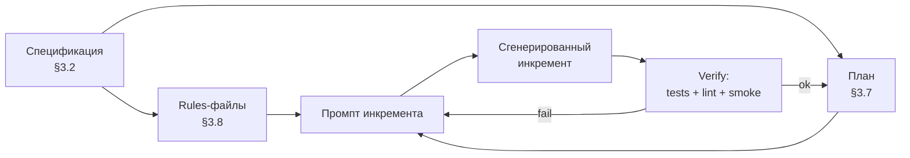
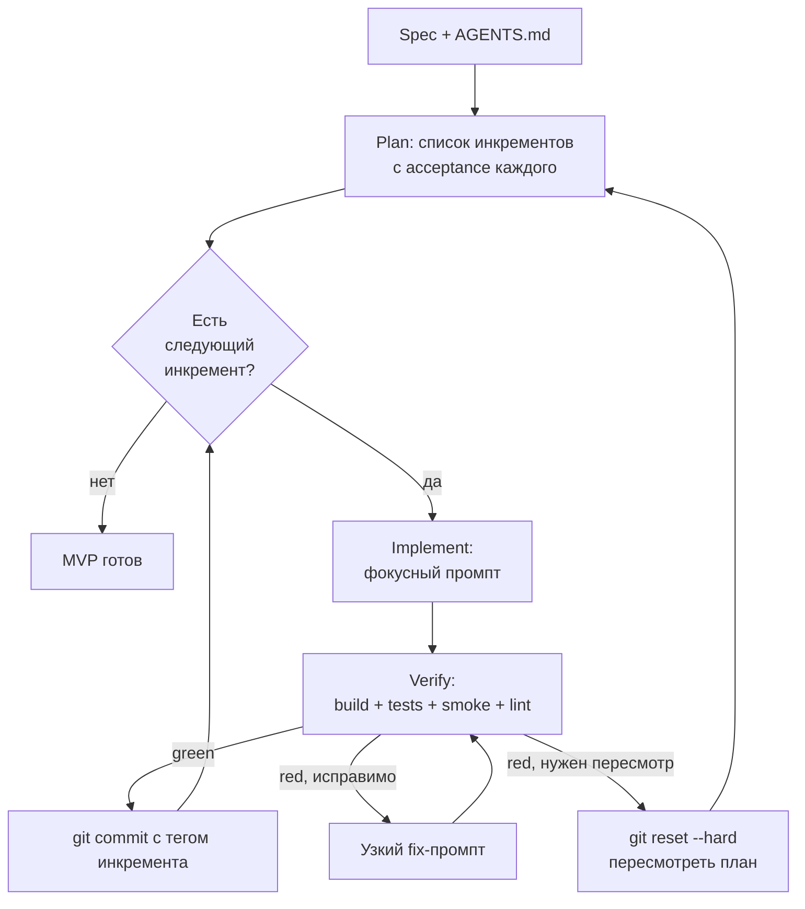
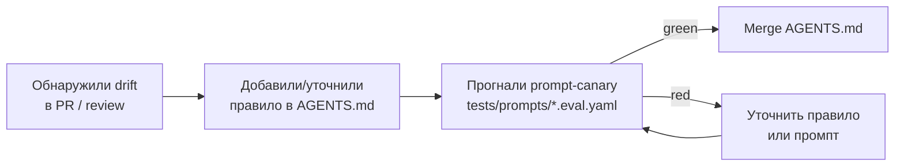
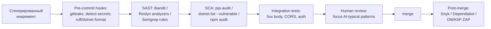
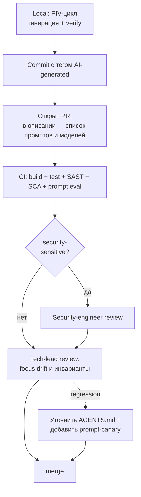

# Глава 3. Генерация кода и MVP проектов

> «Frontier-модель сгенерирует сервис за час. Архитектура этого сервиса будет результатом не часа, а трёх лет накопленных компромиссов вашего промпта — потому что архитектура — единственное, в чём у модели нет своей стратегической позиции».

## Зачем эта глава

Главы 1 и 2 дали ментальную модель LLM и инженерный фреймворк промптинга. Этого достаточно, чтобы получать стабильный код на масштабе одной функции, одного SQL-запроса, одного объяснения алгоритма. Этого недостаточно, чтобы:

- собрать **сервис из 30+ файлов** так, чтобы он не рассыпался при первом рефакторинге;
- объяснить команде, **где проходит граница** между «генерирую» и «пишу руками»;
- встроить AI-генерацию в workflow PR/review **без потери ownership** над архитектурой;
- избежать **prompt-driven architecture drift** — медленного дрейфа структуры проекта в сторону, в которую модель тянет по умолчанию.

Эта глава превращает фреймворк главы 2 в дисциплину MVP-сборки: от спецификации сервиса как input-контракта, через генерацию каркаса, API, persistence-слоя и CLI, до Plan-Implement-Verify-цикла, контроля архитектурных инвариантов и встраивания в PR-процесс.

Целевой уровень — middle/senior, прочитавший главы 1 и 2, имеющий продакшен-опыт с одним из бэкенд-стеков (Python/FastAPI или C#/.NET) и знакомый с базовым CI/CD.

---

## 3.1 От функции к сервису: что меняется при масштабе генерации

> **TL;DR.** На функции из 30 строк R-C-T-F-Q-промпт даёт корректный результат за 1–2 итерации. На сервисе из 30 файлов «один промпт — один сервис» приводит к **архитектурному дрифту**: модель достраивает каждое следующее решение по своему обучающему распределению, а не по контракту вашей системы. Решение — не «больше контекста», а **другая единица генерации**: спецификация → план → инкремент с верификацией. Эмпирически команды, переходящие на этот режим, тратят на MVP в 2–4× меньше итераций, чем «всё одним промптом».

### Почему «функциональный» промпт ломается на сервисе

Промпт в главе 2 решал задачу со свойствами:

- одна точка контракта (сигнатура, схема SQL, формат объяснения);
- один тип результата (код функции, запрос, документ);
- один шаг проверки (тесты или EXPLAIN ANALYZE).

Сервис устроен иначе:

- **N точек контракта**: HTTP API, схема БД, CLI-флаги, конфиги, env-переменные, формат логов, формат ошибок;
- **дюжина типов результата**: контроллер, DTO, ORM-модель, миграция, репозиторий, CLI-handler, README, Dockerfile, compose-файл;
- **многоступенчатая проверка**: компиляция, юнит-тесты, smoke-тест целиком, lint, security scan.

Каждая точка контракта — место, где модель додумает решение из обучающего распределения, если ей это место не задать явно. На функции вы видите проблему сразу: тест красный, exception в консоли. На сервисе — после третьего часа разработки, когда HTTP-валидация противоречит БД-валидации, а CLI ожидает другой формат конфига.

### Архитектурный drift: как это выглядит на практике

> **Definition.** **Prompt-driven architecture drift** — постепенное смещение архитектуры проекта в сторону «среднего по индустрии» решения, к которому модель тянет на каждом промпте при отсутствии явных архитектурных constraint'ов. Накапливается линейно по числу инкрементов; обнаруживается обычно на интеграции или на ревью.

Типичная траектория drift'а на одном MVP за 3–4 часа генерации:

1. **Час 1.** Запросили скелет FastAPI — модель выдала каркас с SQLAlchemy 1.x синтаксисом (legacy `query()`, не 2.0 `select()`).
2. **Час 2.** Попросили endpoint — модель добавила Pydantic v1-style валидацию, потому что её обучающие данные так чаще выглядят.
3. **Час 3.** Попросили миграцию — модель предложила Alembic и слегка иную схему, чем в моделях.
4. **Час 4.** На запуске — три несовместимости: Pydantic v2 не понимает v1-валидаторы, SQLAlchemy 2.x не понимает 1.x query syntax, миграция не сходится со схемой.

Никто из участников промпта не виноват по отдельности. Виновата отсутствующая **спецификация версий и стиля** — то, что должно было быть на уровне system / `AGENTS.md`, а оказалось «домыслено по умолчанию».

### Три новых единицы работы

Чтобы перенести дисциплину главы 2 на масштаб сервиса, нужны три новые сущности.

**Спецификация (specification).** Документ, фиксирующий стек, версии, архитектурные принципы и доменную модель **до** первого промпта. Это input-контракт всего MVP. Подробно — в §3.2.

**План (plan).** Декомпозиция спецификации на последовательность инкрементов, каждый из которых делается одним фокусным промптом и проверяется отдельно. Подробно — в §3.7.

**Архитектурные rules (rules-files).** Правила, которые верны для **каждого** промпта в рамках проекта: версии, naming, error-style, security baseline. Хранятся в `AGENTS.md` / `.cursorrules` / `CONVENTIONS.md`. Подробно — в §3.8.

Без них сервис собирается, как чат-история без system prompt: каждый ход — заново.



### Что это значит для практика

Если ваш текущий процесс — «открыл чат, набрал «сделай мне сервис задач на FastAPI», ждёшь» — этот процесс не масштабируется выше учебного MVP. Дисциплина MVP-сборки начинается там, где вы перестаёте генерировать «сервис целиком» и начинаете генерировать **спецификацию → план → инкремент с верификацией**. Это требует на 30–60 минут больше работы перед первым промптом и экономит 2–4 часа на отладке после.

> **See also.** §3.2 (спецификация как input-контракт) · §3.7 (Plan-Implement-Verify-цикл) · §3.8 (архитектурные rules-файлы) · Глава 1, §1.10 (правило №2: контекст — главный рычаг) · Глава 2, §2.5 (управление контекстом).

---

## 3.2 Spec-driven generation: спецификация как input-контракт

> **TL;DR.** Спецификация для AI-генерации MVP — это **минимально достаточный документ, заменяющий полтонны имплицитных предположений модели явными**. Семь разделов: **стек и версии, домен, контракты, NFR, архитектурный стиль, security baseline, definition of done**. Не ADR (тяжёлый, формальный), не jira-тикет (легковесный, без архитектурных решений), а **компактный input-контракт на 1–3 страницы**. Без него каждый промпт в проекте начинается с пустого листа; со спецификацией — с того же контракта, что и предыдущий.

### Spec-driven vs vibe-coding

> **Definition.** **Vibe-coding** — режим генерации, в котором требования формулируются на естественном языке без явной фиксации архитектурных решений; модель сама принимает все умолчания. Термин предложил Andrej Karpathy в 2025 году; в продакшен-разработке считается анти-паттерном за исключением исследовательских прототипов.

Vibe-coding годится для:

- одноразовых прототипов «проверить идею за час»;
- learning-проектов, где цель — научиться, а не сдать;
- генерации эскизов UI/CLI до согласования с пользователем.

Vibe-coding не годится для:

- любого кода, который пойдёт в репозиторий и будет жить дольше недели;
- любого кода с persistence, security или compliance-требованиями;
- любого кода в команде > 1 человек.

Spec-driven generation противоположен: вы фиксируете архитектурные решения **до** генерации, и модель работает в этих рамках.

### Семь разделов minimum-viable specification

Минимально достаточная спецификация для backend-MVP содержит:

1. **Стек и версии.** Точные версии language/runtime/framework: «Python 3.12, FastAPI 0.110, SQLAlchemy 2.0, Pydantic 2.x, Alembic 1.13». Для C#: «.NET 8, ASP.NET Core 8 Minimal API, EF Core 8, FluentValidation 11». Без точных версий модель смешивает несовместимые синтаксисы (см. §3.1).

2. **Домен.** Бизнес-сущности и их отношения, без реализации. «Task имеет id, title, due_at, status (одно из: pending, in_progress, done, cancelled). Принадлежит User. Один User имеет много Tasks». Это уровень UML class diagram в одном абзаце.

3. **Контракты.** HTTP API endpoints, CLI-команды, схемы сообщений. На уровне сигнатур: «POST /tasks принимает CreateTaskDTO, возвращает 201 + TaskDTO или 400 + ProblemDetails». Без полного OpenAPI; OpenAPI — сгенерированный артефакт, не вход.

4. **NFR (non-functional requirements).** Латентность, throughput, размеры данных, retention, доступность. «p95 на GET /tasks < 200 ms; до 100k Tasks на пользователя; данные хранятся 90 дней». Без NFR модель пишет код «как в учебнике»: O(n²) join в типичной точке, без пагинации, без индексов.

5. **Архитектурный стиль.** Слои, паттерны, что обязательно и что запрещено. «Слои: routers → services → repositories. Никаких прямых обращений к БД из routers-слоя. ORM-модели не пересекают сервисную границу — конверсия в DTO в service-слое». Это самое часто-нарушаемое моделью правило.

6. **Security baseline.** Что обязательно делать с входными данными, секретами, ошибками. «Все входы валидируются на api-слое. Секреты — только через ENV. На внутренних ошибках — 500 без stack trace во внешнем ответе». Без этого secrets утекают в логи на втором промпте.

7. **Definition of done.** Критерии готовности MVP. «API поднимается через `docker compose up`. 5 endpoint'ов работают на smoke-тестах. CLI имеет 2 команды и `--help`. README описывает запуск, env, smoke».

### Шаблон спецификации (выжимка)

```markdown
# MVP Spec: Task Tracker

## Stack & versions
- Python 3.12, FastAPI 0.110, SQLAlchemy 2.0 (async), asyncpg
- Pydantic 2.x, Alembic 1.13, pytest 8.x, ruff 0.4
- PostgreSQL 16, Docker Compose v2, uvicorn

## Domain
- Task(id: UUID, title: str ≤ 200, due_at: datetime?, status: enum[pending|in_progress|done|cancelled], owner_id: UUID, created_at, updated_at)
- User(id: UUID, email: str unique, created_at)
- Один User → много Tasks; каскадного удаления нет, soft-delete не нужен.

## API contracts
- POST /tasks         → 201 + TaskDTO | 400 ProblemDetails
- GET  /tasks         → 200 + list[TaskDTO]; пагинация cursor-based
- GET  /tasks/{id}    → 200 + TaskDTO | 404 ProblemDetails
- PATCH /tasks/{id}   → 200 + TaskDTO | 404
- DELETE /tasks/{id}  → 204 | 404

## NFR
- p95 GET /tasks < 200 ms на 10k Tasks/user.
- Все запросы — авторизованные (X-User-Id; auth — заглушка для MVP).
- Audit-логи пока не нужны; добавим в v2.

## Architecture style
- Слои: routers → services → repositories → DB.
- DTO ≠ ORM models; конверсия в service-слое.
- Никаких бизнес-правил в routers (только валидация формы и вызов service).
- Зависимости — через FastAPI Depends; никаких глобальных синглтонов.

## Security baseline
- Все входные DTO валидируются Pydantic'ом.
- DB-запросы — только через параметризацию (никаких f-strings в SQL).
- ENV-переменные через pydantic-settings; ничего из них в логах.
- На 5xx — текст «internal error», без stack trace в HTTP-ответе.

## Definition of done
- `docker compose up` поднимает сервис + БД.
- 5 endpoint'ов покрыты pytest'ами на happy path + 1 ошибочный кейс.
- CLI `tasks-admin` имеет команды `create-user`, `list-users`.
- README описывает запуск, env, smoke-тест curl'ом.
```

Объём — 30–80 строк. Это input-контракт для **каждого** последующего промпта, не одноразовый артефакт.

### Спецификация vs ADR

> **Definition.** **Architecture Decision Record (ADR)** — документ, фиксирующий **одно** архитектурное решение с контекстом, рассмотренными альтернативами и последствиями. Формат предложил Michael Nygard в 2011 году; на 2026 год — индустриальный стандарт документирования решений, в том числе в AI-эпоху.

Это разные артефакты:

- **Спецификация** = весь input-контракт MVP в одном месте, читается перед каждым промптом.
- **ADR** = одно зафиксированное решение с альтернативами, читается, когда возникает вопрос «почему так».

Для MVP сначала пишется спецификация, ADR'ы появляются по ходу — на нетривиальных развилках. Подробнее — в Модуле 6.

### Pitfall: спецификация как обзор литературы

Распространённая ошибка — превратить спецификацию в полноценный design document на 20 страниц с диаграммами, расчётами и обоснованиями. Это не то.

- Цель спецификации — **сжать input в промпт-контекст**, не обосновать решения для будущего.
- 1–3 страницы — потолок. Если получается 10 страниц — это design doc, а не spec.
- Решения принимаются ДО спецификации; в спецификации — только итог.

Если каждый промпт начинается с того, что вы вставляете 10 страниц контекста — у вас Lost in the Middle (см. глава 2, §2.5) и счёт растёт линейно по объёму спеки.

### Что это значит для практика

Перед первым промптом MVP вы тратите 20–40 минут на спецификацию. Эти минуты возвращаются 2–4 часами на отладке несогласованных решений в конце. Спецификация версионируется в репозитории как `docs/spec.md`; меняется раньше кода и через PR. Если она устарела, любой следующий промпт становится unsafe — модель работает на устаревшем контракте.

> **See also.** §3.3 (как спецификация переходит в scaffolding) · §3.8 (rules-files как continuous-часть спеки) · Глава 2, §2.10 (промпт как версионируемый артефакт; та же логика для спеки) · Модуль 6 (ADR как complement спецификации).

---

## 3.3 Scaffolding: генерация каркаса проекта

> **TL;DR.** Каркас проекта (project scaffolding) — первый артефакт после спеки и самый недооценённый. Ошибки на этом шаге дороже всех последующих, потому что **они задают физическую структуру всех будущих файлов**. Шаблон промпта: спецификация → структура каталогов → конфиги (lockfiles, lint, format, CI) → пустые модули с TODO. Никакого бизнес-кода на этом шаге. Анти-паттерн «один промпт → весь сервис» здесь главный риск: модель сгенерирует 800 строк, в которых 60% будут переписаны через два часа.

### Что такое scaffolding и зачем он отдельным шагом

> **Definition.** **Scaffolding (каркас проекта)** — генерация структуры каталогов, конфигурационных файлов и пустых модулей с явными TODO без бизнес-логики. Цель — зафиксировать физическую раскладку проекта и инструменты разработки до начала реализации фич.

Scaffolding отдельным шагом нужен по трём причинам:

1. **Структура каталогов задаёт impedance** между спецификацией и реализацией. Если в спеке сказано «слои routers → services → repositories», а каркас положил всё в один `app.py` — следующие промпты будут конфликтовать с структурой.
2. **Конфиги задают инструменты проверки.** Без `pyproject.toml`/`*.csproj`, `ruff`/`Roslyn analyzers`, `pytest`/`xunit` нечем верифицировать инкременты. Без верификации Plan-Implement-Verify цикл (§3.7) не работает.
3. **Пустые модули с TODO задают единицу инкремента.** Каждый TODO — кандидат на отдельный фокусный промпт.

### Анти-паттерн «один промпт — весь сервис»

Соблазн: «дай мне готовый FastAPI-сервис задач со всеми endpoint'ами, БД, миграциями и тестами одним промптом». Frontier-модель (Claude 4.5 Sonnet, GPT-4.1) на 2026 год **сделает** это — выдаст 800–1500 строк за один проход.

Что не так:

- Никакая часть результата не верифицирована до его получения; ошибка на 200-й строке делает невалидным всё после.
- Контекст для каждого следующего промпта — этот же сгенерированный код вместо спеки. Дрифт начинается с первого пересмотра.
- Code review такого инкремента — все 800 строк за раз. На практике ревьюер скажет «выглядит ок» и пропустит проблему.

«Один промпт — весь сервис» — это V0-валидация (см. глава 1, §1.8) на масштабе сервиса. На production-кодогенерации это халатность.

### Шаблон промпта для scaffolding (Python/FastAPI)

```text
Role: senior Python engineer scaffolding a FastAPI service from a spec.

Context:
<полная спецификация из §3.2, ≤ 80 строк>

Task: создать структуру проекта и пустые модули с TODO.

Output:
- список файлов в формате `path: <short description>`;
- содержимое каждого файла, кода — минимум, чтобы скомпилировалось;
- никакой бизнес-логики, только TODO-заглушки.

Required files:
- pyproject.toml (с фиксированными minor-версиями из спеки)
- README.md (только заголовок и пустые секции: setup, run, test)
- docker-compose.yml (api + postgres-16, healthchecks)
- Dockerfile (multi-stage, non-root user)
- .env.example (без значений, только список ключей)
- .gitignore (стандартный python + venv + .env)
- src/app/__init__.py
- src/app/main.py (FastAPI() + healthcheck endpoint /health)
- src/app/config.py (pydantic-settings: DB_URL, LOG_LEVEL)
- src/app/db.py (async engine + session factory, TODO для конкретики)
- src/app/models/__init__.py
- src/app/schemas/__init__.py
- src/app/repositories/__init__.py
- src/app/services/__init__.py
- src/app/routers/__init__.py
- src/app/cli/__init__.py + main.py (Typer-skeleton с --help)
- migrations/alembic.ini + env.py + versions/.gitkeep
- tests/conftest.py (httpx.AsyncClient fixture, TODO)
- tests/test_health.py (один тест на /health → 200)

Constraints:
- никаких внешних зависимостей помимо перечисленных в спеке;
- импорты должны разрешаться, mypy --strict не должен ругаться на отсутствие типов;
- ruff check . проходит на пустом проекте.

Acceptance:
- pip install -e . && pytest -q даёт 1 passing.
- ruff check . → no issues.
- docker compose up поднимает api + postgres.
```

После этого промпта вы получаете каркас, **в котором 0 строк бизнес-логики**, но всё, что нужно для верификации последующих инкрементов, уже есть.

### Шаблон промпта для scaffolding (C# / .NET 8)

```text
Role: senior C# engineer scaffolding an ASP.NET Core 8 Minimal API service.

Context:
<спецификация>

Task: создать solution, projects и заглушки.

Required structure:
- TaskTracker.sln
- src/TaskTracker.Api/TaskTracker.Api.csproj (Minimal API)
- src/TaskTracker.Application/TaskTracker.Application.csproj (services, DTO)
- src/TaskTracker.Infrastructure/TaskTracker.Infrastructure.csproj (EF Core 8, repositories)
- src/TaskTracker.Domain/TaskTracker.Domain.csproj (entities)
- src/TaskTracker.Cli/TaskTracker.Cli.csproj (System.CommandLine)
- tests/TaskTracker.Api.Tests/TaskTracker.Api.Tests.csproj (xUnit + WebApplicationFactory)
- Directory.Build.props (TreatWarningsAsErrors=true, Nullable=enable)
- docker-compose.yml, Dockerfile (multi-stage), .editorconfig

Constraints:
- ProjectReference только в одном направлении: Api → Application → Domain; Infrastructure → Domain.
- Никаких пакетов кроме перечисленных в спеке.
- TreatWarningsAsErrors=true не должен падать на пустом solution'е.

Acceptance:
- dotnet build → success.
- dotnet test → 1 passing (HealthEndpointReturns200).
- dotnet format --verify-no-changes → ok.
```

### Что это значит для практика

Scaffolding — единственный шаг MVP, на котором стоит **сознательно** делать «много кода одним промптом», но при этом каждый файл — минимальный, проверяемый и без логики. Это инвестиция в инструменты проверки, которыми вы пользуетесь все следующие 5–10 промптов. Если scaffold падает на `pytest -q` или `dotnet build` — следующий шаг не делается. Точка.

> **See also.** §3.4–§3.6 (как заполняются пустые модули каркаса) · §3.7 (Plan-Implement-Verify цикл стартует на готовом каркасе) · §3.8 (`AGENTS.md` как часть scaffold'а) · Глава 2, §2.6 (R-C-T-F-Q применён к scaffolding-промпту) · Модуль 5 (тестовая инфраструктура как часть каркаса).

---

## 3.4 Генерация API: endpoints, валидация, ошибки

> **TL;DR.** API endpoint = **route + DTO + валидация + service-вызов + маппинг ошибок в HTTP-коды**. Без явных DTO модель использует ORM-модели наружу, протекая infrastructure в API-слой. Без явных error-mappings — `try/except: return 500`. Шаблон endpoint-промпта фиксирует пять элементов и приводит один happy-path-тест и один error-test. Schema-first vs code-first — реальный trade-off; по умолчанию для MVP подходит code-first с автогенерацией OpenAPI, но schema-first обязателен при множественной интеграции.

### Анатомия endpoint-промпта

Шаблон фокусного промпта на один endpoint содержит:

1. **Route и метод.** `POST /tasks`, не «эндпоинт для создания задачи».
2. **Input DTO.** Точная схема Pydantic / record с типами, валидаторами, optional/required.
3. **Output DTO.** Точная схема ответа с HTTP-кодом.
4. **Error-mappings.** Какой HTTP-код на какое исключение/состояние. ProblemDetails (RFC 7807) обязателен.
5. **Service-зависимость.** Какой service вызывается, через какой DI-механизм.
6. **Тесты.** Один happy-path, один валидационный, один на 404/409.

Без любого из шести элементов модель додумает — обычно неудачно.

### Schema-first vs code-first

> **Definition.** **Schema-first** — подход, при котором OpenAPI/AsyncAPI/protobuf-схема пишется первой, и из неё генерируется серверный и клиентский код. Противоположный — **code-first**: код контроллеров — источник истины, схема генерируется из него (FastAPI, ASP.NET Core OpenAPI).

| Schema-first | Code-first |
|--------------|------------|
| **Хорошо подходит**: множественные клиенты на разных языках; стабильный публичный API; команды backend и frontend разделены. | **Хорошо подходит**: MVP; быстрая итерация; один backend-team владеет API. |
| **Плохо подходит**: одиночный сервис с одним клиентом; быстрый прототип; дисциплина команды слабая. | **Плохо подходит**: API уже опубликован публично с контрактом; OpenAPI — часть compliance. |

Для MVP по умолчанию — code-first. На втором релизе, если API публикуется наружу, — переход на schema-first через freeze существующей схемы.

### Шаблон промпта для endpoint (Python/FastAPI)

```text
Role: senior Python engineer adding an endpoint to a FastAPI service.

Context:
<spec.md, особенно секция API contracts и Architecture style>
<существующие модули: src/app/models/task.py, src/app/services/task_service.py>

Task: реализовать POST /tasks.

Input DTO (CreateTaskDTO):
- title: str, 1..200 chars, strip whitespace, не пустая после strip.
- due_at: datetime | None, должна быть в будущем если задана.
- status: enum, по умолчанию pending.

Output DTO (TaskDTO):
- id: UUID
- title, due_at, status, created_at, updated_at: как в Domain.

HTTP behaviour:
- 201 + TaskDTO в body на success.
- 400 + ProblemDetails на validation error (FastAPI default + Pydantic).
- 401 если X-User-Id отсутствует.
- 500 + ProblemDetails (без stack trace) на любую DB-ошибку.

Service contract:
- TaskService.create(owner_id: UUID, dto: CreateTaskDTO) -> Task
- бросает DomainError на доменные конфликты (нет в этом endpoint'е, но на будущее).

Tests:
1. happy: POST с валидным title → 201, response содержит id.
2. validation: POST с title="" → 400 + ProblemDetails.
3. unauthorised: POST без X-User-Id → 401.

Constraints:
- DTO не зависит от ORM-моделей.
- Маппинг Task → TaskDTO в service-слое, не в router.
- Никаких прямых обращений к session из router.

Output:
- src/app/schemas/task.py: CreateTaskDTO, TaskDTO.
- src/app/routers/tasks.py: APIRouter с POST /.
- tests/test_tasks.py: три теста.
- regenerate src/app/main.py: include_router.

Output format: только diff + новые файлы целиком, без prose до и после.
```

### Шаблон промпта для endpoint (C# / .NET 8 Minimal API)

```text
Role: senior C# engineer на ASP.NET Core 8 Minimal API.

Context: <spec.md + существующие проекты solution'а>

Task: добавить POST /tasks endpoint.

DTOs (records в TaskTracker.Application/Dtos):
public sealed record CreateTaskDto(
    [property: Required, StringLength(200, MinimumLength = 1)] string Title,
    DateTimeOffset? DueAt,
    TaskStatus Status = TaskStatus.Pending);

public sealed record TaskDto(Guid Id, string Title, DateTimeOffset? DueAt, TaskStatus Status, DateTimeOffset CreatedAt, DateTimeOffset UpdatedAt);

HTTP behaviour:
- 201 + TaskDto в body на success.
- 400 + ProblemDetails (через AddProblemDetails()) на ValidationException.
- 401 если X-User-Id отсутствует.
- 500 + ProblemDetails (без exception details) на любое необработанное исключение.

Service contract: ITaskService.CreateAsync(Guid ownerId, CreateTaskDto dto, CancellationToken ct) → TaskDto.

Tests (xUnit + WebApplicationFactory):
1. Post_ValidPayload_Returns201
2. Post_EmptyTitle_Returns400WithProblemDetails
3. Post_NoUserHeader_Returns401

Constraints:
- Endpoints в TaskTracker.Api/Endpoints/TasksEndpoints.cs как extension MapTaskEndpoints(this IEndpointRouteBuilder).
- Никакой бизнес-логики в endpoint-handler'е; только модель привязки + вызов сервиса + Results.Created.
- ProblemDetails — единый формат для всех ошибок; никаких произвольных JSON-ответов.

Output: только новые/изменённые файлы целиком.
```

### Маппинг ошибок: централизованно или в endpoint

Два паттерна:

**Централизованно (рекомендуется для MVP).** Один exception-handler middleware (FastAPI: `app.exception_handler`; ASP.NET: `app.UseExceptionHandler` + `IExceptionHandler`) преобразует доменные исключения в HTTP-коды. Endpoint остаётся чистым.

**Inline в endpoint.** `try/except` в каждом router. Простой для одиночного endpoint, разваливается при росте числа exception-классов.

```python
@app.exception_handler(DomainNotFoundError)
async def _not_found(_: Request, exc: DomainNotFoundError) -> JSONResponse:
    return JSONResponse(status_code=404, content={"type": "about:blank", "title": "Not found", "detail": str(exc)})
```

Промпт явно требует централизованную обработку, иначе модель почти всегда выбирает inline `try/except`.

### Pitfall: ORM-модели в API-DTO

Самый частотный анти-паттерн на 2026 год: модель экономит на DTO и возвращает наружу ORM-сущность. Симптомы:

- В JSON-ответе появляются поля, которых не должно быть (`password_hash`, `internal_notes`).
- Изменение БД-схемы ломает API-контракт без явного видимого изменения в API-коде.
- Ленивая загрузка ORM-связей внутри сериализации даёт N+1 запросов.

Антидот в промпте: **«DTO не зависят от ORM-моделей; маппинг — в service-слое»** — короткая фраза, исключающая 80% случаев.

### Что это значит для практика

Endpoint-промпт — главная точка контакта между спецификацией и кодом сервиса. Каждый отсутствующий пункт из шести (route, input DTO, output DTO, errors, service, tests) — место, где модель додумает, и обычно — в сторону, противоречащую следующему endpoint'у. Шаблон копируется в `prompts/endpoint.md` (см. глава 2, §2.10) и применяется ко всем 5 endpoint'ам спеки. Это и есть индустриализация работы с моделью на масштабе MVP.

> **See also.** §3.5 (persistence, к которому endpoint обращается через service) · §3.7 (endpoint как один инкремент в PIV-цикле) · §3.9 (security в endpoint'е) · Глава 2, §2.6 (шаблон функции — строительный блок шаблона endpoint'а) · Модуль 5 (тесты на endpoint как формальная V5-валидация).

---

## 3.5 Persistence: модели, миграции, репозитории

> **TL;DR.** Persistence-слой — место, где модель чаще всего нарушает архитектурные инварианты: возвращает ORM-объекты наружу, генерирует SQL без индексов, путает ORM-сессии и UoW. Шаблон persistence-промпта = **ORM-модель + репозиторий-контракт + миграция + индексы + транзакционная граница**. Миграции — версионируемый артефакт; никогда не редактировать сгенерированные после применения, только новой миграцией. AI хорош в генерации CRUD-репозиториев; плохо генерирует bulk-операции и сложные JOIN — перепроверяйте через `EXPLAIN ANALYZE` (см. глава 2, §2.8).

### Три артефакта persistence-слоя

Persistence-инкремент состоит из трёх артефактов, каждый — отдельный промпт или часть одного:

1. **ORM-модель** — то, что мапится на таблицу. SQLAlchemy `DeclarativeBase` или EF Core `DbSet<T>`-сущности.
2. **Миграция** — DDL-файл, который применит схему к БД. Alembic или EF migrations. Должен сходиться с ORM-моделью bit-to-bit.
3. **Репозиторий** — интерфейс между service-слоем и БД. Возвращает domain-объекты или ORM-объекты внутри границы; **не** возвращает ORM-объекты наружу из service.

Эти три артефакта согласуются между собой и со спецификацией. Пропуск одного — разрыв консистентности.

### Шаблон промпта для persistence-инкремента (Python/SQLAlchemy 2.0)

```text
Role: senior Python engineer на SQLAlchemy 2.0 async + Alembic.

Context:
<spec.md секции Domain, NFR, Architecture style>
<существующие src/app/db.py, src/app/models/__init__.py>

Task: добавить ORM-модель Task, миграцию и TaskRepository.

ORM-model (src/app/models/task.py):
- наследует Base (mapped_column-стиль 2.0, никаких Column).
- id: Mapped[UUID] = mapped_column(primary_key=True, default=uuid4)
- title: Mapped[str] = mapped_column(String(200))
- due_at: Mapped[datetime | None]
- status: Mapped[TaskStatus] (PG enum или check)
- owner_id: Mapped[UUID] = mapped_column(ForeignKey("users.id", ondelete="RESTRICT"))
- created_at, updated_at: Mapped[datetime] (server_default=func.now())
- __table_args__: индексы (см. NFR).

Indices:
- idx_tasks_owner_id (на owner_id) — для GET /tasks по пользователю.
- idx_tasks_owner_id_due_at (составной) — для сортировки by due_at внутри owner.

Migration (migrations/versions/<rev>_add_tasks.py):
- сгенерировать через `alembic revision --autogenerate` semantics, но без autogenerate (имитировать вручную).
- upgrade и downgrade обе непустые и обратные.

Repository (src/app/repositories/task_repository.py):
- async-интерфейс: TaskRepository.
- методы: add(task) -> Task; get_by_id(id) -> Task | None; list_by_owner(owner_id, cursor, limit) -> tuple[list[Task], next_cursor].
- получает AsyncSession через конструктор; никаких глобалов.
- никаких commit'ов внутри; commit делает service.

Constraints:
- никаких lazy='joined' (eager только явный selectinload в service).
- никаких raw SQL string concatenation.
- list_by_owner — ровно один запрос к БД, не N+1.

Tests (tests/test_task_repository.py):
- использовать testcontainers Postgres (см. conftest.py) или sqlalchemy in-memory как fallback.
- happy-path: add → get_by_id возвращает то же.
- list_by_owner с курсором возвращает страницы по 10 элементов.

Output: только новые файлы + миграция.
```

### Шаблон для C# / EF Core 8

```text
Role: senior C# engineer на EF Core 8.

Task: добавить TaskEntity, миграцию AddTasks, ITaskRepository.

TaskEntity (TaskTracker.Domain/Tasks/TaskEntity.cs):
- public sealed class TaskEntity { Id, Title, DueAt, Status, OwnerId, CreatedAt, UpdatedAt; private ctor для EF; статический фабричный Create(...) с валидацией. }
- TaskStatus: enum + конвертер в string column через HasConversion<string>().

Configuration (TaskTracker.Infrastructure/Persistence/TaskEntityConfiguration.cs):
- IEntityTypeConfiguration<TaskEntity>.
- Title: HasMaxLength(200), IsRequired.
- HasIndex(x => x.OwnerId).HasDatabaseName("ix_tasks_owner_id").
- HasIndex(x => new { x.OwnerId, x.DueAt }).HasDatabaseName("ix_tasks_owner_id_due_at").
- HasOne<UserEntity>().WithMany().HasForeignKey(x => x.OwnerId).OnDelete(DeleteBehavior.Restrict).

Migration: dotnet ef migrations add AddTasks семантически (генерируется вручную в этом промпте).

ITaskRepository / TaskRepository:
- AddAsync, GetByIdAsync, ListByOwnerAsync(ownerId, cursor, limit, ct).
- Без сохранения в БД; SaveChangesAsync — на стороне UoW в service.
- ListByOwnerAsync: AsNoTracking, OrderBy DueAt, Take limit + 1 для определения next-cursor.

Tests (xUnit + Testcontainers Postgres): три кейса как выше.
```

### Миграции: что нельзя делегировать модели

Миграция — единственный артефакт persistence-слоя, на котором ошибка в продакшене стоит дороже всего. Что **не** делегируется промпту без верификации человеком:

- **Удаление колонок** (`DROP COLUMN`) — необратимо для данных. Антидот: двухступенчатая миграция (deprecate → drop через релиз).
- **Изменение типа колонки** на сужающий (`varchar(200) → varchar(50)`) — потеря данных. Антидот: `USING` cast + check на наличие проблемных строк.
- **Добавление NOT NULL без default** — падение на существующих строках. Антидот: добавить с DEFAULT, бэкфилл, потом сменить на NOT NULL.
- **Reorder констрейнтов** — race conditions на больших таблицах.
- **Удаление индекса в одной миграции** — длительный lock на таблице. Антидот: `DROP INDEX CONCURRENTLY` (PG).

Промпт для миграции должен содержать секцию «destructive ops policy: any column drop / type narrowing / not-null without default — STOP and ask».

### Pitfall: AI любит «универсальный» репозиторий

Распространённый анти-паттерн в сгенерированном коде:

```python
class GenericRepository(Generic[T]):
    async def add(self, e: T) -> T: ...
    async def get(self, id_: UUID) -> T | None: ...
    async def update(self, e: T) -> T: ...
    async def delete(self, id_: UUID) -> None: ...
```

Симптомы: каждый репозиторий пустой (`class TaskRepository(GenericRepository[Task]): pass`), а реальные запросы (`list_by_owner`, `find_overdue`, `count_by_status`) лежат в service-слое и тащат за собой `session` через всё приложение.

Антидот: явный запрет в промпте — «никаких generic-репозиториев. TaskRepository наследует только от своего интерфейса. Все доменные запросы — методы конкретного репозитория». На фронтире эта одна фраза снимает 70–80% случаев.

### Что это значит для практика

Persistence-инкремент — единственный, где **EXPLAIN ANALYZE** на сгенерированном SQL обязателен до коммита. Не «когда станет медленно», а **на этапе ревью каждого репозиторного метода**. Это V4-валидация (см. глава 1, §1.8) для SQL: «бенчмарк показывает разумные числа на realistic-данных». Если этого нет — миграции уйдут в продакшен с sequential scan на 50M строк, и это инцидент через 2–6 месяцев.

> **See also.** §3.4 (как router вызывает service, который вызывает repository) · §3.7 (persistence как ранний инкремент в PIV-цикле) · §3.9 (SQL injection и параметризация) · Глава 2, §2.8 (шаблон SQL-промпта применим к репозиторным методам) · Модуль 4 (анализ медленных запросов в production).

---

## 3.6 Генерация CLI-инструментов

> **TL;DR.** CLI — отдельный артефакт MVP, не «второй интерфейс к API». Шаблон CLI-инструмента = **команды + флаги + I/O-контракты + exit codes + --help как первоклассный артефакт**. На 2026 год идиоматический выбор: Typer/Click для Python, System.CommandLine для C# / .NET. AI хорош в генерации команд и хелпа; плохо обрабатывает edge cases I/O (stdin без TTY, broken pipe, не-UTF-8). Минимум: `--help`, осмысленные exit codes (0/1/2), ошибки в stderr, никаких прогресс-баров без TTY.

### Чем CLI отличается от API

CLI — это интерфейс для трёх типов потребителей:

1. **Человек в терминале.** Ему нужны `--help`, осмысленные сообщения об ошибках, цветной вывод (когда есть TTY) и интерактивный confirm на деструктивных операциях.
2. **Shell-скрипт.** Ему нужны стабильные exit codes, машинно-читаемый вывод (`--json`), отсутствие color-кодов в pipe, корректное поведение на broken pipe.
3. **CI и автоматизация.** Им нужны идемпотентность (`--if-not-exists`), детерминированный вывод, возможность запуска без TTY (без интерактивных prompt'ов).

Эти три потребителя противоречат друг другу. Промпт без явного приоритета даёт «скрипт для одного человека на одном лэптопе», который ломается в CI на первом же `is_terminal()`-чеке.

### Шаблон промпта для CLI (Python / Typer)

```text
Role: senior Python engineer строящий administrative CLI для FastAPI-сервиса.

Context:
<spec.md, секция о CLI и Domain>
<существующие src/app/services/*, репозитории, db.py>

Task: реализовать `tasks-admin` CLI с двумя командами.

Commands:
1. tasks-admin users create --email <str> [--id <uuid>]
   - создаёт User; если email занят → exit 2, stderr "email already exists".
   - on success: JSON {"id": "...", "email": "..."} в stdout, exit 0.
2. tasks-admin users list [--limit N] [--format json|table]
   - возвращает список пользователей.
   - default --format=table если stdout — TTY, json иначе.
   - exit 0 даже на пустом списке.

Cross-cutting:
- --help и --version на каждой команде; --help должен описывать примеры.
- Все ошибки конфигурации/БД → stderr + exit 1.
- Ошибки валидации пользовательского ввода → stderr + exit 2.
- Нет интерактивных prompt'ов; deструктивные действия требуют --yes явно.
- Конфигурация — те же ENV, что и API (DB_URL и пр.); ничего не хардкодить.
- Никаких progress bars; есть `--verbose` для дополнительных логов в stderr.

Tests:
- pytest с CliRunner: happy-path обеих команд + ошибочный кейс.

Constraints:
- Typer 0.12+, no Click directly.
- Reusable: команда users.create вызывает тот же UserService, что и API.

Output:
- src/app/cli/main.py (entry point, app = typer.Typer()).
- src/app/cli/users.py (commands).
- pyproject.toml: добавить [project.scripts] tasks-admin = "app.cli.main:app".
- tests/test_cli_users.py.
```

### Шаблон промпта для CLI (C# / System.CommandLine)

```text
Role: senior C# engineer building admin CLI on System.CommandLine 2.x.

Task: реализовать `tasks-admin` с командами `users create`, `users list`.

Commands и поведение — как в Python-варианте выше.

Constraints:
- System.CommandLine (preview 2.x as of 2026), не Spectre.Console для парсинга.
- Использовать TaskTracker.Application.IUserService через DI (host builder).
- Exit codes: 0 ok, 1 internal/db, 2 user input.
- Output detection: Console.IsOutputRedirected → json default; иначе table через Spectre.Console для рендера.
- Без интерактивных prompt'ов; --yes для деструктивных действий.

Tests (xUnit):
- Запуск через RootCommand.InvokeAsync; assert на ExitCode и захваченный stdout/stderr.
```

### Эргономика, которую модель пропускает по умолчанию

| Признак |  По умолчанию модель | Что нужно явно потребовать |
|---------|----------------------|----------------------------|
| `--help` | Auto-generated, голый | Содержит 1–2 примера запуска |
| Exit codes | Только 0/1 | Минимум 0 (ok), 1 (system), 2 (user input) |
| stderr vs stdout | Всё в stdout | Логи и ошибки → stderr; только данные → stdout |
| TTY-detection | Игнор | Цвет / table только если is_terminal; иначе plain / json |
| Broken pipe | Crash с traceback | Exit 0 (стандартное поведение Unix-инструментов) |
| Long-running ops | Прогресс-бар всегда | Прогресс только в TTY; в pipe — точечный лог |
| Кодировка | Локаль системы | Явная UTF-8 на in/out |
| Версия | Не упомянута | `--version` + machine-readable `--version --json` |

### Pitfall: CLI как зеркало API

Соблазн — сделать CLI вызывающим HTTP-API. Это плохо для admin-CLI:

- усложняет deployment (CLI требует поднятого API);
- лишает CLI прямого доступа к БД для batch-операций;
- усложняет авторизацию (CLI должен иметь admin-token).

Лучше: CLI вызывает **те же service-слои**, что и API. Один сервис — два транспорта (HTTP и argv). Это и есть смысл слоистой архитектуры из §3.2.

### Что это значит для практика

CLI — самый недооценённый артефакт MVP. Он живёт дольше API (часто переживает 2–3 переписывания backend'а), и в нём концентрируются операционные процедуры. Промпт для CLI требует **явного указания эргономики**, которая моделью домысливается «как удобно одному пользователю на лэптопе» — а нужна устойчивая к pipe, TTY и автоматизации. На MVP минимум: 2 команды, `--help` с примерами, три exit-code класса, stderr-логи, JSON-режим.

> **See also.** §3.5 (services, которые CLI разделяет с API) · §3.10 (CLI в workflow PR/review) · Глава 2, §2.6 (R-C-T-F-Q применён к CLI-команде) · Модуль 6 (CLI-команды как часть documenttation operating procedures).

---

## 3.7 Plan-Implement-Verify: инкрементальная сборка MVP

> **TL;DR.** Plan-Implement-Verify (PIV) — рабочий цикл инкрементальной AI-сборки MVP. **Plan** — декомпозиция спеки на 5–15 мелких инкрементов с явным acceptance каждого. **Implement** — один фокусный промпт на инкремент. **Verify** — обязательная проверка: компиляция, юнит-тесты, smoke-тест, lint, security scan. Откат — first-class operation: если verify красный, откатываемся до последнего зелёного состояния, не «дофиксиваем по ходу». Эмпирически команды на PIV дают рабочий MVP за 4–8 часов вместо 12–20 на vibe-coding.

### Цикл Plan-Implement-Verify



### Plan: что и в каком порядке

План — это упорядоченный список инкрементов, каждый из которых:

- помещается в один фокусный промпт (≤ 60 строк);
- имеет проверяемый acceptance (тест, smoke-команда, EXPLAIN, lint pass);
- не зависит от инкрементов, идущих позже в плане.

Типовой план backend-MVP:

| # | Инкремент | Acceptance |
|---|-----------|------------|
| 1 | Scaffolding (§3.3) | `docker compose up` поднимает api+db; `pytest` зелёный (1 healthcheck-тест) |
| 2 | `AGENTS.md` + `prompts/` (§3.8) | Файлы существуют, заглушки заполнены |
| 3 | User entity + migration | `alembic upgrade head` без ошибок; `\d users` в psql |
| 4 | UserService + UserRepository | юнит-тесты на CRUD проходят |
| 5 | POST /users (admin endpoint) | curl -X POST даёт 201 |
| 6 | Task entity + migration + repo | юнит-тесты, EXPLAIN на list_by_owner |
| 7 | POST /tasks | endpoint-тесты (3 кейса) |
| 8 | GET /tasks (list + cursor pagination) | endpoint-тесты на пустой список и пагинацию |
| 9 | GET /tasks/{id}, PATCH, DELETE | endpoint-тесты по 1 на каждый |
| 10 | CLI: users create, list | CliRunner-тесты |
| 11 | README с инструкциями | `bash README's snippets` запускается |
| 12 | CI workflow | GitHub Actions на push зелёный |

12 инкрементов — типовой объём для MVP. На команде из 1–2 разработчиков с frontier-моделью — это 4–8 часов реального времени.

### Implement: один промпт — один инкремент

Промпт для каждого инкремента собирается из:

- **role + контекст** — спецификация + затронутые файлы (через `@file` в Cursor, копипаст в чат);
- **task** — формулировка инкремента из плана;
- **constraints** — ссылки на `AGENTS.md`, явные ограничения версии и стиля;
- **acceptance** — повторение acceptance из плана;
- **output format** — diff или новые файлы целиком.

Никакой инкремент не требует «угадать, что хотел пользователь». Если требует — план составлен слишком крупно, его нужно дробить.

### Verify: что входит в проверку

Минимум verify-стадии для каждого инкремента:

1. **Build / compile.** Python: `ruff check .` + `mypy --strict src` (или текущая строгость). C#: `dotnet build` с `TreatWarningsAsErrors=true`.
2. **Юнит-тесты затронутого инкремента.** Не весь набор, только относящееся к инкременту — быстрее цикл.
3. **Smoke-тест.** Один curl-запрос на свежеподнятый сервис, или CLI-команда с известным выводом. Проверяет, что инкремент реально работает в составе целого, а не только изолированно.
4. **Полный набор тестов.** Раз в 3–5 инкрементов и обязательно — перед commit'ом крупного шага.
5. **Lint и formatter.** `ruff format`, `dotnet format` — не должны менять код после генерации (если меняют — модель проигнорировала AGENTS.md).
6. **Security scan на финальном инкременте.** `pip-audit`, `dotnet list package --vulnerable` — обязательны до выкладки PR (см. §3.9).

### Откат как first-class operation

> **Pitfall.** «Дофиксим по ходу» — главный анти-паттерн PIV-цикла. Если инкремент не проходит verify, и узкий fix-промпт не решает за 1–2 итерации — это сигнал, что план или промпт некорректны. «Ещё попытка» делает технический долг, а не инкремент.

Правило: **на 3-й failed итерации одного инкремента — откат**. `git reset --hard` до последнего зелёного коммита, пересмотр инкремента в плане (часто — разбить на два), переформулировка промпта. Это и есть инженерная зрелость работы с AI: распознать, что модель сейчас не справляется, и изменить вход, а не повторять reroll-as-debugging (см. глава 2, §2.9).

### Что класть в каждый коммит

Один инкремент — один коммит. Сообщение коммита:

```text
feat(tasks): add POST /tasks endpoint with validation

- AI-generated initial draft (claude-4.5-sonnet, prompts/endpoint.md v3)
- Manual fixes: switched DateTimeOffset to UTC, added 401 path
- Acceptance: 3 endpoint tests green; ruff + mypy ok
- Refs: spec.md§API, plan.md#7
```

Префикс «AI-generated initial draft» — не косметика. Через 6 месяцев это позволяет понять, какие части кодбейза проходили через генерацию, какая модель и какой промпт. Это часть provenance (см. глава 1, §1.10).

### Что это значит для практика

Plan-Implement-Verify — не «методология ради методологии». Это инструмент удержания качества на масштабе сервиса при использовании генератора с известными режимами отказа. Без PIV ваш MVP — это chat-история длиной 200 сообщений, в которой состояние кода нигде не зафиксировано. С PIV — это git-история из 12 атомарных коммитов, каждый с известным acceptance, и понятным rollback'ом до любого предыдущего состояния. Разница — между «прототипом» и «продуктом-в-зачаточной-форме».

> **See also.** §3.2 (спецификация — вход PIV) · §3.8 (rules-файлы — постоянная часть Implement) · §3.10 (PIV в context'е PR-flow) · Глава 1, §1.8 (V0–V6 валидация — что входит в Verify) · Глава 2, §2.10 (тестирование промптов — продолжение Verify на уровне самих промптов).

---

## 3.8 Prompt-driven architecture drift: контроль архитектурных инвариантов

> **TL;DR.** Архитектурные инварианты MVP — слои, границы, naming, error-handling, версии — должны быть в **rules-файле**, который автоматически попадает в каждый промпт: `AGENTS.md` для Cursor/Codex/Claude Code, `.cursorrules`, `.github/copilot-instructions.md`. Без них модель на каждом промпте делает «среднее по индустрии», и архитектура за 3–4 часа дрейфует от слоистой к транзакционно-скриптовой. Rules-файл — версионируемый артефакт; как и спецификация, меняется через PR. Длина — ≤ 200 строк; больше — kitchen-sink (см. глава 2, §2.9).

### Где живут rules

> **Definition.** **Rules-файл (rules-file)** — текстовый файл в корне репозитория, автоматически добавляемый AI-инструментом в контекст каждого промпта в этом проекте. На 2026 год индустрия сходится на формате `AGENTS.md` _[as of 2026]_, поддерживаемом Cursor, OpenAI Codex CLI и Claude Code; параллельно живут legacy-форматы `.cursorrules` (Cursor pre-1.x), `CLAUDE.md`, `.github/copilot-instructions.md`.

> **Versioned facts.** Список и поведение AI-инструментов меняется быстро. Состояние ниже — `[as of 2026]`.

Где какой формат в 2026:

| Инструмент | Основной файл | Формат | Доп. |
|------------|---------------|--------|------|
| Cursor | `AGENTS.md` (1.x+); fallback `.cursorrules` | Markdown | `.cursor/rules/*.md` для контекстных правил |
| Claude Code | `CLAUDE.md` (приоритет), `AGENTS.md` | Markdown | вложенные `CLAUDE.md` в подкаталогах |
| OpenAI Codex CLI / Aider | `AGENTS.md` | Markdown | — |
| GitHub Copilot | `.github/copilot-instructions.md` | Markdown | — |
| Cline / Continue / Cody | `.clinerules`, `.continuerules`, аналоги | Markdown | — |

В пересечении — **`AGENTS.md` в корне**, плюс инструмент-специфичный файл, если команда использует Claude Code или Copilot.

### Что класть в `AGENTS.md`

Минимально достаточный `AGENTS.md` для backend-MVP:

```markdown
# Project rules for AI assistants

## Stack invariants
- Python 3.12 only. Никакого `from __future__ import annotations` без явной причины.
- FastAPI 0.110, SQLAlchemy 2.0 (async, mapped_column-стиль), Pydantic 2.x.
- Никогда не использовать SQLAlchemy 1.x синтаксис (Query.filter, session.query).
- Никогда не использовать Pydantic v1 (validator, Config inner class).

## Architecture invariants
- Слои: routers → services → repositories → DB. В обратную сторону — нельзя.
- DTO ≠ ORM. Конверсия только в service-слое.
- Никаких глобальных синглтонов; зависимости — через FastAPI Depends.
- Никаких бизнес-правил в routers (только валидация формы и вызов service).

## Naming
- snake_case для модулей, функций, переменных.
- PascalCase для классов и типов.
- DTO с суффиксом DTO (CreateTaskDTO, не CreateTaskInput).
- Repositories: TaskRepository, не ITaskRepository (no Hungarian).
- Async функции — без суффикса Async (контекст определяет).

## Errors
- Доменные ошибки → exception в src/app/exceptions.py (DomainNotFoundError и пр.).
- HTTP-маппинг — централизованно в exception_handler middleware.
- 5xx — без stack trace в response body.
- Никаких произвольных JSON для ошибок; только ProblemDetails (RFC 7807).

## Tests
- pytest, pytest-asyncio strict mode, httpx.AsyncClient для API-тестов.
- Никаких `unittest.TestCase`, только функциональный pytest.
- Один тест — один поведенческий контракт; имя read как предложение.

## Security baseline
- Все DB-запросы — параметризованные. Никаких f-strings в SQL.
- Секреты — только через ENV (pydantic-settings). Никаких хардкодов.
- 5xx-ответы — без stack trace.
- Логи — никаких заголовков auth, токенов, паролей.

## What I never want to see
- Generic-репозитории (`Repository<T>`).
- print() для логирования (используется structlog).
- DateTime без timezone (только datetime UTC через timezone.utc или server_default=now()).
- Comments-narrators (`# increment counter`).
```

200 строк — потолок. Если правил больше, это **сигнал**: либо часть лишняя, либо проект уже не MVP, и нужны контекстные правила (`.cursor/rules/*.md` для Cursor, вложенные `CLAUDE.md` для Claude Code).

### Симптомы dr ift'а: как обнаружить раньше

Архитектурный drift обнаруживается на одном из трёх сигналов:

1. **Diff'ы становятся больше.** Один инкремент трогает 8 файлов вместо 3. Это не «фича сложнее», это accumulating coupling.
2. **Тесты становятся хрупкими.** Один тест ломается от изменения, не относящегося к нему семантически. Это размытие границ слоёв.
3. **Reviewer'ы переписывают, а не правят.** Если на PR-ревью комментарии вида «давайте перепишем этот метод» — drift на стадии «всё, что генерирует модель — мусор». Точка возврата.

### Pitfall: rules-файл как мусорка

Распространённая траектория: rules-файл начинается с 50 строк, через месяц — 400, через три — 1200. Каждый случай drift'а добавляет ещё одно правило. Через полгода 50% правил противоречат друг другу.

Антидоты:

- **Ревью rules-файла каждый месяц.** Удалять правила, которые модель уже не нарушает (это сигнал, что они впитались в кодбейз и видны по примерам).
- **Не дублировать спецификацию.** Если правило есть в `spec.md`, оно не нужно в `AGENTS.md`.
- **Не описывать «как надо красиво».** Описывать только то, что модель **на проекте уже нарушала**.
- **Тестировать rules-файл.** Один-два промпта-канарейки в `tests/prompts/` (см. глава 2, §2.10) проверяют, что модель в этом проекте не нарушает ключевых правил.

### Continuous calibration

Rules-файл живёт в pull request'ах:



Это и есть `prompt as code` (глава 2, §2.10) на уровне rules-файла.

### Что это значит для практика

Без `AGENTS.md` команда из 3 разработчиков на одном MVP накопит 3 разные интерпретации архитектурных решений за 2 недели. Каждый промпт каждого разработчика тянет проект в свою сторону, и через месяц ревью становится войной за стиль. С `AGENTS.md` команда тянет в одну сторону — ту, которая зафиксирована в файле. Это инвестиция размером 30–60 минут на старте и постоянная окупаемость в каждой следующей фиче.

> **See also.** §3.2 (спецификация — sibling-артефакт rules-файла) · §3.7 (PIV-цикл, в котором rules автоматически попадают в каждый промпт) · §3.10 (rules как часть PR-flow) · Глава 2, §2.2 (rules как complement к system prompt) · Глава 2, §2.10 (тестирование rules через prompt-canary).

---

## 3.8a IDE-агенты, skills, hooks: таксономия инструментов вокруг rules

> **TL;DR.** Rules-файл (§3.8) — базовый слой, но не единственный. Современный IDE-агентский стек 2026 — это пять уровней: **(1) автокомплит** (FIM-модель, Cursor Tab / Copilot), **(2) chat** (диалог в IDE), **(3) inline edit** (правка выделения), **(4) agent** (многошаговое выполнение задачи с tools), **(5) background agent** (асинхронное исполнение в облаке). Поверх этого — три типа артефактов команды: **rules** (что модель не должна делать), **skills** (как модель должна делать определённый класс задач), **hooks** (что должно происходить вокруг работы модели). Понимание этой таксономии нужно для двух решений: какой инструмент выбрать в команде и где провести границу «человек vs агент».

### Пять уровней автономности AI-ассистента

> **Definition.** **Автономность AI-ассистента** — степень самостоятельности при выполнении задачи: от «дописать строку» до «закрыть Jira-тикет от issue до PR-merge». Эмпирически принято делить на 5 уровней (L1–L5) по аналогии с уровнями автономного вождения. Чем выше уровень — тем критичнее цикл обратной связи (тесты, линтер, типы), без которого агент не работает.

| Уровень | Название | Что делает | Время цикла | Примеры _(as of Q2 2026)_ |
|---|---|---|---|---|
| L1 | Автокомплит / Tab | Достраивает текущую строку или блок | 50–500 мс | Cursor Tab, GitHub Copilot, JetBrains AI |
| L2 | Chat | Отвечает на вопрос в боковой панели | секунды–минута | Cursor Chat, Copilot Chat, Cody |
| L3 | Inline edit | Правит выделенный фрагмент | секунды | Cursor Cmd-K, Copilot Edit |
| L4 | Agent | Выполняет задачу из 3–30 шагов: читает файлы, пишет код, запускает тесты | минуты–часы | Cursor Agent, Claude Code, Aider, Codex CLI |
| L5 | Background agent | Асинхронный агент в облаке, отдаёт PR | часы–сутки | Devin, Cursor Background Agents, Codex (cloud), GitHub Copilot Workspace |

Главный закон автономности: **уровень полезен ровно настолько, насколько быстр верификатор** (тесты, линтер, типы, sandbox). На L4–L5 без zero-friction verifier агент уходит в drift за минуты.

### Три типа командных артефактов

> **Definition.** **Rules** (§3.8) — что модель **не должна** делать. Декларативные ограничения, инжектируются автоматически. Цель — снизить вариативность.
>
> **Skills** _(as of Q2 2026)_ — **как** модель должна делать определённый класс задач. Модульная единица знания + поведения, активируемая агентом по триггеру задачи. Цель — стандартизировать подходы.
>
> **Hooks** — **что должно произойти вокруг** работы модели. Императивные скрипты на события сессии. Цель — автоматизировать quality gates и интеграции.

Сравнение:

| Свойство | Rules | Skills | Hooks |
|---|---|---|---|
| Когда применяется | Каждый промпт, всегда | По триггеру задачи | На событие (`pre-prompt`, `post-tool-call`, `pre-commit`) |
| Природа | Декларативная | Декларативно-процедурная | Императивная (скрипт) |
| Носитель | `AGENTS.md`, `.cursorrules` | `.cursor/skills/`, Claude Skills, Anthropic Skills SDK | `.cursor/hooks.json`, Claude Code hooks |
| Объём | ≤ 200 строк суммарно | Десятки skill'ов по 20–80 строк | Скрипты любой длины |
| Ревью | Через PR | Через PR | Через PR + security review (выполняют код) |
| Риск | Kitchen-sink | Овердизайн, конфликты skill'ов | Side effects, утечки секретов |

#### Skill: пример структуры

```text
.cursor/skills/api-endpoint/SKILL.md

---
name: api-endpoint
description: Use when user asks to add a new REST endpoint to the FastAPI service.
trigger: matches /add.+endpoint|new.+route/i in user message
---

# API endpoint authoring skill

## Steps
1. Read AGENTS.md to confirm stack invariants.
2. Add Pydantic 2 DTO to src/app/api/dto/.
3. Add route handler to src/app/api/routes/<resource>.py.
4. Add service method to src/app/services/<resource>_service.py.
5. Add repository method if persistence touches.
6. Add at least one happy-path test and one error-path test.
7. Run ruff format + ruff check + pytest before reporting done.

## Constraints
- No business logic in router.
- No direct ORM calls in router.
- 5xx responses must follow ProblemDetails (RFC 7807).
```

Skill — это «промпт-библиотека команды на стероидах»: семантический триггер, явные шаги, явные constraints, явный verifier-loop. Команда из 5 разработчиков накапливает 15–30 skill'ов за квартал, и они становятся живой документацией «как мы делаем такие задачи».

#### Hook: пример

```jsonc
// .cursor/hooks.json (формат иллюстративный, см. документацию инструмента)
{
  "post-tool-call": [
    { "match": "edit_file", "run": "ruff format ${file}" },
    { "match": "edit_file", "run": "ruff check --fix ${file}" }
  ],
  "pre-commit": [
    { "run": "gitleaks detect --staged" },
    { "run": "pytest -x" }
  ],
  "session-end": [
    { "run": "node scripts/export-transcript.js" }
  ]
}
```

Hook — это «glue» между агентом и инфраструктурой проекта: линтер срабатывает после каждой правки, secret-scan — перед коммитом, transcript экспортируется в архив. Без hook'ов агент остаётся «чёрным ящиком», с hook'ами — компонентом CI-уровня.

### Какой уровень автоматизации выбрать

Эмпирическое правило по командам:

| Размер команды | Минимум | Желательно | Опционально |
|---|---|---|---|
| 1–2 разработчика | `AGENTS.md` | 3–5 skills | hooks на формат + secret-scan |
| 3–10 разработчиков | `AGENTS.md` + 5 skills | 10–15 skills + hooks | LLMOps-стек |
| 10+ | Всё перечисленное + prompt-canary tests | Backend-middleware | Корпоративный MCP-сервер (см. модуль 7) |

> **Pitfall.** Skill-overengineering. Команда заводит 50 skill'ов в первый же месяц «потому что красиво». Через два месяца половина устарела, конфликтует или дублирует rules. Антидот: skill заводится **только** после того, как класс задач встретился ≥ 3 раз и каждый раз промпт занимал > 5 минут.

> **Pitfall.** Hook'и без security review. Hook исполняет команду от имени разработчика. Враждебный hook в `.cursor/hooks.json`, попавший в PR, — это RCE. Скрипты hook'ов проходят тот же ревью, что и production-код.

### Граница «человек vs агент» в текущем модуле

Принцип, к которому будем возвращаться в §3.10: **человек владеет контрактами, агент — реализацией**.

- Контракты (API, схема БД, NFR, инварианты) → spec.md + `AGENTS.md` → пишет/ревьюит человек.
- Реализация (код endpoint'а, тест, миграция) → агент с верификатором.
- Архитектурные решения (новый слой, новый модуль, замена БД) → ADR (модуль 6) → пишет человек, агент помогает с draft.
- Quality gates (линтер, тесты, SAST, secret-scan) → автоматизируются hook'ами и CI; агент в них не должен иметь права отключать.

> **See also.** §3.8 (rules как foundation, на которой строятся skills и hooks) · §3.9 (hooks как слой автоматических security-проверок) · §3.10 (как skills попадают в PR-flow) · Глава 1, §1.6 (общая теория агентов и tool use) · Глава 2, §2.5a (skills и hooks как 3-й и 4-й уровни автоматизации сессий).

---

## 3.9 Безопасность сгенерированного кода: что модель не увидит за вас

> **TL;DR.** Сгенерированный код регулярно содержит **известные семействам уязвимостей** в местах, где модель «дописала по умолчанию»: SQL injection, slopsquatting (пакеты-фантомы), hardcoded secrets, излишняя информация в error responses, отсутствие input validation на границах. Стэнфордский RCT (Perry et al., 2023) показал: участники с AI-ассистентом написали **более** небезопасный код **и были при этом более уверены** в его безопасности. На 2026 году сдвиг есть, но не отменяет правило: **сгенерированный код проходит тот же SAST/SCA-конвейер, что и handwritten**, плюс specific-checks на AI-typical уязвимости. Promptfile в `AGENTS.md` снижает 50–70% типовых проблем; не решает 30%.

### Каталог типовых AI-уязвимостей

Семь устойчивых классов уязвимостей в сгенерированном коде:

1. **SQL injection через f-strings.** Модель «знает», что параметризация — best practice, и пишет её в простых примерах. На сложном динамическом query (ORDER BY переменное, IN-список с разной длиной) переключается на f-строку. Антидот: явный запрет в `AGENTS.md` + SAST-rule на любую конкатенацию SQL.

2. **Slopsquatting / hallucinated packages.** Модель импортирует пакет, которого не существует на PyPI / NuGet, или существует, но с другим назначением (атакующие регистрируют слоп-имена). Vulert, Lasso Security и Trail of Bits в 2024–2025 фиксировали типичный rate hallucinated imports на уровне 5–20% на сложных промптах. Антидот: SCA-сканер (`pip-audit`, `dotnet list package --vulnerable`), pinning lockfile'а, `pre-commit hook` на проверку существования пакетов.

   > **Definition.** **Slopsquatting** — атака, в которой злоумышленник регистрирует пакет с именем, часто галлюцинируемым LLM, в публичном репозитории (PyPI, npm, NuGet). Жертва — разработчик, который скопировал сгенерированный `requirements.txt` без верификации. Термин ввёл Seth Larson и команда Trail of Bits в 2024.

3. **Hardcoded secrets и debug-флаги.** Модель ставит `DEBUG=True`, `secret_key="changeme"`, `allow_origin=["*"]` для «удобства запуска» в README и оставляет это в коде. Антидот: `gitleaks` / `detect-secrets` в pre-commit + явное правило в `AGENTS.md`.

4. **Излишняя информация в 5xx.** По умолчанию `app.exception_handler` модель пишет `return {"error": str(exc)}` — со stack trace в проде. Антидот: явное правило (см. §3.4) + integration-тест на 5xx, проверяющий отсутствие имён файлов и stack-frame'ов.

5. **Отсутствие rate limiting / auth на admin-endpoint'ах.** Модель добавляет `POST /admin/users` без auth, потому что в спеке об этом не сказано. Антидот: явное правило «admin-роуты требуют admin-роли; тесты проверяют 401/403».

6. **CORS `*` и `allow_credentials=True` в одной конфигурации.** Логически невозможно (браузеры это блокируют), но модель регулярно генерирует. Антидот: prod-checklist + integration-тест.

7. **Insecure deserialization.** `pickle.loads` от пользовательского ввода, `JsonConvert.DeserializeObject<object>` с `TypeNameHandling.All`. Модель использует то, что чаще встречается в обучающих данных. Антидот: явный запрет в `AGENTS.md` + SAST-rule.

### Стенфордский RCT и что он на самом деле говорит

> Perry, Srivastava, Kumar, Boneh («Do Users Write More Insecure Code with AI Assistants?», CCS 2023) — самый цитируемый RCT по безопасности AI-ассистированной разработки. На задачах с криптографией, web-вводом и SQL участники с AI-доступом написали **более** небезопасный код, и в среднем были **более уверены**, что их код безопасен. Эффект статистически значим, размер — около +10–25 процентных пунктов небезопасных решений в зависимости от задачи.

Что делать с этим:

- Не отменять AI-инструменты («они вредят»). Эффект частично сглаживается на frontier-моделях 2025–2026 годов (по последующим репликациям).
- **Не доверять собственной интуиции о безопасности AI-кода.** Уверенность ≠ корректность не только у моделей, но и у людей, которые с ними работают.
- Внедрить **separate review** для security: либо отдельный security-engineer на ревью, либо обязательный SAST/SCA-pass до merge'а.

Эффект «уверенности больше, корректности меньше» — это конкретное проявление общего паттерна automation bias. Распознавать в себе.

### Минимальный security-конвейер для AI-сгенерированного MVP



Для MVP минимум — pre-commit + SAST + SCA. Snyk/ZAP — на следующих этапах, когда сервис идёт в продакшен.

### Pitfall: «у меня же AGENTS.md есть»

Распространённое заблуждение: «в `AGENTS.md` написал «no SQL injection», значит, его не будет». `AGENTS.md` снижает частоту проблемы (50–70% случаев), не устраняет её. Иерархия инструкций (глава 2, §2.2) даёт 90–98% соответствие на стандартных бенчмарках; на edge cases — меньше. Поэтому **rules + tests + scan** — три уровня, а не «один заменяет два».

### Что это значит для практика

Сгенерированный код **не доверяется** только потому, что прошёл компиляцию и тесты. Минимальный конвейер для MVP: pre-commit (gitleaks, detect-secrets, format), CI (SAST + SCA), integration-тест на 5xx-body и auth-границы. На любую новую категорию обнаруженной AI-уязвимости — добавить правило в `AGENTS.md`, **и** тест в CI. Только связка «rules + tests» удерживает уровень безопасности; одно из двух — это иллюзия защиты.

> **See also.** §3.4 (error-mapping и ProblemDetails как часть security baseline) · §3.5 (параметризация в репозиториях) · §3.8 (security-блок в `AGENTS.md`) · Глава 1, §1.5 (галлюцинации как корень slopsquatting) · Модуль 5 (security-тесты как часть тест-набора) · Модуль 4 (анализ инцидентов и фиксация причин в правилах).

---

## 3.10 Generated vs handwritten: граница и встраивание в workflow PR/review

> **TL;DR.** Граница «генерируем / пишем руками» — не идеологический вопрос, а инженерное решение по таксономии кода. **Всегда генерируем**: boilerplate, DTO, миграции, типовые тесты. **Всегда пишем руками**: бизнес-инварианты, security-критичные пути, performance-критичные секции. **Грей-зона**: концептуально новый код — генерируем, но с особым ревью. В PR-workflow: AI-PR помечается как такой; ревьюер фокусируется на драйверах ценности, а не на стилистике. Метрики команды: time-to-MVP, bug-density, review-load — измеряются и сравниваются с baseline до AI-инструментов. Без метрик «AI ускоряет нас» — ничем не подтверждаемое утверждение.

### Таксономия по решению «generate vs write»

Три категории:

**Always generate.** Низкая стоимость ошибки, высокая повторяемость, известные паттерны:

- DTO, request/response модели, ORM-конфигурация по существующей domain-модели.
- Миграции по диффу схем (с обязательным human review на destructive ops).
- CRUD-репозитории по существующей модели.
- Типовые юнит-тесты на CRUD-методы и валидацию.
- README по существующему коду.
- Boilerplate (Dockerfile, compose, CI workflow по шаблону).
- Регулярные выражения и парсеры тривиальных форматов.

**Always write by hand.** Высокая стоимость ошибки, нетривиальные инварианты, низкая воспроизводимость:

- Бизнес-инварианты в domain-слое («заказ нельзя отменить после отгрузки» и подобное).
- Security-критичные пути: auth, токены, доступ к секретам, шифрование.
- Performance-критичные секции с измеренным профилем (после benchmark).
- Транзакционные границы и retry-логика, где correctness зависит от idempotency.
- Конкурентные алгоритмы и lock-free паттерны.
- Интерфейсы публичных API, которые трудно менять.

**Grey zone.** Концептуально новый код, в котором AI используется как brainstorming-партнёр:

- Архитектурные эскизы (выбор между паттернами).
- Code review handwritten кода как «второе мнение».
- Generation вариантов с явным сравнением: «дай 3 разных подхода к X с trade-off-таблицей».
- Refactoring сложных мест: AI генерирует, человек принимает только проверенные части.

В grey zone правило: **AI-генерация не идёт в репозиторий без участка handwritten-логики**. Там, где есть инвариант — человек его и пишет.

### Сценарий PR/review для AI-кода



### Что включить в описание AI-PR

Минимальный шаблон описания PR с AI-генерацией:

```markdown
## What
Реализованы endpoint POST /tasks и GET /tasks с cursor-based pagination.

## Acceptance
- 5 endpoint-тестов зелёные.
- ruff + mypy --strict без ошибок.
- pip-audit без vulnerabilities.

## AI provenance
- Модель: claude-4.5-sonnet (через Cursor 1.x).
- Промпты: prompts/endpoint.md v3, prompts/repository.md v2.
- Manual changes: 12% (см. diff с тегами `// hand:` в комментариях).
- Spec ref: docs/spec.md @ a3f12c7.
- Rules ref: AGENTS.md @ a3f12c7.

## Review focus
- Cursor-pagination корректность на пустом списке и at-edge.
- Маппинг DomainNotFoundError → 404 централизованно (см. middleware).
- Никаких изменений в архитектурных слоях; см. diff с layer-границами.
```

`AI provenance` — не косметика, это traceability (см. глава 1, §1.10). При инциденте через 6 месяцев это позволяет ответить «какая модель и какой промпт это сгенерировали».

### Метрики, без которых нельзя утверждать ускорение

«AI ускоряет нашу команду» — частая фраза. Без измерения — это plausible-sounding, не verified.

Минимальный набор метрик для команды на 2026 год:

| Метрика | Baseline (до AI) | Цель (с AI) | Опасные сигналы |
|---------|------------------|-------------|-----------------|
| Time-to-MVP (часы) | измерить на 1–2 проектах | x0.4–0.6 | x1.0+ — внедрение неэффективно |
| Bug-density (bugs/1k LoC за 30 дней после релиза) | известна | ≤ baseline | > baseline — quality gates слабые |
| PR review time | известна | ≤ baseline | растёт — drift или отсутствие AGENTS.md |
| Rollback rate | известна | ≤ baseline | растёт — недостаточный verify |
| Senior-time на onboarding кодбейзы | известна | ≤ baseline | растёт — drift или missing docs |

> **Pitfall.** «Лена сделала фичу за 2 часа вместо 8» ≠ «команда быстрее в 4×». Эффект Hawthorne, эффект новизны, скрытые косты в ревью и отладке. METR в 2025 году опубликовал результат: на open-source задачах senior-разработчики **переоценили** свой speedup на 20% — реальный был ≈ -19% (медленнее без AI). Не значит, что AI бесполезен; значит, что самоотчёт об ускорении ненадёжен.

Метрики — на уровне команды и проекта, не на уровне индивидуальных героических кейсов.

### Pitfall: «AI всё сделает, я только проверю»

Анти-паттерн, появившийся в 2024–2025 и закрепившийся: разработчик переключается в режим «оператор AI», теряя ownership над кодом. Симптомы:

- На review разработчик не может объяснить, почему именно так.
- При багах в проде разработчик читает свой же код «как чужой».
- Knowledge transfer между разработчиками превращается в «прочитайте промпт и AGENTS.md».

Антидот: **минимум 1 раз в неделю — задача от начала до конца руками**, чтобы калиброваться. AI как инструмент усиления — не как замена ownership.

### Что это значит для практика

Граница «generate / write» в команде — не личный выбор, а зафиксированное соглашение в `AGENTS.md` или `CONTRIBUTING.md`. Каждый AI-PR описывает provenance (модели, промпты, manual changes). CI проверяет SAST/SCA на каждом merge. Ревью фокусируется на инвариантах, не на стилистике. И — обязательно — команда измеряет: time-to-MVP, bug-density, review-load. Без измерений «AI ускоряет нас» — это маркетинг, а не инженерное наблюдение.

> **See also.** §3.7 (PIV-цикл — техническое основание для PR-workflow) · §3.8 (rules-файл — место для границы generate/write) · §3.9 (security-конвейер как часть merge-gate) · Глава 1, §1.10 (AI Validation Checklist) · Глава 2, §2.10 (prompt-canary в CI как часть AI-PR-merge-gate) · Модуль 6 (документация AI-decisions через ADR).

---

## 3.11 Демонстрационные сценарии (для занятия)

> **TL;DR.** Четыре демо за 90 минут: (1) спецификация → scaffolding на двух стеках с замером качества, (2) endpoint с DTO, миграцией и тестами в одном PIV-инкременте, (3) CLI-инструмент с двумя командами и проверкой эргономики, (4) PIV-цикл с искусственно введённым drift'ом и rollback'ом по `AGENTS.md`. Каждое демо имеет Python (FastAPI) и C# (.NET 8) вариант.

### Демо 1. От спеки к scaffolding на двух стеках

**Задача.** За 20 минут собрать каркас Task Tracker MVP двумя путями.

Прогон:

1. **Без спецификации.** «Сделай мне FastAPI-сервис задач со scaffolding». Зафиксировать: версии стека (часто Python 3.10 + Pydantic v1), отсутствие docker-compose, pyproject vs setup.py.
2. **Со спецификацией из §3.2.** Тот же промпт + spec.md в контексте. Зафиксировать: точные версии, корректная структура каталогов, docker-compose, .env.example.
3. То же на C# / .NET 8: dotnet 6 vs 8, EF Core vs Dapper, MVC controllers vs Minimal API.

Что показать: разница в качестве scaffolding — функция спецификации, не «модели». На фронтире (Claude 4.5 Sonnet, GPT-4.1) обе версии скомпилируются; стилистическая и технологическая согласованность отличается на 50–70%.

### Демо 2. Endpoint в одном PIV-инкременте

**Задача (Python-вариант).** На готовом scaffold'е реализовать `POST /tasks` с DTO, валидацией, репозиторием, миграцией, 3 endpoint-тестами. Один PIV-инкремент, ≤ 25 минут.

**Задача (C#-вариант).** То же на .NET 8 Minimal API + EF Core 8.

Прогон:

1. **Plan.** Разбить инкремент на: (a) Task entity + migration; (b) repository; (c) endpoint + DTO + tests.
2. **Implement.** Один промпт на каждую часть, каждый — со ссылкой на `AGENTS.md` и spec.
3. **Verify.** `pytest`/`dotnet test` зелёный, `ruff`/`format` без диффа, ручной curl.
4. **Commit.** Один атомарный коммит с AI-provenance в сообщении.

Что показать:

- На (a) зафиксировать destructive-ops policy: что миграция должна быть upgrade-ble и downgrade-able.
- На (b) — pitfall «universal repository»: явное правило в `AGENTS.md` блокирует.
- На (c) — pitfall «ORM в DTO»: правило ловит на review.

### Демо 3. CLI с двумя командами

**Задача.** Реализовать `tasks-admin users create / list` с эргономикой из §3.6. Один PIV-инкремент, ≤ 20 минут.

Прогон в обеих языках:

1. Промпт без явных требований эргономики. Получить «работает в TTY на одном лэптопе».
2. Прогон с шаблоном из §3.6 (exit codes, stderr, TTY-detection, JSON output).
3. Тест на pipe (`tasks-admin users list | head -3`) и на CI (без TTY).

Что показать: CLI без явных эргономических требований ломается на CI на втором запуске. С шаблоном — проходит smoke на обоих сценариях.

### Демо 4. PIV-цикл с drift'ом и rollback'ом

**Задача.** Симулировать prompt-driven architecture drift и его обнаружение.

Сценарий:

1. На готовом MVP запросить «добавь endpoint `GET /tasks/search?q=...` с full-text-поиском».
2. Модель скорее всего предложит: (a) raw SQL `LIKE %{q}%` в router'е (нарушение слоёв + SQL injection); или (b) добавит pg_trgm-индекс самостоятельно (нарушение destructive-ops policy на миграциях).
3. На stage Verify — `ruff` пройдёт, тесты — могут пройти, но `gitleaks`/Bandit/code-review поймает.
4. **Rollback.** `git reset --hard`. Уточнить `AGENTS.md`: «никакого raw SQL вне репозитория; миграции — отдельным шагом плана с явным «add index» инкрементом».
5. Прогнать промпт повторно. Получить: search-метод в TaskRepository через ORM-функции (`func.lower`, `ilike`), отдельный план-инкремент на pg_trgm migration.

Что показать:

- Как drift выглядит в реальном PR-диффе.
- Как rollback экономит время по сравнению с «давай дофиксим».
- Как уточнение `AGENTS.md` превращает разовый case в пермент-правило.

### Метрики на занятии

После каждого демо фиксировать в shared spreadsheet:

| Демо | Стек | Время до зелёного | Манульных правок | Что попало в AGENTS.md |
|------|------|-------------------|-------------------|------------------------|
| 1    | Py   | …                 | …                 | …                      |
| 1    | C#   | …                 | …                 | …                      |
| 2    | Py   | …                 | …                 | …                      |
| ...  | ...  | ...               | ...               | ...                    |

Это и есть калибровка реального ускорения, о которой написано в §3.10 — на уровне занятия, в маленьком масштабе.

> **See also.** §3.7 (PIV-цикл, на котором построены все демо) · §3.8 (`AGENTS.md` как живой артефакт демо 4) · Глава 2, §2.11 (демо-сценарии prompt engineering как фундамент demo 1–3).

---

## 3.12 Контрольные вопросы для самопроверки

1. Перечислите три новые единицы работы, которые отделяют генерацию сервиса от генерации функции. Что произойдёт, если опустить любую из них?
2. Назовите семь разделов minimum-viable specification. Какой из них модель чаще всего нарушает по умолчанию и почему?
3. Чем спецификация отличается от ADR? В каком артефакте принимается решение о выборе ORM, а в каком — фиксируется итог?
4. Почему scaffolding имеет смысл делать одним «крупным» промптом, в отличие от endpoint'а или persistence-инкремента?
5. Сравните schema-first и code-first для backend MVP. В каком случае переход на schema-first обязателен?
6. Какой пункт promp'а блокирует анти-паттерн «ORM-модели в API-DTO»?
7. На какие три destructive-ops в миграциях нельзя полагаться на модель без human review? Объясните, почему каждая опасна.
8. Почему «универсальный репозиторий» — анти-паттерн в AI-сгенерированном коде, и как это явно запретить в `AGENTS.md`?
9. Опишите, чем отличаются три потребителя CLI: человек в терминале, shell-скрипт, CI. Какие требования каждого по умолчанию игнорируются моделью?
10. Сформулируйте Plan-Implement-Verify цикл в одном абзаце и приведите три условия, на которых нужно делать `git reset --hard` и пересматривать инкремент.
11. Что такое prompt-driven architecture drift? Назовите три ранних симптома и один индикаторный сигнал, при котором rollback дешевле «дофиксить по ходу».
12. Какие три уровня защиты должны работать одновременно для AI-сгенерированного кода в продакшен (по §3.9)? Почему ни один из них в одиночку недостаточен?
13. Опишите границу «всегда генерируем / всегда пишем руками / grey zone». Приведите по два примера в каждой категории.
14. Назовите минимальный набор метрик команды, без которых нельзя утверждать «AI ускоряет нас». Какой эмпирический результат METR 2025 говорит о self-reported speedup?
15. Что такое slopsquatting и почему один SAST-сканер недостаточен против него?

---

## 3.13 Связь со следующими модулями

Эта глава индустриализирует Глава 2-фреймворк до уровня MVP. Каждый последующий модуль — естественное продолжение:

- **Модуль 4 (Debugging и анализ логов)** — что делать, когда сгенерированный сервис в продакшене не работает; как Plan-Implement-Verify применяется к bug-fix'у; как чтение stack trace и логов входит в AI-промпт. На основе провенанса из §3.10 модуль 4 показывает, как находить причину быстрее.
- **Модуль 5 (Тестирование и качество)** — расширяет тесты из §3.4 и §3.5 в полноценную дисциплину: property-based, edge-case generation, integration-тесты, mutation testing. Превращает «3 теста в acceptance» в «осмысленный набор покрытия».
- **Модуль 6 (Документация и архитектурные решения)** — расширяет спецификацию из §3.2 до уровня ADR; README из definition of done — до полноценной документации; AI-PR-описание из §3.10 — до architectural document.
- **Модули 7–8 (Локальные модели и RAG)** — превращает спецификацию и `AGENTS.md` из «положили в каждый промпт» в RAG-индекс над всей кодовой базой; даёт альтернативу frontier-моделям там, где код не должен покидать периметр.

Ключевой переход: всё, что в этой главе — артефакты в репозитории (`spec.md`, `AGENTS.md`, `prompts/`, миграции, AI-PR-шаблоны), в следующих модулях интегрируется в **continuous engineering practice**. MVP, собранный по этой главе, — отправная точка, не финал. Модули 4–7 показывают, как этот MVP живёт, тестируется, документируется и оптимизируется в течение его жизненного цикла.

---

## 3.14 Quick reference

Сжатая шпаргалка по главе. Для тех, у кого нет 30 минут на повторное чтение.

### Артефакты MVP

| Артефакт                  | Где живёт                        | Когда обновляется                      |
|---------------------------|----------------------------------|----------------------------------------|
| Спецификация              | `docs/spec.md`                    | До 1-го промпта; через PR              |
| Архитектурные правила     | `AGENTS.md` / `.cursorrules`      | На каждый обнаруженный drift            |
| План инкрементов          | `docs/plan.md` или PR-описание    | Перед каждым PIV-циклом                |
| Промпты-шаблоны           | `prompts/*.md`                     | Версионируются (см. глава 2, §2.10)    |
| Prompt-canary tests       | `tests/prompts/*.eval.yaml`       | На добавление каждого rule              |

### Длины и пороги

| Параметр                                 | Ориентир                                |
|------------------------------------------|-----------------------------------------|
| Объём спецификации                       | 30–80 строк (до 3 страниц)              |
| Объём `AGENTS.md`                        | ≤ 200 строк                             |
| Промпт на один инкремент                 | 30–80 строк                             |
| Файлов в одном инкременте                | 3–8                                     |
| Инкрементов в плане MVP                  | 5–15                                    |
| Время на MVP (1–2 разработчика, frontier) | 4–8 часов                               |
| Failed итераций до rollback              | 3                                       |

### Семь разделов спецификации

1. Stack & versions; 2. Domain; 3. API contracts; 4. NFR; 5. Architecture style; 6. Security baseline; 7. Definition of done.

### Шесть элементов endpoint-промпта

Route + Input DTO + Output DTO + Error mappings + Service contract + Tests.

### Три артефакта persistence-инкремента

ORM-модель + Migration + Repository.

### Эргономика CLI: что добавлять явно

`--help` с примерами · 3 класса exit codes (0 / 1 / 2) · stderr для логов и ошибок · TTY-detection · корректное поведение на broken pipe · `--json` для машинного вывода · `--version`.

### Plan-Implement-Verify

Plan (декомпозиция) → Implement (один промпт-инкремент) → Verify (build + tests + smoke + lint + scan) → commit с provenance. На 3-й failed итерации — `git reset --hard`.

### Семь типичных AI-уязвимостей

| #  | Уязвимость                                  | Антидот                                       |
|----|---------------------------------------------|-----------------------------------------------|
| 1  | SQL injection через f-strings               | `AGENTS.md` rule + SAST                        |
| 2  | Slopsquatting                                | SCA + lockfile + pre-commit на пакеты         |
| 3  | Hardcoded secrets / debug flags              | gitleaks + ENV-only policy                    |
| 4  | Stack trace в 5xx                            | Централизованный handler + integration test   |
| 5  | Missing auth на admin                       | Routes-чек-лист + 401/403 тесты               |
| 6  | CORS `*` + credentials                       | prod checklist + integration test             |
| 7  | Insecure deserialization                     | `AGENTS.md` запрет + SAST                      |

### Границы generate / write / grey zone

| Категория              | Примеры                                                  |
|------------------------|----------------------------------------------------------|
| Always generate        | DTO, ORM, миграции, CRUD-репо, README, Dockerfile, CI    |
| Always write by hand   | Бизнес-инварианты, auth, перформанс-критика, конкуренция |
| Grey zone              | Архитектурные эскизы, refactoring, второе мнение         |

### AI-PR описание: minimum viable

What · Acceptance · AI provenance (модель, промпты, manual change %) · Spec/Rules ref · Review focus.

---

## 3.15 Глоссарий главы

Минимальный набор определений главы. Термины — в логике главы, не по алфавиту.

**Specification (для AI-MVP)** — компактный input-контракт на 1–3 страницы с семью разделами (стек, домен, контракты, NFR, архитектура, security, DoD); читается перед каждым промптом проекта.

**Vibe-coding** — режим генерации без явной фиксации архитектурных решений; модель сама принимает все умолчания. Допустим на одноразовых прототипах; анти-паттерн на production-коде.

**Prompt-driven architecture drift** — постепенное смещение архитектуры в сторону «среднего по индустрии» при отсутствии явных архитектурных constraint'ов в каждом промпте.

**Architecture Decision Record (ADR)** — документ, фиксирующий одно архитектурное решение с контекстом, альтернативами и последствиями (Nygard, 2011).

**Scaffolding** — генерация структуры каталогов, конфигов и пустых модулей с TODO без бизнес-логики; первый артефакт после спеки.

**Schema-first vs code-first** — два подхода к API-контракту. Schema-first: схема (OpenAPI/protobuf) — источник истины. Code-first: код контроллеров — источник, схема генерируется.

**ProblemDetails (RFC 7807)** — стандартный формат HTTP error response с полями `type`, `title`, `status`, `detail`, `instance`. Индустриальный стандарт для API-ошибок.

**Centralised exception handler** — middleware, преобразующий доменные исключения в HTTP-коды единообразно (FastAPI `app.exception_handler`, ASP.NET `IExceptionHandler`).

**ORM-модель в API-DTO** — анти-паттерн, при котором ORM-сущности возвращаются наружу из API-слоя; ведёт к утечке полей и связей.

**Repository (репозиторий)** — интерфейс между service-слоем и БД, инкапсулирует доменные запросы; не выпускает ORM-объекты за свою границу.

**Universal/Generic repository** — анти-паттерн `Repository<T>` с CRUD-методами; маскирует фактические запросы и тащит инфраструктуру в service.

**Migration (миграция)** — версионируемый артефакт с DDL, переводящим схему БД из одного состояния в другое; должна иметь обратимые upgrade и downgrade.

**Destructive ops (миграций)** — необратимые операции: DROP COLUMN, narrowing type cast, NOT NULL без DEFAULT, изменение индексов с lock'ом таблицы. Требуют human review.

**CLI-эргономика** — набор требований к интерфейсу командной строки: `--help` с примерами, осмысленные exit codes, stderr для логов, TTY-detection, корректное поведение на broken pipe.

**System.CommandLine / Typer / Click / Cobra** — идиоматические библиотеки CLI-парсинга на 2026 год для C#, Python и Go соответственно.

**Plan-Implement-Verify (PIV)** — рабочий цикл инкрементальной AI-сборки: декомпозиция в план → один фокусный промпт-инкремент → обязательный verify (build, tests, smoke, lint, scan).

**Rules-файл** — текстовый файл в корне репозитория, автоматически попадающий в каждый промпт AI-инструмента. Основной формат на 2026 — `AGENTS.md`.

**AGENTS.md** — open-format спецификации проектных правил для AI-ассистентов (Cursor, OpenAI Codex CLI, Claude Code) `[as of 2026]`; markdown в корне репозитория.

**Prompt-canary test** — набор промптов с known-good ответами в `tests/prompts/`, прогоняемый при изменении `AGENTS.md` для регрессии правил.

**Slopsquatting** — атака, эксплуатирующая галлюцинируемые LLM имена пакетов; злоумышленник регистрирует пакет под популярным «придуманным» именем.

**Stanford CCS 2023 RCT (Perry et al.)** — RCT, показавший, что разработчики с AI-доступом написали более небезопасный код и были более уверены в его безопасности.

**Generated vs handwritten boundary** — зафиксированное соглашение о том, какие категории кода всегда генерируются, какие пишутся руками, какие — в grey zone.

**AI provenance** — секция описания PR с моделью, промптами, процентом manual changes и ссылками на spec/rules; обеспечивает traceability AI-вкладов.

**Time-to-MVP** — метрика времени от начала проекта до зелёного DoD (Definition of Done); используется для калибровки эффекта AI-инструментов.

**METR self-report study (2025)** — результат, показавший, что senior-разработчики систематически переоценивают свой AI-speedup на ≈ 20 п.п.

---

## Дополнительные материалы (опционально)

**Ключевые источники:**

- Nygard, M., «Documenting Architecture Decisions», 2011 — оригинал ADR-формата.
- Karpathy, A., «Vibe coding», 2025 — введение термина.
- Perry, N., Srivastava, M., Kumar, D., Boneh, D., «Do Users Write More Insecure Code with AI Assistants?», CCS 2023.
- METR, «Measuring the Impact of Early-2025 AI on Experienced Open-Source Developer Productivity», 2025 — self-reported speedup vs measured.
- Trail of Bits / Lasso Security, «Slopsquatting: Hallucinated package names as supply-chain attack vector», 2024.
- OpenAI / Anthropic / Google, AGENTS.md spec и ecosystem-документация _[as of 2026]_.

**Регулярные источники:**

- [agents.md](https://agents.md) — open-format спецификации rules-файлов.
- [Cursor docs: rules and AGENTS.md](https://docs.cursor.com) — инструмент-специфичные практики.
- [Claude Code docs: CLAUDE.md](https://docs.anthropic.com/claude-code) — практики Anthropic.
- [GitHub Copilot custom instructions](https://docs.github.com/en/copilot) — Copilot-specific формат.
- [OWASP LLM Top 10 (2025)](https://owasp.org/www-project-top-10-for-large-language-model-applications/) — каталог уязвимостей.
- [Snyk AI Code Security](https://snyk.io/learn/ai-code-security/) — практики SAST/SCA для AI-кода.
- [Inspect (UK AISI)](https://inspect.ai-safety-institute.org.uk) — для prompt-canary и regression-eval.

**Шаблоны для копирования:**

- `templates/spec.md.template` — заготовка под §3.2.
- `templates/AGENTS.md.template` — заготовка под §3.8.
- `templates/ai-pr-description.md.template` — заготовка под §3.10.
- `prompts/scaffolding.md` — §3.3.
- `prompts/endpoint.md` — §3.4.
- `prompts/persistence.md` — §3.5.
- `prompts/cli.md` — §3.6.

---

> **Главная мысль главы.** Генерация сервиса — это не «один большой промпт», а **спецификация → план → инкремент с верификацией**, повторённый 5–15 раз с одним и тем же rules-файлом в контексте. Frontier-модель добавляет скорость, но не добавляет архитектурной стратегии: эту стратегию вы фиксируете в spec.md и AGENTS.md, и она становится единственным, что удерживает MVP от prompt-driven architecture drift'а. Граница «generate / write» — инженерное решение, а не идеологическое; она измеряется метриками команды, а не самоощущением разработчика. Сгенерированный код проходит **тот же** конвейер качества, что и handwritten, плюс specific-checks на AI-typical уязвимости. В этом — вся дисциплина модуля; всё остальное — её приложение к конкретным сценариям следующих модулей курса.
