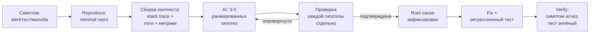
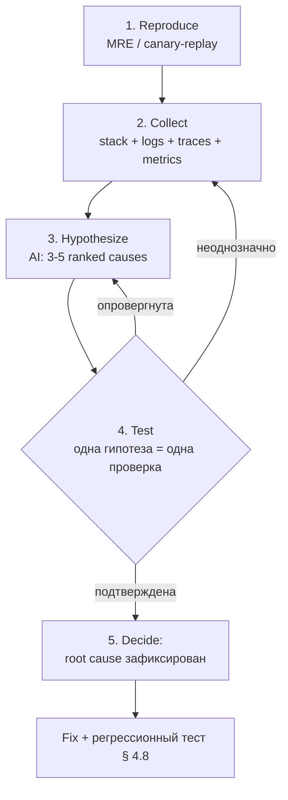

# Глава 4. Debugging и анализ логов

> «Модель видит баг быстрее, чем вы. Модель доказывает баг медленнее, чем компилятор. Между этими двумя утверждениями лежит вся дисциплина AI-ассистированной диагностики».

## Зачем эта глава

Главы 1–3 дали вам ментальную модель LLM, фреймворк промптинга и дисциплину сборки MVP. Этого достаточно, чтобы генерировать код, который **в идеальном мире** работает с первого запуска. Реальный мир к идеальному не сводится: тот же сервис в продакшене упадёт на n+1 сценарии, на котором не падал в тестах, в три часа ночи, по причине, которая не очевидна ни из stack trace, ни из последнего изменения кода.

Эта глава — про то, что делать в этот момент. Она не учит дебажить вообще; это вы умеете. Она учит **встраивать LLM в цикл диагностики так, чтобы модель ускоряла поиск гипотез, не подменяя инженерную проверку**. Различие между этими двумя режимами — не косметическое: первое сокращает **MTTR** (mean time to resolve, среднее время восстановления) на десятки процентов; второе генерирует красивые fix'ы, которые маскируют root cause, и инцидент возвращается через две недели в виде второго.

Кому эта глава адресована:

- инженерам, которые уже **видели** продакшен-инциденты и понимают цену неправильного fix'а;
- тимлидам, чья команда уже использует AI на этапе генерации, но ещё не на этапе диагностики;
- on-call-инженерам, которые ищут способ сократить ночной TTR без передачи решения модели.

Что эта глава не делает: не учит читать stack trace впервые, не объясняет, что такое DNS, и не претендует на полноту по observability как дисциплине (для этого есть Beyer et al., «SRE Book», 2016 и Majors/Fong-Jones/Miranda, «Observability Engineering», 2022).

Целевой уровень — middle/senior, прочитавший главы 1–3, имеющий опыт on-call'а или production-эксплуатации, знакомый с базовым логированием и хотя бы одним APM-инструментом (Datadog, New Relic, Grafana stack, Sentry, Application Insights).

---

## 4.1 От «debugger» к «гипотез-машине»: что AI меняет в цикле диагностики

> **TL;DR.** Классический debugging — это **direct manipulation** состояния программы: брейкпойнт, наблюдение переменной, шаг вперёд, проверка инварианта. LLM не делает direct manipulation; LLM делает **hypothesis generation** на основе текстовых артефактов (stack trace, логи, diff'ы). Это меняет роль модели в цикле: не «найди мне баг», а «дай 3–5 ранжированных гипотез, чтобы я не пропустил очевидную ветвь и не залип на одной». Эмпирически команды, переходящие в этот режим, сокращают MTTR на 20–40%; команды, делегирующие модели весь цикл, увеличивают rate возврата инцидентов на 1.5–2× — fix маскирует, но не устраняет.

### Цикл диагностики до AI

Канонический цикл debugging без AI:

1. **Observe** — увидеть симптом (alert, упавший тест, жалоба пользователя).
2. **Reproduce** — воспроизвести симптом локально или в staging.
3. **Hypothesize** — сформировать догадку о причине.
4. **Test** — проверить догадку (логи, debugger, бенчмарк).
5. **Fix** — внести изменение, устраняющее причину.
6. **Verify** — убедиться, что симптом исчез и регрессия не введена.

В этом цикле LLM не нужен на шагах 1, 2, 6 — это работа с реальной системой, не с текстом. На шагах 3, 4, 5 — модель меняет экономику.

### Что меняет LLM в каждом шаге

**Hypothesize (шаг 3).** Без AI вы перебираете гипотезы из своего опыта в порядке «частое сначала, редкое потом». LLM на стек-трейсе и логах за минуту перечислит 5–10 возможных причин с указанием частоты в открытых датасетах. Это **снимает рекogn-bias**: вы реже залипаете на «знакомой» причине только потому, что она знакома.

**Test (шаг 4).** Без AI вы пишете ad-hoc запросы к логам, ad-hoc grep, ad-hoc SQL. LLM генерирует точный запрос (`jq`, `grep`, KQL, SQL) под конкретную гипотезу за секунды. Это сокращает время от гипотезы до её опровержения / подтверждения.

**Fix (шаг 5).** Это место максимальной опасности. Модель напишет fix, который компилируется и проходит тесты. Будет ли он устранять root cause — отдельный вопрос. См. §4.7–§4.8.

### Что в этом цикле моделью не делегируется

> **Pitfall.** «Модель понимает наш сервис лучше, чем кажется» — самая частая ошибка инженерного восприятия LLM в диагностике. Модель не понимает ваш сервис; она правдоподобно продолжает текст, в котором есть упоминание вашего сервиса. На редком баге это даёт уверенно сформулированный вывод, который не верифицирован ничем.

Никогда не делегируется модели:

- **Финальное доказательство причинности.** Модель формулирует гипотезу; доказательство — реальный voucher (логи в нужный момент, метрика в нужный момент, тест-репродукция).
- **Решение о выкатке fix'а в прод.** Это решение требует знания blast radius, отката, влияния на соседние сервисы. Модель этого знания не имеет.
- **Классификация severity инцидента.** Severity — функция бизнес-контекста, не текста ошибки.
- **Постановка action items постмортема.** Action item — это коммитмент команды; коммитмент модели бессмысленен.

### Hypothesis-Driven Debugging как явный режим

> **Definition.** **Hypothesis-Driven Debugging (HDD)** — режим работы, в котором каждое действие диагностики мотивировано явной гипотезой и завершается её опровержением или подтверждением. Введён в обиход в SRE-сообществе ~2015; в AI-эпоху приобретает дополнительный смысл: модель — генератор-кандидатов гипотез, человек — их фильтр и проверяющий.

Цикл HDD с AI:



Без AI этот цикл занимает 30–120 минут в типичной задаче. С AI и тем же дисциплинированным подходом — 10–40 минут. Без дисциплины и с AI — может занять 5 минут (модель угадала) или 4 часа (модель угадала уверенно, но неправильно, и команда чинила симптом).

### Что это значит для практика

Разница между «debugger» и «гипотез-машиной» — операциональная. Debugger даёт вам **состояние**: значения переменных, путь выполнения. LLM даёт **возможности**: список того, что могло пойти не так в этом классе ошибок. Не путать одно с другим. Когда модель говорит «вот причина» — это гипотеза, не диагноз. Диагноз ставит реальная система при попытке воспроизвести.

> **See also.** §4.2 (воспроизводимость как нулевой шаг цикла) · §4.6 (HDD-цикл в деталях) · §4.7 (как не остановиться на симптоме) · Глава 1, §1.5 (почему модель уверена в неверном ответе) · Глава 2, §2.9 (reroll-as-debugging как анти-паттерн).

---

## 4.2 Воспроизводимость как нулевой шаг: minimal reproducible example

> **TL;DR.** Корректный debug начинается с **воспроизводимости**, не с гипотез. Воспроизведение — это контракт между симптомом и кодом: «вот команда, которая надёжно вызывает симптом». Без него любая диагностика — гадание; с AI — гадание с уверенным голосом. Minimal reproducible example (MRE) — самая компактная версия воспроизведения: ≤ 30 строк, ≤ 1 файла, без внешних зависимостей сверх необходимого. AI хорошо генерирует MRE из stack trace + описания; плохо — без описания семантики того, что считается «правильным» поведением.

### Что считать воспроизведением

> **Definition.** **Reproducible failure (воспроизводимый сбой)** — состояние, в котором известна последовательность действий, надёжно (≥ 95% запусков) приводящая к наблюдаемому симптому. Воспроизводимость — нулевое свойство любой инженерной диагностики: без него «починили» = «сегодня не упало».

Три уровня воспроизводимости:

1. **Local-deterministic.** Команда `pytest tests/test_x.py::test_y` или `dotnet test --filter X.Y` падает с одной и той же ошибкой каждый раз. Это идеальный случай.
2. **Local-flaky.** Команда падает в 30–80% запусков. Это race condition, недетерминизм окружения или внешняя зависимость. Чинится через изоляцию недетерминизма (см. ниже).
3. **Production-only.** Локально не падает, в продакшене падает «иногда». Это самый дорогой класс — требует production-tracing или canary-replay.

### Чек-лист для конструирования MRE

Минимальная воспроизводимая ошибка собирается по чек-листу:

- **Изоляция.** Один файл, одна команда, никаких docker-compose из 8 сервисов.
- **Минимальные данные.** Не «дамп БД на 2 GB», а 2–3 INSERT'а, дающих то же поведение.
- **Минимальные зависимости.** Стандартная библиотека + один пакет, не «весь requirements.txt».
- **Точная версия.** Версия языка, фреймворка, ОС зафиксирована: «Python 3.12.2, FastAPI 0.110.1, macOS 14.5».
- **Ожидаемое поведение.** Что **должно** происходить, а не только что происходит. Без этого MRE — просто bug report без полярности.

MRE — артефакт постоянной ценности: он становится регрессионным тестом после fix'а (см. §4.8).

### Промпт для генерации MRE из stack trace

```text
Role: senior Python engineer building a minimal reproducible example.

Context:
<stack trace, целиком, ≤ 50 строк>
<релевантный фрагмент кода: функция, в которой произошла ошибка, ≤ 40 строк>
<версии: Python 3.12, pytest 8.x, FastAPI 0.110>

Task: предложить minimal reproducible example.

Requirements:
- один файл, ≤ 30 строк.
- standalone: запускается через `python repro.py` или `pytest repro.py`.
- зависит только от стандартной библиотеки + перечисленных в Context пакетов.
- в комментарии: ожидаемое vs наблюдаемое поведение.
- если для воспроизведения нужны внешние данные — синтезировать их в коде.

Output: только код файла, никакого prose.

Constraints:
- если воспроизвести невозможно из предоставленного контекста — явно ответить "INSUFFICIENT_CONTEXT" и перечислить, какие 1–3 куска информации нужны дополнительно.
```

Последний constraint критичен. Без него модель «угадает» MRE на основе stack trace и сделает уверенный вид, что воспроизвела баг — даже если на деле она угадала похожий баг из обучения.

### Изоляция недетерминизма

Flaky-баг становится reproducible через явный контроль:

| Источник недетерминизма | Изоляция |
|--------------------------|----------|
| Время | Замена `datetime.now()` на freezegun / FakeTimeProvider |
| Случайность | Фиксированный seed: `random.seed(42)`, `np.random.seed(42)` |
| Конкурентность | Сериализация через `asyncio.run` в одной таск-группе; `Task.WaitAll` без `Task.Run` |
| Внешний API | WireMock / responses / httpx mock с записью текущего трафика |
| БД-состояние | Чистая БД из снапшота на каждый запуск; testcontainers + fixed init script |
| Файловая система | tmp_path / TempDirectory; отсутствие зависимости от рабочего каталога |
| Часовой пояс | `TZ=UTC` в окружении теста |
| Локаль | `LANG=C.UTF-8`; явная UTF-8 на in/out |

AI хорошо предлагает изоляцию по этой таблице: дайте модели stack trace + описание flakiness, модель назовёт правдоподобный источник за 2–3 секунды. Это **гипотеза**, не диагноз — проверяйте на реальном репо.

### Pitfall: «у меня воспроизводится в проде, и этого достаточно»

Production-only баг без локального MRE — особый класс. Соблазн «фиксить прямо в проде» через AI («модель посмотрит на логи и предложит fix») приводит к четырём типам отказа:

1. Fix сделан, симптом ушёл, но **кто-то** другой починил то же самое параллельно — и ваш fix накладывается на уже исправленную систему, ломая что-то иное.
2. Fix сделан, симптом ушёл сегодня, **возвращается** через неделю — root cause не устранён.
3. Fix введён в прод без локальной верификации, ломает сценарий, не покрытый production-нагрузкой (выходные, чёрная пятница).
4. Fix маскирует **другой** баг рядом, который без этого симптома не наблюдался.

Антидот: даже на production-only баге первый шаг — попытка построить **production-replay environment** (canary-копия трафика, shadow-traffic, replay test). Без этого fix'ы летят вслепую.

### Что это значит для практика

Если на момент обращения к LLM у вас нет MRE — первое, что делает модель полезного, это **помогает построить MRE**. Не прыгать сразу в hypothesizing. Промпт «вот stack trace, что не так?» без MRE — это reroll-as-debugging (см. глава 2, §2.9). Промпт «вот stack trace + код функции, помоги построить MRE» — это инженерная работа.

> **See also.** §4.3 (что просить у модели на материале stack trace) · §4.6 (где MRE стоит в HDD-цикле) · §4.8 (MRE как заготовка регрессионного теста) · Глава 3, §3.7 (Verify-стадия PIV-цикла — где чинимый баг даёт регрессионный тест).

---

## 4.3 Анализ stack trace с моделью

> **TL;DR.** Stack trace — самый структурированный артефакт диагностики, и AI извлекает из него больше пользы, чем из чего-либо другого. Полезный промпт = **полный stack trace + версии стека + описание того, что приложение делало в момент ошибки**. Frontier-модель за один проход типизирует ошибку по семейству (NPE, race, resource leak, dependency mismatch), указывает 3–5 наиболее вероятных причин в ранжированном виде и даёт точку входа для проверки. Слабый промпт = только сообщение об ошибке без контекста — на нём модель угадывает по кэшу и часто ошибается.

### Анатомия полезного stack-trace-промпта

Шесть элементов:

1. **Полный stack trace.** Не «последняя строка», не «сокращённый». Полный — с нумерацией кадров, именами файлов, номерами строк. Trim'ите только framework-internals при условии, что они не релевантны.
2. **Версии стека.** Язык, фреймворк, основные библиотеки. SQLAlchemy 1.4 vs 2.0 — это разные миры и разные ошибки.
3. **Что приложение делало.** «POST /users с email=x@y.com», «cron-задача send_daily_digest», «warm-up на старте». Без этого stack trace — обезличенный.
4. **Когда впервые наблюдается.** «После деплоя 2026-04-26», «появилось вчера ночью», «первый раз вижу». Это сужает класс гипотез.
5. **Что менялось рядом.** Деплой, миграция, конфиг, версия зависимости, scaling event.
6. **Релевантный код.** Функция, в которой бросило исключение, и одна-две вызывающие функции. Не весь файл.

Без любого из шести элементов модель додумает, и часто — в сторону, далёкую от реальной причины.

### Шаблон промпта (Python)

```text
Role: senior Python engineer doing root-cause analysis on a production stack trace.

Stack trace:
<полный traceback, ≤ 60 строк>

Stack:
- Python 3.12, FastAPI 0.110, SQLAlchemy 2.0 (async), asyncpg 0.29
- PostgreSQL 16.2, Redis 7.2 (caching layer)
- uvicorn 0.30 (4 workers), Linux container

Context:
- Endpoint: POST /api/v1/orders/{order_id}/items
- Triggered by: production traffic, ~50 RPS, появилось 2026-04-26 после деплоя release/2026-04-26-1
- Что менялось: bumped SQLAlchemy 2.0.25 → 2.0.30, без других изменений в коде.
- Frequency: 0.3% запросов на этом endpoint падают с этим traceback.
- Логи рядом: <2-3 строки логов до и после, по correlation-id>

Code:
<функция order_service.add_item, ≤ 30 строк>
<репозиторий метод order_repository.update, если он в trace>

Task: дать ранжированный список из 3–5 наиболее вероятных причин.

Format:
- для каждой причины: гипотеза (1-2 строки) + проверка, опровергающая или подтверждающая её (1 запрос/команда/тест).
- ранжировать по вероятности с учётом «менялось SQLAlchemy minor».
- если контекста недостаточно для уверенного ранжирования — назвать это явно.

Constraint: не предлагать исправление в этом ответе. Только гипотезы и проверки.
```

Constraint в последней строке принципиален. Без него модель в 80% случаев сразу прыгает к «вот fix» — и фокус сдвигается с диагностики на пэтч.

### Шаблон промпта (C#)

```text
Role: senior C# engineer doing root-cause analysis.

Stack trace (single exception, no AggregateException unwrap needed):
<полный stack trace, ≤ 60 строк, включая InnerException>

Stack:
- .NET 8.0.4, ASP.NET Core 8 Minimal API
- EF Core 8.0.4 (provider Npgsql.EntityFrameworkCore.PostgreSQL 8.0.2)
- Polly 8.x для retry, Serilog 4.x для логов

Context: <как в Python>

Code: <C#-фрагменты>

Task: ранжированные гипотезы с проверкой каждой.
```

### Семейства ошибок: что AI распознаёт хорошо

Модель надёжно типизирует stack trace по семейству:

| Семейство | Признаки в trace | Что AI распознаёт |
|-----------|-------------------|-------------------|
| Null/None dereference | `AttributeError: 'NoneType'`, `NullReferenceException` | Источник: незаполненное поле БД, отсутствующий header, опциональный параметр без default |
| Type mismatch | `TypeError`, `InvalidCastException` | Несовпадение версий пакета, миграция типов, JSON-парсинг |
| Resource exhaustion | `OperationalError: too many connections`, `OutOfMemoryException` | Утечка соединений, неправильный pool sizing, рекурсивный кейс |
| Concurrency | `RuntimeError: cannot enter coroutine`, `InvalidOperationException: ... is not thread-safe` | Sharing mutable state, неправильный async context |
| Dependency mismatch | `AttributeError: module has no attribute X`, `MissingMethodException` | Несовпадение minor-версий после bump'а |
| Network/timeout | `TimeoutError`, `HttpRequestException`, `OperationCanceledException` | Внешняя зависимость деградировала, taskCancellation prop'нулся неправильно |
| Domain logic | Application-specific exception | Здесь AI слабее: нужна domain-знание, которой у модели нет |

На первых пяти семействах AI выдаёт практически готовый список proper causes. На седьмом — модель даёт правдоподобные слова, не привязанные к вашим инвариантам; здесь нужен ваш собственный контекст.

### Что AI пропускает по умолчанию

Вне всех ранжированных гипотез модель **систематически** упускает:

- **Платформенные баги.** Bug в самом фреймворке/runtime; модель видит его как «что-то странное» и не относит к причине.
- **Heisenbugs.** Баги, исчезающие при добавлении логирования (модификация timing'а). На stack trace они выглядят как обычные, но воспроизведение делает их невидимыми.
- **Bugs от observability.** Баг, причина которого — сама система мониторинга (sampling-bias на трейсе, переполнение буферов, deadlock в async logger).
- **Региональные/тенант-специфичные.** Баг проявляется только на одном клиенте. Модель не имеет данных о тенанте.

Когда после прохода по 5 ранжированным гипотезам ни одна не подтверждается — это сигнал, что вы попали в один из этих четырёх классов. Дальше — реверсивная инженерия в коде самого фреймворка / реверсивная инженерия наблюдаемого поведения, и AI здесь — второстепенный инструмент.

### Pitfall: модель «знает» этот stack trace

Особый случай: stack trace из популярного фреймворка с распространённой ошибкой (типа классических FastAPI/SQLAlchemy mismatch'ей). Модель даст уверенный ответ, основанный на своём кэше — и часто этот ответ корректен. Но на 10–20% случаев он **неверен для вашего сценария**, потому что у вас отличается конфигурация / версия / инвариант. Уверенность модели не маркирует корректность; см. §4.7.

### Что это значит для практика

Stack-trace-промпт — самая результативная точка применения LLM в диагностике. На правильно составленном промпте frontier-модель экономит 5–30 минут на типовом баге (NPE, dependency mismatch, race) и почти ничего — на нетривиальном domain-баге. Но даже в первом случае: модель даёт **гипотезы**, не **диагноз**. Каждая гипотеза подтверждается одной точечной проверкой; та, что подтвердилась — это и есть root cause. Потратьте 90 секунд на проверку первой гипотезы перед тем, как принимать её за факт.

> **See also.** §4.4 (логи как продолжение контекста stack trace) · §4.6 (HDD-цикл, в который встраивается stack-trace-анализ) · §4.7 (5-Whys как защита от остановки на верхушке причины) · Глава 1, §1.5 (галлюцинация уверенным голосом) · Глава 2, §2.6 (R-C-T-F-Q применён к stack-trace-промпту).

---

## 4.4 Структурированные логи: input-контракт для AI-анализа

> **TL;DR.** Полезность LLM на логах — линейная функция структурированности логов. На JSON-логах с фиксированной схемой и correlation-id модель выделяет паттерны, считает аномалии и строит timeline за один проход. На plain-text-логах с printf-стилем — модель угадывает структуру каждый раз заново и часто промахивается. Это даёт прямой инженерный аргумент в пользу structured logging: AI **на порядок** полезнее на структурированных логах. Анти-паттерн — `print(...)` в коде; стандарт 2026 — `structlog` / `Serilog` / `slog` / `pino` с обязательными полями `ts`, `level`, `service`, `correlation_id`, `event`.

### Что значит «структурированные»

> **Definition.** **Structured logging (структурированное логирование)** — режим логирования, в котором каждая запись — машинно-парсируемый объект (обычно JSON или logfmt) с устойчивой схемой полей. Противопоставляется printf-стилю, где запись — произвольная строка с данными в произвольных местах.

Минимальная схема записи лога:

```json
{
  "ts": "2026-04-27T18:23:11.482Z",
  "level": "ERROR",
  "service": "tasks-api",
  "version": "1.4.2",
  "host": "tasks-api-7c9d-bf2x4",
  "correlation_id": "01HXFWT3N7K4Y9P2RMH5J3ZBV",
  "trace_id": "4bf92f3577b34da6a3ce929d0e0e4736",
  "span_id": "00f067aa0ba902b7",
  "user_id": "...",
  "event": "task.create.failed",
  "endpoint": "POST /tasks",
  "duration_ms": 142,
  "error": {
    "type": "ValidationError",
    "message": "title must be 1..200 chars",
    "code": "validation.title.length"
  }
}
```

Семь полей — обязательны: `ts`, `level`, `service`, `correlation_id`, `event`, `error.type`, `error.code`. Остальное — опционально, но рекомендовано.

### Почему AI лучше работает на структуре

Frontier-модель на 200 строках **plain-text** логов справляется хуже, чем на 2000 строках **JSON** логов. Причина:

- **Стабильность токенизации.** В JSON одни и те же поля одинаково токенизируются, и модель видит «timeline» как последовательность одного и того же типа объектов. В plain-text каждое сообщение — новый паттерн.
- **Меньше шума на attention.** Модель «прошивает» структурой и не тратит attention на разбор формата.
- **Возможность сделать запрос.** На структурированных логах модель пишет точный `jq` / KQL / SQL / Loki-LogQL запрос за секунды; на plain-text — пишет regex, который ловит 70% кейсов.

Эмпирически: одинаковая задача «найди все ошибки одного класса в этой выгрузке» на одинаковом объёме данных решается AI **в 3–5× быстрее** на JSON, чем на printf.

### Промпт для анализа логов

```text
Role: senior backend engineer triage'ующий production-инцидент.

Logs (structured JSON, ~500 lines):
<выгрузка логов за 5-минутный интервал по correlation-id или endpoint'у>

Schema:
- ts, level, service, correlation_id, event, error.type, error.code, duration_ms.

Task:
1. Построить timeline ключевых событий (≤ 15 строк) с временными метками относительно первой записи (T+0).
2. Выделить аномалии: пики ошибок, скачки latency, изменения паттерна.
3. Сгруппировать ошибки по error.type и error.code; вернуть таблицу top-5 по частоте.
4. Сформулировать 2-3 гипотезы о root cause на основе timeline + группировки.

Format:
- markdown
- timeline в виде таблицы T+ms / event / detail
- гипотезы с явной проверкой каждой

Constraint:
- не предлагать fix.
- если в логах **отсутствует** информация, нужная для гипотезы (например, нет downstream-сервисов) — указать это явно как "missing signal: ...".
```

«Missing signal» — критичный constraint. Без него модель додумает данные, которых нет в логах.

### Промпт для генерации запроса по логам

Часто полезнее не «дать модели все логи», а попросить запрос:

```text
Role: SRE building a query for log search.

Log store: <Loki / Elasticsearch / Datadog Logs / CloudWatch Logs>
Schema: <обязательные поля>
Hypothesis: <одна конкретная гипотеза, например, "deadlock on task_repository.list_by_owner during high concurrency">

Task: написать запрос, который вернёт записи, опровергающие или подтверждающие гипотезу.

Output: запрос (LogQL / KQL / DQL) + 1-строчное обоснование, какой паттерн в результате означает «гипотеза подтверждена».
```

Это смещение фокуса с «модель ищет за вас» на «модель пишет запрос, вы ищете быстрее». На больших объёмах логов второй режим дешевле и точнее.

### Анти-паттерны логирования, которые ломают AI-анализ

| Анти-паттерн | Симптом | Что делать |
|--------------|---------|-------------|
| `print(...)` / `Console.WriteLine` | Логи в stdout без структуры | Заменить на `structlog` / `Serilog` |
| Многострочные exceptions без exception-id | Stack trace разорван на N записей; модель не сшивает | `processors.format_exc_info` (Python), Serilog Exception destructurer |
| Sensitive data в логах | Токены, email'ы, PII в plain-text | Redaction-middleware на logger; правило в `AGENTS.md` |
| Inconsistent levels | Один и тот же сценарий — то WARNING, то ERROR в разных местах | Единый log-level guideline; review раз в квартал |
| No correlation-id | Невозможно связать события распределённого запроса | Middleware на каждом сервисе; см. §4.5 |
| Sampling без маркера | Часть логов уходит в /dev/null без явного указания | Sampling — на уровне sink с явным маркером `sampled=true` |
| Логи как метрики | Counter в виде «ERROR: 1» | Метрики — отдельно (Prometheus); логи — события |

Это правила, проверяемые SAST/lint'ами и автоматически блокируемые в `AGENTS.md` (см. глава 3, §3.8).

### Стоимость structured logging

> **Versioned facts.** Стоимость хранения логов меняется быстро; цифры ниже — `[as of 2026]`.

Возражение «структурированное логирование дороже»:

- **Storage**: JSON-логи в среднем на 30–60% больше plain-text по объёму. Компрессия (gzip, zstd) сжимает до сопоставимого с plain-text.
- **CPU**: serialization 0.05–0.2 ms на запись. На 1000 RPS — 0.05–0.2% от CPU процесса.
- **Бэкенд хранения**: Loki / ELK / Datadog с JSON — стандарт; никаких доплат за формат.

Реальная цена — 5–15% операционной нагрузки. AI-полезность — **в разы**. Trade-off очевиден; команды, которые не переходят на structured logs к 2026 году, накапливают долг по диагностике быстрее, чем экономят на инфраструктуре.

### Pitfall: «дам модели весь день логов»

Соблазн — выгрузить за день логов в чат и попросить модель «найти проблему». Это работает в простом сценарии (один сервис, тысячи записей) и ломается на сервисе с миллионами записей в день:

- Контекст модели — 200k токенов на frontier (≈ 500–800 KB текста). День логов на сервисе с 100 RPS — гигабайты.
- Truncation выбирает «начало», а не «релевантное».
- Lost in the Middle (см. глава 2, §2.5) на длинных контекстах.

Антидот: **сначала отфильтруйте**. Промпт «найди X в этих 50 MB логов» переписывается в два промпта: «(а) дай LogQL-запрос, выбирающий релевантное; (б) на отобранных 500 строках сделай анализ».

### Что это значит для практика

Structured logging — это не «инфраструктура ради инфраструктуры», это **инвестиция в эффективность AI-диагностики**. Сервис без structured logs — это сервис, в котором AI-анализ логов работает на уровне `grep + regex + угадывание`. Сервис с structured logs — это сервис, в котором AI пишет запросы под гипотезы и строит timeline за минуту. Стоимость перехода — 1–3 человеко-дня на сервис; окупаемость — на первом серьёзном инциденте.

> **See also.** §4.5 (correlation-id и tracing — продолжение structured logging в распределённой системе) · §4.6 (где анализ логов стоит в HDD-цикле) · §4.10 (логи как источник timeline для постмортема) · Глава 2, §2.5 (Lost in the Middle на длинных логах) · Глава 3, §3.8 (логирование как часть architecture invariants в `AGENTS.md`).

---

## 4.5 Distributed tracing и метрики: контекст за пределами логов

> **TL;DR.** Логов недостаточно для диагностики в распределённой системе. Полная картина инцидента — это **три типа сигналов**: логи (события), метрики (агрегированные показатели), трейсы (связанные через correlation-id шаги одного запроса). На 2026 год индустриальный стандарт сборки — **OpenTelemetry** (logs/metrics/traces в единый pipeline). AI хорошо строит timeline по trace-данным и хорошо предлагает гипотезы по метрикам через **USE-метод** (Brendan Gregg) или **RED** (Tom Wilkie). Без correlation-id LLM «видит» только локальные логи одного сервиса; полезность падает в 3–5×. Без метрик AI догадывается о ресурсной деградации, но не доказывает её.

### Три столпа observability

> **Definition.** **Observability (наблюдаемость)** — свойство системы, при котором её внутреннее состояние можно вывести из внешних сигналов: logs, metrics, traces. Термин в современном смысле популяризировал Charity Majors (~2018); три столпа — каноническая декомпозиция.

| Столп | Что отвечает | Используется в | Размер |
|-------|--------------|----------------|--------|
| **Logs** (логи) | Что произошло — точное событие | Диагностика конкретных инцидентов | Большой (десятки GB/день) |
| **Metrics** (метрики) | Сколько/как быстро/как часто | Алертинг, тренды, capacity planning | Маленький (МБ/день после агрегации) |
| **Traces** (трейсы) | Что и в каком порядке делалось в одном запросе | Корреляция между сервисами, поиск hot path | Средний; сэмплируется |

В диагностике AI получает максимум пользы, когда видит **все три**:

- логи отвечают «что именно случилось»;
- метрики дают контекст «было ли это аномалией или нормой»;
- трейсы связывают шаги между сервисами в timeline.

### Correlation ID: минимальный шов между логами и трейсами

> **Definition.** **Correlation ID (correlation-id, request-id, trace-id)** — уникальный идентификатор запроса, прокидываемый через **все** сервисы и компоненты, обработавшие этот запрос. Позволяет собрать полный timeline одного логического запроса из распределённых логов и трейсов. На 2026 год индустриальный стандарт — **W3C Trace Context** (`traceparent`/`tracestate` headers).

Минимум: HTTP middleware в каждом сервисе либо читает `X-Correlation-Id`/`traceparent` из входящего запроса, либо генерирует UUID/ULID, и **прокидывает** его дальше через:

- HTTP-клиенты (header при downstream-вызове);
- очереди (header сообщения);
- логи (поле `correlation_id` в каждой записи);
- БД-запросы (через комментарий `/* trace-id=... */` или session_attribute).

Без correlation-id отладка инцидента в системе из 5+ сервисов — это сшивка по timestamp'ам, и AI вам тут помочь не может. С correlation-id — фильтр по одному ID даёт полную картину одного запроса в одном промпте.

### Промпт по trace-данным

```text
Role: senior backend engineer analyzing a distributed trace.

Trace summary (OpenTelemetry export, 1 trace, 14 spans):
<spans в виде таблицы: span_id, parent_id, service, operation, start_offset_ms, duration_ms, status>

Trace duration total: 4823 ms (p99 нормы: 800 ms).
Status: error (one downstream span failed).

Context:
- Endpoint: POST /api/v1/orders, обычно p99 = 250 ms.
- Сервисы в трейсе: api-gateway → orders-svc → inventory-svc → notification-svc + Redis + Postgres.
- Инцидент: latency пик в течение 5 минут, started 18:22 UTC.

Task:
1. Построить call-tree с указанием latency на каждом span'е.
2. Найти hot path: куда ушло 80% времени.
3. Найти span со статусом error; объяснить, как он повлиял на родительский span.
4. Сформулировать 2-3 гипотезы об источнике latency-spike.

Output: markdown с tree и таблицей; 2-3 гипотезы в конце с проверкой каждой.

Constraint: не предлагать fix; только анализ.
```

Подача trace'а в виде **таблицы**, а не сырого JSON OpenTelemetry — критично. JSON OTel занимает на порядок больше токенов и усыпляет attention.

### Метрики: USE и RED

Два классических метода чтения метрик при инциденте:

> **Definition.** **USE method** (Utilization, Saturation, Errors) — фреймворк Brendan Gregg (2012) для анализа ресурсных проблем. Для каждого ресурса (CPU, RAM, диск, сеть, дескрипторы файлов) проверяются три метрики: utilization (% использования), saturation (очередь), errors (счётчик ошибок).

> **Definition.** **RED method** (Rate, Errors, Duration) — фреймворк Tom Wilkie (2015) для анализа сервисных проблем. Для каждого сервиса/endpoint'а: rate (запросов в секунду), errors (доля ошибочных), duration (latency-распределение).

Промпт для модели на материале метрик:

```text
Role: SRE analyzing a service degradation.

Metrics (RED for orders-svc, last 15 min, 1-min granularity):
- rate (rps): <14 значений>
- errors (%): <14 значений>
- duration p50/p95/p99 (ms): <таблица 14×3>

Resource metrics (USE for orders-svc host, last 15 min):
- CPU util %: <values>
- CPU saturation (load avg / cores): <values>
- RAM util %: <values>
- Disk I/O util %: <values>
- DB connection pool util % (50 max): <values>

Context:
- Pager fired at 18:24 (errors > 1% for 3 min).
- No deploys in last 6 hours.
- Upstream traffic: ~стабильный по timestamp'ам.

Task:
- Какой ресурс в саторации?
- Корректирует ли он errors/duration?
- 2-3 гипотезы об источнике; для каждой — какой метрика подтвердит/опровергнет.

Output: краткий анализ + ранжированные гипотезы; не предлагать fix.
```

На таком промпте frontier-модель в 70–80% случаев правильно идентифицирует семейство проблемы (например, «pool saturation на DB → cascading latency») и предлагает следующую метрику для проверки.

### Что AI плохо видит на метриках

- **Слабые сигналы.** Метрика выросла на 5%, что в пределах шума. Человек с контекстом «у нас обычно 2%» это видит; модель — нет.
- **Сезонность.** «Ночью у нас падает rate в 10×» — норма для одной системы и инцидент для другой. Модель не знает baseline.
- **Стабильные но неправильные значения.** Метрика всегда 0 — это может быть «всё ок» или «коллектор сломан». Без знания, что метрика **должна** двигаться, модель не отличит.

Антидот: всегда подавайте модели **исторический baseline** рядом с текущим окном. «p99 нормы 250 ms, сейчас 1200 ms» — лучше, чем «p99 = 1200 ms».

### Pitfall: dashboard вместо причины

Распространённый сценарий: команда долгие минуты «смотрит на дашборд» и просит модель «помочь с дашборда». Модель видит только то, что вы скопировали; она не видит того, чего нет на дашборде. Если ваш incident — в неотображённой метрике (третий зависимый сервис, недоступная региональная зона) — никакой объём AI-анализа имеющихся метрик не приведёт к ответу. Расширение наблюдаемости — отдельная задача, не «проанализировать имеющиеся данные ещё раз».

### Что это значит для практика

Без correlation-id и хотя бы базовых USE/RED метрик ваш AI-анализ инцидента упирается в местные логи одного сервиса. С distributed tracing и метриками AI видит timeline всех сервисов и может ранжировать гипотезы по семействам ресурсных и сервисных проблем. Инвестиция в OpenTelemetry pipeline (≈ 5–10 человеко-дней на сервис первой настройки) — это инвестиция в **AI-effective observability**, не «галочка по compliance».

> **See also.** §4.4 (структурированные логи как один из трёх столпов) · §4.6 (где tracing встраивается в HDD) · §4.9 (скорость диагностики как метрика инцидента) · Глава 1, §1.10 (provenance и telemetry на уровне продукта) · Модуль 6 (architecture decisions, обосновывающие observability-стек).

---

## 4.6 Hypothesis-Driven Debugging: формальный цикл AI-диагностики

> **TL;DR.** HDD с AI — пять явных шагов: **Reproduce → Collect → Hypothesize → Test → Decide**. Reproduce — построить MRE или canary-replay; Collect — собрать stack trace, логи, трейсы, метрики; Hypothesize — модель даёт 3–5 ранжированных причин; Test — каждая проверяется отдельно (не все сразу); Decide — фиксируется root cause или возвращаемся в Hypothesize. Главное правило: **одна проверка опровергает или подтверждает одну гипотезу**, не две сразу. Это операционализация § 4.1 в чек-лист.

### Пять шагов HDD-цикла с AI



### 1. Reproduce: всегда первый шаг

См. §4.2. Никаких «начну с гипотез без MRE». Если репродукция дороже 30 минут — переключитесь на canary-replay (повторить production-трафик в shadow-окружении) или на форензику production-логов с correlation-id.

### 2. Collect: что собирать перед промптом

Пять артефактов перед обращением к LLM:

1. **Полный stack trace** (если применимо).
2. **Логи** ±5 минут вокруг инцидента, отфильтрованные по correlation-id.
3. **Трейсы** одного запроса с распределением latency по span'ам.
4. **Метрики**: USE/RED за окно инцидента + baseline за прошлую неделю.
5. **Diff**: что менялось в коде/конфиге за последние 24 часа (`git log --since='24h ago'`).

Все пять — в одном файле / одном чат-сообщении. Это и есть «context bundle» для AI.

### 3. Hypothesize: модель — генератор кандидатов

```text
Role: senior backend engineer doing hypothesis generation.

Context bundle:
<пять артефактов из шага 2>

Task: предложить 3-5 ранжированных гипотез о root cause.

Format: для каждой гипотезы:
- Statement (1-2 строки): что именно сломалось.
- Mechanism (1-2 строки): как это приводит к наблюдаемому симптому.
- Falsifier (1-2 строки): какой запрос/метрика/тест опровергает гипотезу.
- Confirmer (1-2 строки): какой результат подтверждает.
- Estimated probability: high / medium / low.

Constraint:
- ровно 3-5 гипотез, не 10.
- если контекст содержит явный сигнал в пользу одной гипотезы — пометить это в Mechanism.
- не предлагать fix.
```

Структура falsifier/confirmer заставляет модель формулировать гипотезу **проверяемо** — без них модель сводится к «что-то с базой данных», что не помогает. Это форма попперианского критерия: гипотеза должна быть опровергаема, иначе она не гипотеза.

### 4. Test: одна проверка = одна гипотеза

> **Pitfall.** «Проверим всё сразу» — главный анти-паттерн HDD. Параллельная проверка четырёх гипотез приводит к четырём изменениям, и когда симптом исчезает, вы не знаете, какое из изменений было решающим. И ещё хуже — два изменения могут компенсировать друг друга, симптом исчезнет, но root cause останется.

Правило: **последовательно**. Берёте гипотезу с самым высоким confidence + дешёвой проверкой → проверяете → опровергаете или подтверждаете → следующая. Это медленнее на простых случаях (одно лишнее измерение) и **в разы быстрее** на сложных (вы не теряетесь в комбинациях).

Дешёвые проверки идут первыми:

- log query → 10 секунд;
- metric query → 30 секунд;
- locally-executed test → 1 минута;
- feature flag toggle в staging → 5 минут;
- redeploy в canary → 30 минут.

### 5. Decide: что считать диагнозом

Гипотеза становится диагнозом при выполнении трёх условий:

1. **Confirmer сработал** — реальный артефакт показал то, что предсказывала гипотеза.
2. **Falsifier для альтернатив проверен** — основные конкурирующие гипотезы опровергнуты.
3. **Mechanism связан с симптомом** — между корнем и симптомом построена причинная цепочка, не просто «X случилось вместе с Y».

Без любого из трёх — у вас не диагноз, а сильная гипотеза. Это разные качества: гипотезу можно доразвить или опровергнуть; диагноз — основание для fix'а.

### Промпт для финальной фиксации диагноза

```text
Role: senior engineer закрывающий диагностику.

Hypothesis (победившая): <текст гипотезы из шага 3>
Confirmer evidence: <конкретные артефакты, опровергающие альтернативы>
Mechanism: <причинная цепочка от корня до симптома, ≤ 5 шагов>

Task: написать 1 параграф (≤ 8 строк) — root cause statement, который пойдёт в incident channel и будет основой постмортема.

Format:
- одна декларативная фраза в начале: «root cause: ...».
- далее 3-5 строк mechanism.
- последняя строка: blast radius (что ещё в системе подвержено тому же дефекту).

Constraint: не fix; не action items; только root cause.
```

«Blast radius» — критичный пункт. Один root cause часто означает, что **ещё** где-то в системе тот же дефект ждёт своего часа. Без явного blast radius fix чинит один экземпляр, а не класс проблем.

### Антициклы: когда HDD деградирует в ad-hoc

Признаки, что вы вышли из HDD-цикла:

- Гипотезы перестали ранжироваться (всё «может быть»).
- Test'ы стали проверять не одну, а несколько гипотез (что я сделал вместе).
- Нет письменного списка проверенного / неопровергнутого; всё в голове.
- Время на инцидент > 60 минут без зафиксированного диагноза.

Антидот: **тайм-бокс**. Каждые 30 минут — короткий status: список гипотез с пометкой confirmed / falsified / pending. Если за час нет прогресса — переоценить весь подход (расширить collect, привлечь второго инженера, перейти к workaround вместо root cause). Это и есть инженерная зрелость on-call'а.

### Что это значит для практика

HDD — не «методология ради методологии». Это инструмент удержания дисциплины при работе с генератором гипотез, чьи гипотезы убедительно звучат вне зависимости от их корректности. Без HDD AI ускоряет вас в простых случаях и обманывает в сложных. С HDD — ускорение происходит во всём диапазоне сложности, потому что роль модели формализована, а контроль — у вас.

> **See also.** §4.2 (Reproduce-шаг) · §4.4–§4.5 (Collect-артефакты) · §4.7 (Decide требует проверки симптом ≠ root cause) · §4.8 (Fix как продолжение Decide) · Глава 2, §2.4 (Chain-of-Thought как генератор кандидатов решения — близкий механизм) · Глава 3, §3.7 (PIV-цикл — родственная дисциплина в режиме генерации).

---

## 4.7 Symptom vs root cause: 5-Whys и проверка причинности

> **TL;DR.** «Сообщение об ошибке исчезло» ≠ «причина устранена». На 2026 год это самая частая ошибка AI-ассистированной диагностики: модель предлагает изменение, оно убирает симптом, инцидент закрывается — root cause возвращается через 1–8 недель в виде нового инцидента, часто более серьёзного. Защита: **5-Whys** (Sakichi Toyoda, ~1930), применённый последовательно к каждой гипотезе. Останавливайтесь, когда последний «почему» упирается в **процесс или контракт**, а не в технический пэтч. AI хорошо генерирует первые 1–2 «почему», слабее на 3–4, плохо на 5 — пятый «почему» обычно упирается в политику команды/организации, которой у модели нет.

### Иерархия причинности

Классификация по глубине причины:

| Уровень | Тип | Пример |
|---------|-----|--------|
| **Surface symptom** | Что увидел пользователь | «500 на POST /tasks» |
| **Proximate cause** | Что сломалось в коде/инфре | `NullReferenceException` в `task_service.create` |
| **Direct cause** | Что произошло одним шагом раньше | Отсутствует обработка случая `due_at == None` |
| **Root cause** | Что позволило этому пройти все защиты | Тип `due_at: datetime` без `Optional`, тест не покрывал отсутствие поля |
| **Contributing cause** | Что сделало root cause возможным | Code review не требует unit-тестов на DTO-валидацию |
| **Process / contract cause** | Какая политика команды это допустила | Отсутствие правила в `AGENTS.md` про nullable-поля |

Классическая ошибка: остановиться на **proximate cause** и закрыть инцидент. Это даёт fix для одного баг-экземпляра при сохранении класса.

### 5-Whys как защита от мелкого фикса

> **Definition.** **5-Whys (метод пяти «почему»)** — техника анализа причин, при которой к ответу на каждый «почему» снова задаётся «почему», 5 раз подряд. Введён Sakichi Toyoda в Toyota Production System; на 2026 год — стандарт post-incident review в тех-индустрии.

Применение к примеру выше:

1. **Почему пользователь видит 500?** — `NullReferenceException` в `task_service.create`.
2. **Почему `NRE`?** — `due_at` пришёл `null`, не было обработки.
3. **Почему не было обработки?** — DTO задекларирован как `due_at: datetime` без `Optional`, тип-чекер на этом не падает (Pydantic v2 пропускает None в datetime, если включён coerce-mode).
4. **Почему включён coerce-mode?** — глобальная конфигурация в `BaseModel`-наследнике, поставленная два года назад без явного обоснования.
5. **Почему конфигурация прошла без обоснования?** — нет правила в code review, требующего ADR на изменения `BaseModel`-конфига.

Surface fix остановился бы на (2) — добавил `if due_at is None: ...`. Root cause fix меняет (5) — добавляет правило в `AGENTS.md`/CONTRIBUTING.md о ADR на global config changes. И — параллельно — fix'ит (2) в коде.

### Промпт для применения 5-Whys

```text
Role: senior engineer doing root-cause analysis using 5 Whys.

Hypothesis (confirmed in HDD step 5): <текст>
Mechanism: <causal chain from § 4.6>

Task: применить метод 5 Whys.

Format:
- 5 пар "Why N: ... -> Because ...".
- если на 3-4-5 шаге упираемся в process/policy — это ожидаемо.
- финальная строка: "Root cause level: <process | contract | code | infra>" — где **должен** быть применён fix.

Constraint:
- не предлагать конкретный fix; только метод.
- если на 4-5 шаге не хватает контекста (organisational policy) — явно ответить "missing context: organisational" и остановиться.
```

«Missing context: organisational» — констрейнт против выдумывания политики команды. Модель не знает вашей организации; на пятом «почему» это становится критично.

### Где AI силён и где слаб в 5-Whys

| Уровень | Качество AI | Почему |
|---------|-------------|--------|
| Why 1 (proximate) | Высокое | Прямо из stack trace |
| Why 2 (direct) | Высокое | Из кода функции |
| Why 3 (механизм) | Среднее | Иногда требует знания фреймворка глубже среднего |
| Why 4 (защиты) | Среднее | Требует знания вашего testing-практик |
| Why 5 (политика) | Низкое | Знание организации, которого у модели нет |

Это означает: **первые 2–3 «почему» делегируются** модели; последние 1–2 — пишутся вами.

### Анти-паттерны: где AI закрывает диагностику слишком рано

Три формы преждевременной фиксации:

1. **«Found it!» на proximate cause.** Модель сказала «вот NPE» — fix добавляет null-check. Class of bugs остаётся.
2. **Симптом-решение.** Модель предложила `try/except: return 500 with retry`. Симптом исчезает (теперь 500 не валится в exception, а возвращает 500), root cause тот же.
3. **Workaround как fix.** «Увеличим pool до 200» — да, на эту неделю поможет; через месяц та же утечка достигнет 200.

Все три — не «модель плохая», а «процесс не дисциплинирован». 5-Whys ловит каждое.

### Pitfall: AI «уверенно» завершает 5-Whys

Особенно опасно: модель напишет связный 5-Whys без вашего контекста, и пятый «почему» будет звучать **правдоподобно**, но не отражать вашу реальность. Например, для бага с `due_at` модель может написать «Why 5: команда не использует ruff на pre-commit». А у вас ruff используется и баг прошёл всё равно. Это — confabulation на пятом уровне.

Антидот: пятый «почему» — **руками**, всегда. Модель — для первых четырёх и для проверки логической связности. Никогда не финал.

### Что это значит для практика

Каждый закрытый инцидент проверяется вопросом: «на каком уровне я остановился?». Если на proximate — у вас будет повторение через 1–8 недель. Если на root cause + contributing — у вас будет на порядок реже. AI ускоряет первые шаги 5-Whys (минуты вместо часа), но финальный шаг — это ваш собственный анализ организации и процессов, в котором AI бесполезен или вреден.

> **See also.** §4.6 (Decide-шаг HDD ведёт в 5-Whys) · §4.8 (fix должен ложиться на root cause level, не на proximate) · §4.10 (5-Whys как часть постмортема) · Глава 1, §1.10 (AI Validation Checklist — не доверять confident-голосу) · Глава 3, §3.8 (`AGENTS.md` как место фиксации process-level fix'ов).

---

## 4.8 Генерация fix'ов и регрессионных тестов

> **TL;DR.** Fix без регрессионного теста — это не fix, это надежда. Регрессионный тест — формализация диагноза в коде, гарантия, что **этот** баг не вернётся незаметно. AI хорошо генерирует регрессионный тест из MRE (см. §4.2) и хуже — из словесного описания. Сам fix: модель генерирует пэтч, проходящий тесты; ваша задача — убедиться, что пэтч ложится на root cause level (см. §4.7), не маскирует, не вводит регрессий в соседних компонентах. Разделение «predicate fix → diff → test → manual review» — обязательно; не «попросил fix и закоммитил».

### Что входит в полноценный fix

Шесть артефактов:

1. **Predicate fix** — формулировка того, что именно меняется и **почему**. Одна фраза: «изменить тип `due_at` с `datetime` на `datetime | None` и добавить explicit None-handling в `task_service.create`».
2. **Code change** — собственно diff.
3. **Регрессионный тест** — тест, который **падал** до fix'а и **проходит** после.
4. **Verification of side effects** — проверка, что соседние сценарии не сломались (полный test suite).
5. **Documentation / changelog** — упоминание в release notes / CHANGELOG.md.
6. **Process update (если applicable)** — изменение в `AGENTS.md` / linter / pre-commit, если root cause — process-level (см. §4.7).

Без любого из шести — fix неполон. Чаще всего пропускается (3) или (6); первое даёт регресс через 2–4 недели, второе — повторение того же класса бага в соседнем месте через 1–3 месяца.

### Промпт для генерации fix'а

```text
Role: senior Python engineer fixing a confirmed root-cause bug.

Root cause statement: <из § 4.6, шаг 5>
Mechanism: <causal chain>
MRE: <minimal reproducible example, ≤ 30 строк>
Affected code: <функции, в которых нужны изменения>

Task: предложить fix.

Output:
1. Predicate fix: одна фраза, что меняется и почему.
2. Code change: diff'ы по затронутым файлам.
3. Regression test: тест в pytest-style, который сейчас падает с тем же сообщением, что MRE, и проходит после применения diff'а.
4. Side effects checklist: список соседних сценариев, которые могли быть затронуты, с указанием, какой тест/проверка их покрывает.

Constraints:
- Fix должен ложиться на mechanism, не только на симптом.
- Если fix меняет публичный API — отметить отдельно как breaking change.
- Если для устранения root cause требуется изменение процесса/политики — указать это в Predicate fix (например, "additionally: add rule to AGENTS.md").
- Если fix вы не уверены, что покрывает все случаи — явно ответить "fix is incomplete" и описать, чего не хватает.
```

Шаг 4 (side effects) — то, что AI пропускает по умолчанию. Без явного запроса модель напишет fix, не задумавшись о blast radius.

### Шаблон промпта для генерации регрессионного теста из MRE

```text
Role: senior Python engineer formalizing a bug as a regression test.

MRE:
<repro.py из § 4.2>

Expected behaviour (from MRE):
<абзац: что должно происходить вместо того, что происходит>

Task: преобразовать MRE в pytest-тест в подходящем месте репо.

Output:
- путь к тестовому файлу (на основе structure репо).
- код теста.
- если тест требует фикстур (db, http client) — использовать существующие в conftest.py.
- название теста как декларативное предложение: `test_create_task_accepts_null_due_at`.

Constraint:
- тест должен ловить именно этот баг, не «похожий».
- тест должен быть детерминирован (нет datetime.now без freeze, нет random без seed).
```

### Что AI пропускает в side effects

Систематические слепые зоны при предложении fix'а:

- **Backward compatibility.** Изменение типа DTO ломает старых клиентов; модель не задумывается о deserialization у них.
- **Database migrations.** Fix меняет ORM-модель — нужна миграция; модель забывает её предложить.
- **Caching.** Fix меняет shape объекта в Redis-кэше; старые записи дают `KeyError` после деплоя. Модель этого не видит.
- **Distributed state.** Fix в одном сервисе требует синхронизированного fix'а в downstream — модель не знает о соседнем сервисе.
- **Performance.** Fix добавляет N+1 запрос «для надёжности»; в нагрузке это даёт деградацию.

Антидот в промпте: явный список «известные viewpoints» в side-effects checklist. Модель проверит каждый.

### Антидот: pre-merge regression test gate

В CI добавляется явный gate:

```yaml
# .github/workflows/pr-validation.yml
- name: Regression test from issue
  run: |
    pytest tests/regression/ -q
    test $(grep -c "test_" tests/regression/) -ge $((LAST_REGRESSION_COUNT + 1)) || \
    echo "::warning::No new regression test for this PR. If this PR fixes an incident, add one."
```

Эвристика: каждый PR, помеченный label'ом `bugfix`, должен добавлять минимум один тест в `tests/regression/`. Это не панацея, но защита от ленивого fix'а.

### Pitfall: «тест уже был, но проходил»

Особый класс: тест существовал, проходил, при этом баг был. Это **значит, что тест проверял не то**. Регрессионный тест от AI должен начинаться с проверки, что **в текущей версии репо без fix'а** он падает с **тем же** сообщением, что MRE. Если не падает — тест неправильный, и баг через него снова пройдёт.

Промпт включает явное требование: «runs against current main: must FAIL with same error as MRE; runs against fix branch: must PASS».

### Stylistic check: что регрессионный тест **не** делает

| Анти-паттерн | Симптом | Что вместо |
|--------------|---------|-------------|
| Sleep-based timing | `await asyncio.sleep(0.1)` для «ожидания» | event-based или synchronous deterministic flow |
| Mock-of-mock | мокаем функцию, которая мокается рядом | один уровень мокирования |
| Large test fixtures | 200-строчный setup для теста на 5 строк | minimal setup в conftest, общая фикстура |
| Test names as questions | `test_does_it_work` | declarative: `test_create_task_accepts_null_due_at` |
| Random without seed | `uuid4()` без freeze | фиксированный UUID или seeded faker |
| Order dependency | один тест зависит от другого | каждый тест — изолирован |

### Что это значит для практика

Закрытие инцидента — это PR с шестью артефактами, не «коммит с словом fix». Регрессионный тест — обязательная часть; без него инцидент не закрыт, он отложен. AI генерирует все шесть артефактов из confirmed root cause + MRE — но проверка, что fix ложится на правильный уровень причинности (см. §4.7) и что side effects реалистично оценены, — на вас. Это самая дорогая часть; делегировать её модели — закладывать инцидент №2.

> **See also.** §4.2 (MRE как заготовка регрессионного теста) · §4.7 (root cause level → fix level) · §4.10 (action items постмортема как продолжение fix'а) · Глава 3, §3.7 (PIV-цикл — родственная дисциплина для генерации) · Модуль 5 (мутационное тестирование как способ оценить качество регрессионного теста).

---

## 4.9 Production-инциденты: severity, timeline, коммуникации

> **TL;DR.** Production-инцидент — особый класс работы, в котором техническая диагностика — половина задачи; вторая половина — **управление инцидентом**: классификация severity, коммуникации со стейкхолдерами, поддержка timeline, координация on-call'а. AI здесь полезен как генератор шаблонов communication и как помощник по сборке timeline в реальном времени; AI **не** делегируется severity-классификация и решения по mitigation. Индустриальный стандарт ролей — **Incident Commander / Tech Lead / Communications Lead** (Google SRE Book, 2016). Без явных ролей on-call вырождается в «все делают всё», что увеличивает MTTR в 2–3×.

### Что такое инцидент и его классификация

> **Definition.** **Incident (инцидент)** — событие, влияющее на доступность, корректность или performance сервиса, наблюдаемое пользователями (внутренними или внешними) и требующее активного вмешательства команды для устранения. Не каждый bug — инцидент; не каждое падение алерта — инцидент.

Severity-уровни (типичная классификация на 2026 год):

| Severity | Признаки | Response |
|----------|----------|----------|
| **SEV-1** | Сервис недоступен полностью; полная потеря данных; security breach | Немедленный pager; on-call дроп всего; communication внешним |
| **SEV-2** | Major degradation: > 10% запросов failing, или критичная функция недоступна | Pager в рабочее время / приглашение on-call'а; communication ключевым стейкхолдерам |
| **SEV-3** | Minor: единичные ошибки, < 1% запросов; deferred-functionality | Tracked, fix в плановом режиме |
| **SEV-4** | Cosmetic: UI-изюм, без бизнес-влияния | Backlog |

Severity — функция **бизнес-влияния**, не технического масштаба. Один сервис в подсистеме может упасть полностью (SEV-1 для команды) при общем SEV-3 или ниже для бизнеса. AI не назначает severity; назначает Incident Commander.

### Роли в инциденте

> **Definition.** **Incident Commander (IC)** — человек, координирующий ход инцидента: принимает решения о mitigation, severity, эскалации, привлечении дополнительных команд. Не обязан сам диагностировать; обязан удерживать процесс. Концепция взята из аварийно-спасательных систем (Incident Command System, FEMA).

Минимальный состав на SEV-1/2:

- **Incident Commander** — координирует.
- **Tech Lead / On-call** — диагностирует и фиксит.
- **Communications Lead** — пишет updates наружу (status page, email, slack).

В малой команде один человек совмещает все три, но это потолок для SEV-1; на масштабе нужно разделение, иначе IC превращается в TL и теряет общую картину.

### AI в роли инструмента инцидентного штаба

Что AI делает:

- Собирает timeline (см. §4.4) из логов и трейсов в реальном времени.
- Генерирует черновик status update для пользователей (Communications Lead corrigирует).
- Предлагает гипотезы и проверки (см. §4.6) для TL.
- Подсказывает rollback-команды и playbook'и из репозитория.

Что AI **не** делает:

- Не назначает severity.
- Не принимает решение «продолжаем диагностику или откатываем».
- Не общается со стейкхолдерами напрямую.
- Не вызывает дополнительные команды.

Эти решения требуют контекста, которого у модели нет: SLA, бизнес-приоритеты, политические соображения, история отношений с клиентом.

### Timeline в реальном времени: промпт

```text
Role: incident timeline assistant.

Logs (structured, last 30 min, filtered by service=tasks-api OR correlation_id=...):
<выгрузка>

Existing timeline entries (manually added by IC):
- T+0  18:24 UTC: pager fired, errors > 5% on POST /tasks
- T+3  18:27 UTC: rollback of release/2026-04-26-1 initiated
- T+12 18:36 UTC: rollback complete; errors back to baseline

Task: на основе логов добавить пропущенные события timeline между ручными записями.

Format: таблица T+offset / source (log/metric/manual) / event / detail.

Constraint:
- только события из реальных логов; не выдумывать.
- если событие уже есть в manual — не дублировать.
- маркировать как `(inferred)` если событие — следствие, а не явная запись.
```

Promtр периодически (каждые 5–10 минут) обновляется свежими логами — модель достраивает timeline. IC использует этот timeline для status update'а.

### Communications: шаблоны

| Канал | Аудитория | Длина | Tone |
|-------|-----------|-------|------|
| Status page | Внешние пользователи | 1-3 предложения | Фактический; без spec'а проблемы |
| Slack #incidents | Inner команда | Telegraph-style; T+offset | Тех-нейтральный |
| Stakeholder email | Топ-менеджмент / клиенты | 1 параграф | Бизнес-ориентированный |
| Postmortem | Вся компания | Длинный документ | Объяснительный |

Промпт для status update:

```text
Role: communications lead during ongoing incident.

Severity: SEV-2.
Started: 18:24 UTC.
Current state (from IC, T+15): rollback in progress; ETA recovery 18:45.
Last public update: 18:35: "We are investigating elevated errors on tasks API."

Task: написать update для status page (≤ 3 предложения; без технических подробностей).

Constraints:
- не предлагать root cause до окончательной диагностики.
- не давать ETA, отличающийся от ETA from IC.
- не использовать слова "magic", "powerful" — статусы фактические.
- если фраза может быть истолкована как обещание SLA — пометить как [LEGAL_REVIEW].
```

Communications Lead принимает или редактирует. Никаких «AI пишет напрямую в status page» — это путь к словам, за которые отвечать.

### Severity-эскалация и дезэскалация

| Сигнал | Действие |
|--------|----------|
| Errors растут на 5% / 5 min | Не эскалировать ещё, уточнить scope |
| Critical user flow blocked | Эскалация до SEV-2 |
| Data corruption risk | Эскалация до SEV-1 |
| Mitigation сработала, errors падают 10 min | Дезэскалация до SEV-3 |
| Recovery полностью | Closure → постмортем триггерится |

AI помогает в первой колонке (детекция сигнала в логах/метриках), не во второй (решение).

### Pitfall: «AI разбирается, я сплю»

Соблазн в ночной on-call смене: «модель диагностирует, я просыпаюсь к утру с готовым диагнозом». Это работает в SEV-3/4, не работает в SEV-1/2. Production-инцидент — комбинация технической, бизнес и человеческой работы; средняя из трёх — критическая, и модель её не покрывает. On-call ответственность не делегируется AI; ответственность остаётся персональной.

### Что это значит для практика

Инцидент-флоу — это не «отладка с акцентом». Это другой режим работы с явными ролями, явной классификацией и явной коммуникацией. AI ускоряет timeline-сборку, генерирует черновики communications, помогает с гипотезами — но удержание процесса (severity, эскалация, координация, ownership over решений) — на людях. Команды, которые делегируют это AI, обнаруживают через 2–3 крупных инцидента, что MTTR не падает, а communication становится менее точной — модель повторяет правдоподобные вещи без знания контекста.

> **See also.** §4.6 (HDD-цикл — техническая часть инцидент-работы) · §4.10 (постмортем как закрывающий артефакт инцидента) · Глава 3, §3.10 (PR-flow — где fix из инцидента переходит в код) · Глава 1, §1.10 (provenance релизов как часть incident-forensics).

---

## 4.10 Postmortem с участием AI: что писать руками, что генерировать

> **TL;DR.** Постмортем — закрывающий артефакт инцидента; качество постмортема определяет, повторится ли класс ошибок. Структура (Google SRE Book, 2016): **summary, impact, timeline, root cause, what went well, what went poorly, action items, lessons learned**. AI хорошо генерирует timeline (из логов), summary (из root cause statement) и шаблонные секции; **плохо** — what went well/poorly (требует interpretive judgment) и action items (требует ownership и political reality). Главное правило постмортема — **blameless culture**: фокус на системе, не на человеке. AI этому правилу следует механически (он не знает имён); человек должен сознательно.

### Зачем постмортем вообще

> **Definition.** **Postmortem (постмортем)** — структурированный документ, описывающий инцидент после его восстановления: что произошло, почему, что нужно изменить. Цель — не наказание виновных, а **систематическое снижение вероятности класса повторения**. Концепцию blameless postmortem популяризировал Etsy ~2012 (John Allspaw); индустриальный стандарт на 2026.

Постмортем нужен в двух случаях:

- любой SEV-1 / SEV-2;
- любой повторяющийся SEV-3 (третий раз — повод для постмортема).

SEV-4 и одноразовые SEV-3 — без постмортема; на них пишется короткий incident report и отметка в трекере.

### Стандартная структура постмортема

```markdown
# Postmortem: <название инцидента> (<дата>)

## Summary
<2-3 предложения: что произошло, кто пострадал, как восстановили>

## Impact
- Severity: SEV-X
- Duration: <минуты, точные UTC времена>
- Affected users / requests / data: <числа>
- SLA breach: <yes/no>

## Timeline
<таблица T+offset / event / source>

## Root cause
<диагноз из § 4.6, шаг 5; mechanism; blast radius>

## What went well
<3-5 пунктов: что сработало в детекции, диагностике, mitigation, коммуникации>

## What went poorly
<3-5 пунктов: где была задержка, где упустили сигнал, где process подвёл>

## Action items
<таблица: owner / item / priority / due date / linked tickets>

## Lessons learned
<2-3 параграфа высокого уровня: что мы поняли об архитектуре / процессе>
```

Объём — 2–5 страниц. Меньше — поверхностно; больше — никто не прочитает.

### Что делегируется AI

**Summary.** Из root cause statement + impact цифр модель пишет 2–3 предложения за один проход. Качество — высокое, человек редактирует тон.

**Timeline.** Из выгрузки логов + ручных записей IC модель собирает таблицу. См. §4.9.

**Impact.** Из метрик + длительности — модель считает «affected requests = rate × duration × error_rate». Числа модель выдаёт корректно, если даны входные.

**Шаблонные секции.** Заготовка structure, плейсхолдеры — модель.

### Что **не** делегируется AI

**Root cause statement.** Не генерируется заново — берётся из §4.6 после реальной диагностики.

**What went well / poorly.** Это рефлексия команды о собственном поведении в инциденте. Модель может сгенерировать **правдоподобные** пункты («слишком долго реагировали», «не хватало dashboards»), и они звучат как настоящий анализ. На деле это шаблонные слова без отражения вашей реальности. **Пишется руками** командой.

**Action items.** Action item — коммитмент: «owner X сделает Y до даты Z». Коммитмент модели бессмысленен. Кроме того, AI генерирует action items, которые в вашей политической реальности невыполнимы: «нанять второго SRE» — может, и да, но это не в полномочиях команды. Action items пишутся командой, валидируются IC.

**Lessons learned.** Это интерпретация на уровне команды/организации. Генерировать модель — получать клишированный текст, который никто не запомнит. Пишется руками.

### Промпт для генерации шаблона

```text
Role: senior engineer drafting an incident postmortem skeleton.

Inputs:
- Incident summary (from incident channel): <2-3 строки>
- Root cause statement (from §4.6): <текст>
- Timeline entries (from §4.9): <таблица>
- Impact metrics: <числа>
- Affected services: <список>

Task: сгенерировать заготовку постмортема.

Output format: markdown по стандартной структуре (Summary, Impact, Timeline, Root cause, What went well [SKELETON_FOR_TEAM], What went poorly [SKELETON_FOR_TEAM], Action items [SKELETON_FOR_TEAM], Lessons learned [SKELETON_FOR_TEAM]).

Constraints:
- Заполнить только Summary, Impact, Timeline, Root cause.
- В остальных разделах — placeholder с явной пометкой `[SKELETON_FOR_TEAM]` и подсказками-вопросами:
  - What went well: "Что сработало быстрее ожидаемого? Какой сигнал детектировали вовремя?"
  - What went poorly: "Где была задержка? Какого сигнала не хватало?"
  - Action items: "Каждый item: owner, due date, ticket. Не более 5 для не-SEV1."
  - Lessons learned: "1-2 параграфа об архитектурном/процессном выводе."
- НЕ предлагать содержимое skeleton-разделов.

Constraint final: blameless tone. Никаких имён. Замена «Y did X» на «X happened».
```

«[SKELETON_FOR_TEAM]» — критичный маркер. Без него модель заполнит каждую секцию правдоподобным текстом, и команда поленится это переписать.

### Blameless tone и AI

> **Pitfall.** Blameless culture — это не «не пишем имена». Это «фокусируемся на системе, которая позволила ошибке пройти, а не на человеке, который её совершил». AI имена и не пишет (в большинстве случаев), но может написать что-то вроде «инженер не проверил» — это прямой blame на анонимного человека. На review постмортема это **переписывается** на «процесс ревью не требовал проверки».

Линтер для постмортема (можно делать AI-ассистированным):

| Pattern | Replace with |
|---------|--------------|
| «X не сделал Y» | «процесс не требовал Y» |
| «человеческая ошибка» | «процесс не защитил от ошибки» |
| «надо быть внимательнее» | (удалить — это не action item) |
| «Y отвлёкся» | (удалить или конкретизировать структурно) |

Промпт линтера: «найди фразы, нарушающие blameless tone, и предложи замены».

### Action items: критерии качества

Хороший action item:

- **Specific**: «добавить лимит на pool size в config» — а не «улучшить connection management».
- **Owner**: указано имя или команда. «backend team» допустимо в небольших структурах; в крупных — конкретное имя.
- **Time-bound**: due date, не «когда-нибудь».
- **Tracked**: ссылка на ticket в трекере; без ticket'а — это намерение, не план.
- **Verifiable**: можно проверить, что сделано.
- **Bounded**: не «переделать архитектуру», а конкретный inkrement, помещающийся в спринт.

AI-сгенерированные action items систематически нарушают первое и пятое — они звучат как «улучшить наблюдаемость», а не «добавить алерт на pool saturation > 80% за 3 минуты». Команда корректирует.

### Срок жизни постмортема

Постмортем без follow-up — потерянное время. Метрика качества:

| Метрика | Цель |
|---------|------|
| Действия с owner и ticket | 100% |
| Действия закрыты в срок | ≥ 80% |
| Среднее время от postmortem до закрытия action items | ≤ 30 дней (для SEV-1/2) |
| Процент инцидентов с повторением root cause class в 90 дней | ≤ 5% |

Если последняя метрика > 5% — у вас постмортемы пишутся, но их выводы не внедряются. Это сигнал для engineering-менеджмента, не для on-call'а.

### Что это значит для практика

Постмортем — самый структурированный артефакт всего инцидент-цикла, и поэтому самая привлекательная мишень для делегирования AI. **Не делайте этого целиком.** AI хорош в шаблонной части (Summary, Timeline, Impact) и плох в рефлексивной (What went well/poorly, Action items, Lessons learned). Делегирование рефлексивных частей превращает постмортем в формальность; формальный постмортем означает, что инцидент повторится. Соотношение: 30–40% постмортема — генерируется, 60–70% — пишется командой.

> **See also.** §4.6 (root cause statement как вход в постмортем) · §4.7 (5-Whys как Lessons learned skeleton) · §4.8 (action items пересекаются с fix'ом) · §4.9 (timeline и severity из инцидента → в постмортем) · Глава 3, §3.10 (AI provenance — может быть полезен в постмортеме при инцидентах в AI-сгенерированном коде).

---

## 4.11 Демонстрационные сценарии (для занятия)

> **TL;DR.** Четыре демо за 75 минут: (1) stack-trace анализ на двух стеках с измерением качества гипотез, (2) логи и timeline на структурированных vs неструктурированных логах, (3) полный HDD-цикл на синтетическом баге с AI-ассистом, (4) постмортем с blameless-линтером. Каждое демо имеет Python (FastAPI) и C# (.NET 8) вариант. Цель занятия — не «решить баг», а **продемонстрировать различие в качестве промпта и в дисциплине цикла**.

### Демо 1. Stack-trace анализ на двух стеках

**Задача.** За 15 минут получить ранжированные гипотезы по реальному stack trace.

Прогон:

1. **Слабый промпт.** «Что не так с этим stack trace?» + один traceback. Зафиксировать: модель угадывает по трём словам в trace.
2. **Сильный промпт.** Шаблон из §4.3 — полный traceback, версии, что менялось рядом, релевантный код. Зафиксировать: 5 ранжированных гипотез с falsifier'ами.
3. То же на C# / .NET 8: NullReferenceException в Minimal API endpoint после bump'а EF Core.

Что показать:

- На (1) модель уверенно «диагностирует» неправильно в 30–50% случаев.
- На (2) — корректно в 70–80% (одна гипотеза попадает в реальный root cause).
- Разница — функция промпта, не «модели».

### Демо 2. Логи: structured vs printf

**Задача.** Найти причину 500-х на эндпоинте за 10 минут на двух типах логов.

Прогон:

1. **Plain-text логи.** Выгрузка `print(...)`-style; 500 строк. Промпт «найди корень проблемы».
2. **Structured JSON логи.** Те же события, но с `correlation_id`, `event`, `error.type`, `duration_ms`. Тот же промпт.
3. На C#: то же сравнение `Console.WriteLine` vs Serilog в JSON.

Что показать:

- На printf — модель строит частичный timeline, угадывает паттерн error type, ошибается на корреляции.
- На JSON — модель строит полный timeline с T+offset, точно группирует ошибки, выдаёт два верных гипотеза-кандидата.
- Время решения — 7–10 минут на printf vs 1–2 минуты на JSON.

### Демо 3. Полный HDD-цикл на синтетическом баге

**Задача.** Симулировать production-инцидент и пройти все 5 шагов HDD за 25 минут.

Сценарий:

1. **Setup.** Подготовлен сервис tasks-api с искусственно вшитым багом: при отсутствующем `due_at` происходит NPE в service-слое (см. §4.7); тест на это не написан.
2. **Reproduce (5 минут).** Curl-команда + ответ 500. AI помогает построить MRE.
3. **Collect (5 минут).** Stack trace + логи (5 минут вокруг) + diff последнего коммита.
4. **Hypothesize (5 минут).** Промпт по §4.6; модель выдаёт 3-5 гипотез с falsifier'ами.
5. **Test (8 минут).** Опровергаем первые 2 гипотезы дешёвыми проверками; третья подтверждается.
6. **Decide + 5-Whys (2 минуты).** Root cause statement + 5 «почему» руками после первых 2-х модельных.
7. **Fix + регрессионный тест.** Промпт по §4.8.

Что показать:

- Где AI ускоряет (Hypothesize, Collect — secondary processing).
- Где AI замедляет (если делегировать Test — пытается подтвердить все гипотезы сразу).
- Где AI обманывает (5-Whys на 4-5 шаге — правдоподобный, но неверный для реального процесса команды).

### Демо 4. Постмортем с blameless-линтером

**Задача.** Сгенерировать заготовку постмортема и проверить blameless tone.

Прогон:

1. **Inputs.** Используются артефакты из Демо 3.
2. **Generate skeleton.** Промпт по §4.10 → генерирует Summary, Impact, Timeline, Root cause + skeleton'ы.
3. **Заполнить skeleton'ы руками** (5 минут): What went well, What went poorly, Action items, Lessons learned.
4. **Blameless lint.** AI-промпт на проверку tone'а; покажет 1-2 фразы с blame.
5. **Action item rewrite.** AI генерирует первые формулировки; команда правит до SMART-критериев.

Что показать:

- AI пишет 30-40% постмортема корректно.
- Skeleton-секции, заполненные AI «как если бы», выглядят правдоподобно — но команда легко определяет, что это шаблон, не их анализ.
- Blameless-lint ловит классические нарушения; полезен как обязательный шаг review.

### Метрики на занятии

После каждого демо в shared spreadsheet:

| Демо | Стек | Время до диагноза | Качество промпта (1-5) | Что попало в team-checklist |
|------|------|-------------------|------------------------|------------------------------|
| 1    | Py   | …                 | …                      | …                            |
| 1    | C#   | …                 | …                      | …                            |
| 2    | Py   | …                 | …                      | …                            |
| ...  | ...  | ...               | ...                    | ...                          |

Это калибровка реальной полезности AI в цикле диагностики на масштабе занятия.

> **See also.** §4.3, §4.4, §4.6, §4.10 (методические основания для каждого демо) · Глава 2, §2.11 (демо prompt engineering как фундамент) · Глава 3, §3.11 (демо MVP-сборки как комплемент демо отладки).

---

## 4.12 Контрольные вопросы для самопроверки

1. Чем «debugger» концептуально отличается от «гипотез-машины»? Что в цикле диагностики делегируется LLM, а что нет?
2. Перечислите три уровня воспроизводимости (local-deterministic, local-flaky, production-only). Как изменяется роль AI в каждом из них?
3. Назовите шесть элементов полезного stack-trace-промпта. Какой из них чаще всего пропускается, и к каким ошибкам это приводит?
4. Какие семь полей обязательны в structured-log-записи? Что становится невозможным при отсутствии каждого?
5. Сравните USE-метод и RED-метод. В каком сценарии каждый эффективнее? Может ли AI применить любой из них без `baseline`-данных?
6. Что такое correlation-id и почему его отсутствие в распределённой системе делает AI-анализ инцидента в 3-5× менее эффективным?
7. Опишите пять шагов HDD-цикла. На каком шаге чаще всего теряется дисциплина и в какой анти-паттерн это превращается?
8. Сформулируйте Popper-критерий для AI-сгенерированной гипотезы. Какие два поля (falsifier, confirmer) делают гипотезу проверяемой?
9. Что такое 5-Whys? На каком уровне («почему») AI силён, на каком — слаб? Почему пятый «почему» обычно пишется руками?
10. Перечислите шесть артефактов полноценного fix'а. Какие два чаще всего пропускаются и какие последствия это даёт через 1-3 месяца?
11. В чём разница между «proximate cause», «direct cause» и «root cause»? Приведите пример иерархии причинности из реального инцидента.
12. Назовите три роли в инцидент-штабе по Google SRE Book. Какие функции делегируются AI, а какие — нет?
13. Из восьми разделов стандартного постмортема какие три обычно генерируются AI с приемлемым качеством? Какие три **никогда** не делегируются?
14. Сформулируйте критерии хорошего action item (SMART-вариант для постмортема). Какой из критериев AI систематически нарушает?
15. Что такое blameless culture, и почему AI-сгенерированные постмортемы могут механически следовать blameless tone, но семантически нарушать его?
16. Объясните, как Lost in the Middle (глава 2) проявляется при анализе больших объёмов логов. Какой антидот?

---

## 4.13 Связь со следующими модулями

Эта глава замыкает первую половину курса: главы 1–2 дали ментальную модель и фреймворк, глава 3 — дисциплину сборки, глава 4 — дисциплину диагностики. Дальше — закрепление качества и расширение инструментария:

- **Модуль 5 (Тестирование и качество)** — расширяет регрессионные тесты из §4.8 в полноценную дисциплину: property-based для проверки **классов** багов, mutation testing для оценки **качества** регрессионных тестов, edge-case-генерация. Постмортем-action item «добавить регрессионный тест» становится частью continuous testing practice.
- **Модуль 6 (Документация и архитектурные решения)** — превращает 5-Whys process-level findings (§4.7) в ADR, постмортем — в документ, на который ссылаются ADR'ы, runbook'и инцидентов — в живые операционные документы.
- **Модули 7–8 (Локальные модели и RAG)** — даёт альтернативу frontier-моделям там, где **логи не должны покидать периметр** (PII, compliance, sensitive PI). RAG-индекс над runbook'ами и историей постмортемов превращает «модель видит этот инцидент впервые» в «модель видит ваши прошлые 50 инцидентов».

Сквозная линия: артефакты из этой главы — MRE, регрессионные тесты, постмортем, action items, runbook'и — все живут в репозитории как версионируемые документы. В модулях 5–7 они интегрируются в **continuous engineering practice**, в которой каждый инцидент оставляет след в виде кода, теста, документа или правила, а не «закрытого тикета».

Особо: эта глава **ссылается назад** на главу 3 чаще, чем главы 1–2 на главу 3. Причина: 80% диагностируемых багов в AI-эпоху — это баги в AI-сгенерированном коде, и provenance из §3.10 становится первым шагом инцидент-расследования. «Какая модель и какой промпт сгенерировали этот код» — теперь часть incident timeline, не побочная информация.

---

## 4.14 Quick reference

Сжатая шпаргалка по главе. Для тех, у кого нет 25 минут на повторное чтение.

### Цикл HDD

| Шаг | Что делает человек | Что делает AI |
|-----|--------------------|----------------|
| 1. Reproduce | строит MRE / canary-replay | помогает свести к минимуму |
| 2. Collect | собирает stack + logs + traces + metrics | помогает с фильтрами/запросами |
| 3. Hypothesize | оценивает гипотезы | генерирует 3–5 ranked candidates |
| 4. Test | проверяет по одной, с falsifier | пишет команды/запросы под гипотезу |
| 5. Decide | фиксирует root cause | помогает с blast radius statement |

### Шесть элементов stack-trace-промпта

Полный stack trace · Версии стека · Что приложение делало · Когда впервые наблюдается · Что менялось рядом · Релевантный код.

### Семь обязательных полей structured log

`ts` · `level` · `service` · `correlation_id` · `event` · `error.type` · `error.code`.

### USE и RED методы

| Метод | Применение | Метрики |
|-------|-----------|---------|
| USE | Ресурсы (CPU, RAM, диск, сеть, дескрипторы) | Utilization, Saturation, Errors |
| RED | Сервисы / endpoint'ы | Rate, Errors, Duration |

### Уровни причинности

Surface symptom → Proximate cause → Direct cause → **Root cause** → Contributing cause → Process / contract cause.

### Severity-классификация (типовая)

| SEV | Признак | Response |
|-----|---------|----------|
| 1 | Сервис недоступен; data loss; security | Pager 24/7; внешние коммуникации |
| 2 | > 10% errors; критичная функция down | Pager в час; ключевые стейкхолдеры |
| 3 | < 1% errors; deferred-functionality | Tracked в плановом режиме |
| 4 | Cosmetic | Backlog |

### Шесть артефактов полноценного fix'а

Predicate fix · Code change · Регрессионный тест · Side effects checklist · Documentation/changelog · Process update (если applicable).

### Структура постмортема

Summary · Impact · Timeline · **Root cause** · What went well · What went poorly · Action items · Lessons learned.

### Что делегируется AI и что нет

| Делегируется | Не делегируется |
|--------------|------------------|
| Stack trace анализ → гипотезы | Severity-классификация |
| Timeline из логов | Decision о rollback / mitigation |
| Запросы к логам / метрикам под гипотезу | 5-Whys уровень 5 (process/policy) |
| Шаблонные секции постмортема | What went well / poorly |
| Summary + Impact + Timeline постмортема | Action items (owner, due date) |
| Communications drafts | Lessons learned |
| Регрессионный тест из MRE | Решение о blast radius mitigation |

### Длины и пороги

| Параметр | Ориентир |
|----------|----------|
| MRE | ≤ 30 строк, ≤ 1 файл |
| Промпт по stack trace | 30–80 строк |
| Логи в одном промпте | ≤ 500 строк (после фильтрации) |
| Гипотез на один цикл | 3–5 |
| Failed итераций до тайм-бокса | 3 цикла за 30 минут |
| Объём постмортема | 2–5 страниц |
| Action items на SEV-1/2 | 3–7 (не 30) |
| Время от постмортема до закрытия action items | ≤ 30 дней (SEV-1/2) |

### Антидоты по типам ошибок диагностики

| Анти-паттерн | Антидот |
|--------------|---------|
| Лечат симптом, не причину | 5-Whys + явный root cause statement |
| Параллельная проверка нескольких гипотез | Одна проверка = одна гипотеза |
| Fix без регрессионного теста | CI-gate `bugfix` label → тест в `tests/regression/` |
| AI «угадывает» MRE без описания | Constraint: если контекст недостаточен — «INSUFFICIENT_CONTEXT» |
| Постмортем без owner и due date | Action item template с обязательными полями |
| Reroll промпта вместо разбора | Тайм-бокс 30 минут; status check каждые 30 |

---

## 4.15 Глоссарий главы

Минимальный набор определений главы. Термины — в логике главы, не по алфавиту.

**Hypothesis-Driven Debugging (HDD)** — режим работы, в котором каждое действие диагностики мотивировано явной гипотезой и завершается её опровержением или подтверждением; AI выступает генератором кандидатов гипотез.

**Reproducible failure** — состояние, в котором известна последовательность действий, надёжно (≥ 95%) приводящая к симптому. Нулевое свойство любой инженерной диагностики.

**Minimal Reproducible Example (MRE)** — самая компактная воспроизводимая версия бага: ≤ 30 строк, ≤ 1 файл, минимум зависимостей. Становится основой регрессионного теста.

**Mean Time To Resolve (MTTR)** — среднее время от обнаружения инцидента до его восстановления. Ключевая метрика SRE.

**Mean Time To Detect (MTTD)** — среднее время от начала инцидента до его обнаружения. Часто скрытая часть MTTR.

**Structured logging** — режим логирования, в котором каждая запись — машинно-парсируемый объект (JSON / logfmt) с устойчивой схемой полей. Anti-pattern: `print(...)`.

**Correlation ID (request-id, trace-id)** — уникальный идентификатор запроса, прокидываемый через все сервисы и компоненты, обработавшие запрос. На 2026 год стандарт — W3C Trace Context (`traceparent`).

**Distributed tracing** — сбор связанных через correlation-id шагов одного запроса в разных сервисах в единый граф вызовов (trace).

**Observability** — свойство системы, при котором её внутреннее состояние можно вывести из внешних сигналов: logs, metrics, traces. Три столпа.

**OpenTelemetry (OTel)** — open-source стандарт сбора observability-сигналов; поддерживается всеми major-облаками и backend'ами. Индустриальный стандарт `[as of 2026]`.

**USE method** — Brendan Gregg, 2012. Для каждого ресурса — Utilization, Saturation, Errors. Применяется к ресурсной деградации.

**RED method** — Tom Wilkie, 2015. Для каждого сервиса — Rate, Errors, Duration. Применяется к сервисной деградации.

**Surface symptom / Proximate / Direct / Root / Contributing / Process cause** — иерархия причинности от наблюдаемого симптома до организационной политики, допустившей баг.

**5-Whys** — метод последовательного «почему» (Sakichi Toyoda, ~1930). На 2026 — стандарт post-incident review. AI силён на первых 2–3 уровнях, слаб на 4–5.

**Falsifier / Confirmer** — два поля гипотезы, делающие её проверяемой по Попперу: что **опровергает** и что **подтверждает**. Без них гипотеза не гипотеза, а догадка.

**Blast radius** — область системы, подверженная тому же дефекту, что обнаружен в этом инциденте. Часть root cause statement.

**Regression test (регрессионный тест)** — тест, формализующий MRE; падал до fix'а, проходит после; защищает от незаметного возврата бага.

**Incident** — событие, влияющее на доступность/корректность/performance сервиса, наблюдаемое пользователями и требующее активного вмешательства.

**Severity (SEV-1 / SEV-2 / SEV-3 / SEV-4)** — функция бизнес-влияния инцидента, не технического масштаба. Назначается Incident Commander.

**Incident Commander (IC)** — координатор инцидента: severity, эскалация, mitigation, не обязательно сам диагностирует. Концепция из FEMA Incident Command System.

**Tech Lead (in incident)** — диагностирует и фиксит; работает по запросу IC.

**Communications Lead** — пишет updates наружу: status page, email, slack. Не общается с моделью напрямую без проверки.

**Postmortem (постмортем)** — структурированный документ после восстановления инцидента: Summary, Impact, Timeline, Root cause, What went well/poorly, Action items, Lessons learned.

**Blameless culture** — фокус на системе, допустившей ошибку, а не на человеке, её совершившем. AI следует механически (нет имён); человек — сознательно.

**SMART action item** — Specific, Measurable, Assigned, Realistic, Time-bound + Tracked + Bounded. AI систематически нарушает Specific и Bounded.

**Canary-replay / Shadow-traffic** — техника воспроизведения production-only багов через дублирование trafficа в shadow-окружение без влияния на пользователей.

**Heisenbug** — баг, исчезающий при добавлении наблюдения (логирования, debugger). Класс багов, на которых AI малополезен.

**Confabulation (в контексте 5-Whys)** — правдоподобное продолжение цепочки «почему» моделью, не основанное на реальных процессах команды. Главная опасность пятого «почему».

---

## Дополнительные материалы (опционально)

**Ключевые источники:**

- Beyer, B., Jones, C., Petoff, J., Murphy, N., «Site Reliability Engineering: How Google Runs Production Systems», O'Reilly, 2016 — каноническое введение в SRE-дисциплину, включая incident response и postmortem.
- Allspaw, J., «Blameless PostMortems and a Just Culture», Etsy Code as Craft, 2012 — оригинал концепции blameless postmortem.
- Majors, C., Fong-Jones, L., Miranda, G., «Observability Engineering», O'Reilly, 2022 — современная дисциплина observability и три столпа.
- Gregg, B., «The USE Method», 2012 — оригинал USE-метода.
- Wilkie, T., «The RED Method», 2015 — оригинал RED-метода.
- Toyoda, S., оригинал 5-Whys (через Toyota Production System; цитируется по Ohno, T., «Toyota Production System», 1988).
- Popper, K., «The Logic of Scientific Discovery», 1959 — критерий фальсифицируемости как основание для проверяемой гипотезы.
- Perry, N., Srivastava, M., Kumar, D., Boneh, D., «Do Users Write More Insecure Code with AI Assistants?», CCS 2023 — эффект уверенности при работе с AI; релевантно §4.3 и §4.7.

**Регулярные источники:**

- [SRE Workbook](https://sre.google/workbook) — Google's open-published SRE materials; постмортем-шаблоны, runbook'и.
- [OpenTelemetry docs](https://opentelemetry.io/docs/) — для §4.5; протоколы и SDK.
- [Brendan Gregg's blog](https://brendangregg.com) — performance и USE-метод.
- [Honeycomb blog](https://honeycomb.io/blog) — современная observability practice.
- [Datadog Engineering blog](https://datadoghq.com/blog) — incident management в production-команде.
- [Charity Majors on Twitter / X](https://twitter.com/mipsytipsy) — observability как культура.
- [PagerDuty incident response training](https://response.pagerduty.com) — open-published incident response framework.

**Шаблоны для копирования:**

- `templates/mre.md.template` — заготовка под §4.2.
- `templates/stack-trace-prompt.md.template` — заготовка под §4.3.
- `templates/log-analysis-prompt.md.template` — заготовка под §4.4.
- `templates/postmortem.md.template` — заготовка под §4.10.
- `prompts/hdd-hypothesize.md` — §4.6.
- `prompts/blameless-lint.md` — §4.10.

**Runbook-репозитории:**

- Каждый сервис должен иметь `docs/runbooks/<service>/` — каталог пошаговых инструкций для типовых инцидентов. AI хорош в генерации runbook'а из истории постмортемов; смотри Модуль 6.

---

> **Главная мысль главы.** AI ускоряет цикл диагностики на стадиях, где работа сводится к **анализу текстовых артефактов** (stack trace, логи, трейсы): hypothesis generation, query writing, timeline assembly. AI не ускоряет — и часто вредит — на стадиях, где требуется **доказательство** (Test, Decide), **рефлексия** (What went well/poorly) или **ownership** (Action items, severity, communications). Дисциплина AI-ассистированной диагностики — это **HDD-цикл с явной разметкой**, кто в каком шаге ведущий: модель — на генерации кандидатов, человек — на их фильтрации, проверке и коммитменте к выводу. Без такой разметки модель ускоряет вас в простых случаях и обманывает уверенным голосом в сложных. С разметкой — ускорение системно, на всём диапазоне сложности, и каждый закрытый инцидент оставляет в репозитории след: MRE, регрессионный тест, постмортем с action items, обновлённый `AGENTS.md`. В этом — отличие между «командой, использующей AI» и «командой, чинящей те же баги быстрее, потому что использует AI как инструмент, а не как замену инженерной дисциплине».
