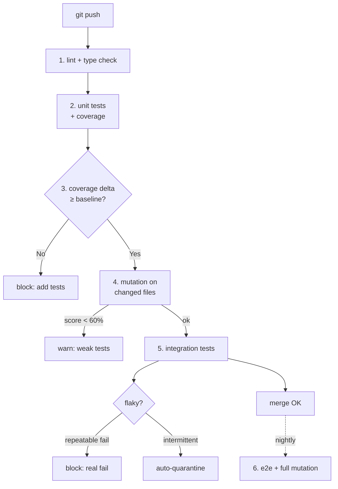

# Глава 5. Тестирование и обеспечение качества кода

> «Coverage показывает, какие строки исполнены тестами; mutation score показывает, какие из них защищены. AI пишет тесты быстрее, чем вы думаете; защищают ли они код — вопрос, который AI за вас не решит».

## Зачем эта глава

Глава 4 закончила тем, что регрессионный тест — обязательный артефакт любого закрытого инцидента (§4.8). Эта глава расширяет регрессионный тест в полноценную дисциплину тестирования: от ежедневной генерации unit-тестов на новый код до property-based проверок, от анализа «пустого» покрытия до mutation testing'а как эталона качества.

Тестирование — единственная инженерная дисциплина, где AI даёт самый быстрый и самый обманчивый прирост одновременно. Frontier-модель за минуту пишет 30 unit-тестов на функцию из 50 строк; coverage report показывает 92%. Это выглядит как защита; в действительности половина этих тестов — **тавтологии и mock-mirror'ы** (§5.4), которые проходят на любом коде, включая сломанный. Команды, которые принимают такой результат за дисциплину, обнаруживают через 2–4 недели, что AI-рефакторинг идёт через все тесты, баги — тоже через все тесты, а защита от регрессий существует только на бумаге.

Кому эта глава адресована:

- инженерам, которые **уже** пишут тесты и понимают разницу между unit и integration, но никогда не видели mutation testing в работе;
- тимлидам, которые внедряют AI в команду и ищут, как блокировать ленивые AI-сгенерированные тесты до review;
- on-call-инженерам из главы 4, которым нужна привычка превращать каждый зафиксированный root cause в регрессионный тест без 30 минут ручной работы.

Что эта глава **не** делает: не учит писать первый unit-тест, не повторяет основы pytest/xUnit/gtest (это считается базой), не претендует на полноту по test design — для этого есть Myers, «The Art of Software Testing» (1979/2011) и Beck, «Test-Driven Development» (2002).

Целевой уровень — middle/senior, прочитавший главы 1–4, имеющий опыт промышленной разработки на одном из бэкенд-стеков (Python/FastAPI или C#/.NET 8) либо системного на C++ (gtest/Catch2), знакомый с базовыми CI-практиками: блокирующий тест-стейдж, coverage-отчёты, lint-gates.

---

## 5.1 От «coverage» к «защите свойств»: что AI меняет в дисциплине тестирования

> **TL;DR.** Классическая метрика качества тестов — line/branch coverage — это **input-метрика**: измеряет, какие строки исполнены, не — какие баги поймали бы. AI ускоряет генерацию unit-тестов в 3–10× и при отсутствии явных правил наполняет репозиторий тестами с высоким coverage и низким **mutation score** (см. §5.6). Реальная единица защиты — **инвариант, формализованный в тесте**, не строка с `assert`. Эта глава перенастраивает дисциплину тестирования с «количества тестов» на «количество защищённых инвариантов» и описывает, где AI ускоряет, где — замедляет, и где — обманывает.

### Тест как инвестиция, не как формальность

Тест в инженерной дисциплине существует по двум причинам:

1. **Ловить регрессии при изменении кода.** Без тестов любой рефакторинг — игра в русскую рулетку: что-то сломалось, вы узнаете об этом позже, на проде, в три часа ночи (см. главу 4).
2. **Документировать ожидаемое поведение.** Тест — единственная исполняемая спецификация в репозитории; в нём явно сказано, что должно происходить, а не только что происходит.

Обе причины делают тест **активом**, а не накладным расходом. Актив имеет стоимость владения: тест нужно поддерживать, обновлять при изменении API, чинить, когда он флапает. Если стоимость владения превышает стоимость защиты — тест — пассив, и его существование вреднее, чем отсутствие.

AI смещает экономику: генерация теста дешевеет в 5–10×, поддержка дешевеет несильно (если вообще дешевеет). Команда, которая не пересматривает дисциплину, накапливает тесты быстрее, чем способна их поддерживать.

### Три режима использования AI в тестировании

> **Definition.** **Assertion-machine** — режим, в котором AI генерирует assertions по заданному коду и happy-path-сценарию. Самый дешёвый и самый поверхностный; даёт coverage без mutation score.

> **Definition.** **Invariant-articulator** — режим, в котором AI помогает сформулировать инвариант (свойство, которое должно выполняться для класса входов) и оформить его в виде property-based-теста (см. §5.7) или параметризованного unit-теста с осмысленными граничными значениями.

> **Definition.** **Counter-example-generator** — режим, в котором AI получает описание свойства и пытается предложить вход, на котором свойство нарушается. Это работа того же типа, что fuzzing, но управляется через текстовое описание.

Команда, использующая только первый режим, получает coverage без защиты. Команда, использующая все три, получает дисциплину test design, где AI — ускоритель в каждой роли.

### Тест-пирамида в эпоху AI

Каноническая пирамида (Cohn, 2009): много unit-тестов, средний слой — integration, тонкая верхушка — end-to-end. Соотношение по числу — приблизительно 70 / 20 / 10.

| Слой | Стоимость одного теста | Скорость прогона | Что покрывает | AI-ускорение |
|------|------------------------|------------------|---------------|---------------|
| Unit | низкая (минуты) | мс | одна функция/класс изолированно | 5–10× |
| Integration | средняя (десятки минут) | секунды | компонент + 1–2 зависимости | 2–4× |
| End-to-end | высокая (часы) | минуты | пользовательский сценарий целиком | 1.5–2× |

AI ускоряет нижний слой сильнее верхнего: на unit-тестах модель видит весь контекст функции в промпте, на end-to-end — нет. Команда, которая считает «AI пишет тесты», по умолчанию пишет unit-тесты — и пирамида становится **колонной**: 95% unit, 4% integration, 1% e2e. Колонна не защищает от integration-багов, в которых баг проявляется только в комбинации компонентов.

> **Pitfall.** «Чем больше unit-тестов, тем безопаснее рефакторинг» — неверно для AI-генерируемых тестов. Каждый тест, **жёстко связанный с реализацией** (mock'и приватных методов, проверка порядка вызовов внутренних функций), ломается при любом рефакторинге, даже если поведение не изменилось. На AI-сгенерированном тестовом наборе таких тестов в среднем 30–50% — модель «защищается избыточно». Рефакторинг ломает половину тестов; команда чинит не код, а тесты, и теряет веру в их сигнал.

### Что AI меняет в инженерной экономике тестов

| До AI | С AI без дисциплины | С AI и дисциплиной этой главы |
|-------|----------------------|-------------------------------|
| Тесты пишут редко, стоимость высокая | Тестов много, mutation score низкий | Тестов меньше, mutation score высокий |
| Coverage 30–50% типично | Coverage 70–90%, баги те же | Coverage 60–80%, реальная защита растёт |
| Регрессионный тест из инцидента — ручная работа | Регрессионный тест автогенерируется, но не падает на mutant'ах | Регрессионный тест проходит mutation testing |
| Property-based — для «теоретиков» | Property-based не используется (модель не предлагает по умолчанию) | Property-based — стандарт для функций с математическими инвариантами |

Третий столбец — то, к чему стремится остаток главы.

### Что это значит для практика

Если в вашей команде разговор о тестировании сводится к «нам нужно увеличить coverage до 90%», вы измеряете не то. Измерять надо **mutation score** (см. §5.6), **defect detection rate** на synthetic mutations, **test stability** (доля флапов на 100 прогонов), **cost-per-defect-caught** (если есть прод-данные). AI без этих метрик ускоряет производство тестов; не ускоряет производство **защиты**.

> **See also.** §5.5 (что не измеряет coverage) · §5.6 (mutation testing как реальная метрика) · §5.7 (property-based как режим invariant-articulator) · §5.11 (стоимость поддержки тестов в CI) · Глава 4, §4.8 (регрессионный тест как минимальный артефакт fix'а).

---

## 5.2 Анатомия полезного теста: AAA, инварианты, observable behavior

> **TL;DR.** Полезный unit-тест строится по схеме **AAA** (Arrange-Act-Assert): подготовь вход, выполни действие, проверь наблюдаемый результат. AI хорошо генерирует структуру AAA и naming; плохо — формулирует, **что именно** должно проверяться. Тест защищает не «строки кода», а **observable behavior** — внешне наблюдаемое поведение функции/класса. Тесты, проверяющие внутреннее устройство (приватные методы, порядок вызовов), хрупки: ломаются при рефакторинге без изменения поведения. Семь признаков «теста, который защищает»: одна причина падения, observable behavior, declarative naming, минимум моков, отсутствие order-dependency, детерминизм, fast feedback.

### AAA как универсальная структура

> **Definition.** **AAA-pattern (Arrange-Act-Assert)** — каноническая структура unit-теста, описанная в Beck, «Test-Driven Development» (2002), и закреплённая Bill Wake (~2001): три блока, каждый с одной задачей. Arrange готовит состояние; Act выполняет одно действие; Assert проверяет одно наблюдаемое следствие.

Минимальный пример (Python, pytest):

```python
def test_create_task_assigns_pending_status_by_default():
    # Arrange
    repository = InMemoryTaskRepository()
    service = TaskService(repository)
    command = CreateTaskCommand(title="Write docs", due_at=None)

    # Act
    task = service.create(command)

    # Assert
    assert task.status == TaskStatus.PENDING
```

Тот же тест на C# (xUnit + FluentAssertions):

```csharp
[Fact]
public void Create_AssignsPendingStatusByDefault()
{
    // Arrange
    var repository = new InMemoryTaskRepository();
    var service = new TaskService(repository);
    var command = new CreateTaskCommand("Write docs", DueAt: null);

    // Act
    var task = service.Create(command);

    // Assert
    task.Status.Should().Be(TaskStatus.Pending);
}
```

AAA — не догма, а контракт читаемости. Когда тест не разделён на три блока, отладка падающего теста удлиняется в 2–3×: вы тратите время, чтобы понять, где «подготовка», а где «проверка».

### Что такое observable behavior

> **Definition.** **Observable behavior (наблюдаемое поведение)** — внешний результат работы единицы кода, доступный её клиенту: возвращаемое значение, изменение состояния публичной зависимости (БД, очередь, файл), брошенное исключение, побочный эффект через наблюдаемый интерфейс (логи в API-контракте, метрики, события). Не observable behavior: значения приватных полей, имена внутренних методов, порядок их вызова, временные переменные.

Тест защищает observable behavior. Тест, проверяющий не-observable, — это тест, привязанный к **реализации**. При рефакторинге без изменения поведения такой тест падает, и команда теряет одно из двух: либо рефакторит код, ломая тест, и тратит время на его починку; либо отказывается от рефакторинга — и долг копится.

Эмпирически: AI-генератор по умолчанию пишет 30–50% тестов, привязанных к реализации (например, проверяющих вызовы конкретных приватных методов через mocked spies). Это **главный** источник rotting тестов в AI-эпоху.

### Семь признаков теста, который защищает

| Признак | Что значит | Анти-пример |
|---------|------------|-------------|
| **One reason to fail** | Тест падает по одной причине; в названии — эта причина | Один тест проверяет 5 вещей; падает — не понятно, что сломалось |
| **Observable behavior only** | Asserts на возвращаемое значение, состояние публичной зависимости, exception | Asserts на вызов приватного метода, на конкретный SQL-запрос |
| **Declarative naming** | `test_create_rejects_negative_amount` | `test_method_1`, `test_validation_works` |
| **Minimal mocks** | Mock'и только на внешний I/O (БД, HTTP) и на не-детерминизм (время, рандом) | Mock каждой зависимости, включая чистые функции |
| **No order dependency** | Любой порядок запуска даёт одинаковый результат | Тест A создаёт состояние, тест B на него полагается |
| **Determinism** | 100/100 запусков — одинаковый исход | `datetime.now()`, `uuid4()`, `asyncio.sleep` без freeze |
| **Fast feedback** | < 50 ms на типичный unit-тест | 5-секундный «unit» с реальной БД и сетевыми вызовами |

Каждый из семи нарушается AI-генератором по умолчанию **систематически**, если в промпте не указан контр-пример. Поэтому — следующая секция.

### Что AI делает хорошо и плохо в анатомии теста

**Хорошо:**

- AAA-структура (модель её знает по обучающему распределению).
- Декларативные имена в стиле `test_<subject>_<scenario>_<expected>`.
- Standard fixtures (Pytest fixtures, xUnit `IClassFixture`, Catch2 `SECTION`).
- Параметризация (`pytest.mark.parametrize`, `[Theory] [InlineData]`).

**Плохо:**

- Различение observable vs implementation. Модель часто проверяет «вызвался ли метод X», когда правильно — «вернулось ли Y».
- Минимум моков. Модель добавляет моки «на всякий случай» — делает тест жёстким.
- Свойства, не-очевидные из сигнатуры (бизнес-инварианты).
- Отрицательные сценарии (что **не** должно произойти) без явного запроса.

Эти слабости компенсируются дисциплиной промпта (§5.3) и review-чек-листами (§5.4).

### Specification by Example как языковая обёртка

> **Definition.** **Specification by Example (SBE)** — практика, в которой требования формулируются конкретными примерами вход-выход, и эти примеры становятся executable specification (тестами). Введена Gojko Adzic (2011); инструменты — Cucumber/SpecFlow/Behave (gherkin), но SBE применима и без них через обычные параметризованные тесты.

SBE — лучший способ скормить AI требование без архитектурных разногласий: вы не описываете, что **должно** произойти, в общих словах; вы даёте 5–8 пар (input, expected output), и модель восстанавливает семантику из примеров. Это снимает 70–80% «модель поняла не то», что характерно для свободного текстового описания.

```python
@pytest.mark.parametrize("amount,currency,expected_fee", [
    (Decimal("100"), "USD", Decimal("2.50")),
    (Decimal("0"), "USD", Decimal("0.00")),
    (Decimal("100"), "EUR", Decimal("3.00")),
    (Decimal("9999.99"), "USD", Decimal("249.99")),
])
def test_calculate_fee_matches_pricing_table(amount, currency, expected_fee):
    assert calculate_fee(amount, currency) == expected_fee
```

Шесть строк — и спецификация ценообразования зафиксирована. Это и тест, и документация одновременно.

### Что это значит для практика

Когда вы смотрите на AI-сгенерированный тест, спросите себя по чеклисту: упадёт ли он по **одной** причине? Проверяет ли он **observable** behavior? Можно ли по имени восстановить, что проверяется? Если нет хотя бы на один — тест отправляется на переписывание промпта, не в репозиторий. Это занимает 30 секунд и экономит 30 минут будущей боли при рефакторинге.

> **See also.** §5.3 (как формулировать промпт, чтобы получить тест по этим семи признакам) · §5.4 (что становится с тестами, когда anatomy нарушена) · §5.7 (property-based как способ отвязать тест от конкретного примера) · Глава 3, §3.7 (PIV-цикл: Verify-стадия требует именно таких тестов) · Глава 4, §4.8 (регрессионный тест как формализация observable behavior).

---

## 5.3 Генерация unit-тестов с AI: контекст, шаблоны, явные edge-cases

> **TL;DR.** Полезный AI-промпт для генерации unit-тестов содержит **пять блоков**: код тестируемой функции, типы и инварианты, тестовый стек, существующие тесты как стилистический якорь, явный список edge-cases. Отсутствие любого из пяти даёт «coverage без защиты». Frontier-модель на правильно составленном промпте за 1–2 итерации генерирует 8–15 тестов на функцию из 30–50 строк, mutation score которых 60–75%; на наивном промпте «напиши тесты для этой функции» — 4–8 тестов с mutation score 20–35%. Разница — в промпте, не в модели.

### Анатомия полезного промпта на тесты

Пять блоков, каждый — обязательный:

1. **Код функции/класса.** Полный текст, не «начало» и не «сигнатура». Без тела функции модель не видит ветвлений и угадывает их по имени метода.
2. **Типы и инварианты.** Что именно валидно/невалидно; нулевые/максимальные значения; формат строк (UUID, ISO-date, ULID); граничные числа (0, -1, MAX).
3. **Тестовый стек.** Версии: `pytest 8.x + pytest-asyncio 0.23 + hypothesis 6.x` или `xUnit 2.x + FluentAssertions 6.x + Moq 4.x`. Без версий модель смешивает синтаксисы (см. §3.1).
4. **Существующие тесты как якорь.** 1–2 теста того же модуля, чтобы модель скопировала naming style, fixture style, organization.
5. **Явный список edge-cases.** Не «edge-cases generally», а **именованные**: empty input, max input, off-by-one, unicode, timezone, race, large.

Без блока (5) модель пишет 4–6 happy-path-вариаций; baseline mutation score — 25%. С блоком (5) — 10–14 тестов с распределением «happy + boundary + invalid», mutation score — 60%+.

### Шаблон промпта (Python, pytest)

```text
Role: senior Python engineer writing unit tests for production code.

Test stack:
- Python 3.12, pytest 8.x, pytest-asyncio 0.23
- hypothesis 6.x (используем только если запрошено отдельно)
- FluentAssertions-style: один assert на тест, ясное сообщение

Code under test:
<полный код функции / класса, ≤ 80 строк>

Type and invariants:
- title: str, 1..200 chars, не пустой после strip()
- due_at: datetime | None, в UTC, не в прошлом (если задан)
- owner_id: UUID, существует в users
- status: Enum {pending, in_progress, done, cancelled}; начальное — pending
- идемпотентность по (owner_id, idempotency_key) в течение 24h

Existing tests as style anchor:
<2 существующих теста того же модуля>

Edge cases to cover (named, exhaustive):
- empty/whitespace-only title (пустая строка, "   ")
- title length boundaries (1, 200, 201 chars)
- due_at: None, past datetime, exact now, far future
- owner_id: existing, missing, malformed UUID
- idempotency: same key in window, same key after window
- timezone: due_at в non-UTC tz (модель должна нормализовать)
- unicode: emoji, RTL, combining characters в title
- concurrent create with same idempotency_key

Task: написать набор unit-тестов в pytest-стиле.

Format:
- AAA-структура с явными комментариями `# Arrange / # Act / # Assert`.
- declarative names: `test_<subject>_<scenario>_<expected>`.
- параметризация для семейств кейсов (lengths, statuses).
- никаких mocks на чистые функции; mock только на внешние зависимости из контекста.

Constraints:
- assert на observable behavior (return value, raised exception, state of repository); не на приватные методы.
- если для какого-то edge-case требуется поведение, не явное из кода/инвариантов — ответить "REQUIRES_CLARIFICATION: <что неясно>" и не выдумывать.
- не превышать 15 тестов; если нужно больше — сгруппировать через parametrize.
```

Последний constraint — главный. Без `REQUIRES_CLARIFICATION` модель допишет инвариант сама и протестирует его — баг в тесте, не в коде.

### Шаблон промпта (C#, xUnit + FluentAssertions)

```text
Role: senior C# engineer writing unit tests for production code.

Test stack:
- .NET 8.0, xUnit 2.x, FluentAssertions 6.x, NSubstitute 5.x (mocking)
- AutoFixture 4.x для синтетических объектов (использовать минимально)
- Naming: `Method_Scenario_Expected` (Roy Osherove convention)

Code under test:
<C#-код, ≤ 80 строк>

Type and invariants:
<тот же блок, что и в Python-шаблоне>

Existing tests as style anchor:
<2 существующих [Fact] / [Theory] из того же проекта>

Edge cases to cover:
<тот же список>

Task: набор unit-тестов в xUnit-стиле.

Format:
- [Fact] для одиночных кейсов; [Theory] + [InlineData] для семейств.
- AAA с разделителями-комментариями.
- FluentAssertions: `result.Should().Be(...)`, `act.Should().Throw<T>().WithMessage(...)`.
- ровно один наблюдаемый assert per test (FluentAssertions chain — это один assert).

Constraints (те же, что Python):
- observable behavior only.
- REQUIRES_CLARIFICATION на неоднозначностях.
- ≤ 15 тестов.
```

### Промпт для C++ (gtest)

```text
Role: senior C++ engineer writing unit tests using GoogleTest.

Test stack:
- C++20, GoogleTest 1.14, GoogleMock 1.14
- AddressSanitizer ON в test build (ловить UB и memory errors)
- стиль: TEST_F с фикстурой, EXPECT_* для не-fatal, ASSERT_* для invariants
- никаких raw new/delete — RAII через unique_ptr/shared_ptr/optional

Code under test:
<C++-код, ≤ 80 строк>

Type and invariants:
- ownership semantics: <кто владеет, кто заимствует>
- exception safety: <basic / strong / nothrow>
- thread safety: <single-threaded / thread-safe / requires external sync>

Edge cases:
- nullptr inputs (если допустимо/нет)
- empty containers (vector{}, string{}, span{})
- max sizes (numeric_limits<size_t>::max() где применимо)
- self-assignment, move-after-use
- iterator invalidation после mutating operations
- exception в середине batch operation (strong guarantee нарушается?)

Task: TEST_F-suite + фикстура.

Constraints:
- ASSERT_DEATH для UB-сценариев (только если debug-asserts включены).
- никаких side-effect'ов между тестами через global state.
- если ownership неоднозначен — REQUIRES_CLARIFICATION.
```

### Эмпирические данные: что меняет полнота промпта

Грубое правило, верифицированное в командах, использующих AI-ассистированное тестирование (диапазон большой; конкретные числа зависят от модели и языка):

| Состав промпта | Среднее число тестов | Mutation score |
|----------------|----------------------|------------------|
| Только код функции | 4–7 | 20–35% |
| Код + типы | 6–10 | 30–45% |
| Код + типы + стек | 8–12 | 40–55% |
| Код + типы + стек + якорные тесты | 9–14 | 50–65% |
| Все пять блоков с явными edge-cases | 10–15 | 60–75% |

Скачок на последней строке — функция блока (5). Без него edge-cases остаются на интуиции модели, и большая часть «нестандартных» входов не проверяется.

### Pitfall: «давай ещё тестов»

Соблазн — после первой генерации сказать «давай ещё». Модель добавит 5 тестов; половина — вариации существующих с косметическими отличиями (другое строковое значение в `title`). Coverage растёт, mutation score не двигается. Антидот: вторая итерация — не «ещё», а **«какие edge-cases ты пропустил из списка»**. Список явный → модель проверяет себя по нему.

### Что это значит для практика

Каждая функция, на которую вы пишете тесты с AI, начинается с пятиблочного промпта. Если у вас нет существующих тестов в репо — вторая часть итерации становится «тесты, которые написал AI, превращаются в стилистический якорь для следующих». Это инвестиция: первый промпт занимает 5–8 минут вместо 30 секунд; даёт тесты, которые **переживают** рефакторинг и ловят регрессии. Альтернатива — `coverage > 80%, mutation_score < 30%`, и через 2 месяца тесты переписываются полностью.

> **See also.** §5.4 (как ловить плохо-сгенерированные тесты до merge) · §5.6 (mutation score как валидатор полноты тестов) · §5.8 (как составить именованный список edge-cases) · Глава 2, §2.6 (R-C-T-F-Q применён к промпту на тесты) · Глава 3, §3.8 (правила тестирования в `AGENTS.md`).

---

## 5.4 Тесты, которые ничего не ловят: assertion roulette, тавтологии, mock-mirror

> **TL;DR.** «Тест есть, баг не ловит» — один из трёх паттернов: **assertion roulette** (нечитаемые asserts; падает — не понять что), **тавтология** (тест проверяет тождество, выполняющееся всегда), **mock-mirror** (тест проверяет, что mock вернул то, что в него вложили). AI-генератор продуцирует все три по умолчанию; review должен ловить их до merge. Минимальный gate — обязательный mutation testing хотя бы на изменённых файлах PR (см. §5.6); без mutation testing эти три паттерна неотличимы от полезных тестов по любой автоматической метрике.

### Семейство 1: assertion roulette

> **Definition.** **Assertion roulette** — анти-паттерн (Meszaros, «xUnit Test Patterns», 2007), при котором тест содержит несколько asserts без отличающих сообщений; при падении — не очевидно, какой именно assert упал и почему. Особенно болезненно в xUnit-фреймворках без line-level reporting.

Анти-пример:

```python
def test_user_creation():
    user = create_user(email="x@y.com", age=30)
    assert user.email == "x@y.com"
    assert user.age == 30
    assert user.is_active
    assert user.created_at is not None
    assert user.id is not None
```

Если падает второй assert, в логе видно «AssertionError» без контекста. Хуже: если в `create_user` баг с `is_active`, вы увидите падение на `assert user.is_active`, и потратите 2–3 минуты, чтобы понять, что это **третий** assert.

Антидот:

- Один assert на тест (один declarative naming → одна причина падения).
- Если несколько проверок логически связаны — использовать FluentAssertions / `assert_that` с message:

```python
def test_create_user_initializes_active_flag():
    user = create_user(email="x@y.com", age=30)
    assert user.is_active, f"new user should be active by default; got {user!r}"
```

AI генерирует assertion roulette **систематически**: на промпт «протестируй create_user» модель выдаёт один большой test с 5–8 asserts. Это не «модель ошиблась», это «промпт не запретил». Запрет — в формат-секции промпта (§5.3): «один assert per test».

### Семейство 2: тавтология (assertion that always passes)

> **Definition.** **Тавтологический тест** — тест, проверяющий тождество, выполняющееся независимо от тестируемого кода: `assert x == x`, проверка возвращаемого значения mock'а, проверка, что setter присвоил то же значение, что было передано.

Канонический пример:

```python
def test_repository_save_returns_saved_entity():
    repo = MagicMock()
    entity = Task(title="x")
    repo.save.return_value = entity  # настроили mock возвращать entity

    result = repo.save(entity)

    assert result == entity  # тавтология: проверяем то, что сами настроили
```

Этот тест проходит **всегда**: при любом изменении `repo.save`, при удалении вызова, при инверсии логики. Модель пишет такие тесты, когда контекст содержит mock-объект и не содержит реальной зависимости.

Менее очевидный пример:

```csharp
[Fact]
public void Validator_AcceptsValidInput()
{
    var input = new CreateTaskCommand("Valid title", DateTime.UtcNow.AddDays(1));
    var validator = new CreateTaskValidator();

    var result = validator.Validate(input);

    result.IsValid.Should().BeTrue();
}
```

Здесь тавтологии нет в строгом смысле, но тест проверяет одно: «валидатор не падает на одном корректном input'е». Если в `CreateTaskValidator` баг — например, не проверяется длина title, — этот тест **всё равно** проходит. Защита от регрессии — нулевая, потому что тестируется только один вход в одном измерении.

Антидоты:

1. **Параметризация с граничными значениями** — таблица входов, не один input.
2. **Mutation testing** (§5.6) — мутации валидатора должны ронять тест.
3. **Negative cases** — обязательный пункт в промпте: «протестировать N валидных + N невалидных + N граничных».

### Семейство 3: mock-mirror

> **Definition.** **Mock-mirror (зеркальный мок)** — паттерн, при котором тест проверяет, что mocked-зависимость была вызвана с теми же аргументами, что и в setup, либо что вернулось то же, что было запрограммировано return_value. Тест проверяет настройку mock'а, не поведение под тестом.

Пример:

```python
def test_service_calls_repository_with_correct_args():
    repo = MagicMock()
    service = TaskService(repo)
    
    service.create_task(title="x", owner_id="u1")
    
    repo.save.assert_called_once_with(Task(title="x", owner_id="u1"))
```

На вид тест проверяет интеграцию service-repository. На деле: если в `TaskService.create_task` логика сводится к «передать параметры в `repo.save`», тест проверяет, что вы написали именно `repo.save(Task(title=title, owner_id=owner_id))`. Любая модификация (например, добавление валидации до save) — тест падает, хотя поведение корректно.

Mock-mirror особенно опасен на DDD-стиле слоёв (router → service → repository): почти каждый service-метод сводится к делегации, и AI-сгенерированные тесты сводятся к проверке делегации. Coverage растёт, защита — нулевая.

Антидот: тестировать **observable behavior** (§5.2), не вызовы зависимостей. Заменить `MagicMock()` на in-memory fake (например, `InMemoryTaskRepository`), и проверять состояние fake после операции:

```python
def test_create_task_persists_to_repository():
    repo = InMemoryTaskRepository()
    service = TaskService(repo)
    
    task = service.create_task(title="x", owner_id="u1")
    
    saved = repo.get(task.id)
    assert saved is not None
    assert saved.title == "x"
```

In-memory fake — это не mock; это альтернативная реализация интерфейса. Тест проверяет результат, не путь.

### Сводная таблица: AI-генератор и три семейства

| Семейство | Когда AI генерирует | Как ловить на review | Что писать в промпт |
|-----------|---------------------|----------------------|----------------------|
| Assertion roulette | По умолчанию, если не задано «один assert per test» | grep на тестовые функции с `assert` count > 1 | «один assert per test; параметризация для семейств» |
| Тавтология | На coverage-driven промптах («протестируй максимум кода») | Mutation testing (тест не убивает мутантов) | «обязательно negative cases и boundary values» |
| Mock-mirror | На функциях-делегатах, при наличии mock'ов в контексте | Review: «тест проверяет состояние реальной зависимости?» | «использовать in-memory fake вместо mock; testов state, не вызовов» |

### Pitfall: «модель сказала, что покрывает edge-case»

Особый случай: модель генерирует тест с именем `test_handles_empty_input`, и в нём `assert handle("") == ""`. Имя обещает, что edge-case покрыт; assertion — тавтология. Без human-review это **проходит** все автоматические gate'ы (есть тест с правильным именем → coverage по строке вырос → CI зелёный). Антидот: review-чеклист на каждом PR с AI-сгенерированными тестами включает явный пункт — **«читать тесты как документацию: что обещает имя теста; проверяет ли тело это обещание»**.

### Минимальный set ловушек в CI

Кроме mutation testing (§5.6), три дешёвых линта:

1. **`pytest-deadcode-tests`** / `Stryker --since` — детектят тесты, которые проходят на любом коде модуля.
2. **Ratio of mocks per test** — > 3 моков на test = подозрительно. Lint-rule + warning в CI.
3. **`assert` count per test** — > 1 без сообщений = автоматический warning.

Это не панацея, но повышает стоимость публикации плохого теста.

### Что это значит для практика

«Покрытие выросло» — это не «защита выросла». Каждый AI-сгенерированный набор тестов идёт через review с тремя вопросами: упадёт ли тест на mutated implementation? Тестирует ли он observable behavior, или вызовы зависимостей? Имя теста описывает обещание, выполняет ли тело это обещание? Три вопроса — две минуты на тест. Это меньше, чем минута затрачена на починку ложного срабатывания через две недели.

> **See also.** §5.5 (coverage не отличает три семейства) · §5.6 (mutation testing — единственный автоматический фильтр) · §5.7 (property-based как защита от тавтологий) · Глава 1, §1.10 (AI Validation Checklist — не доверять confident-голосу) · Глава 4, §4.7 (5-Whys для process-причин «почему такой тест прошёл review»).

---

## 5.5 Coverage и его пределы: что измеряет, что не измеряет

> **TL;DR.** Coverage — input-метрика, не output. Line coverage показывает, какие строки исполнены тестами; branch coverage — какие ветви условий пройдены; condition / MC/DC — какие комбинации логических условий проверены. Ни одна не отвечает на вопрос «найдут ли тесты баг». Эмпирическая связь coverage → defect-detection слабая (Inozemtseva & Holmes, ICSE 2014, ≈ 80–100 проектов: корреляция 0.3–0.5 после нормализации на размер тест-сюита). 100% coverage без assertions — обычная ситуация на AI-сгенерированных наборах. Coverage полезен для одного: находить **полностью неиспользуемые** части тестового скоупа (dead zones) — ту трёхпроцентную долю кода, которая не запускалась ни разу.

### Уровни coverage и что они меряют

| Уровень | Что измеряется | Пример |
|---------|----------------|--------|
| **Line coverage** | Доля исполненных строк | `if x: foo()` — строка `foo()` исполнилась = 100% line |
| **Statement coverage** | То же на уровне statement-level (часто = line) | — |
| **Branch coverage** | Доля пройденных ветвей условий | Для `if x:` нужно и True, и False; иначе 50% branch |
| **Condition coverage** | Каждая под-условная часть `&&`/`\|\|` принимала и True, и False | `if x and y:` — 4 комбинации, проверяется ≥ 2 |
| **MC/DC (Modified Condition / Decision Coverage)** | Каждое условие независимо влияет на исход | Стандарт для авионики (DO-178C, level A); редок в обычной разработке |

Большинство инструментов (`coverage.py`, `Coverlet`, `gcov`, `lcov`) считают line + branch. MC/DC — отдельные инструменты (`pytest-mcdc`, `MC/DC` для C++), редко применяются вне регулируемых отраслей.

Хорошо: branch coverage (target 70–80% на бизнес-коде).
Не очень полезно как единственная метрика: line coverage (target ≥ 90% — манипулируется).
Реальный эталон качества — **mutation score** (см. §5.6).

### Почему 100% coverage не равно отсутствию багов

Каноническое исследование Inozemtseva & Holmes (ICSE 2014) на 5 крупных Java-проектах: корреляция между coverage и effectiveness тестов в обнаружении настоящих багов — **слабая** после нормализации на размер тест-сюита. Объяснение простое:

- **Coverage показывает, что строка исполнена.** Не показывает, что результат проверен.
- **Coverage не различает observable и implementation.** Тест, который вызвал функцию и не assert'ил ничего, даёт 100% line coverage этой функции.
- **Coverage манипулируется.** Можно увеличить до 95% за час, добавив тесты-«вызыватели» без assertions.

Минимальный пример:

```python
def calculate_discount(amount, percentage):
    if amount <= 0:
        return 0
    if percentage < 0 or percentage > 100:
        raise ValueError("invalid percentage")
    return amount * (1 - percentage / 100)
```

Тест:

```python
def test_calculate_discount_runs():
    calculate_discount(100, 20)
    calculate_discount(0, 20)
    try:
        calculate_discount(100, 150)
    except ValueError:
        pass
```

Результат: 100% line coverage, 100% branch coverage. Защита: **нулевая**. Если функция начнёт возвращать `amount * percentage` (вместо `amount * (1 - percentage / 100)`) — тест проходит. Это и есть «coverage без mutation score».

### Где coverage реально помогает

> **Pitfall.** Coverage — не цель и не метрика качества; coverage — **инструмент диагностики**, аналог `top` для CPU. Команда, которая ставит coverage целью, оптимизирует метрику, не результат (Goodhart's law).

Что coverage показывает корректно:

1. **Dead test zones.** Куски кода, не покрытые ни одним тестом. Это полезный сигнал: «здесь точно нет защиты». Действие — добавить тест или удалить мёртвый код.
2. **Drift при изменении кода.** PR добавляет 100 строк, coverage в этих строках 0%. Сигнал: автор не написал тестов на новый код. CI gate (см. §5.11) блокирует merge.
3. **Сильно избыточные модули.** Часть кода с очень низким coverage и низкой stability — кандидат на удаление или переписывание.

Что coverage **не** показывает:

- Качество тестов (assertion meaningfulness).
- Защиту от регрессий (тест может проходить на любой реализации).
- Достаточность edge-cases.
- Корректность mock'ирования.

### Целевые уровни coverage по слою и стеку

> **Versioned facts.** Целевые уровни — практика 2026 года; меняются с моделями и инструментами.

| Слой / стек | Реалистичный target | Комментарий |
|-------------|----------------------|-------------|
| Domain logic / pure functions | 85–95% line, 80–90% branch | Дёшево достичь; высокая ROI |
| Application services | 70–85% line | Часто требует in-memory fakes |
| Infrastructure adapters (DB, HTTP) | 40–60% line через unit; добор integration-тестами | Не имеет смысла гнаться за 90% unit |
| Glue code (DI, configuration) | 0–30% | Тестируется опосредованно |
| Generated code (миграции, OpenAPI client) | exclude | Из coverage-расчёта явно исключать |
| C++ system code | 50–75% line + ASAN-runtime для UB | UB ловится не coverage'ом, а sanitizer'ами |

Блокирующий CI-gate на 95% — рецепт rotting тестов. Реалистичный gate: **70–80% на bizness-коде + не падать ниже текущего уровня в PR**.

### Pitfall: AI-сгенерированный coverage-buster

Соблазн: «нам нужно поднять coverage с 60% до 85%; пусть AI напишет недостающие тесты». Модель за час сгенерирует 200 тестов, coverage поднимется до 85%, mutation score останется на 30%. Через две недели — рефакторинг сломает 80 тестов; команда чинит тесты, не код, и теряет неделю.

Антидот: цель не «поднять coverage», а «защитить **новый** или **критичный** код». Coverage — следствие защиты, не самостоятельная цель.

### Что это значит для практика

Если ваш инженерный диалог сводится к «нам надо больше coverage», переключите его на «нам нужно проверить mutation score на критичных модулях» и «нам нужно gate в CI на падение coverage в PR» (см. §5.11). Первое — реальная метрика; второе — реальная дисциплина. Цель «coverage 90%» в KPI команды через 6 месяцев приведёт к тестам, которые ничего не защищают; цель «mutation score 70% на core-домене» через 6 месяцев приведёт к зрелой тест-стратегии.

> **See also.** §5.4 (тесты, которые проходят без проверок, дают coverage без защиты) · §5.6 (mutation score как реальный измеритель) · §5.11 (CI-gate'ы на coverage и mutation) · Глава 4, §4.8 (регрессионный тест должен падать без fix'а — это и есть базовый mutation test).

---

## 5.6 Mutation testing: эталон качества тестов в эпоху AI

> **TL;DR.** **Mutation testing** — техника, в которой инструмент автоматически вносит маленькие изменения (mutants) в исходный код и проверяет, **падает ли** хотя бы один тест на каждом mutant'е. Доля убитых mutants — **mutation score**. Это самая точная автоматическая метрика качества тестов: тесты, не убивающие мутантов, не защищают от настоящих багов того же класса. Стандартные инструменты — `mutmut` / `cosmic-ray` (Python), `Stryker.NET` (C#), `Pitest` (Java/JVM), `Mull` (C++). AI работает с mutation testing в двух режимах: (1) предлагает **дополнительные тесты** для убийства выживших мутантов, (2) формулирует, **почему** мутант выжил — баг в логике или баг в тесте. Стоимость прогона: 5–50× test runtime в зависимости от инструмента; митигация — incremental mutation testing на изменённых файлах.

### Что такое mutation и mutant

> **Definition.** **Mutation** — атомарное изменение исходного кода, имитирующее правдоподобный программистский баг: замена `<` на `<=`, замена `+` на `-`, удаление `if`-условия, замена `return x` на `return null`. Полученная версия — **mutant**.

> **Definition.** **Killed mutant** — мутант, на котором хотя бы один тест упал. **Survived mutant** — мутант, прошедший все тесты.

> **Definition.** **Mutation score** = killed mutants / (killed + survived) × 100%. Эквивалентные мутанты (semantically identical к оригиналу) исключаются из расчёта.

Простейший пример (Python):

Оригинал:
```python
def is_adult(age):
    return age >= 18
```

Возможные мутанты:
1. `age > 18` (boundary)
2. `age <= 18` (отрицание)
3. `age == 18` (другой operator)
4. `return False` (constant return)
5. `return age` (изменение return)

Полезный тест должен убить минимум 4 из 5:

```python
@pytest.mark.parametrize("age,expected", [
    (17, False),  # boundary - 1
    (18, True),   # boundary
    (19, True),   # boundary + 1
    (0, False),
    (200, True),
])
def test_is_adult(age, expected):
    assert is_adult(age) == expected
```

Без `(18, True)` мутант `age > 18` выживает. Без `(17, False)` мутант `age >= 17` выживает. Mutation testing **точно** показывает, какие boundaries не проверены.

### Категории mutators

Канонические категории (из Pitest и наследников):

| Категория | Пример мутации | Что проверяет |
|-----------|----------------|---------------|
| **Conditionals Boundary** | `<` → `<=`, `>` → `>=` | off-by-one в граничных условиях |
| **Negate Conditionals** | `==` → `!=`, `if x` → `if not x` | инверсия логики |
| **Math** | `+` → `-`, `*` → `/` | арифметические опечатки |
| **Increments** | `i++` → `i--` | счётчики |
| **Return Values** | `return x` → `return null/0` | потерянное возвращаемое значение |
| **Void Method Calls** | удалить вызов `foo();` | пропущенный side-effect |
| **Constructor Calls** | удалить `new Bar()` | потерянная инициализация |
| **Conditionals Removal** | удалить `if`-блок | пропущенная проверка |

Хорошо настроенный mutation tool применяет 8–15 категорий. На типичной функции из 30 строк — это 50–200 мутантов. Прогон 200 мутантов = 200 раз прогнать тест-сюит. Отсюда — стоимость.

### Инструменты и их зрелость

> **Versioned facts.** Список зрелых инструментов на 2026 год; быстро обновляется.

| Стек | Инструмент | Зрелость | Особенности |
|------|------------|----------|-------------|
| Python | **mutmut** 2.x | стабильная | простая настройка, ограниченные mutators |
| Python | **cosmic-ray** | стабильная | гибкая, медленнее |
| C# / .NET | **Stryker.NET** 4.x | стабильная, поддерживается активно | хороший HTML-отчёт |
| Java/JVM | **Pitest** 1.x | очень зрелая | каноническая для JVM |
| C++ | **Mull** | альфа/бета | компилируется через LLVM |
| Rust | **cargo-mutants** | стабильная | работает на rust 1.70+ |
| TypeScript / JS | **Stryker** 8.x | стабильная | основная для node |

Один инструмент покрывает один язык; команды на multi-language repo нуждаются в нескольких.

### Пример прогона: mutmut

```bash
# Установка
uv add --dev mutmut

# Конфигурация в setup.cfg или pyproject.toml
[tool.mutmut]
paths_to_mutate = "src/"
runner = "pytest -x -q"
tests_dir = "tests/"

# Прогон
mutmut run

# Просмотр выживших
mutmut results
mutmut show <id>
```

Типичный output:
```
Mutation 47: src/services/task.py:42
- if amount > 0:
+ if amount >= 0:
SURVIVED — no test failed.
```

Это сигнал: добавить тест, в котором `amount = 0` даёт исход, отличающийся от `amount = 1`.

### Промпт: AI помогает убить выжившего мутанта

```text
Role: senior Python engineer expanding test coverage to kill a surviving mutant.

Original code:
<функция, в которой произошла мутация, ≤ 30 строк>

Mutated code (this version SURVIVED — all tests passed):
<тот же код с одним изменением, диффом>

Existing tests for this function:
<все текущие тесты функции>

Task: предложить минимальный дополнительный тест, который:
- падает на mutated version,
- проходит на original version,
- не дублирует существующие тесты.

Format:
- pytest-функция с AAA-разметкой.
- declarative name.
- комментарий: «kills mutant: <тип мутации>».

Constraint:
- если mutant эквивалентен оригиналу (semantically identical) — ответить "EQUIVALENT_MUTANT" и обосновать.
- не предлагать более одного теста.
```

«EQUIVALENT_MUTANT» — критичный constraint. Часть мутантов **семантически** идентична оригиналу (например, `i++ → i+=1`). Их нельзя убить ни одним тестом; их исключают из расчёта.

### Цена и митигация

| Аспект | Без митигации | С митигацией |
|--------|---------------|--------------|
| Время прогона | 5–50× test runtime | 1.5–3× |
| Митигация | — | incremental: только мутанты в изменённых файлах PR |
| Стоимость CI | непомерно дорого на каждый PR | приемлемо как ночной job + incremental на PR |
| Поддержка эквивалентных мутантов | manual annotation | inline-комментарий `# pragma: no mutate` |

Инкрементальный режим — стандарт-2026: на каждом PR проверяется mutation score только для **изменённых строк**. Полный прогон — раз в сутки/неделю.

### Как читать mutation report

Выживший мутант — не всегда баг в тестах; иногда — тонкость дизайна. Три категории:

1. **«Тест плох».** Мутация изменила observable behavior, ни один тест не упал — недостающий test case. Действие: добавить.
2. **«Эквивалентный мутант».** Изменение синтаксически другое, семантически идентично. Действие: пометить, исключить из расчёта.
3. **«Дизайн хрупкий».** Мутация показала, что код **зависит** от детали, которую вы не считали важной (например, инициализация поля по умолчанию). Действие: либо документировать инвариант, либо рефакторить.

AI помогает в первой категории; вторую и третью требуют human judgment.

### Целевые mutation score

> **Versioned facts.** Целевые цифры — индустриальная практика 2026 года.

| Тип кода | Реалистичный mutation score |
|----------|------------------------------|
| Domain logic / финансовые расчёты / authorization | 80–95% |
| Application services с in-memory fakes | 65–80% |
| Adapters (HTTP, DB) | 50–70% (большая часть в integration-тестах) |
| UI/glue | не применять mutation testing |

Превышение 95% обычно — overfitting тестов под mutators; полезность сомнительна.

### Pitfall: «mutation score 100%»

Особый случай: модель генерирует тесты до достижения mutation score 100%. Это часто означает, что тесты повторяют структуру кода буква-в-букву (test mirror) — и при рефакторинге **с сохранением поведения** тесты падают. Mutation score 100% — не цель; 75% устойчивых тестов лучше 95% хрупких.

### Что это значит для практика

В команде, использующей AI-генерацию тестов, mutation testing — обязательный gate (хотя бы инкрементальный). Без него вы **не можете** отличить полезный AI-сгенерированный тест от тавтологии. С ним — у каждого PR есть ответ на вопрос «насколько новые/изменённые тесты защищают изменённый код». Это поднимает стоимость merge на 5–10 минут CI-времени и снижает рост технического долга в тестовом коде в 2–3×.

> **See also.** §5.4 (тавтологии — главные кандидаты на surviving mutants) · §5.7 (property-based: mutation score высокий по построению) · §5.11 (mutation testing в CI-pipeline) · Глава 4, §4.8 (регрессионный тест из MRE — тест, который **гарантированно** убивает один конкретный mutant).

---

## 5.7 Property-based testing: тестирование инвариантов классов входов

> **TL;DR.** **Property-based testing (PBT)** — техника тестирования, в которой вы формулируете не пары (input, expected output), а **свойство** — инвариант, выполняющийся для **всех** валидных входов из заданного класса. Инструмент (Hypothesis в Python, FsCheck в C#, RapidCheck в C++) автоматически генерирует входы и пытается найти контрпример. PBT находит баги, которые example-based тестирование пропускает: edge cases, race conditions, encoding issues, integer overflow. AI хорош в роли **invariant-articulator** — формулирует кандидатов property по сигнатуре функции; плох в формулировке domain-specific properties (требуется бизнес-знание). Не замена unit-тестам; дополнение для функций с математическими / комбинаторными инвариантами.

### Что такое property

> **Definition.** **Property (свойство)** — логическое утверждение, истинное для **всех** допустимых входов функции. Формулируется как универсальная квантификация: «для всех `x ∈ X`: `P(f(x))`».

Простой пример: функция `reverse(list)` обладает свойствами:

1. **Round-trip**: `reverse(reverse(xs)) == xs` для всех `xs`.
2. **Length-preservation**: `len(reverse(xs)) == len(xs)`.
3. **Element-preservation**: `set(reverse(xs)) == set(xs)`.
4. **Idempotence на симметричных списках**: `xs == reverse(xs)` если `xs` палиндром.

Каждое свойство проверяется на 100–1000 случайно сгенерированных входах за прогон. Если хоть один фейлит — инструмент **сжимает** (shrinks) контр-пример до минимального.

### Канонические категории properties

| Категория | Шаблон | Пример |
|-----------|--------|--------|
| **Round-trip** | `decode(encode(x)) == x` | `parse(format(date)) == date` |
| **Idempotence** | `f(f(x)) == f(x)` | `normalize(normalize(s)) == normalize(s)` |
| **Commutativity** | `f(a, b) == f(b, a)` | `merge(s1, s2) == merge(s2, s1)` для set |
| **Associativity** | `f(f(a, b), c) == f(a, f(b, c))` | concat strings |
| **Identity** | `f(x, identity) == x` | `multiply(x, 1) == x` |
| **Inverse** | `g(f(x)) == x` | `decompress(compress(b)) == b` |
| **Oracle** | `f(x) == reference_impl(x)` | новая быстрая реализация = старая |
| **Model-based** | состояние f после операций = модель состояния | event sourcing проверка |
| **Metamorphic** | `f(transform(x)) == related_to(f(x))` | `sin(π - x) == sin(x)` |

Канонические категории — Claessen & Hughes («QuickCheck», 2000) и Hughes («Experiences with QuickCheck», 2007). Оригинал PBT — QuickCheck для Haskell; Hypothesis (David MacIver, 2013+) перенёс в Python с улучшениями (smart shrinking, fuzzing на основе coverage).

### Hypothesis (Python): минимальный пример

```python
from hypothesis import given, strategies as st

@given(st.lists(st.integers()))
def test_reverse_round_trip(xs):
    assert reverse(reverse(xs)) == xs

@given(st.lists(st.integers()))
def test_reverse_preserves_length(xs):
    assert len(reverse(xs)) == len(xs)
```

Запуск:

```bash
pytest tests/ -q
# Hypothesis генерирует ~100 случайных списков на каждый тест
# Если найден контрпример — print'ает минимальный
```

Когда контр-пример найден — Hypothesis сохраняет seed в `.hypothesis/examples/`; следующий прогон **гарантированно** включает этот вход. Это превращает property-based тест в регрессионный после первого фейла.

### FsCheck (C#): аналог

```csharp
using FsCheck;
using FsCheck.Xunit;

public class ReverseProperties
{
    [Property]
    public bool Reverse_RoundTrip(List<int> xs)
        => xs.Reverse().Reverse().SequenceEqual(xs);

    [Property]
    public bool Reverse_PreservesLength(List<int> xs)
        => xs.Reverse().Count == xs.Count;
}
```

FsCheck интегрируется с xUnit/NUnit через атрибут `[Property]`. Сгенерированные входы — на основе встроенных Arb (arbitrary) или custom-генераторов.

### RapidCheck (C++): минимальный пример

```cpp
#include <rapidcheck.h>
#include <vector>

int main() {
    rc::check("reverse round-trip", [](const std::vector<int>& xs) {
        auto rev1 = reverse(xs);
        auto rev2 = reverse(rev1);
        RC_ASSERT(rev2 == xs);
    });
    return 0;
}
```

RapidCheck менее зрелая, чем Hypothesis/FsCheck, но достаточная для базовых свойств. Альтернатива — fuzzing через libFuzzer + ASAN/UBSAN — даёт схожий эффект на C++ системном коде.

### Где PBT эффективен и где нет

**Хорошо подходит:**

- Pure functions с математическими инвариантами (encode/decode, парсеры, форматтеры).
- Структуры данных с алгебраическими свойствами (collections, sets, maps).
- Сериализация / десериализация (JSON, protobuf, бинарные форматы).
- Authorization-логика с invariant'ами (если у user есть permission X, операция допустима).
- Финансовые расчёты (commutativity, associativity, no-loss-of-precision).

**Плохо подходит:**

- Code, тесно связанный с side effects (интеграция с external service).
- UI / визуализация.
- Workflow-orchestration с многими шагами и состоянием.
- Domain logic, в которой инварианты неочевидны или зависят от бизнес-правил, недокументированных в коде.

PBT не заменяет example-based тестов; дополняет. Соотношение «3–5 example-based на каждый property-based» — типичное.

### Промпт: AI как invariant-articulator

```text
Role: senior engineer formulating properties for a function.

Function under test:
<сигнатура + код, ≤ 50 строк>

Type and invariants:
<что валидно, что нет>

Domain context:
<2-3 строки о бизнес-смысле функции>

Task: предложить 3-5 property-based тестов в hypothesis-стиле.

Format:
- для каждого property: имя категории (round-trip / idempotence / oracle / metamorphic / etc.).
- formulation в виде @given(...) + assertion.
- @given-strategies: hypothesis-strategies, корректные для типов аргументов.
- комментарий: «property holds because <обоснование на 1 строке>».

Constraints:
- если для функции естественные properties неочевидны (например, чистая бизнес-логика без математической структуры) — ответить "NO_OBVIOUS_PROPERTIES" и предложить только example-based тесты.
- не предлагать тавтологические properties (assert True / assert == identity без преобразования).
- если property требует reference implementation (oracle) — указать это явно.
```

«NO_OBVIOUS_PROPERTIES» — против over-engineering. PBT не нужен для каждой функции; на бизнес-логике с case-by-case-семантикой example-based может быть **проще** и **полезнее**.

### Pitfall: Oracle problem

> **Definition.** **Oracle problem** — задача определения корректного результата для случайно сгенерированного входа. Если функция вычисляет нечто нетривиальное, у вас нет «второго источника» для сравнения; PBT превращается в проверку «не падает» (что = тавтология).

Решения oracle problem:

1. **Reference implementation.** Старая медленная реализация vs новая быстрая.
2. **Metamorphic relation.** Не «знаем правильный ответ», а «знаем, как ответ меняется при преобразовании входа».
3. **Round-trip / inverse.** Если есть пара функций f и f⁻¹ — проверяем `f⁻¹(f(x)) == x`.
4. **Weakening.** Не точное равенство, а **слабое** свойство (диапазон, sign, monotonicity).

AI часто игнорирует oracle problem — генерирует property `f(x) == expected_result(x)` без указания, как `expected_result` вычисляется. Это **тавтология в обёртке**.

### Минимальный диапазон применения в команде

Реалистичный таргет на год внедрения:

- 5–10 property-based тестов на core-домен (не «на каждую функцию»).
- 1–2 property на сериализацию / парсинг.
- 1 property на authorization-логику.
- Hypothesis в test-stack: добавлен в `dev-dependencies`, hypothesis-database — в .gitignore (sample seeds — в репозитории через `pytest --hypothesis-seed`).

Расширение — после первой найденной баги: команда видит, что PBT нашла **то**, что example-based пропустил, и инвестирует дальше.

### Что это значит для практика

PBT — не стиль жизни и не замена unit-тестам. PBT — точечное оружие на классах функций, где example-based фундаментально неполон. На сериализации — PBT обязателен; на чистой бизнес-логике с case statements — обычно избыточен. AI ускоряет formulation в 3–5×, но financial / authorization properties всё равно пишутся вами: бизнес-знание у модели нет. Команда, начавшая с 5 properties на core, через год — у которой 10–20 properties — обычно ловит на год вперёд 3–8 багов, которые иначе ушли бы в прод.

> **See also.** §5.6 (mutation testing на функциях с PBT даёт существенно более высокий score) · §5.8 (PBT-strategies — это и есть формализация edge-case generator) · §5.10 (для C++ системного кода fuzzing через libFuzzer часто эффективнее RapidCheck) · Глава 1, §1.6 (next-token prediction → почему модель формулирует round-trip и idempotence естественно, а oracle requires care).

---

## 5.8 Edge-case generation: классы граничных условий и роль AI

> **TL;DR.** Полезный набор тестов покрывает **классы граничных условий**, не «несколько разных входов». Канонические техники: **equivalence partitioning** (разделение пространства входов на классы эквивалентности) и **boundary value analysis** (значения на границе и за ней). AI хорошо предлагает **кандидатов** edge-case'ов из стандартных категорий: empty/null, max/min, off-by-one, unicode/encoding, time/timezone, race, large, NaN/Inf. Плохо — domain-specific edge-case'ов (бизнес-исключения, нетривиальные state-machine transitions). Промпт с **именованным** списком категорий даёт в 3–5× больше полезных тестов, чем «протестируй edge-cases».

### Equivalence partitioning и boundary value analysis

> **Definition.** **Equivalence partitioning (EP)** — техника тест-дизайна (Myers, «The Art of Software Testing», 1979), при которой пространство входов делится на классы, в пределах которых поведение программы предполагается одинаковым. Тест проверяет один представитель класса; остальные считаются эквивалентными.

> **Definition.** **Boundary value analysis (BVA)** — расширение EP: тестируются значения на границах классов и непосредственно за ними (e.g., 0, 1, max-1, max, max+1). Эмпирически: 60–80% багов локализованы на границах.

Минимальный пример: функция `validate_age(age: int) -> bool`, `True` если 0 ≤ age ≤ 150.

EP-классы: { age < 0 }, { 0 ≤ age ≤ 150 }, { age > 150 }.

BVA-точки: −1, 0, 1, 75, 149, 150, 151. Семь точек покрывают все три класса плюс границы.

Без BVA AI часто пишет три теста: `validate_age(25) == True`, `validate_age(-1) == False`, `validate_age(200) == False`. Coverage 100%; mutation `age <= 150` → `age < 150` (boundary off-by-one) **выживает**, потому что 150 не проверяется.

### Канонические семейства edge-cases

| Семейство | Примеры | Когда применять |
|-----------|---------|------------------|
| **Empty / null** | `""`, `[]`, `{}`, `None`, `null` | Все коллекции и nullable-параметры |
| **Boundary numbers** | 0, 1, -1, MAX, MIN, MAX+1, MIN-1 | Все числовые входы |
| **Off-by-one** | n-1, n, n+1 на границах циклов и массивов | Pagination, ranges, slicing |
| **Unicode** | emoji 🙂, RTL (עברית), combining (`é` vs `é`), surrogate pairs | Text processing, validation |
| **Encoding** | UTF-8, UTF-16, latin-1, mojibake | I/O boundaries |
| **Time** | epoch (0), DST transition, leap second, far future, microsecond precision | Date/time logic |
| **Timezone** | UTC, non-UTC, half-hour TZ (Iran, India), changed TZ | Scheduling, timestamping |
| **Locale** | en-US, ru-RU, tr-TR (i/I problem), de-DE (ß vs ss) | Sorting, formatting |
| **Float** | 0.0, -0.0, NaN, Inf, -Inf, denormals, precision loss | Math, financial |
| **Strings** | `""`, single char, очень длинная (10⁶ chars), only whitespace, control chars | Validation, persistence |
| **Concurrency** | race condition на shared state, contention, deadlock | Multi-threaded code |
| **Resource** | file not found, permission denied, disk full, network timeout | I/O |
| **Idempotency** | повторный вызов с тем же ключом, после window | Distributed / retry-able operations |
| **Adversarial** | SQL injection, path traversal, XSS, ReDoS-кишка | Untrusted input |

Это «универсальный» список — общие места, в которых ошибаются 80% реализаций. Domain-specific edge-cases (например, «договор может быть расторгнут только при статусе active») — отдельная категория, которую AI не угадывает без явного указания инвариантов.

### Промпт: AI как edge-case-generator

```text
Role: senior engineer enumerating edge-cases for a function.

Function:
<сигнатура + краткое описание>

Type and invariants:
<какие значения валидны, какие нет>

Domain context:
<1-2 строки о бизнес-смысле>

Task: предложить edge-cases для тестирования.

Format: таблица — категория | конкретное значение | ожидаемое поведение.

Categories to consider (отметить применимые, пропустить неприменимые):
- Empty / null
- Boundary numbers
- Off-by-one
- Unicode / encoding
- Time / timezone
- Locale
- Float / NaN / Inf
- Strings (empty, max, control chars, whitespace)
- Concurrency
- Resource (I/O)
- Idempotency
- Adversarial input
- Domain-specific (только если ты можешь обосновать из инвариантов)

Constraints:
- для каждой категории — 1-3 конкретных значения, не больше.
- не выдумывать domain-specific edge-cases вне предоставленных инвариантов.
- если для функции категория неприменима (например, нет string-input → unicode неприменимо) — пропустить, не выдумывать.
- если для domain-specific edge-case требуется бизнес-знание, не предоставленное — ответить "DOMAIN_KNOWLEDGE_REQUIRED: <вопрос>".
```

«DOMAIN_KNOWLEDGE_REQUIRED» — против выдумывания бизнес-инвариантов. На функции «calculate refund» модель может «вспомнить», что refund нельзя оформить позже 30 дней; в **вашем** домене — может быть 90 дней. Запрос-вопрос лучше, чем выдуманный edge-case.

### Pitfall: AI «знает» edge-cases по обучающему распределению

Особый случай: модель пишет edge-case «empty list», и вы получаете `assert handle([]) == []`. Это уже тест, но **не покрывает** реальную мотивацию: пустой вход в домене может означать «return default», «raise ValidationError», «log and continue». Без явного `expected_behavior` модель угадывает по learning distribution; в 30–50% случаев — угадывает не для вашего домена.

Антидот: каждый edge-case в таблице сопровождается `expected_behavior` — что **должно** произойти. Пробел в `expected_behavior` = пробел в спецификации, не в тесте.

### Equivalence partitioning vs property-based: trade-off

| Подход | Хорошо подходит | Плохо подходит |
|--------|------------------|-----------------|
| **EP + BVA** | Discrete-input functions, бизнес-логика с case-by-case-семантикой | Continuous spaces (floats), combinations of N inputs |
| **Property-based** | Math functions, parsers, encoders, properties над классами | Domain logic с case-by-case без явных инвариантов |

В реальном проекте — оба. Pure функции и сериализация — PBT. Бизнес-логика — EP + BVA. AI ускоряет каждый.

### Adversarial edge-cases: что спросить отдельно

```text
Task: предложить adversarial inputs для функции <name>.

Categories:
- SQL injection (если строка идёт в БД-запрос)
- Path traversal (если строка → файловая система)
- XSS (если строка → HTML output)
- ReDoS (если строка → регулярка)
- Integer overflow (если число → арифметика)
- Buffer overflow (C/C++: размер буфера)
- Deserialization gadgets (если bytes → deserialize)

Constraint:
- предлагать только для категорий, релевантных по контексту функции.
- для каждого — указать тип защиты (validation / parameterized query / encoding / ...).
```

Adversarial — отдельный промпт, не часть основного. Защита от security-bug — это не «edge-case», это требование.

### Что это значит для практика

Каждый набор edge-cases начинается с прогона по 14-категорному списку: какие из них применимы? Для применимых — 1–3 конкретных значения. Для domain-specific — отдельный заход с явным указанием инвариантов. AI генерирует таблицу за минуту; вы вычитываете её за 3 минуты, отмечая «применимо / неприменимо». Это базовая практика edge-case-coverage; без неё AI генерирует «happy + 1 эмпиризм edge», и пирамида тестов оказывается **широкой и тонкой**.

> **See also.** §5.3 (edge-cases — обязательный пятый блок промпта на тесты) · §5.6 (BVA на boundary mutators естественно проверяется через mutation testing) · §5.7 (PBT генерирует edge-cases автоматически на классах входов) · Глава 4, §4.7 (5-Whys часто упирается в edge-case, который не был в спецификации).

---

## 5.9 Integration-тесты: testcontainers, фикстуры, детерминизм

> **TL;DR.** Integration-тест — тест, в котором один компонент работает с **реальной** реализацией одной-двух зависимостей (БД, очередь, HTTP-сервис) вместо mock'а. На 2026 год индустриальный стандарт — **testcontainers** для БД и infrastructure (Postgres, Kafka, Redis, MinIO в Docker-контейнерах на запуск теста), **WireMock**/**httpx mock**/**MockServer** для внешних HTTP, и **изолированные test-DB-схемы** для избегания cross-test contamination. AI хорошо генерирует фикстуры из ORM-схемы и testcontainer-конфиги; плохо — стратегию изоляции тестов друг от друга и cleanup. Стоимость: integration-тест в 50–500× медленнее unit'а; митигация — параллелизация, reuse контейнера, минимизация числа integration-тестов до 5–15% от общего числа.

### Что считается integration-тестом

> **Definition.** **Integration test (интеграционный тест)** — тест, проверяющий поведение компонента **во взаимодействии** с одной или несколькими зависимостями: БД с реальной схемой, файловая система, HTTP-клиент с реальным сервером (часто — mocked endpoint), очередь сообщений. Противопоставляется **unit-тесту** (полная изоляция через mocks/fakes) и **end-to-end** (вся система целиком).

Типичные сценарии для integration-теста:

- Repository-слой с реальной БД (проверка SQL-запросов, миграций, индексов).
- HTTP-handler с реальным DI-контейнером и реальным persistence (FastAPI TestClient, ASP.NET Core `WebApplicationFactory`).
- Producer / consumer с реальной очередью (Kafka testcontainer).
- File-storage адаптер с реальной MinIO-инстанцией.

То, что **не** integration-тест:

- Тест с mocked DB через `MagicMock` (это unit с хрупким mock'ированием).
- Тест с реальной production-БД (это разрушительный тест на dev-окружении).
- Тест с реальными external services (3rd-party APIs) — это либо contract-тест, либо e2e.

### Testcontainers: индустриальный стандарт

> **Definition.** **Testcontainers** — open-source-фреймворк (Sergei Egorov, ~2015), запускающий Docker-контейнеры из тестового кода, ждущий ready-state и предоставляющий connection-string. Поддерживается на Java/Python/.NET/Go/Node (`testcontainers-python`, `Testcontainers.NET`, и т.д.). На 2026 год — стандарт для integration-тестов с инфраструктурой.

Минимальный пример (Python + Postgres):

```python
import pytest
from testcontainers.postgres import PostgresContainer
from sqlalchemy import create_engine
from myapp.models import Base
from myapp.repositories import TaskRepository

@pytest.fixture(scope="session")
def postgres_container():
    with PostgresContainer("postgres:16.2-alpine") as postgres:
        yield postgres

@pytest.fixture
def engine(postgres_container):
    engine = create_engine(postgres_container.get_connection_url())
    Base.metadata.create_all(engine)
    yield engine
    Base.metadata.drop_all(engine)

@pytest.fixture
def repo(engine):
    return TaskRepository(engine)

def test_task_repository_saves_and_retrieves(repo):
    task = Task(title="x", owner_id="u1")

    repo.save(task)
    retrieved = repo.get(task.id)

    assert retrieved == task
```

`scope="session"` поднимает контейнер один раз на всю тестовую сессию (cost: 3–10 секунд на старт; reuse — мс на тест). `Base.metadata.create_all` + `drop_all` — пересоздание схемы между тестами на per-engine-фикстуре; альтернатива — транзакция с rollback (быстрее, но требует disciplined session management).

### .NET: WebApplicationFactory + Testcontainers

```csharp
public class TaskApiFixture : IAsyncLifetime
{
    public PostgreSqlContainer Postgres { get; } = new PostgreSqlBuilder()
        .WithImage("postgres:16.2-alpine")
        .Build();

    public WebApplicationFactory<Program> Factory { get; private set; } = default!;

    public async Task InitializeAsync()
    {
        await Postgres.StartAsync();
        Factory = new WebApplicationFactory<Program>()
            .WithWebHostBuilder(b => b.ConfigureServices(s =>
            {
                s.RemoveAll<IDbConnectionFactory>();
                s.AddSingleton<IDbConnectionFactory>(
                    new NpgsqlConnectionFactory(Postgres.GetConnectionString()));
            }));
    }

    public async Task DisposeAsync()
    {
        await Postgres.DisposeAsync();
        Factory.Dispose();
    }
}

[Collection("api")]
public class CreateTaskTests : IClassFixture<TaskApiFixture>
{
    private readonly TaskApiFixture _fixture;
    public CreateTaskTests(TaskApiFixture fixture) => _fixture = fixture;

    [Fact]
    public async Task Post_Tasks_PersistsToDatabase()
    {
        var client = _fixture.Factory.CreateClient();
        var response = await client.PostAsJsonAsync("/api/v1/tasks", new { title = "x" });

        response.StatusCode.Should().Be(HttpStatusCode.Created);
    }
}
```

Pattern: один контейнер на всю collection тестов; isolation между тестами — через транзакции или per-test-cleanup.

### Промпт: AI генерирует фикстуры

```text
Role: senior engineer building integration test fixtures.

Stack:
- Python 3.12, pytest 8.x, testcontainers-python 4.x
- SQLAlchemy 2.0 ORM, Alembic 1.13, Postgres 16.2

Schema:
<ORM-модели или DDL>

Existing fixture conventions:
<2 примера существующих фикстур из repo>

Task: построить набор pytest-фикстур для integration-тестов:
- session-scoped: testcontainer Postgres
- function-scoped: clean schema (или transaction rollback)
- per-test data builders: одна функция на каждую сущность

Format:
- conftest.py-style фикстуры с явными scope'ами.
- typed (type hints).
- cleanup в teardown'е, не в setup'е.

Constraints:
- никаких глобальных переменных.
- никаких os.environ-настроек, только через container.get_connection_url().
- если требуется migrations — использовать Alembic, а не raw SQL.
- если для cleanup-стратегии есть trade-off (drop-all vs transaction rollback) — назвать оба варианта с аргументами.
```

Последний constraint — против one-true-way в том месте, где есть реальный trade-off (см. ниже).

### Trade-offs: cleanup-стратегии

| Стратегия | Скорость | Изоляция | Применимость |
|-----------|----------|----------|--------------|
| **Drop + recreate schema** на каждом тесте | медленно (100–500 ms) | абсолютная | Любые тесты, включая DDL-операции |
| **Transaction with rollback** | очень быстро (5–20 ms) | хорошая | Тесты, не выполняющие DDL внутри теста |
| **Truncate tables** | быстро (10–50 ms) | хорошая | Если тест не зависит от sequence-состояния |
| **DELETE FROM с фиксированным порядком** | медленно на больших таблицах | хорошая | Legacy / без TRUNCATE-привилегий |
| **Test-data namespace** (per-test prefix) | быстро | плохая (не cleanup'ит) | Append-only-логи, partitioned-таблицы |

Стандартный выбор: **transaction-with-rollback** для большинства тестов; **drop + recreate** для тестов, проверяющих миграции; namespacing — анти-паттерн в большинстве случаев.

### Детерминизм: те же источники, что в §4.2

Integration-тесты — главный источник flaky-тестов в проекте, потому что зависимостей больше:

| Источник недетерминизма | Изоляция в integration-тесте |
|--------------------------|-------------------------------|
| Время | `freezegun` (Py) / `TimeProvider` (.NET 8) с фиксированным «now» |
| Случайность | `random.seed(42)` глобально + per-test seed для генераторов |
| Внешний HTTP | WireMock / httpx-mock / MockServer; **никогда** реальный 3rd-party |
| Очереди / Kafka | testcontainer + cleanup топиков; ожидание через polling с timeout |
| Параллелизм тестов | per-worker isolation: отдельная схема на воркер pytest-xdist |
| Файловая система | tmp_path (pytest) / TestContext.TestRunDirectory (.NET) |
| TZ / Locale | `TZ=UTC LANG=C.UTF-8` в env CI |
| Таймауты | реалистичные wait-loops (0.5 sec poll, 30 sec total), не sleep'ы |

Каждый источник, не изолированный, даёт 0.1–5% flap-rate. На 100 тестов и 5 источниках — 1–5% общего flap-rate (= один из 20–100 прогонов CI красный без изменений). Это достаточно, чтобы команда перестала верить тестам.

### Что AI делает хорошо и плохо в integration-тестах

**Хорошо:**

- Стандартные fixtures (testcontainer setup, engine creation).
- Data builders из ORM-схемы.
- WireMock-конфиги из OpenAPI-спецификации downstream.
- Migration-tests из Alembic-changelog.

**Плохо:**

- Cleanup-стратегия (по умолчанию выбирает drop-all — медленно).
- Tests-isolation между параллельными воркерами.
- Wait-стратегии для асинхронных операций (по умолчанию sleep'ы).
- Diagnosis flaky-теста: модель чинит симптом («увеличить timeout»), не причину («race на shared state»).

### Pitfall: «replace mocks with testcontainers»

Соблазн при внедрении testcontainers: «давайте перепишем все наши mock-based тесты как integration». Это превращает 200-миллисекундный test suite в 30-минутный, и команда перестаёт запускать его локально. Антидот: integration-тесты — на **границах** компонентов (репозиторий, HTTP-handler), не на бизнес-логике. Бизнес-логика — unit с in-memory fakes (см. §5.2). Соотношение integration:unit:e2e — 15:80:5 типично; пирамида сохраняется.

### Что это значит для практика

Integration-тестов в проекте — мало (5–15% от общего числа), но они критичны: ловят то, что unit-тесты с mocks физически не могут увидеть (constraint violations в БД, неправильные индексы, race на schema migration). AI ускоряет setup в 3–5×; **поддержание** детерминизма и стратегии изоляции — на вас. Команда, которая пускает на самотёк cleanup-strategies и flaky-detection, через 6 месяцев имеет integration-сюит, который никто не запускает локально, и который красный в CI 5–15% времени, — то есть фактически отсутствует.

> **See also.** §5.10 (особенности integration-тестов на C++ — там нет testcontainers, но есть mock-libraries) · §5.11 (CI-стратегия: pre-merge unit + nightly integration) · Глава 3, §3.6 (генерация persistence-слоя и его тестов в MVP) · Глава 4, §4.2 (изоляция недетерминизма в minimal reproducible example).

---

## 5.10 Языко-специфические нюансы: Python, C#, C++

> **TL;DR.** Тестовые экосистемы Python (pytest), C# (xUnit/NUnit/MSTest) и C++ (GoogleTest/Catch2) разные по идиомам: pytest — fixture-driven и dynamic; xUnit — attribute-driven и compile-time-typed; GoogleTest — TEST_F с фикстурой-классом и явным lifecycle. AI генерирует тесты во всех трёх стеках, но систематически делает разные ошибки: в Python — слишком много моков и недостаточное использование `parametrize`; в C# — неправильное использование `[Theory]` (mixing разных контрактов в одной таблице); в C++ — игнорирование RAII, sanitizer'ов и владения памятью. Native-стек дополняет тесты **runtime-санитайзерами** (ASAN/UBSAN/TSAN/MSAN) — то, чего нет в managed-языках, и что AI часто не предлагает по умолчанию.

### Python (pytest): идиомы и AI-ошибки

Pytest — fixture-driven framework на доминирующих идиомах:

```python
# Fixture-инъекция через имя параметра
@pytest.fixture
def repository():
    return InMemoryTaskRepository()

# Параметризация
@pytest.mark.parametrize("title,expected_error", [
    ("", ValidationError),
    (" " * 10, ValidationError),
    ("x" * 201, ValidationError),
])
def test_create_rejects_invalid_title(repository, title, expected_error):
    with pytest.raises(expected_error):
        TaskService(repository).create(title=title)
```

Стандартная стилевая база:

- `pytest-asyncio` для async-тестов (или встроенный `asyncio_mode = auto`).
- `pytest.fixture` со scope `function` (default) / `module` / `session`.
- `monkeypatch` для подмены атрибутов модулей (чище, чем mock).
- `pytest-mock` (`mocker` fixture) поверх unittest.mock с auto-cleanup.
- Hypothesis для PBT.

**AI-ошибки в Python-тестах:**

- **Сверхмокирование.** Mock'ит чистые функции из stdlib (`datetime`, `uuid`) вместо использования `freezegun` / fixed seeds. Стандарт: mock-only-on-IO-boundary.
- **Игнорирование `parametrize`.** Пишет 5 одинаково структурированных тестов вместо одного `@parametrize`. Размер сюита больше; читаемость хуже.
- **`unittest.TestCase` вместо pytest-стиля.** Иногда модель «вспоминает» старый стиль (Java-наследие); приходится явно требовать pytest.
- **Side effects в conftest.py.** Глобальный `monkeypatch` без revert — отравляет последующие тесты.

Антидот в промпте: «pytest-style functions, не unittest.TestCase; parametrize для семейств; monkeypatch только в fixture, не на module-уровне».

### C# (xUnit / .NET 8): идиомы и AI-ошибки

xUnit — attribute-driven, compile-time-typed:

```csharp
public class CreateTaskValidatorTests
{
    private readonly CreateTaskValidator _sut = new();

    [Theory]
    [InlineData("", "title is required")]
    [InlineData("   ", "title is required")]
    [InlineData("a", null)]   // valid
    [MemberData(nameof(LongTitles))]
    public void Validate_TitleLength_ReturnsExpected(string title, string? expectedError)
    {
        var result = _sut.Validate(new CreateTaskCommand(title, DueAt: null));

        if (expectedError is null)
            result.IsValid.Should().BeTrue();
        else
            result.Errors.Should().ContainSingle(e => e.ErrorMessage == expectedError);
    }

    public static IEnumerable<object?[]> LongTitles =>
        new[] { new object?[] { new string('x', 200), null },
                new object?[] { new string('x', 201), "title too long" } };
}
```

Стандартная база:

- xUnit (`[Fact]`, `[Theory]` + `[InlineData]` / `[MemberData]` / `[ClassData]`).
- FluentAssertions (`Should().Be(...)`, `Should().Throw<T>()`) — стандарт-2026; читаемее `Assert.Equal`.
- NSubstitute / Moq для mock'ирования; FakeItEasy реже.
- Bogus / AutoFixture для генерации synthetic-данных (минимально).
- `IClassFixture<T>` / `ICollectionFixture<T>` для shared-state между тестами одного класса/коллекции.

**AI-ошибки в C#-тестах:**

- **`[Theory]` с разнотипными кейсами.** В одну таблицу `[InlineData]` модель кладёт «valid / invalid / boundary» — затрудняет диагностику падения. Стандарт: разделять theories по семантике.
- **`Assert.Equal` вместо FluentAssertions.** Зависит от обучающего распределения; на репо с FluentAssertions — стилевой mismatch.
- **Async-tests без `await`.** `public async Task` без await на test-методе — компилятор предупредит, но AI иногда генерирует `async void`-тесты, которые xUnit отвергает.
- **Mock-mirror через NSubstitute.** Особенно при наличии `[Mock] IRepository repo` в context — модель пишет `repo.Received(1).Save(...)` вместо проверки итогового состояния.

Антидот: «FluentAssertions for assertions; Theory только для one-contract семейств; async Task-tests; observable state checks, not Received-calls».

### C++ (GoogleTest / Catch2): идиомы и AI-ошибки

GoogleTest — наиболее распространённый; Catch2 — современная альтернатива с одним header'ом и BDD-стилем.

```cpp
#include <gtest/gtest.h>
#include "task_service.h"

class TaskServiceTest : public ::testing::Test {
protected:
    InMemoryTaskRepository repo_;
    TaskService service_{repo_};
};

TEST_F(TaskServiceTest, Create_WithValidInput_PersistsTask) {
    auto task_id = service_.create("title", std::nullopt);
    auto retrieved = repo_.get(task_id);

    ASSERT_TRUE(retrieved.has_value());
    EXPECT_EQ(retrieved->title, "title");
}

TEST_F(TaskServiceTest, Create_WithEmptyTitle_ThrowsValidationError) {
    EXPECT_THROW(service_.create("", std::nullopt), ValidationError);
}
```

Стандартная база:

- GoogleTest + GoogleMock (Google).
- Catch2 v3 (alternative, header-only возможен).
- `EXPECT_*` — non-fatal (продолжает тест); `ASSERT_*` — fatal (останавливает).
- TEST_F для test fixture (state); TEST для standalone.
- Парадигма compile-time test discovery (без pytest-стиля runtime сборки).

**AI-ошибки в C++-тестах:**

- **Игнорирование RAII.** Тест выделяет `new`, не оборачивает в `unique_ptr` — после `ASSERT` тест прерывается, утечка. Антидот: все ресурсы — RAII-обёрнуты.
- **Global state между тестами.** Singletons, статические переменные — изменения остаются между TEST_F'ами. Антидот: per-test reset в fixture's `SetUp()`.
- **Без sanitizer'ов.** AI пишет тест, забывает указать, что test build должен быть с `-fsanitize=address,undefined`. Reality: 50–80% сегфолтов и UB ловятся **только** sanitizer'ами, не assertions.
- **Перегруженный fixture.** TEST_F с 5+ полями, инициализируемыми разно для разных тестов. Антидот: декомпозиция fixture'а; SECTION в Catch2.
- **Игнорирование move semantics.** Модель пишет тест на класс с `unique_ptr`-полем без проверки move-after-use UB. Антидот: явно тестировать move-semantics + ASAN-runtime.

Антидот в промпте: «assume ASAN/UBSAN ON in test build; RAII for all resources; per-test state reset in SetUp; для классов с move-semantics — явно проверять move-after-use поведение».

### Sanitizers как продолжение тест-runtime'а

> **Definition.** **AddressSanitizer (ASAN)** — runtime-инструментация, обнаруживающая buffer overflows, use-after-free, double-free, memory leaks. Включается флагом `-fsanitize=address` (clang/gcc) или `/fsanitize=address` (MSVC). Замедление: 2–3×.

> **Definition.** **UndefinedBehaviorSanitizer (UBSAN)** — обнаруживает signed integer overflow, null pointer dereference, divide-by-zero, type mismatches. Замедление: 1.1–1.5×.

> **Definition.** **ThreadSanitizer (TSAN)** — обнаруживает data race, deadlock. Несовместим с ASAN (запускают раздельно). Замедление: 5–15×.

> **Definition.** **MemorySanitizer (MSAN)** — обнаруживает чтение из неинициализированной памяти. Требует instrumented stdlib; редко в production-CI. Замедление: 2–4×.

Стандарт-2026 для C++ test-pipeline: основные тесты — с ASAN+UBSAN; thread-safety тесты — отдельный stage с TSAN. Тесты, проходящие без sanitizer'ов, но падающие с ним — это **уже** баг (UB / race), не «строгий компилятор».

AI часто пропускает sanitizer-конфиги в CMake-файлах/CI; в промпте — явный пункт.

### Стандартная test-stack-таблица: что использовать на 2026 год

> **Versioned facts.** Снимок практики 2026 года; быстро обновляется по minor-версиям.

| Стек | Test runner | Assertions | Mocking | PBT | Mutation | Sanitizers |
|------|-------------|------------|---------|-----|----------|-------------|
| Python | pytest 8.x | builtin assert / pytest's | pytest-mock 3.x | hypothesis 6.x | mutmut 2.x / cosmic-ray | — |
| C# / .NET 8 | xUnit 2.x | FluentAssertions 6.x | NSubstitute 5.x / Moq 4.x | FsCheck 3.x | Stryker.NET 4.x | — |
| C++20 | GoogleTest 1.14 / Catch2 v3 | EXPECT_/ASSERT_ macros | GoogleMock 1.14 | RapidCheck (alpha) / fuzzing | Mull (beta) | ASAN/UBSAN/TSAN |
| Rust | builtin `cargo test` / nextest | `assert_eq!` / `assert!` | mockall 0.12 | proptest / quickcheck | cargo-mutants | miri (UB checker) |
| TypeScript | Vitest 1.x / Jest 29.x | builtin / chai 5 | vi.mock / jest.mock | fast-check 3.x | StrykerJS 8.x | — |

### Pitfall: смешивание стилей в одном репо

Особый класс ошибок: репо использует pytest, но один контрибьютор написал тест в `unittest.TestCase`-стиле. AI, видя оба, генерирует то pytest, то unittest, в зависимости от того, какой соседний файл попался в контекст. Антидот: единый стиль в `AGENTS.md` (см. §3.8) + lint-rule, отвергающее unittest.TestCase в новых файлах.

То же для C# (xUnit vs NUnit vs MSTest) и C++ (GoogleTest vs Catch2). Один проект — один тест-фреймворк; миграция — отдельная инициатива, не «по ходу дела».

### Что это значит для практика

При внедрении AI-генерации тестов в команду первым артефактом становится секция в `AGENTS.md` под названием «Test conventions» (см. главу 3, §3.8): один runner, одна библиотека assertions, одна mock-библиотека, одна PBT-библиотека, sanitizer-флаги для нативных билдов. Без этой секции AI генерирует «среднее по индустрии» — и репо превращается в zoo стилей. С ней — модель копирует якорный стиль из existing tests (см. §5.3), и согласованность сохраняется.

> **See also.** §5.3 (промпты для каждого стека) · §5.6 (mutation tools для каждого стека) · §5.7 (PBT-библиотеки) · Глава 3, §3.8 (`AGENTS.md` как место фиксации test-conventions).

---

## 5.11 AI-assisted тестирование в CI и стоимость поддержки

> **TL;DR.** AI ускоряет генерацию тестов в 3–10× и **не** ускоряет их поддержку. На горизонте 6–18 месяцев это инвертирует cost-структуру: написание ~10% инженерного времени, поддержка — ~30%. Дисциплина CI определяет, окупится инвестиция или нет. Минимальный CI-pipeline для AI-эпохи: **(1) lint + type check + unit на каждом push**, **(2) coverage delta-gate на PR**, **(3) mutation testing на изменённых файлах**, **(4) flaky-test-detector с авто-quarantine**, **(5) integration + e2e в nightly**. Без detector'а флапов AI-сгенерированный сюит за 3–6 месяцев накапливает 5–15% флапающих тестов; команда перестаёт верить CI; merge'ы идут с красными тестами; защита нулевая.

### Cost-структура тестов на горизонте

```text
Написание теста (один раз):       ████░░░░░░░░░░░░░░░░  10%
Поддержка при изменении API:      ██████████████░░░░░░  30%
Починка после рефакторинга:       ████████░░░░░░░░░░░░  20%
Disable / re-enable / quarantine: ████░░░░░░░░░░░░░░░░  10%
Чтение тестов как документации:   ████░░░░░░░░░░░░░░░░  10%
Анализ падений в CI:              ████████░░░░░░░░░░░░  20%
```

(Грубое распределение, основанное на полевых отчётах команд из 5–30 инженеров; диапазоны широкие.)

AI снижает первый пункт; не снижает остальные. Команда, которая считает «AI пишет тесты, время сэкономлено», обнаруживает, что общее время на тестирование **не упало**, а структура сместилась с написания на поддержку.

### Минимальный CI-pipeline на 2026 год



Стадии (1)–(5) — на каждом PR; (6) — раз в сутки. Время каждой:

| Стадия | Цель | Реалистичная длительность |
|--------|------|---------------------------|
| Lint + type check | < 30 sec | 10–60 sec |
| Unit tests | < 3 min | 30 sec – 5 min |
| Coverage delta-gate | < 10 sec | 1–5 sec |
| Mutation (incremental) | < 5 min | 1–15 min |
| Integration | < 10 min | 3–20 min |
| E2E (nightly only) | — | 15–60 min |

Превышение этих окон системно — сигнал, что pipeline нуждается в параллелизации, разделении на shards или удалении dead tests.

### Coverage delta-gate

Реалистичный gate на PR:

- **Hard rule:** coverage не падает > 0.5 percentage points относительно main.
- **Soft rule:** на новых строках coverage ≥ 70%.
- **Excluded:** generated code, миграции, DI-контейнер, `__init__.py` без логики.

```yaml
# .github/workflows/coverage.yml
- name: Coverage delta gate
  run: |
    pytest --cov=src --cov-report=xml
    diff-cover coverage.xml --compare-branch=origin/main \
      --fail-under=70  # 70% покрытие на новых строках
```

`diff-cover` (Python) / `coverlet.console` (.NET) / `cargo-llvm-cov` (Rust) — стандартные инструменты для **дифференциального** coverage.

### Mutation gate: incremental

Полный mutation testing — слишком дорог на каждом PR (5–50× test runtime). Incremental режим:

```bash
# Только мутанты в файлах, изменённых в PR
mutmut run --use-coverage --paths-to-mutate=$(git diff --name-only main)
```

Для Stryker.NET:

```bash
dotnet stryker --since=main --threshold-high 70 --threshold-low 50 --threshold-break 50
```

Реалистичные пороги:

- `threshold-break: 50` — PR блокируется, если mutation score изменённых файлов < 50%.
- `threshold-low: 60` — warning.
- `threshold-high: 75` — отметка «тесты сильные».

Эти числа — не универсальные. На критичном core-домене gate может быть 80%; на UI-glue — 40% или mutation testing вообще исключён.

### Flaky-test detection и авто-quarantine

> **Definition.** **Flaky test (флапающий тест)** — тест, исход которого зависит от не-входных факторов: timing, порядка тестов, случайных значений, сетевых таймаутов. Прогон 100 раз — 5–95 фейлов без изменения кода.

AI-сгенерированный сюит **систематически** содержит 3–10% флапающих тестов на год внедрения, если не противопоставить detector. Минимальный detector:

```bash
# Каждый ночной билд: прогнать все тесты 5 раз
for i in 1 2 3 4 5; do
    pytest --json-report --json-report-file=run-$i.json
done

# Найти тесты с разными исходами в run-1..run-5
python tools/flaky_detector.py run-*.json --output flaky-tests.json
```

`flaky_detector.py` отмечает тест как flaky при разном исходе в 5 прогонах. Автоматическое действие:

- Тест помечается `@pytest.mark.flaky(rerun=2)` (pytest-rerunfailures) — переходит в auto-quarantine.
- Создаётся ticket с owner'ом (по `git blame` на тестовом файле).
- В CI continues, но quarantine'д тест не блокирует merge.
- В backlog: chore-task на починку (приоритет — функция критичности кода под тестом).

Без auto-quarantine флапающие тесты блокируют merge'и → команда ставит «retry CI» как стандартный жест → доверие к CI падает → флаки множатся.

### AI в роли flaky-fixer

Промпт:

```text
Role: senior engineer fixing a flaky test.

Test code:
<тест целиком>

Test history:
- 100 runs: 87 pass / 13 fail
- failure pattern: race condition? timing? environment?
- fail messages from 5 last failures: <логи>

Task: 
1. Назвать наиболее вероятный источник flakiness из стандартных категорий:
   - timing (sleep, polling, race)
   - shared state (порядок тестов, env, global singleton)
   - non-determinism (random, time, uuid)
   - external dependency (network, file system)
   - resource leak from previous test
2. Предложить fix с обоснованием.
3. Если данных недостаточно — назвать, какой пробег нужно сделать (например, "запустить с pytest --randomly-seed=12345 для воспроизведения").

Constraint: 
- никогда не "увеличить timeout" как primary fix.
- если fix — изоляция non-determinism, использовать стандартные tools (freezegun, fixed seed).
```

«Никогда не увеличить timeout как primary fix» — критичный пункт. Это стандартный AI-ответ на flaky test, который **маскирует** race condition (см. главу 4, §4.7 — symptom vs root cause).

### Размер test suite и параллелизация

Когда test suite превышает 5 минут локально — команда перестаёт запускать его перед push'ем. Стратегии:

1. **Параллелизация.** `pytest-xdist`, xUnit `[Collection]` parallel, GoogleTest `--gtest_parallel`. Speedup: 2–8× на CI с 4–8 ядрами.
2. **Test sharding.** Разделение на N shards в CI; запуск параллельно в matrix-jobs. Speedup: linear по N.
3. **Smart selection.** `pytest --testmon`, .NET `dotnet test --filter` с label'ами. Запуск только тестов, релевантных изменению.
4. **Fail-fast.** `pytest -x`, xUnit `--fail-fast`. Ранний exit на первом фейле — экономит CI-минуты.

Параллелизация выявляет **скрытые** order-dependencies (тесты, ранее проходившие в строгом порядке, теперь в произвольном). Это болезненно при первом включении; полезно в долгосрочной перспективе.

### Метрики health'а тест-сюита

Команда отслеживает ежемесячно:

| Метрика | Целевое значение | Сигнал тревоги |
|---------|-------------------|------------------|
| Mutation score core-домена | ≥ 70% | < 50% — нет реальной защиты |
| Coverage delta на PR | без падения | падение в 5%+ PR'ов |
| Flap rate (5-прогонный) | < 1% | > 5% — доверие к CI падает |
| Avg test duration unit | < 50 ms | > 200 ms — зачем-то реальный I/O |
| Avg test duration integration | < 5 sec | > 30 sec — недетерминированный wait |
| Time to fix quarantined test | ≤ 7 days | > 30 days — quarantine = удаление |
| % тестов, упавших в production-баге | ≥ 30% | < 10% — тесты не защищают |

Последняя метрика — самая жёсткая: если 80% production-багов **не** были покрыты ни одним тестом до инцидента, ваш сюит измеряет что-то иное, не дефекты.

### Pitfall: «AI напишет — мы потом отрефакторим»

Особенно опасный паттерн: команда генерирует 500 тестов AI'ем, mutation score 30%, флап-rate 8%, planning «отрефакторим во втором квартале». Второй квартал не наступает; через 8 месяцев в репо — 1500 тестов, защищающих 25% mutation, и команда тратит больше времени на починку CI, чем на разработку. Антидот: **порог качества — на этапе merge'а, не «потом»**. Mutation gate в CI с break-threshold 50% — реалистичный минимум.

### Что это значит для практика

Внедрение AI-assisted тестирования без CI-дисциплины ухудшает положение команды через 6–12 месяцев. Внедрение **с** дисциплиной (coverage delta + mutation incremental + flaky detector + sanitizers) — улучшает в течение 3–6 месяцев и далее остаётся стабильным. Разница — несколько недель на настройку pipeline и пересмотр test-conventions в `AGENTS.md`. Это самая дешёвая инвестиция с самым высоким долгосрочным ROI в AI-эпоху тестирования.

> **See also.** §5.5 (coverage gate как часть pipeline) · §5.6 (mutation testing в incremental режиме) · §5.10 (sanitizer-stage в C++ pipeline) · Глава 4, §4.8 (регрессионный тест из инцидента — обязательный artifact для каждого bugfix-PR в CI) · Глава 3, §3.8 (`AGENTS.md` как канонический источник test-conventions).

---

## 5.11a Quality gates: линтеры, форматтеры, SAST/SCA как первая линия защиты

> **TL;DR.** Тесты ловят дефекты поведения; линтеры, форматтеры, SAST и SCA ловят дефекты кода **до** того, как поведение запускается. В AI-эпоху это критично: модель быстрее, чем человек, генерирует синтаксически валидный, но семантически неправильный код, а часть AI-типичных ошибок (slopsquatting, hardcoded secrets, hallucinated imports) ловится именно статикой, а не тестами. Минимальный гейт-сет 2026: **(1) форматтер** (Black/Ruff format, dotnet format, clang-format) — единый стиль, отключает споры о стиле в ревью; **(2) линтер** (Ruff, ESLint, Roslyn analyzers, golangci-lint, clippy) — ошибки без запуска кода; **(3) typecheck** (mypy --strict, tsc --strict, build с warnings as errors) — контракт типов; **(4) SAST** (Bandit, Semgrep, CodeQL, SonarQube) — security smells; **(5) SCA + secret-scan** (pip-audit, npm audit, Trivy, gitleaks, detect-secrets) — известные CVE в зависимостях и hardcoded credentials. Все пять — pre-commit и/или PR-gate, время выполнения ≤ 60 сек суммарно. Пропускной gate означает «не проверял» — а не «всё хорошо».

### Зачем quality gates критичны в эпоху AI-кода

Модель за минуту генерирует столько кода, сколько человек пишет за день. Без статических гейтов это означает: **за день в репо попадает в 8 раз больше потенциальных дефектов, чем команда может ревьюить вручную**. Ситуация спасается одним: автоматизированной фильтрацией большинства тривиальных проблем до того, как они дойдут до человека.

Эмпирика 2024–2026 (свод полевых отчётов GitHub, Sourcegraph, Snyk):

- 30–50% AI-сгенерированных проблем — **синтаксис, импорты, типы, форматирование** → ловятся форматтером + линтером + typecheck'ом.
- 15–25% — **security smells** (SQL injection через f-strings, hardcoded secrets, insecure deserialization) → ловятся SAST + secret-scan.
- 5–15% — **dependency-проблемы** (slopsquatting, устаревшие пакеты с CVE) → ловятся SCA.
- 20–30% — **семантические/архитектурные** проблемы → требуют тестов и человеческого ревью.

Если первые три семейства не отфильтрованы — четвёртое тонет в шуме, и человек либо устаёт ревьюить, либо начинает merge'ить вслепую.

### Категории статических анализаторов

> **Definition.** **Линтер (linter)** _(см. также `01-chapter.md` §1.6)_ — статический анализатор кода, проверяющий стиль, потенциальные баги и нарушения конвенций до запуска. Делится на **формальные** (приводят код к канонической форме) и **содержательные** (ищут баги и code smells).
>
> **Definition.** **Форматтер (formatter)** — детерминированный преобразователь кода в каноническую форму без изменения семантики. Black, Prettier, gofmt, clang-format, dotnet format, ruff format. Цель — устранить споры о стиле и уменьшить шум в diff'ах.
>
> **Definition.** **Type checker** — статический анализатор типов: mypy (Python), Pyright/Pylance, tsc (TypeScript), Roslyn (C#), Flow (JS legacy). Часть линтеров (Ruff, ESLint) частично пересекается; полноценный typecheck — отдельная стадия. Ловит примерно те же проблемы, что и AI-«сгенерил функцию с неправильной сигнатурой».
>
> **Definition.** **SAST (Static Application Security Testing)** — статический анализатор, специализированный на security smells: SQL injection, XSS, insecure crypto, hardcoded secrets в логике, path traversal. Bandit (Python), Semgrep (поликлиент), CodeQL (GitHub), SonarQube, Snyk Code, Checkmarx. Перекрывается с линтерами, но фокус — security.
>
> **Definition.** **SCA (Software Composition Analysis)** — анализ зависимостей на известные уязвимости (CVE) и проблемные лицензии. pip-audit, npm audit, OWASP Dependency-Check, Trivy, Snyk Open Source, Dependabot. Особо критичен в AI-эпоху из-за **slopsquatting** (см. §3.9): модель импортирует пакет-фантом, атакующие регистрируют пустое имя.
>
> **Definition.** **Secret scanner** — детектор хардкоженных секретов (API keys, токены, пароли, приватные ключи). gitleaks, detect-secrets, TruffleHog, GitHub secret scanning. Запускается на pre-commit и в CI. AI-модели регулярно вставляют `secret_key="changeme"` или `OPENAI_API_KEY=sk-...` для «удобства».

### Минимальный гейт-сет по стекам _(as of Q2 2026)_

| Категория | Python | TypeScript / JS | C# / .NET | C++ | Go | Rust |
|---|---|---|---|---|---|---|
| Форматтер | `ruff format` | Prettier | `dotnet format` | `clang-format` | `gofmt` / `goimports` | `rustfmt` |
| Линтер | `ruff check` | ESLint | Roslyn analyzers | `clang-tidy` | `golangci-lint` | `clippy` |
| Type check | `mypy --strict` / Pyright | `tsc --strict` | компилятор + analyzers | `-Wall -Wextra -Werror` | компилятор | компилятор |
| SAST | Bandit, Semgrep | Semgrep, ESLint security plugins | Roslyn security analyzers, Semgrep | clang-tidy с security checks | `gosec`, Semgrep | `cargo-audit`, Semgrep |
| SCA | `pip-audit`, `safety` | `npm audit`, Snyk | `dotnet list package --vulnerable` | Trivy, Conan-audit | `govulncheck` | `cargo-audit` |
| Secret-scan | gitleaks, detect-secrets | gitleaks | gitleaks | gitleaks | gitleaks | gitleaks |

### Где запускать и в каком порядке

```text
locally (pre-commit):    format → lint --fix → secret-scan
                            ↓ блокирует commit при ошибке

CI на PR (mandatory):    format-check → lint → typecheck → SAST → SCA → tests
                            ↓ блокирует merge

CI nightly:              full SAST (CodeQL polyglot), full SCA + license check,
                         coverage trend, mutation testing на core-домене
```

Время выполнения локального гейта — ≤ 5 секунд (иначе разработчики его обходят через `--no-verify`). Время CI-гейта на PR — ≤ 5 минут до фидбека. Превышение этого окна систематически — сигнал к параллелизации или удалению lint-rules, которые никто не понимает.

### Pre-commit как точка интеграции

`.pre-commit-config.yaml` — стандарт де-факто 2026 для locally-enforced гейтов:

```yaml
repos:
  - repo: https://github.com/astral-sh/ruff-pre-commit
    rev: v0.6.0
    hooks:
      - id: ruff-format
      - id: ruff
        args: [--fix]
  - repo: https://github.com/gitleaks/gitleaks
    rev: v8.18.0
    hooks:
      - id: gitleaks
  - repo: https://github.com/Yelp/detect-secrets
    rev: v1.5.0
    hooks:
      - id: detect-secrets
        args: [--baseline, .secrets.baseline]
  - repo: local
    hooks:
      - id: mypy-strict
        name: mypy --strict
        entry: mypy --strict src
        language: system
        pass_filenames: false
        types: [python]
```

Ключевое: pre-commit ловит проблему **до** push'а, а не на CI через 5 минут. На AI-сгенерированном коде это разница между «модель зачастую ошибается на импорте → разработчик исправляет за 10 секунд → новый цикл» и «PR-гейт красный → разработчик переключается на другую задачу → возвращается через час → длинная сессия деградирует».

### Линтеры как verifier-loop для агента

Раздел §3.8a и `01-chapter.md` §1.6 уже фиксируют: агент работает ровно настолько, насколько быстр верификатор. Линтер — самый быстрый из верификаторов: 200–800 мс на типовой файл. Для L4-агента это означает:

- **post-tool-call hook** (см. §3.8a) запускает `ruff format` + `ruff check --fix` после каждой правки → агент видит свои нарушения сразу;
- агент в 70–90% случаев исправляет lint-ошибки без вмешательства человека;
- остаются только семантические проблемы, которые ловятся тестами.

Без этого hook'а агент генерирует код, который проходит компиляцию, но падает на CI через 10 минут — это худший feedback-loop, чем у человека-разработчика.

### AI-review как дополнительный гейт

> **Definition.** **AI-review** — автоматическая проверка PR другой LLM (часто frontier-моделью), параллельно с человеческим ревью. CodeRabbit, GitHub Copilot Code Review, Greptile, PR-Agent — типовые инструменты _(as of Q2 2026)_.

Полезные применения:
- авто-ревью на стилистические/паттерн-проблемы, не покрытые линтерами (читаемость, naming, дублирование);
- авто-ревью на типичные AI-уязвимости (см. §3.9): SQL injection через f-strings, hardcoded secrets, отсутствие input validation;
- summary PR'а для быстрого понимания изменений ревьюером;
- авто-предложение тестов для непокрытых веток.

Что AI-review **не** заменяет:
- ревью архитектурных решений (требует контекста проекта, которого у бота нет);
- ревью бизнес-логики (требует понимания доменной модели);
- финальный approve — должен делать человек-owner кодовой области.

> **Pitfall.** «Bot-approved → мерджу». Команда настраивает CodeRabbit с auto-approve и через 3 месяца обнаруживает, что 30% мерджей не имели человеческого ревью. Антидот: AI-review = **дополнительный** review, не замещающий обязательный human review code-owner'а.

### Стоимость владения гейтами

Реалистичная оценка для команды 5–10 разработчиков, начинающей с нуля:

| Этап | Время | Артефакт |
|---|---|---|
| Базовый pre-commit (формат + линтер + secret-scan) | 2–4 часа | `.pre-commit-config.yaml` + onboarding в README |
| Typecheck strict mode на legacy-кодбейзе | 2–4 недели (постепенно) | `mypy.ini` / `tsconfig.json` |
| SAST в CI (Semgrep + Bandit) | 4–8 часов | `.github/workflows/sast.yml` + ruleset |
| SCA + Dependabot | 2–4 часа | `dependabot.yml` + policy для CVE-severity |
| AI-review (CodeRabbit или аналог) | 2–4 часа интеграции | секрет в репо + конфиг бота |
| **Итого** | **2–4 рабочих дня инженера + 4 недели на typecheck-баг-фикс** | Полный гейт-сет |

ROI окупается на первом же предотвращённом инциденте безопасности: средняя стоимость security-инцидента в 2025 (IBM Cost of a Data Breach) — $4.88M.

### Что это значит для практика

Линтеры и форматтеры — не «гигиена для красоты». Это инфраструктура verifier-loop'а для AI-агентов. Без них L4–L5 агенты (см. §3.8a) деградируют в «угадайку с деплоем». С ними — становятся компонентом, который можно intregraирirовать в продакшен-pipeline без потери надёжности. Команда, которая внедрила pre-commit с пятью гейтами и SAST в CI до старта работы с AI, получает 2–3× больше пользы от каждой AI-фичи; команда, которая «потом наладит линтер» — через год обнаруживает, что не наладила, а технический долг утроился.

> **See also.** §5.5 (coverage delta-gate как стилистический брат lint-gate'а) · §5.11 (CI-pipeline как контейнер для всех гейтов) · Глава 1, §1.6 (линтер как verifier-loop для агентов) · Глава 3, §3.8a (hooks как механизм инжекции линтера в работу агента) · Глава 3, §3.9 (SAST/SCA против AI-типичных уязвимостей).

---

## 5.12 Демонстрационные сценарии (для занятия)

> **TL;DR.** Пять демо за 70 минут практики (см. программу модуля): (1) генерация unit-тестов на функцию с явными ветвлениями — слабый vs сильный промпт; (2) «тест есть, баг не ловит» — три семейства; (3) edge-case generation через именованный список категорий; (4) integration-тест с testcontainers; (5) сравнение defect-detection до/после через mutation testing. Каждое демо — Python + C# (для бэкенд-аудитории) и/или C++ (для системной); обязательно один стек совпадает со стеком слушателя. Цель занятия — не «написать тесты», а **показать различие в качестве промпта и в дисциплине review**.

### Демо 1. Unit-тесты: слабый vs сильный промпт

**Задача.** За 12 минут получить тестовый набор для функции `calculate_late_fee(amount, days_overdue, customer_tier)` — три ветвления, два инварианта.

Прогон:

1. **Слабый промпт.** «Напиши тесты для этой функции» + код. Зафиксировать: 4–6 тестов; coverage 100%; mutation score (через mutmut) — обычно 20–35%.
2. **Сильный промпт.** Шаблон из §5.3 — пять блоков, явный список из §5.8 (boundary numbers, off-by-one, NaN, customer_tier values). Зафиксировать: 10–14 тестов с параметризацией; mutation score 60–75%.
3. На C# .NET 8: тот же контракт, xUnit + FluentAssertions + Stryker.NET.

Что показать:

- На (1) coverage 95–100%, mutation 25%. На review — 2–3 теста окажутся mock-mirror, 1–2 — тавтологии.
- На (2) coverage 90–95%, mutation 65%. Тесты переживают рефакторинг.
- Разница — функция промпта, не модели.

### Демо 2. «Тест есть, баг не ловит»: три семейства

**Задача.** За 10 минут диагностировать, почему тестовый набор не ловит конкретный баг.

Setup:

- Функция `apply_discount(price, code)` — возвращает `price` без изменений при невалидном коде.
- Существующие тесты: 8 штук, coverage 100%, написанные AI.
- Скрытый баг: при `code = "VIP"` функция возвращает `price * 1.1` вместо `price * 0.9`.

Прогон:

1. Запустить тесты — все зелёные.
2. Изменить функцию: `return price` (всегда). Запустить тесты — 6 из 8 всё ещё зелёные. Это и есть тавтологии и mock-mirror'ы.
3. Прогнать `mutmut run` — survived mutants ≥ 60%.
4. Промпт «найди тавтологии и mock-mirror'ы в этом наборе тестов» (§5.4) — модель находит их за один проход.
5. Переписать набор по §5.3 — mutation score → 75%.

Что показать:

- Coverage не отличает три семейства.
- Mutation testing — единственный автоматический фильтр.
- AI хорош в **анализе** теста (нашёл анти-паттерны), но писать тест с самого начала надо по §5.3.

### Демо 3. Edge-case generation на 14-категорном списке

**Задача.** За 10 минут построить таблицу edge-cases для функции `parse_iso_datetime(s: str) -> datetime`.

Прогон:

1. Начать с промпта без структурированного списка: «какие edge-cases для парсинга даты». Получить 4–6 кейсов: empty, malformed, valid, timezone.
2. Применить шаблон из §5.8 с 14 категориями. Получить 14 строк таблицы:
   - empty: `""`, `None` (не строка)
   - boundary numbers: epoch (`1970-01-01T00:00:00Z`), max date представимый
   - off-by-one: `2024-02-29` vs `2023-02-29` (leap year)
   - unicode: `"٢٠٢٤-٠١-٠١T٠٠:٠٠:٠٠Z"` (Arabic digits)
   - encoding: UTF-16 BOM в начале
   - time: leap second `2016-12-31T23:59:60Z`
   - timezone: `+05:30` (India), `-12:00` / `+14:00` (extreme)
   - locale: «-» vs «—» vs «–» (дефисы Unicode)
   - float: nano-seconds `2024-01-01T00:00:00.123456789Z`
   - strings: 10⁶-char string (DoS)
   - concurrency: N/A (pure function)
   - resource: N/A
   - idempotency: парсинг дважды — тот же результат
   - adversarial: ReDoS на больших строках с символами «»

3. Параметризованный pytest-тест из таблицы за один проход.

Что показать:

- 14 категорий явно пробуждают то, что AI не назвал бы сам.
- На категории «Domain-specific» модель просит уточнения — это **правильное** поведение.
- Параметризация делает 14 тестов одной функцией.

### Демо 4. Integration-тест с testcontainers

**Задача.** За 15 минут построить integration-тест Repository-слоя на реальном Postgres.

Прогон (Python):

1. Установка: `uv add --dev testcontainers pytest-asyncio`.
2. Промпт по шаблону из §5.9 — получить conftest.py с session-scoped Postgres + function-scoped engine.
3. Написать 3 integration-теста: `save → get`, `save twice → idempotent`, `save with violation → IntegrityError`.
4. Запустить — поднимается контейнер, тесты идут 5–10 секунд.
5. Прогнать с `pytest -n 4` (xdist) — параллельно. Если flap — исследование (вероятно, shared schema).

Прогон (.NET 8):

1. Тот же контракт через `Testcontainers.PostgreSql` + `WebApplicationFactory<Program>`.
2. Стрелки те же; конкретный синтаксис см. §5.9.

Что показать:

- AI генерирует фикстуры за один проход.
- Cleanup-стратегия — место trade-off: drop-all (надёжно, медленно) vs transaction-rollback (быстро, требует discipline).
- Параллелизация ловит скрытые order-dependencies.

### Демо 5. Defect-detection до/после через mutation testing

**Задача.** За 18 минут показать, что улучшение AI-сгенерированного сюита через mutation testing меняет defect-detection.

Прогон (Python):

1. Подготовлен сервис с 5 функциями и AI-сгенерированный сюит (60 тестов, coverage 92%).
2. Прогнать `mutmut run` — фиксируем mutation score, например, 38%.
3. Список выживших мутантов: 80 штук.
4. Промпт по §5.6 для топ-10 выживших — модель предлагает 10 дополнительных тестов.
5. Применить, прогнать снова — score 65%.
6. Оставшиеся 20 survived: половина — equivalent mutants (промпт по §5.6, ответ EQUIVALENT_MUTANT — модель обосновывает).
7. Финальный mutation score: 75%.

Прогон (C#): то же самое через Stryker.NET.

Что показать:

- Coverage 92% и mutation 38% — нормальная исходная точка для AI-сгенерированного сюита.
- AI помогает поднять mutation score до 70% за 10–15 минут.
- Equivalent mutants требуют human-judgment; модель помогает обосновать.

### Метрики занятия

После каждого демо — таблица в shared spreadsheet:

| Демо | Стек | Coverage | Mutation | Время | Качество промпта (1-5) |
|------|------|----------|----------|-------|-------------------------|
| 1    | Py   | …        | …        | …     | …                       |
| 1    | C#   | …        | …        | …     | …                       |
| 2    | Py   | …        | …        | …     | …                       |
| ...  | ...  | ...      | ...      | ...   | ...                     |

Это калибровка реальной полезности AI-генерации тестов в дисциплине курса.

> **See also.** §5.3, §5.4, §5.6, §5.8, §5.9 (методические основания каждого демо) · Глава 3, §3.11 (демо MVP-сборки как комплемент демо тестирования) · Глава 4, §4.11 (демо отладки — где регрессионный тест становится частью fix'а).

---

## 5.13 Контрольные вопросы для самопроверки

1. Сравните coverage и mutation score как метрики качества тестов. Какая из них — input-метрика, какая — output? Почему 100% coverage не означает 100% защиты?
2. Назовите три режима использования AI в тестировании (assertion-machine, invariant-articulator, counter-example-generator). Какой из них даёт самый высокий mutation score, и почему?
3. Перечислите семь признаков теста, который защищает (§5.2). Какие из них AI-генератор нарушает по умолчанию, без явного запрета в промпте?
4. Что такое observable behavior? Приведите пример теста, проверяющего observable behavior, и теста, привязанного к реализации той же функции.
5. Назовите пять блоков полезного промпта на генерацию unit-тестов. Какой из них даёт самый сильный прирост mutation score, и какой — самый сильный прирост coverage?
6. Опишите три семейства тестов «без обнаружения»: assertion roulette, тавтология, mock-mirror. Каждое — пример и стандартный антидот.
7. В чём разница между line, branch и MC/DC coverage? На каком уровне coverage обычно настраивают gate в CI на 2026 год, и почему не выше?
8. Что такое mutation testing? Что такое mutation score, killed mutant, equivalent mutant? Почему mutation testing не запускают на каждом PR в полном объёме?
9. Перечислите 5 канонических категорий properties (round-trip, idempotence, commutativity, oracle, metamorphic). Для каждой приведите пример функции, на которой это свойство естественно.
10. Что такое oracle problem в property-based testing? Какие три способа его обхода (reference impl, metamorphic, weakening)?
11. Назовите 14 семейств edge-cases (§5.8). Для функции `parse_amount(s: str) -> Decimal` отметьте, какие категории применимы, и приведите по одному значению из каждой применимой.
12. Чем integration-тест отличается от unit-теста? Почему testcontainers — стандарт-2026 для integration-тестов с инфраструктурой?
13. Сравните три cleanup-стратегии для integration-тестов (drop+recreate, transaction rollback, namespace prefix). Какая для каких случаев?
14. Перечислите 4 типа sanitizer'ов (ASAN, UBSAN, TSAN, MSAN). Что ловит каждый? Почему для C++-теста sanitizer'ы — не «строгий компилятор», а часть test runtime'а?
15. Назовите 5 стадий минимального CI-pipeline на 2026 год. Какая стадия чаще всего пропускается командами при внедрении AI-генерации тестов, и какие последствия это даёт через 6–12 месяцев?
16. Что такое flaky test? Какие 5 источников flakiness стандартны? Почему «увеличить timeout» — анти-паттерн как primary fix flaky-теста?
17. Объясните, почему AI ускоряет написание тестов в 3–10×, но **не** ускоряет их поддержку. Как это меняет cost-структуру тестирования на горизонте 6–18 месяцев?
18. Что входит в полноценный регрессионный тест из bugfix-PR (см. главу 4, §4.8 + §5.6)? Чем отличается от обычного unit-теста?

---

## 5.14 Связь со следующими модулями

Эта глава — точка перехода от «писать код с AI» к «гарантировать качество кода с AI». Следующие модули используют артефакты этой главы и расширяют их:

- **Модуль 6 (Документация и архитектурные решения)** — превращает test conventions из §5.10–§5.11 в раздел `AGENTS.md` и в ADR (Architecture Decision Record) о выборе тестовой стратегии. Постмортемы из главы 4 включают ссылки на регрессионные тесты этой главы как action items. Property-based-инварианты из §5.7 становятся частью архитектурной документации, потому что инварианты — это контракт компонента, не имплементационная деталь.

- **Модуль 7 (Локальные модели и RAG)** — даёт ответ на вопрос, что делать с генерацией тестов, когда **код нельзя отправлять в облачный AI** (PII, защищённые отрасли, internal IP). Локальные модели на 7B–70B параметрах (Qwen2.5-Coder, DeepSeek-Coder-V3, Llama 3.x) генерируют unit-тесты с качеством 70–85% от frontier-моделей; для большинства тест-сценариев — этого достаточно. RAG-индекс над test-utilities команды и existing tests превращает якорный стиль (§5.3) из «2 примера в промпте» в «10–20 ближайших по семантике из всего репо».

Сквозная линия первой половины курса (главы 1–5):

1. Глава 1 — **что** такое LLM (next-token prediction, галлюцинации, лимиты).
2. Глава 2 — **как** говорить с LLM (R-C-T-F-Q, контекст, CoT).
3. Глава 3 — **как** строить с AI (spec-driven generation, MVP, PIV-цикл).
4. Глава 4 — **как** диагностировать с AI (HDD, structured logs, постмортем).
5. Глава 5 — **как** защищать с AI (mutation testing, property-based, CI-gates).

Все пять глав сходятся в одной идее: **AI ускоряет дисциплинированную работу и обманывает недисциплинированную**. Без дисциплины этой главы регрессионные тесты из §4.8 — это формальность; с ней — это инвестиция, которую защищает каждый последующий рефакторинг.

Особо: артефакты этой главы — mutation score, property-based suites, CI-gates, test conventions в `AGENTS.md` — это **первый** структурированный артефакт качества, на который ссылаются модули 6–7. Проектная документация (модуль 6) объясняет «почему» эти конвенции; локальные модели (модуль 7) обеспечивают, чтобы конвенции работали в любом deployment-сценарии.

---

## 5.15 Quick reference

Сжатая шпаргалка по главе. Для тех, у кого нет 25 минут на повторное чтение.

### Семь признаков теста, который защищает

One reason to fail · Observable behavior only · Declarative naming · Minimal mocks · No order dependency · Determinism · Fast feedback (< 50 ms unit).

### Пять блоков полезного промпта на тесты

Код функции · Типы и инварианты · Тестовый стек с версиями · Существующие тесты как якорь · Явный список edge-cases (14 категорий).

### Три семейства тестов без обнаружения

| Семейство | Признак | Антидот |
|-----------|---------|---------|
| Assertion roulette | > 1 assert без message | один assert per test |
| Тавтология | проходит на сломанной реализации | mutation testing |
| Mock-mirror | проверяет вызовы, не state | in-memory fake |

### Уровни coverage

| Уровень | Реалистичный target |
|---------|----------------------|
| Domain logic | 85–95% line, 80–90% branch |
| Application services | 70–85% line |
| Adapters | 40–60% line + integration |
| Glue / DI | 0–30% или exclude |
| Generated code | exclude |

### Mutation score: целевые

| Тип кода | Mutation score |
|----------|------------------|
| Core domain / authorization / financial | 80–95% |
| Application services | 65–80% |
| Adapters | 50–70% |
| UI/glue | не применять |

### Категории properties для PBT

Round-trip · Idempotence · Commutativity · Associativity · Identity · Inverse · Oracle · Model-based · Metamorphic.

### 14 семейств edge-cases

Empty/null · Boundary numbers · Off-by-one · Unicode · Encoding · Time · Timezone · Locale · Float (NaN/Inf) · Strings · Concurrency · Resource · Idempotency · Adversarial.

### Тест-пирамида в эпоху AI

| Слой | Доля | AI-ускорение генерации |
|------|------|--------------------------|
| Unit | 70–80% | 5–10× |
| Integration | 15–25% | 2–4× |
| End-to-end | 1–5% | 1.5–2× |

### Тест-стек на 2026 год

| Стек | Runner | Assert | Mock | PBT | Mutation | Sanitizers |
|------|--------|--------|------|-----|----------|------------|
| Python | pytest 8 | builtin | pytest-mock | hypothesis | mutmut | — |
| .NET 8 | xUnit 2 | FluentAssertions 6 | NSubstitute 5 | FsCheck 3 | Stryker.NET 4 | — |
| C++20 | GoogleTest 1.14 | EXPECT_/ASSERT_ | GoogleMock | RapidCheck | Mull (β) | ASAN/UBSAN/TSAN |

### CI-pipeline на 2026 год

| Стадия | Цель | Длительность |
|--------|------|---------------|
| Lint + type check | < 30 sec | 10–60 sec |
| Unit tests + coverage | < 3 min | 30 sec – 5 min |
| Coverage delta-gate | < 10 sec | 1–5 sec |
| Mutation incremental | < 5 min | 1–15 min |
| Integration | < 10 min | 3–20 min |
| E2E + full mutation (nightly) | — | 15–60 min |

### Метрики health'а тест-сюита

| Метрика | Цель | Сигнал тревоги |
|---------|------|------------------|
| Mutation score core | ≥ 70% | < 50% |
| Coverage delta на PR | без падения | падение в > 5% PR'ов |
| Flap rate (5-прогонный) | < 1% | > 5% |
| Avg unit test | < 50 ms | > 200 ms |
| Avg integration test | < 5 sec | > 30 sec |
| Time to fix quarantined test | ≤ 7 days | > 30 days |
| % production-багов, покрытых тестами до инцидента | ≥ 30% | < 10% |

### Что делегируется AI и что нет

| Делегируется | Не делегируется |
|--------------|------------------|
| Генерация unit-тестов из кода + типов | Решение, что считать observable behavior |
| Генерация фикстур из ORM-схемы | Cleanup-стратегия для integration-тестов |
| Генерация дополнительных тестов на survived mutants | Решение «equivalent mutant или баг» |
| Формулировка стандартных properties | Domain-specific properties (бизнес-инварианты) |
| Список кандидатов edge-cases по 14 категориям | Domain-specific edge-cases |
| Анализ flaky-теста по логам | Решение об удалении тест-кейса |
| Adversarial inputs из стандартного списка | Threat model команды |
| Шаблоны WireMock из OpenAPI | Контрактные ожидания между сервисами |

### Антидоты по типам ошибок тестирования

| Анти-паттерн | Антидот |
|--------------|---------|
| Coverage без mutation score | Mutation gate в CI на изменённых файлах |
| Тавтологии и mock-mirror | In-memory fakes + observable state checks |
| Assertion roulette | Один assert per test; параметризация для семейств |
| Edge-cases на интуиции модели | 14-категорный явный список в промпте |
| Hard-coded mocks вместо PBT | Property-based для функций с инвариантами |
| Flaky-тесты блокируют CI | Auto-quarantine + ticket с owner |
| Sleep'ы и timeout'ы | freezegun / TimeProvider / fixed seed |
| Integration-тесты с реальной prod-БД | testcontainers + per-test schema |
| C++ тест без sanitizer'ов | ASAN+UBSAN ON в test build; TSAN отдельно |
| AI «знает» domain edge-cases | DOMAIN_KNOWLEDGE_REQUIRED constraint в промпте |

---

## 5.16 Глоссарий главы

Минимальный набор определений главы. Термины — в логике главы, не по алфавиту.

**Observable behavior (наблюдаемое поведение)** — внешний результат работы единицы кода, доступный её клиенту: возвращаемое значение, изменение состояния публичной зависимости, brockenное исключение. Не observable: значения приватных полей, имена внутренних методов, порядок вызовов.

**AAA-pattern (Arrange-Act-Assert)** — каноническая структура unit-теста: подготовь состояние, выполни одно действие, проверь одно наблюдаемое следствие. Beck/Wake, ~2001.

**Assertion-machine / Invariant-articulator / Counter-example-generator** — три режима использования AI в тестировании: генератор assertions / формулировщик инвариантов / искатель контрпримеров. Mutation score растёт по этой шкале.

**Assertion roulette** — анти-паттерн (Meszaros, 2007): несколько asserts в одном тесте без отличающих сообщений; падает — не понять что.

**Тавтологический тест** — тест, проверяющий тождество, выполняющееся независимо от тестируемого кода. Главный продукт coverage-driven промптов на AI без явных требований.

**Mock-mirror (зеркальный мок)** — тест, проверяющий, что mock был вызван с теми же аргументами, что и в setup. Coverage растёт; защита нулевая.

**Specification by Example (SBE)** — Gojko Adzic, 2011: требования формулируются конкретными примерами вход-выход, и эти примеры становятся executable spec через параметризованные тесты.

**Coverage (line / branch / condition / MC/DC)** — метрика доли исполненного кода тестами на разном уровне детализации. Input-метрика, не output. Не отвечает на вопрос «защищают ли тесты».

**Mutation testing** — техника, в которой инструмент вносит атомарные изменения (mutants) в код и проверяет, падает ли хоть один тест на каждом mutant'е. Output-метрика.

**Mutant / killed mutant / survived mutant / equivalent mutant** — изменённая версия кода / убитый одним тестом / прошедший все тесты / семантически идентичный оригиналу (не считается).

**Mutation score** — killed / (killed + survived) × 100%, где equivalent mutants исключены. На 2026 год — самая точная автоматическая метрика качества тест-сюита.

**Property-based testing (PBT)** — техника тестирования инвариантов над классами входов через автоматический генератор. QuickCheck (Claessen & Hughes, 2000), Hypothesis (MacIver, 2013+).

**Property** — логическое утверждение, истинное для всех допустимых входов функции. Категории: round-trip, idempotence, commutativity, associativity, oracle, model-based, metamorphic.

**Oracle problem** — задача определения корректного результата для случайно сгенерированного входа в PBT. Решения: reference implementation, metamorphic relation, round-trip, weakening.

**Equivalence partitioning (EP)** — Myers, 1979: разделение пространства входов на классы эквивалентности; тестируется по одному представителю.

**Boundary value analysis (BVA)** — расширение EP: тесты на границах классов (e.g., 0, 1, max-1, max, max+1). 60–80% багов локализованы на границах.

**Edge-case (граничный случай)** — редкий, но важный сценарий, в котором поведение программы отличается от happy path. 14 канонических семейств: empty, boundary numbers, off-by-one, unicode, encoding, time, timezone, locale, float, strings, concurrency, resource, idempotency, adversarial.

**Integration test (интеграционный тест)** — тест, проверяющий компонент во взаимодействии с одной-двумя реальными зависимостями (БД, очередь, HTTP).

**Testcontainers** — фреймворк (Egorov, ~2015), запускающий Docker-контейнеры из тестового кода с ready-state и connection-string. Стандарт-2026 для integration-тестов.

**WireMock / httpx mock / MockServer** — фреймворки для эмуляции HTTP-зависимостей в integration-тестах с явным API записи expected behavior.

**Flaky test (флапающий тест)** — тест, исход которого зависит от не-входных факторов: timing, порядок тестов, случайные значения, сетевые таймауты.

**Auto-quarantine** — автоматический перевод флапающего теста в режим, в котором его падение не блокирует merge; параллельно создаётся ticket с owner'ом.

**AddressSanitizer (ASAN) / UndefinedBehaviorSanitizer (UBSAN) / ThreadSanitizer (TSAN) / MemorySanitizer (MSAN)** — runtime-инструментации для C/C++/Rust, обнаруживающие memory errors / UB / data races / uninitialized reads. Часть test runtime'а, не «строгий компилятор».

**Coverage delta-gate** — CI-gate, блокирующий PR при падении coverage относительно baseline; стандарт-2026.

**Mutation gate (incremental)** — CI-gate, прогоняющий mutation testing только на изменённых в PR файлах; типичная стоимость 1–15 мин CI-времени.

**Cost of test ownership** — суммарная стоимость владения тестом за его жизненный цикл: написание + поддержка + починка + анализ падений. AI снижает первое; не снижает остальное.

**Test pyramid (тест-пирамида)** — Cohn, 2009: много unit, средний слой integration, тонкая верхушка e2e. AI без дисциплины превращает пирамиду в колонну (95% unit без integration).

**`AGENTS.md` (test conventions section)** — каноническое место в репо, фиксирующее: один runner, одна assertion-библиотека, один mock-фреймворк, один PBT-фреймворк, sanitizer-флаги. См. главу 3, §3.8.

**Defect detection rate** — доля багов, пойманных тест-сюитом до production. На AI-сгенерированных сюитах без mutation testing — стабильно ниже, чем на меньших, но дисциплинированных сюитах.

**Specification-by-example tests / parametrize / [Theory]** — параметризованные тесты, выполняющие одно тело на N парах (input, expected). Стандартный способ borrow семантику требования в тесте.

---

## Дополнительные материалы (опционально)

**Ключевые источники:**

- Beck, K., «Test-Driven Development: By Example», Addison-Wesley, 2002 — каноническое введение в TDD и AAA-pattern.
- Meszaros, G., «xUnit Test Patterns: Refactoring Test Code», Addison-Wesley, 2007 — энциклопедия анти-паттернов (assertion roulette, mock-mirror, etc.).
- Myers, G., Sandler, C., Badgett, T., «The Art of Software Testing», 3rd ed., Wiley, 2011 (orig. 1979) — equivalence partitioning, boundary value analysis.
- Khorikov, V., «Unit Testing: Principles, Practices, and Patterns», Manning, 2020 — современный взгляд на unit-тестирование, observable behavior, classical vs London schools.
- Inozemtseva, L., Holmes, R., «Coverage Is Not Strongly Correlated with Test Suite Effectiveness», ICSE 2014 — empirical study, на которое ссылается §5.5.
- Claessen, K., Hughes, J., «QuickCheck: A Lightweight Tool for Random Testing of Haskell Programs», ICFP 2000 — оригинал property-based testing.
- Hughes, J., «Experiences with QuickCheck: Testing the Hard Stuff and Staying Sane», Functional Programming Languages and Computer Architecture, 2007.
- MacIver, D., Donaldson, A., «Test-Case Reduction via Test-Case Generating Programs», ECOOP 2020 — Hypothesis и smart shrinking.
- Adzic, G., «Specification by Example», Manning, 2011 — SBE как практика.
- Cohn, M., «Succeeding with Agile», Addison-Wesley, 2009 — test pyramid (исходное определение).
- Gregg, B., «Site Reliability Engineering» (главы по reliability через test discipline) — связь с modulем 4.

**Регулярные источники:**

- [Hypothesis docs](https://hypothesis.works) — каноническая документация PBT для Python; раздел «How to write good properties».
- [Stryker.NET docs](https://stryker-mutator.io/docs/stryker-net/) — документация по mutation testing для .NET.
- [Pitest docs](https://pitest.org) — JVM mutation testing, методические основы для всех остальных.
- [Testcontainers official](https://testcontainers.com) — multi-language integration testing.
- [Property-Based Testing Patterns](https://fsharpforfunandprofit.com/series/property-based-testing/) — Scott Wlaschin, серия статей о категориях properties.
- [Google Testing Blog](https://testing.googleblog.com) — практики тестирования из Google.
- [Test Smells catalog](http://testsmells.org) — каталог анти-паттернов в тестах.

**Шаблоны для копирования:**

- `templates/unit-test-prompt.md.template` — заготовка под §5.3.
- `templates/edge-cases.md.template` — таблица 14 категорий из §5.8.
- `templates/integration-test-fixture.md.template` — заготовка под §5.9.
- `prompts/kill-mutant.md` — §5.6.
- `prompts/find-tautologies.md` — §5.4.
- `prompts/flaky-test-diagnosis.md` — §5.11.

**Конфиги для CI:**

- `.github/workflows/test.yml` — pipeline для Python (lint + pytest + coverage delta + mutmut incremental).
- `.github/workflows/test-dotnet.yml` — то же для .NET 8 (xUnit + Stryker.NET).
- `.github/workflows/test-cpp.yml` — то же для C++ (gtest + ASAN + UBSAN + Mull).
- `pyproject.toml` (раздел `[tool.pytest.ini_options]`, `[tool.coverage]`, `[tool.mutmut]`) — стандартный набор настроек.
- `stryker-config.json` — для .NET с инкрементальным mutation testing.

---

> **Главная мысль главы.** Тестирование в AI-эпоху — не «больше тестов быстрее», а **другой баланс между генерацией и поддержкой**. AI ускоряет производство тестов в 3–10× и не ускоряет их обслуживание; команда без дисциплины через 6–12 месяцев имеет coverage 90% и mutation score 30% — то есть **выглядит** защищённой и не является. Дисциплина этой главы: AAA-структура и observable behavior на анатомии теста; пятиблочный промпт и явный 14-категорный список edge-cases на этапе генерации; mutation testing как обязательный gate на изменённых файлах; property-based для функций с инвариантами; testcontainers для границ компонентов; sanitizer'ы как часть runtime'а на C/C++; CI-pipeline с delta-gate'ами и flaky-detector'ом. Каждый из этих элементов в одиночку — улучшение; вместе — порядковое снижение rate'а production-багов на горизонте года. Альтернатива — accumulating test debt, ритуальные «зелёные» CI и постепенная потеря доверия команды к собственному сюиту. На этом водоразделе и проходит граница между «командой, использующей AI для тестирования» и «командой, в которой AI-тесты реально защищают код».
