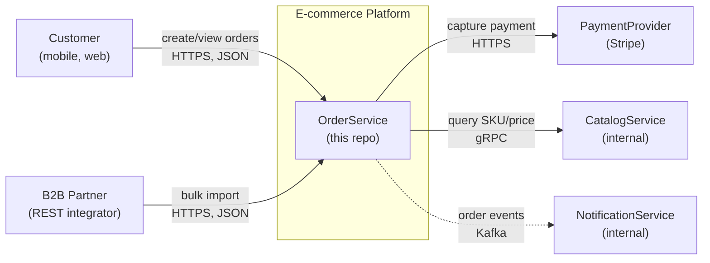
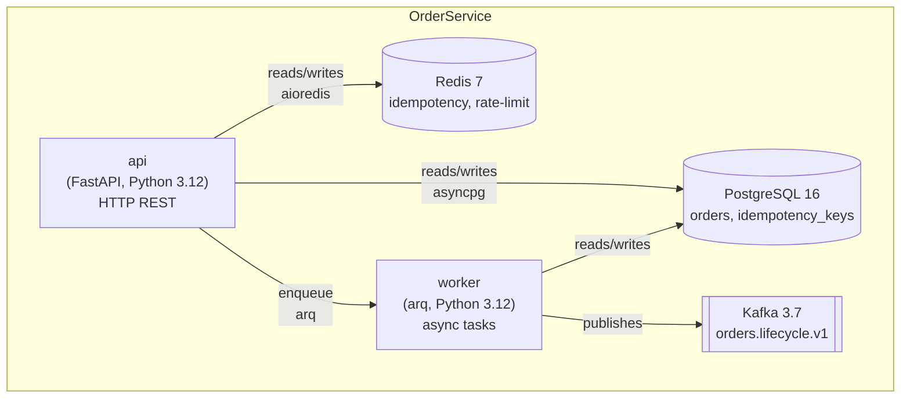
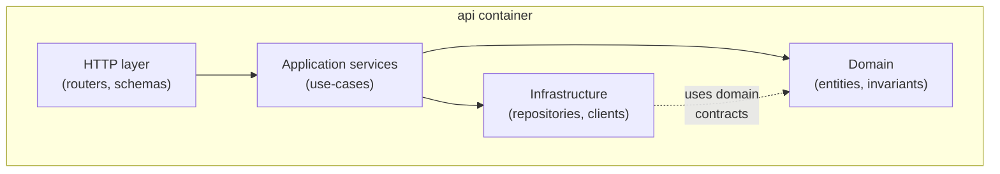

# Глава 6. Документация и архитектурные решения

> «Документация — это исполняемая память команды. Без неё каждое архитектурное решение принимается заново, каждый onboarding длится недели, каждый bus factor равен единице. AI ускоряет производство документов в 5–10×; обеспечивает ли это рост памяти команды — вопрос, который AI за вас не решит».

## Зачем эта глава

Главы 3–5 закрыли цикл «спроектировать — построить — отладить — защитить тестами». На выходе у команды есть рабочий MVP (глава 3), runbook'и и постмортемы (глава 4), регрессионный сюит и тестовые conventions (глава 5). Эта глава отвечает на следующий по очереди вопрос: **где и как живёт каноническая правда о системе**, чтобы новый инженер поднял проект за 15 минут, чтобы спор о выборе СУБД не повторялся в третий раз через год, чтобы AI-ассистент в IDE имел грамотный контекст, а не угадывал его.

Документация — это инженерная дисциплина, в которой AI даёт двусторонний эффект сильнее, чем где-либо ещё. Frontier-модель за 30 секунд сгенерирует 200-строчный README по структуре репозитория; за 5 минут — черновик ADR (Architecture Decision Record) по теме «MySQL vs PostgreSQL»; за 15 минут — OpenAPI-спецификацию из существующих контроллеров. Скорость впечатляет; качество без дисциплины — нет. Команды, которые принимают AI-генерированный README за документацию, через 3–6 месяцев обнаруживают одно и то же: README рассказывает «как должно быть» (а не «как сейчас работает»), ADR содержит обтекаемые фразы вместо trade-off'ов, API-документация описывает endpoint'ы, которых уже нет.

Кому эта глава адресована:

- **инженерам**, которые пишут продакшн-код и считают написание документации «не своей работой» — после этой главы документация становится частью PR'а, не пост-фактумной активностью;
- **тимлидам и техлидам**, отвечающим за onboarding, архитектурные решения и снижение bus factor — для вас здесь ADR-дисциплина и trade-off-карты;
- **engineering-менеджерам**, которые видят, как одни и те же архитектурные споры повторяются на каждом квартальном review — для вас здесь связь документации с Definition of Done и метриками delivery.

Что эта глава **не** делает: не учит технописанию как ремеслу (для этого есть Markel, «Technical Communication» и Diátaxis-фреймворк), не описывает корпоративные wiki-системы (Confluence/Notion/Outline — это инструмент, а не дисциплина), не претендует на полноту по архитектурному дизайну (Bass/Clements/Kazman, «Software Architecture in Practice», 4th ed., 2021 покрывает это). Здесь — про то, как **с AI** превратить минимальный набор артефактов (README, API-doc, ADR, диаграммы) в живой документ репозитория, который не протухает и который защищает team velocity на горизонте 12–24 месяцев.

Целевой уровень — middle/senior, прочитавший главы 1–5, имеющий опыт промышленной разработки на одном из бэкенд-стеков (Python/FastAPI или C#/.NET 8), знакомый с базовыми форматами Markdown, OpenAPI 3, Mermaid/PlantUML на уровне «видел диаграммы».

---

## 6.1 Документация как актив, не как обязанность: что AI меняет в экономике

> **TL;DR.** Документация — единственный артефакт репозитория, у которого **стоимость владения** заметно превышает стоимость создания: написать README за 1 час просто, поддерживать его актуальным 18 месяцев — задача другого порядка. AI снижает стоимость **создания** в 5–10× и стоимость **поддержки** в 1.5–2×; разрыв между ними не закрывается. Команда, которая не пересмотрела дисциплину, через 6 месяцев имеет в 3–5× больше документов и тот же процент устаревших — то есть формально-объёмную, но дезинформирующую документацию. Эта глава настраивает дисциплину так, чтобы AI ускорял **обе** стороны: и генерацию из источника правды (код, конфиги, реальные команды), и регулярную сверку с этим источником.

### Почему документация — актив и почему она устаревает

Документ в инженерной команде существует по трём причинам:

1. **Снижение bus factor.** Без документа знание о системе живёт в голове 1–3 человек. Уход одного — потеря 30–60% оперативного знания, восстановление через reverse engineering: 2–6 недель на средний сервис.
2. **Ускорение onboarding.** Без README инженер тратит 3–10 рабочих дней на то, чтобы поднять проект и понять его границы. С качественным README — 1–4 часа.
3. **Закрытие повторяющихся споров.** Без ADR один и тот же архитектурный выбор обсуждается на каждом квартальном review команды; среднее время обсуждения — 2–4 часа на 4–8 человек, итого 8–32 человеко-часа на эпизод. У средне-крупной команды таких эпизодов 6–10 в год.

Все три причины делают документ **активом** с измеримой отдачей. Но у актива есть стоимость владения: документ нужно обновлять при каждом изменении контракта, миграции, переименовании, удалении. Если стоимость поддержки превышает стоимость защиты — документ становится **пассивом**: его существование вреднее, чем отсутствие, потому что он дезинформирует.

> **Definition.** **Documentation rot (гниение документации)** — состояние, при котором документ формально существует, но описывает прошлое состояние системы. Симптомы: команды запуска не работают, env-переменные переименованы или удалены, диаграмма архитектуры не отражает 2 последних рефакторинга, ADR ссылается на отозванное решение без пометки «Superseded by».

Эмпирически: в репозитории без дисциплины ревизии 30–60% документов rot'нуты через 12 месяцев после написания. README протухает быстрее всего (медиана — 4–6 месяцев); ADR — медленнее (15–24 месяца), но ровно потому, что архитектурные решения сами устаревают медленнее.

### Что AI меняет в экономике документирования

AI смещает **обе** стороны уравнения, но несимметрично:

| Стадия | До AI | С AI без дисциплины | С AI и дисциплиной этой главы |
|--------|-------|----------------------|-------------------------------|
| Создание README | 2–4 часа на средний сервис | 10–30 минут (черновик из репо) | 30–60 минут (черновик + ручная верификация) |
| Создание ADR | 1–3 часа | 15–40 минут (черновик из дискуссии) | 1–2 часа (черновик + trade-off-сверка) |
| OpenAPI из контроллеров | 4–8 часов вручную | автогенерация + AI-описания | автогенерация + AI-описания + ручная сверка контракта |
| Поддержка README | 30–60 мин на ревизию | 10–20 мин (auto-diff vs current state) | 15–30 мин (diff + интеграция в DoD) |
| % rot'нутых через 12 мес | 30–60% | 40–70% (документов больше, дисциплины — нет) | 10–20% (документация связана с источником правды) |

Третий столбец — то, к чему ведёт остаток главы. Заметьте: **«с AI без дисциплины» хуже, чем «до AI»** по доле rot'нутых документов. Это не парадокс — это прямое следствие того, что AI ускоряет производство, а не верификацию. Команда без дисциплины утроила объём документов, не нарастив привычку их сверять.

### Документация как input для AI: инструменты читают то, что вы пишете

Дополнительный сдвиг 2024–2026 годов: документация стала **input'ом** не только для людей, но и для AI-инструментов. Cursor, Claude Code, GitHub Copilot Chat, Aider — все они подгружают `README.md`, `AGENTS.md`, `CONTRIBUTING.md`, OpenAPI-схемы, ADR в контекст промпта. Качество этой документации напрямую влияет на качество AI-ответов в IDE.

> **Definition.** **`AGENTS.md`** _[as of 2025]_ — конвенциональный файл в корне репозитория, описывающий правила работы AI-агентов в проекте: предпочитаемые библиотеки, conventions, запрещённые операции, контракты тестирования, стиль коммитов. Аналог `CONTRIBUTING.md` для AI-инструментов; читается большинством IDE-агентов автоматически. Подробнее — глава 3, §3.8.

Эмпирически: в репозитории с актуальным `AGENTS.md` качество AI-ответов (по subjective rating senior-инженеров на типовых задачах) выше на 15–35%, чем в репозитории без него — при той же модели и тех же промптах. Это **второй** аргумент в пользу дисциплины, помимо людей: документация — общий протокол, на котором вы говорите и с командой, и с AI-инструментами.

### Что это значит для практика

Если в вашей команде разговор о документации сводится к «нам нужно писать больше документов», вы измеряете не то. Измерять надо: **time-to-first-commit** для нового инженера (час, не дни), **doc-rot rate** (доля документов, в которых команды/факты не работают), **% повторяющихся архитектурных дискуссий** (должно стремиться к нулю при наличии ADR), **AGENTS.md coverage** (есть ли свежий файл и используется ли он AI-инструментами команды). AI без этих метрик ускоряет производство; не ускоряет производство **полезной** документации.

> **See also.** §6.2 (где живёт правда: doc-as-code) · §6.3 (README как самый протухающий артефакт) · §6.5 (ADR как медленно устаревающий артефакт) · §6.9 (как бороться с doc rot системно) · Глава 3, §3.8 (AGENTS.md в контексте кодогенерации) · Глава 5, §5.10 (test conventions в `AGENTS.md`).

---

## 6.2 Doc-as-Code и единый источник правды: где живёт каноническая документация

> **TL;DR.** Документация делится на два класса: **продуктовая** (для пользователя API, end-customer'а) и **инженерная** (для команды и для AI-инструментов). Инженерная документация в 2026 году хранится в репозитории рядом с кодом, в Markdown, под Git-версионированием, с обязательным review в PR. Это паттерн **doc-as-code**: документация — такой же артефакт, как код, со своим CI, lint'ингом и review-checklist'ом. Альтернатива — wiki вне репо (Confluence, Notion) — приемлема только для продуктовой документации; для инженерной даёт rot'у в 2–3× быстрее. Минимальный набор артефактов в репозитории: `README.md`, `AGENTS.md`, `docs/adr/*.md`, `openapi.yaml` (или эквивалент), `docs/architecture.md` с C4-диаграммами в Mermaid.

### Doc-as-code: основной паттерн инженерной документации

> **Definition.** **Doc-as-code** — практика, в которой документация хранится в том же репозитории, что и код; пишется в lightweight markup-форматах (Markdown, AsciiDoc, reStructuredText); редактируется через Pull Request с обязательным review; собирается и публикуется через CI как сайт или статические страницы (MkDocs, Docusaurus, Sphinx, Antora, mdBook). Введена в практику примерно в 2014–2016 годах в Write the Docs community и закреплена в работах Anne Gentle («Docs Like Code», 2017).

Преимущества по сравнению с wiki-системами вне репозитория:

- **Атомарность изменения.** Один PR содержит и изменение кода, и обновление документа. Невозможно «забыть обновить README»: review его явно требует.
- **Версионирование.** История документа = история кода. Можно откатить документ к моменту релиза 1.4 и увидеть, как он выглядел тогда.
- **Review-дисциплина.** Документ проходит тот же review, что и код: на корректность, ясность, обратную совместимость.
- **Локальная редактируемость.** Инженер правит документ в своём IDE рядом с кодом, в той же ветке, без переключения контекста на отдельную систему.
- **AI-readability.** AI-агенты в IDE подхватывают Markdown в репо автоматически. Wiki вне репо — нет (без специальной интеграции).

Недостатки:

- **Markdown ограничен по визуальной выразительности.** Сложные схемы — через Mermaid/PlantUML или внешние SVG (см. §6.7).
- **Не подходит для нетехнической аудитории.** Маркетологу не нужна `git checkout` для редактирования продуктового onboarding-гайда.
- **Поиск ограничен возможностями репо.** Confluence имеет встроенный enterprise-search; GitHub-search кода работает иначе.

> **Уточнение.** Doc-as-code не противоречит wiki: продуктовая документация (для конечного пользователя), бизнес-процессы, HR-процедуры, корпоративные политики — остаются в Confluence/Notion. **Инженерная** документация (всё, что описывает систему изнутри для разработчика) — в репо.

### Минимальный набор артефактов на 2026 год

Для среднего MVP-сервиса (15–50 KLOC) канонический набор инженерных артефактов в репозитории:

```text
.
├── README.md                    # Quick start, базовые сценарии — §6.3
├── AGENTS.md                    # Правила для AI-инструментов — §6.2 ниже
├── CONTRIBUTING.md              # Правила для разработчиков — стандартные
├── CHANGELOG.md                 # Версионная история — формат Keep a Changelog
├── LICENSE
├── openapi.yaml                 # Для HTTP API — §6.4
├── docs/
│   ├── architecture.md          # C4-диаграммы и обзор — §6.7
│   ├── runbook.md               # On-call инструкции — глава 4, §4.9
│   ├── postmortems/             # Постмортемы инцидентов — глава 4, §4.10
│   │   └── 2026-03-12-pg-replica-lag.md
│   └── adr/                     # Architecture Decision Records — §6.5
│       ├── 0001-record-architecture-decisions.md
│       ├── 0002-choose-postgresql-over-mysql.md
│       └── 0003-event-sourcing-for-orders.md
├── src/
└── tests/
```

Это **минимум**. Многие команды добавляют `docs/api-design-guide.md`, `docs/security-considerations.md`, `docs/deployment.md` — они полезны, но не обязательны на старте.

Каждый из этих файлов — отдельный артефакт с отдельной анатомией, которую разбирают следующие разделы.

### `AGENTS.md`: канонический протокол для AI-инструментов

`AGENTS.md` — относительно новый артефакт, появившийся как convention в 2024 году и закрепившийся к 2025–2026 как стандарт для проектов, активно использующих AI-агентов в разработке.

Минимальный полезный `AGENTS.md` содержит:

```markdown
# AGENTS.md

## Stack
- Backend: Python 3.12 + FastAPI 0.110 + SQLAlchemy 2.0 + Alembic
- DB: PostgreSQL 16 (asyncpg)
- Tests: pytest 8 + hypothesis + testcontainers
- Lint: ruff (line-length=100), mypy --strict
- Pkg manager: uv (никогда pip/poetry в этом репо)

## Conventions
- Все public-функции — type-hinted; `from __future__ import annotations` в каждом файле.
- Async везде; sync-блокировки разрешены только в migrations и в CLI-скриптах.
- Pydantic v2 для DTO; SQLAlchemy ORM для persistence; маппинг — явный.
- Тесты: AAA + observable behavior (см. CONVENTIONS.md, §Testing).

## Don'ts
- Не использовать Flask, Django, Tornado — только FastAPI.
- Не использовать `print` для логирования — только `structlog`.
- Не комментировать очевидное; комментарии — только для non-obvious intent.
- Не модифицировать `migrations/versions/*.py` после merge.

## Test commands
- `make test` — unit + integration через testcontainers.
- `make lint` — ruff + mypy.
- `make mutation` — Stryker-эквивалент (mutmut) на изменённых файлах.

## Definition of Done
- Все тесты зелёные; coverage не упал; mutation score core ≥ 70%.
- README обновлён, если изменился quick-start.
- ADR создан, если изменилось архитектурное решение (см. docs/adr/template.md).
```

Эмпирический эффект: AI-агент в IDE с актуальным `AGENTS.md` в 70–80% случаев предлагает совместимый со стилем код с первой попытки; без `AGENTS.md` — в 30–50%. Разница — это сэкономленные итерации review.

> **Pitfall.** `AGENTS.md` без update'а превращается в **ложный учитель**: AI продолжает следовать декларациям, которые команда неявно отозвала (например, всё ещё генерирует Pydantic v1, хотя репо мигрировал на v2). Признак: «странные» предложения AI, которые соответствуют документу, но не соответствуют реальному коду. Антидот — обновлять `AGENTS.md` в том же PR, что и стек-изменение, и иметь автоматический `agents-md-freshness` чек в CI: дата последнего изменения `AGENTS.md` не должна отставать от даты последнего изменения `pyproject.toml` / `*.csproj` / `Cargo.toml` больше, чем на 30 дней.

### Где документация **не** должна жить

Антипаттерны размещения, которые встречаются в командах среднего размера:

| Место | Проблема | Что вместо |
|-------|----------|-------------|
| Comments в коде с длинными объяснениями архитектуры | Коммент не читают вне контекста файла; rot'ает быстрее всего | `docs/architecture.md` + ADR |
| Ссылка на Confluence-страницу в `README.md` | Двойной источник правды; команда не знает, какой канонический | Содержимое в репо; в Confluence — ссылка обратно, если нужно для не-инженеров |
| Документ только в Slack-pinned message | Не индексируется, не review'ится, теряется при смене канала | ADR или `docs/decisions/` |
| Email с архитектурным решением | То же + не находится поиском | ADR, обязательно |
| Внутренний Notion-doc, который «все знают» | Bus factor 1; новичок не знает о существовании | В репо как ссылка минимум |

### Что это значит для практика

Если документация вашего проекта живёт в трёх местах (репо + Confluence + Slack) — это не три источника, это **ноль источников правды**: в случае расхождения никто не знает, какой источник считать каноническим. Минимальный шаг: один документ — одно место. Инженерная документация — в репо. Продуктовая — в Confluence. Ссылки между ними — explicit, не «все знают, где это». AI-агенты в IDE при таком устройстве работают с большим contextual recall и меньше галлюцинируют о структуре проекта.

> **See also.** §6.3 (анатомия README как первого read'а в репо) · §6.5 (ADR как канонический файл архитектурных решений) · §6.7 (где хранить диаграммы) · Глава 3, §3.8 (AGENTS.md в контексте генерации кода) · Глава 5, §5.10 (test conventions внутри AGENTS.md).

---

## 6.3 README, который реально поднимает проект за 15 минут

> **TL;DR.** README — самый протухающий артефакт репозитория и одновременно самый высокоотдачный для onboarding. Хороший README отвечает на пять вопросов в первых трёх экранах: что это, как запустить за 5 минут, какие env-переменные, как проверить «работает», куда идти дальше. Длина — 150–400 строк для среднего сервиса; всё длиннее — выносится в `docs/`. AI генерирует приличный черновик из структуры репо, `Makefile`, `docker-compose.yml`, `.env.example` и тестов; финальное качество определяется ручной верификацией: вы сами проходите README с чистого checkout и фиксируете каждую точку, на которой запинались. Цель верификации — **time-to-first-success ≤ 15 минут** для нового инженера на стандартной машине команды.

### Пять вопросов, на которые отвечает README

Канонический минимум, после Tom Preston-Werner («Readme Driven Development», 2010) и более поздних практик:

1. **Что это.** Одно-два предложения: тип проекта (HTTP-сервис / CLI / библиотека), его назначение в системе, основные потребители.
2. **Как запустить локально.** Команды за 5 минут от `git clone` до running instance. Никаких «настройте локально PostgreSQL» — только команды.
3. **Какие переменные окружения.** Полный список с дефолтами и пометкой обязательности; `.env.example` рядом.
4. **Как проверить, что запустилось.** Health-check, smoke-команда, ожидаемый ответ.
5. **Куда идти дальше.** Ссылки на `docs/architecture.md`, OpenAPI, ADR, runbook, CONTRIBUTING.

Всё, что не отвечает на эти пять вопросов в первых трёх экранах, — выносится в `docs/`.

### Каноническая структура

Шаблон `README.md` для backend-сервиса, проверенный на десятках команд:

```markdown
# OrderService

Service-of-record for customer orders in the e-commerce platform.
Provides REST API for order lifecycle (create, pay, fulfill, cancel)
and emits domain events to Kafka for downstream consumers.

- **Stack**: Python 3.12, FastAPI, PostgreSQL 16, Kafka 3.7
- **Owners**: @team-orders (Slack: #team-orders)
- **SLO**: p99 < 200 ms, error rate < 0.1% on /orders endpoints

## Quick start (5 min)

Prerequisites: Docker Desktop ≥ 24, Make, uv ≥ 0.4.

```bash
git clone git@github.com:acme/order-service.git
cd order-service
cp .env.example .env
make up        # docker-compose up: pg, kafka, kafka-ui
make migrate   # alembic upgrade head
make seed      # 5 fixtures for local dev
make run       # uvicorn on http://localhost:8000
```

Open http://localhost:8000/docs (Swagger UI) and call `GET /orders/health`.
Expected: `{"status":"ok","db":"ok","kafka":"ok"}`.

## Environment variables

| Var | Required | Default | Notes |
|-----|----------|---------|-------|
| `DATABASE_URL` | yes | — | postgresql+asyncpg://... |
| `KAFKA_BROKERS` | yes | — | comma-separated host:port |
| `LOG_LEVEL` | no | INFO | DEBUG / INFO / WARNING / ERROR |
| `OTEL_EXPORTER_OTLP_ENDPOINT` | no | — | OTLP-collector for traces |

Secrets are managed via Vault in non-local envs; see `docs/deployment.md`.

## Smoke test

```bash
curl -X POST http://localhost:8000/orders \
  -H 'Content-Type: application/json' \
  -d '{"customer_id":"c-1","items":[{"sku":"S-1","qty":2}]}'
# => 201 Created, Location: /orders/<uuid>
```

If you got 201 — local stack is healthy.

## Where to go next

- [Architecture overview](docs/architecture.md) — C4 L1/L2 diagrams, component boundaries.
- [API reference](http://localhost:8000/docs) — generated from FastAPI / OpenAPI 3.
- [ADR index](docs/adr/) — architecture decisions and their context.
- [Runbook](docs/runbook.md) — on-call playbook.
- [CONTRIBUTING](CONTRIBUTING.md) — branching, commit conventions, PR template.
- [AGENTS.md](AGENTS.md) — rules for AI tooling.

## Known limitations

- No idempotency keys on POST /orders yet — see [ADR-0007](docs/adr/0007-idempotency.md).
- Kafka consumer is at-least-once; deduplication is consumer's responsibility.
- Local seeds do not cover multi-currency orders.
```

Заметьте: 90 строк, пять блоков, ноль маркетинга, все команды воспроизводимы. Это и есть «hard target».

### Что AI делает хорошо и плохо при генерации README

**Хорошо:**

- Структура и заголовки — модель знает каноническую форму.
- Извлечение команд из `Makefile` / `package.json` / `pyproject.toml`.
- Список env-переменных из `.env.example` или `os.getenv`-вызовов в коде.
- Описание endpoint'ов из OpenAPI или FastAPI/Express-роутов.
- Stack из `pyproject.toml` / `*.csproj` / `package.json`.

**Плохо:**

- Различение «как должно быть» vs «как сейчас работает». Модель пишет в правдоподобном будущем времени, а не в воспроизводимом настоящем.
- SLO, owners, контактные данные — модель **галлюцинирует** их, если не дать явно.
- Known limitations — модель не знает их без contextual hint'а; нужно подкормить трекером багов или явно перечислить.
- Smoke-тест с конкретным response body — модель угадывает структуру, нужно сверять с реальным запуском.

> **Pitfall.** AI-сгенерированный README часто содержит фразу «See documentation for more details» с ссылкой на несуществующий документ. Это **рудимент обучающей выборки**: модель видела миллионы README с этим оборотом. На review удаляйте такие ссылки или превращайте их в реальные.

### Промпт-шаблон для AI-генерации README

Пять блоков, каждый — обязательный:

```text
[ROLE] Senior backend engineer, опыт onboarding в командах 10–50 человек.

[CONTEXT]
- Repo structure: [tree -L 2 output]
- pyproject.toml: [contents]
- Makefile: [contents]
- .env.example: [contents]
- Main entrypoint: [src/app/main.py contents]
- Existing OpenAPI: [openapi.yaml contents, если есть]

[TASK]
Сгенерируй README.md по структуре:
1. One-paragraph description (что делает сервис, кто потребители).
2. Stack (одна строка, без markdown-таблиц).
3. Owners + SLO (если SLO неизвестен — placeholder TODO, не выдумывай число).
4. Quick start (5 min target). Только команды из Makefile; никаких инструкций "set up Postgres".
5. Environment variables — таблица из .env.example.
6. Smoke test — один curl или httpie с реальным endpoint из роутов; expected response — placeholder, я проверю.
7. Where to go next — ссылки только на файлы, которые существуют (см. tree).
8. Known limitations — placeholder TODO, я заполню сам.

[CONSTRAINTS]
- 100–150 строк итог.
- Все команды должны быть исполняемы as-is.
- Никаких "magic", "easily", "powerful" — нейтральный инженерный язык.
- Не выдумывай URL, версии, имена людей, метрики.
- Где данных нет — TODO с явной пометкой.

[OUTPUT FORMAT]
Markdown, готовый для commit'а.
```

Эмпирически: на этом промпте frontier-модель генерирует README, требующий 15–30 минут ручной правки. На наивном промпте «сгенерируй README для этого репо» — 1.5–3 часа правки.

### Верификация README: «холодный onboarding» как обязательная процедура

Главная проверка качества README — не review коллегой, а **холодный прогон**: вы (или, лучше, новый инженер команды) делаете `git clone` в чистую папку и идёте по README пошагово, фиксируя каждое место, где:

- команда не работает as-is;
- требуется неявное знание (например, «нужно сгенерировать SSH-ключ для bitbucket»);
- ожидаемый ответ не совпадает с фактическим;
- инструкция отсылает к несуществующему файлу.

Каждое такое место — багфикс README. Цель — **time-to-first-success ≤ 15 минут**. Это число выбрано не случайно: 15 минут — типичный лимит attention'а нового инженера, до которого онboarding ощущается как «работающий», после которого — как «сломанный».

> **Definition.** **Time-to-first-success (TTFS)** — время от момента, когда новый инженер начал работать с репозиторием, до момента, когда он получил первый успешный smoke-результат (например, 201-ответ от API, прошедший локальный тест, собранный артефакт). Метрика onboarding-качества; зависит от README на 60–80%.

Команды, серьёзно подходящие к onboarding, делают **холодный прогон** ежеквартально на чистой VM/контейнере и обновляют README по результатам. Это — единственный способ удерживать TTFS на 15 минутах в течение 12+ месяцев.

### Что это значит для практика

README — единственный документ, который вы должны **проходить руками** регулярно. Не «просматривать», не «review'ить» — а делать `git clone` и идти по нему, как новый инженер. AI ускоряет первый черновик и периодические update'ы, но не заменяет холодный прогон. Если в последний раз вы сами поднимали проект по своему же README больше 3 месяцев назад — README протух с вероятностью 50–70%. Это эвристика, не статистика, но она работает.

> **See also.** §6.2 (где живёт README) · §6.4 (как README ссылается на API-доку) · §6.9 (системная борьба с doc rot) · §6.10 (демо «холодный onboarding» на занятии) · Глава 3, §3.8 (Makefile/pyproject.toml как input для README-генерации) · Глава 4, §4.9 (runbook как parallel-артефакт).

---

## 6.4 API-документация: OpenAPI, doc-comments, Diátaxis-разделение

> **TL;DR.** API-документация на 2026 год — это **не один документ**, а четыре пересекающихся артефакта по фреймворку Diátaxis (Procida): tutorial, how-to, reference, explanation. **Reference** для HTTP API генерируется из OpenAPI 3.x автоматически (Swagger UI / Redoc / Scalar) — это решённая инженерная задача; AI здесь полезен только для **описаний** (summary, descriptions, examples), не для структуры. **How-to** и **tutorial** — это `docs/guides/` в Markdown; AI генерирует приличный черновик из реальных запросов. **Explanation** (concept-документация о модели данных, инвариантах, lifecycle ресурсов) — самая сложная для AI, требует ручной формулировки и review. AsyncAPI 3.x — стандарт для event-driven API _(as of 2026)_; gRPC документируется через protobuf-комментарии и buf.build/Connect docs. Главная ошибка команд — генерировать только reference и считать API «задокументированным»: reference отвечает на «что», но не на «как» и «зачем».

### Diátaxis: четыре типа документации

> **Definition.** **Diátaxis** (Procida, 2017+) — фреймворк, разделяющий техническую документацию на четыре независимых типа по двум осям: «практическое vs теоретическое» × «обучающее vs справочное». Четыре типа: **tutorial** (обучает практике, шаг за шагом), **how-to** (решает конкретную задачу), **reference** (точное описание интерфейса), **explanation** (объясняет «почему»). Каждый тип — отдельный жанр со своими правилами; смешение типов — главный источник неудобной документации.

Практическое разделение для API-документации:

| Тип | Аудитория | Пример | Кто пишет / генерирует |
|-----|-----------|--------|------------------------|
| Tutorial | Новый интегратор | «Создайте свой первый order» — пошагово, с copy-paste | Ручная работа, AI-черновик из реальных запросов |
| How-to | Знакомый интегратор | «Как реализовать idempotent retries» | Ручная работа на основе реальных кейсов |
| Reference | Любой пользователь API | OpenAPI / Swagger UI | **Автогенерация из кода + AI для descriptions** |
| Explanation | Архитектор / senior-интегратор | «Почему order имеет 7 статусов и какой инвариант между ними» | Ручная работа, частично AI |

Команды, которые генерируют только Swagger UI, отвечают на «какие endpoint'ы есть»; не отвечают на «как этим пользоваться» и «почему так устроено». Это — главная причина, по которой интеграторы пишут в support: «у вас в документации всё есть, но непонятно, с чего начать».

### Reference: OpenAPI 3.x как канон

OpenAPI Specification (бывший Swagger) — стандарт-2026 для REST/HTTP API. Формат: YAML или JSON, генерируется одним из двух способов:

1. **Code-first.** Спецификация генерируется из кода (FastAPI, ASP.NET Core, NestJS, Spring Boot). Это **доминирующий** паттерн: один источник правды, документация всегда совпадает с кодом.
2. **Spec-first.** Спецификация пишется руками первой, код генерируется из неё. Применяется в API-first организациях (платформы, открытые API), требует жёсткой дисциплины.

Code-first пример (FastAPI):

```python
from fastapi import FastAPI, HTTPException, status
from pydantic import BaseModel, Field
from uuid import UUID

app = FastAPI(title="OrderService", version="1.4.0")

class OrderItem(BaseModel):
    sku: str = Field(..., description="Stock-keeping unit, regex: ^[A-Z0-9-]{3,20}$")
    qty: int = Field(..., ge=1, le=999, description="Items count, 1..999")

class CreateOrderRequest(BaseModel):
    customer_id: str
    items: list[OrderItem] = Field(..., min_length=1, max_length=50)

class OrderCreated(BaseModel):
    id: UUID
    status: str = Field(..., examples=["pending"])

@app.post(
    "/orders",
    status_code=status.HTTP_201_CREATED,
    response_model=OrderCreated,
    summary="Create order",
    description=(
        "Creates a new order in `pending` status. "
        "Idempotency: pass header `Idempotency-Key` to deduplicate retries within 24h."
    ),
    responses={
        201: {"description": "Order created"},
        400: {"description": "Validation error"},
        409: {"description": "Duplicate Idempotency-Key with different body"},
    },
)
async def create_order(req: CreateOrderRequest) -> OrderCreated:
    ...
```

Pydantic-модели + `summary` + `description` + `responses` дают на выходе OpenAPI с метаданными, достаточными для генерации Swagger UI без дополнительных усилий. Это — пример, где AI **полезен**: описать `description` и `examples` для каждого field'а вручную в большой схеме — 1–2 человеко-дня; с AI — 1–2 часа.

C# / ASP.NET Core 8 эквивалент:

```csharp
[HttpPost]
[ProducesResponseType(typeof(OrderCreated), StatusCodes.Status201Created)]
[ProducesResponseType(StatusCodes.Status400BadRequest)]
[ProducesResponseType(StatusCodes.Status409Conflict)]
[EndpointSummary("Create order")]
[EndpointDescription(
    "Creates a new order in `pending` status. " +
    "Idempotency: pass header `Idempotency-Key` to deduplicate retries within 24h.")]
public async Task<IActionResult> Create([FromBody] CreateOrderRequest req) { ... }

public record CreateOrderRequest(
    [property: Required, RegularExpression("^[A-Z0-9-]{3,20}$")] string CustomerId,
    [property: MinLength(1), MaxLength(50)] OrderItem[] Items);

public record OrderItem(
    [property: Required] string Sku,
    [property: Range(1, 999)] int Qty);
```

Swashbuckle / NSwag из этих атрибутов соберут OpenAPI; Swagger UI / Scalar / Redoc — отрисуют.

> **Pitfall.** AI-генерированные `description` часто содержат **тавтологии**: для поля `customer_id` модель пишет «The customer ID». Это бесполезный текст, занимающий место. Правильное `description` отвечает на: формат (regex), границы (min/max), последствия передачи неправильного значения (404 vs 400), связь с другими полями (например, «должен совпадать с `customer.id` в JWT»). AI способен на это, но **только** если в промпте прописаны явные требования.

### Reference vs how-to: где документировать idempotency

Самый частый разрыв в API-документации — между «есть endpoint POST /orders» (reference) и «как делать retries без дубликатов» (how-to). Reference покажет header `Idempotency-Key`; не покажет, как его генерировать (UUID v4? Hash от тела? Per-attempt vs per-business-operation?), что произойдёт при истечении 24-часового окна, что произойдёт при коллизии с другим телом.

Это — задача для `docs/guides/idempotent-retries.md`, не для OpenAPI:

```markdown
# Idempotent retries

Если ваш HTTP-клиент повторяет запросы (timeout, 5xx, network blip),
без `Idempotency-Key` каждый retry создаёт новый order. Это редко то, что вам нужно.

## Как генерировать ключ

- **Per-business-operation.** Один UUID v4 на одну попытку оформить заказ; повторите тот же UUID на каждом retry той же операции.
- **Не** генерируйте новый UUID на каждом сетевом retry — это эквивалентно отсутствию ключа.

## Как себя ведёт сервер

| Сценарий | Ответ |
|----------|-------|
| Первый запрос с ключом X, success → 201 | сохраняем (key=X, response=201, body=...) на 24ч |
| Повтор с тем же X и тем же телом | возвращаем сохранённый 201 (no DB write) |
| Повтор с тем же X и **другим** телом | 409 Conflict с `error: idempotency_key_conflict` |
| Запрос с X через 25 часов | новый order |

## Пример клиента (Python, httpx)

```python
import httpx, uuid, asyncio

async def create_order_with_retry(payload: dict, max_attempts: int = 3) -> dict:
    key = str(uuid.uuid4())  # один на бизнес-операцию
    for attempt in range(max_attempts):
        try:
            async with httpx.AsyncClient() as c:
                r = await c.post(
                    "https://api.example.com/orders",
                    json=payload,
                    headers={"Idempotency-Key": key},
                    timeout=5.0,
                )
                r.raise_for_status()
                return r.json()
        except (httpx.TransportError, httpx.HTTPStatusError) as e:
            if attempt == max_attempts - 1:
                raise
            await asyncio.sleep(2 ** attempt)
```
```

How-to отвечает на конкретный вопрос конкретного интегратора. AI генерирует приличный черновик how-to за минуту из вашего OpenAPI и описания бизнес-логики — **если** контекст промпта включает реальное поведение сервера (а не догадки модели о том, что бывает в подобных API).

### AsyncAPI и event-driven документация

> **Versioned facts.** AsyncAPI 3.x _(as of 2026)_ — стандарт для документирования event-driven систем (Kafka, RabbitMQ, MQTT, WebSocket). YAML/JSON-формат, аналогичный OpenAPI; рендерится через AsyncAPI Studio или Stoplight. Менее зрелый по экосистеме (особенно генераторы клиентов), но единственный широко принятый стандарт.

Минимальный пример AsyncAPI 3 для Kafka-топика:

```yaml
asyncapi: 3.0.0
info:
  title: OrderService events
  version: 1.4.0

channels:
  orders.lifecycle:
    address: orders.lifecycle.v1
    messages:
      orderCreated:
        $ref: '#/components/messages/OrderCreated'
      orderPaid:
        $ref: '#/components/messages/OrderPaid'

operations:
  publishOrderEvents:
    action: send
    channel:
      $ref: '#/channels/orders.lifecycle'

components:
  messages:
    OrderCreated:
      payload:
        type: object
        required: [event_type, order_id, customer_id, occurred_at]
        properties:
          event_type:
            const: order.created
          order_id:
            type: string
            format: uuid
          customer_id:
            type: string
          occurred_at:
            type: string
            format: date-time
```

Команды, использующие Kafka/RabbitMQ без AsyncAPI, документируют события в произвольном Markdown — это работает на двух событиях, перестаёт работать на двадцати.

### gRPC и Protobuf-документация

Для gRPC-API канон — комментарии в `.proto`-файлах, рендеримые через `protoc-gen-doc` или buf.build/Connect docs:

```protobuf
// OrderService manages customer orders.
//
// Lifecycle: pending -> paid -> fulfilled -> closed.
// Cancellation allowed in pending and paid (refund follows).
service OrderService {
  // Creates a new order in `pending` status.
  // Idempotency: pass `Idempotency-Key` metadata.
  rpc CreateOrder(CreateOrderRequest) returns (Order);
}

message CreateOrderRequest {
  // Customer identifier; must match authenticated user in JWT.
  string customer_id = 1;
  // Order line items; 1..50 per order.
  repeated OrderItem items = 2;
}
```

AI-полезность здесь та же, что для OpenAPI: писать `description` и `examples`. Структура (типы, поля, RPC) — из самого `.proto`.

### Что AI делает хорошо и плохо для API-доки

**Хорошо:**

- Заполнение `description`, `summary`, `examples` для OpenAPI/AsyncAPI/Protobuf по уже существующей структуре.
- Генерация **черновика** how-to из реальных curl-запросов в логах или integration-тестах.
- Генерация client-code-samples на 5–8 языках (Python, JS, Go, Java, C#, curl).
- Описание error-codes таблицей.

**Плохо:**

- **Архитектурный invariant** между ресурсами (lifecycle, причинно-следственные связи) — модель **угадывает**, не знает.
- **Версионирование контракта** (deprecated since 1.3, breaking in 2.0) — нужно указать вручную.
- **Авторизация и tenant-scoping** — модель часто пишет наивную модель «у каждого user есть JWT», игнорируя реальные RBAC/ABAC.
- **Rate limiting и quotas** — модель не знает ваших политик.

### Что это значит для практика

API-документация — не один файл, а **четыре жанра**. Reference автогенерируется и поддерживается дисциплиной кода (тип, decorator, описание); how-to и explanation пишутся руками с AI-черновиком; tutorial — самый трудоёмкий, но самый ценный для нового интегратора. Команда, у которой есть только Swagger UI, формально задокументирована и фактически — нет: интеграторы тратят те же 3–5 дней на «понять, как с этим работать», что и без документации. AI ускоряет каждый из четырёх жанров, но не заменяет жанровую дисциплину.

> **See also.** §6.5 (ADR на API-design-решения: например, idempotency model) · §6.6 (архитектурные обсуждения: как принять решение об RPC vs REST) · §6.7 (диаграмма event-flow для AsyncAPI) · Глава 3, §3.4 (генерация API-контроллеров с docstrings) · Глава 5, §5.9 (integration-тесты как живая «спецификация» поведения).

---

## 6.5 ADR (Architecture Decision Records): анатомия, MADR, место в репозитории

> **TL;DR.** ADR — короткий (1–2 страницы) Markdown-документ, фиксирующий **одно** архитектурное решение, его контекст, рассмотренные варианты и последствия. Введён Michael Nygard (2011); канонический lightweight-формат — MADR (Markdown ADR) на 2026 год. ADR живут в `docs/adr/NNNN-kebab-case-title.md`, нумеруются последовательно и **никогда** не редактируются после merge: новое решение, отменяющее старое, — это новый ADR со статусом `Supersedes ADR-NNNN`. AI генерирует приличный черновик ADR из транскрипта обсуждения и текущего состояния кода; критическая часть, которую AI **не** делает за вас, — это честная trade-off-карта (см. §6.6) и формулировка **последствий** (consequences) с пометкой ожидаемого пересмотра.

### Зачем ADR существует

Без ADR архитектурное решение живёт в трёх местах: чат-логе обсуждения, Jira-комментарии, головах участников. Через 6–12 месяцев происходит одно из:

- Команда обсуждает то же самое решение заново, потому что обоснование забылось.
- Новый инженер делает изменение, противоречащее решению, потому что не знал о нём.
- Решение признаётся ошибочным, но никто не помнит, **почему** оно было принято — и тот же argument приводит к той же ошибке.

ADR закрывает все три риска одним артефактом. Цена — 30–60 минут на запись после принятия решения; экономия — десятки часов будущих обсуждений.

> **Definition.** **Architecture Decision Record (ADR)** — Nygard, 2011: короткий immutable-документ, фиксирующий контекст, решение и последствия одного архитектурного выбора. Принципы: **immutable** (после merge не редактируется), **single-decision** (одно решение — один документ), **status-tracked** (Proposed / Accepted / Deprecated / Superseded by ADR-N).

### MADR-формат (Markdown ADR)

> **Definition.** **MADR (Markdown Any Decision Records)** _[as of 2026]_ — lightweight Markdown-формат для ADR, открытый стандарт (https://adr.github.io/madr/). Текущая версия — 4.0; используется по умолчанию в большинстве open-source проектов и многих корпоративных репозиториях.

Минимальный шаблон MADR 4:

```markdown
---
status: Accepted
date: 2026-04-12
deciders: ["@yury", "@arch-team"]
consulted: ["@security", "@sre"]
informed: ["#team-orders"]
---

# ADR-0007. Idempotency keys for POST /orders

## Context and Problem Statement

Клиенты (mobile, web, B2B-партнёры) повторяют POST /orders при сетевых сбоях.
В 2025-Q4 это привело к 1340 дубликатам order'ов (~0.6% от всех POST), 
ручной откат — 2 человеко-дня в инциденте 2025-12-03.

Нужно решить: как обеспечить идемпотентность POST-операций?

## Decision Drivers

- DD1: SLO error rate < 0.1% включая логические ошибки (дубликаты).
- DD2: Минимальное изменение клиентского контракта (мы не контролируем mobile-клиентов).
- DD3: Стоимость разработки ≤ 5 человеко-дней.
- DD4: Совместимость с существующим CDN/API-gateway (CloudFront).

## Considered Options

1. **Idempotency-Key header** (Stripe-style)
2. **Content-based deduplication** (hash от body + customer_id)
3. **Request log с TTL и server-side dedup**
4. **Не делать ничего, оставить откаты на клиента**

## Decision Outcome

**Выбрано: Option 1 — Idempotency-Key header**, потому что:

- Совместимо с существующими клиентами через optional header (DD2).
- Стандартный паттерн (Stripe, AWS), интеграторы знакомы.
- ~3 человеко-дня на реализацию (DD3).
- Работает on-edge на CloudFront (DD4).

### Consequences

**Положительные:**
- Дубликаты с тем же ключом возвращают сохранённый ответ за < 5 ms (Redis-cache).
- Чёткий контракт ошибки на коллизии: 409 Conflict с error_code.

**Отрицательные:**
- Дополнительная Redis-инфраструктура (TTL=24h на ключ).
- Клиенты, не передающие Idempotency-Key, остаются уязвимы — это **их** ответственность.
- Окно дубликатов = 24h. Запросы через 25h создают новый order.

### Confirmation

Решение считается успешным, если:
- Дубликаты в логах падают с 0.6% до < 0.05% за 4 недели после релиза.
- p99 latency на POST /orders с ключом ≤ 250 ms.
- Не более 5 интеграторских тикетов в неделю по теме idempotency через 8 недель.

## Pros and Cons of the Options

### Option 1: Idempotency-Key header (Stripe-style)

- **Good**, потому что standard pattern (Stripe, AWS, GCP).
- **Good**, потому что optional header — нет breaking change.
- **Good**, потому что edge-friendly (можно делать dedup на CDN).
- **Bad**, потому что требует Redis-инфраструктуры (~$50/mo на каждый env).
- **Bad**, потому что клиенты могут забыть ключ — частичная защита.

### Option 2: Content-based deduplication (hash от body + customer_id)

- **Good**, потому что не требует клиентских изменений.
- **Bad**, потому что **ложные срабатывания**: два разных, но идентичных по содержанию заказа подряд (например, две одинаковые покупки) воспринимаются как дубликат.
- **Bad**, потому что не решает идемпотентность для PUT/DELETE.

### Option 3: Request log с TTL и server-side dedup

- **Good**, потому что прозрачно для клиента.
- **Bad**, потому что не отличает «retry» от «новый запрос с тем же телом» (см. Option 2).
- **Bad**, потому что storage расходы пропорциональны RPS, не количеству retries.

### Option 4: Не делать ничего

- **Good**, потому что 0 человеко-дней.
- **Bad**, потому что 1340 дубликатов в квартал — нарушение SLO и source of trust-issues с партнёрами.
- **Bad**, потому что прецедент: следующая интеграция повторит ту же боль.

## More Information

- [Stripe API: Idempotent Requests](https://stripe.com/docs/api/idempotent_requests)
- [RFC draft: HTTP Idempotency-Key Header](https://datatracker.ietf.org/doc/draft-ietf-httpapi-idempotency-key-header/)
- Internal: incident postmortem 2025-12-03 (см. docs/postmortems/).

## Review trigger

Пересмотр ADR при:
- Изменении SLO error rate (релевантно DD1).
- Появлении HTTP Idempotency-Key как формального RFC (тогда переход на стандарт).
- Существенном росте Redis-стоимости относительно бизнес-эффекта.
```

Это — каноническая форма. Менее формальные команды используют упрощённый Nygard-шаблон (Context / Decision / Consequences), что приемлемо, но даёт меньше структуры на review.

### Когда писать ADR, а когда — нет

Не каждое решение заслуживает ADR. Эвристика:

| Тип решения | Нужен ADR? |
|-------------|------------|
| Выбор СУБД (Postgres vs MySQL vs DynamoDB) | да |
| Выбор framework (FastAPI vs Django) | да |
| Выбор формата API (REST vs gRPC vs GraphQL) | да |
| Авторизация (JWT vs Session vs OAuth provider) | да |
| Event-driven model (event-sourcing vs CRUD + outbox) | да |
| Идемпотентность POST-операций | да |
| Выбор названия класса | нет |
| Выбор линтера (ruff vs flake8) | да, если меняется существующий |
| Структура папок (`src/` vs flat) | граница, обычно нет |
| Naming-convention для миграций | нет (это в `CONTRIBUTING.md`) |
| Конкретный SQL-запрос с CTE | нет (это в коде) |

Эвристика: ADR нужен, если **обратное решение через 6 месяцев потребует значительной работы**. Выбор СУБД — потребует. Имя переменной — нет.

> **Pitfall.** Команды, недавно открывшие ADR, проходят фазу «ADR на всё». Через 3–6 месяцев в `docs/adr/` лежит 80 файлов, половина из которых — мелкие имплементационные детали. Шум подавляет сигнал; никто не читает индекс. Антидот — review ADR-индекса раз в квартал, удаление мелких в `CONTRIBUTING.md` или просто `ARCHIVED` со статусом.

### Промпт-шаблон для генерации ADR

Эффективный промпт даёт AI: **транскрипт обсуждения** (или его краткое summary), **текущее состояние** (стек, существующие constraints), **формат вывода** (MADR-шаблон).

```text
[ROLE] Senior architect, опыт ADR-дисциплины в командах 50–200 инженеров.

[CONTEXT]
- Текущий стек: [из AGENTS.md]
- Текущий ADR-индекс: [список существующих ADR]
- Транскрипт обсуждения: [записи из митинга / Slack-thread / RFC-doc]
- Текущее состояние кода: [релевантные файлы]

[TASK]
Сгенерируй ADR-NNNN.md в формате MADR 4.0 по теме [TITLE].
- Status: Proposed (я переведу в Accepted после review).
- Considered Options — минимум 3, максимум 5; включи "do nothing" как option, если он рассматривался.
- Decision Drivers — 3–5 явных критериев.
- Pros and Cons — для каждого option, минимум по 2 pros и 2 cons.
- Consequences — раздели на Положительные / Отрицательные.
- Confirmation — измеримый критерий, по которому через N недель видно, сработало ли решение.
- Review trigger — условия, при которых ADR должен быть пересмотрен.

[CONSTRAINTS]
- Избегай маркетинговых слов ("scalable", "robust", "powerful").
- Числа — реальные из контекста; если не дано — placeholder TODO.
- Не выдумывай решение, если транскрипт неоднозначен — пометь как TODO в Decision Outcome.
- Каждый pros/cons — конкретный, не абстрактный ("Bad, потому что требует Redis-инфраструктуру ($50/mo)" — хорошо; "Bad, потому что сложнее" — плохо).

[OUTPUT FORMAT]
Markdown по шаблону MADR 4.0.
```

Эмпирически: на этом промпте frontier-модель за 1 итерацию даёт ADR, требующий 30–60 минут ручной правки (в основном — Confirmation и Review trigger, где нужны измеримые критерии). На наивном промпте «напиши ADR по выбору БД» — модель пишет generic Postgres-vs-MySQL-эссе без привязки к контексту команды; правка — 2–3 часа.

### ADR-индекс и lifecycle

В `docs/adr/` лежат файлы вида `0007-idempotency-keys.md`. В `docs/adr/index.md` или `docs/adr/README.md` — таблица:

| ID | Title | Status | Date | Supersedes |
|----|-------|--------|------|------------|
| 0001 | Record architecture decisions | Accepted | 2025-01-10 | — |
| 0002 | Choose PostgreSQL over MySQL | Accepted | 2025-02-03 | — |
| 0003 | Event sourcing for orders | Deprecated | 2025-04-15 | superseded by 0009 |
| 0007 | Idempotency keys for POST /orders | Accepted | 2026-04-12 | — |
| 0009 | Outbox pattern instead of event sourcing | Accepted | 2025-09-20 | supersedes 0003 |

Lifecycle статусов:

- **Proposed** — открыт PR, идёт review.
- **Accepted** — merged.
- **Deprecated** — больше не применяется, причина зафиксирована в новом ADR.
- **Superseded by ADR-N** — заменён конкретным новым ADR.
- **Rejected** — proposed, но не принят; **остаётся в репо** с обоснованием отказа (это важная институциональная память).

> **Pitfall.** Команды часто **удаляют** rejected ADR из репо. Это потеря: через 12 месяцев новый член команды предлагает ту же отвергнутую идею, и обсуждение начинается заново. Антидот — оставлять Rejected ADR с явным разделом «Why not chosen»: один раз потраченные 30 минут экономят 3 часа в будущем.

### Что это значит для практика

ADR — самая высокоотдачная инвестиция в командную память среди всех инженерных артефактов. Цена — 30–60 минут после решения; срок окупаемости — первое же повторное обсуждение той же темы (типично 4–8 месяцев). AI убирает 60–80% писательского усилия, оставляя за вами **формулировку trade-off'ов** и **измеримых последствий**. Команда без ADR-дисциплины через 18 месяцев разработки имеет 3–6 «вечных» архитектурных дискуссий, на которые тратит 50–100 человеко-часов в год; команда с ADR — те же дискуссии решает один раз.

> **See also.** §6.6 (как формулировать trade-off'ы для ADR через AI-обсуждение) · §6.8 (ADR в Definition of Done) · §6.9 (как rejected ADR защищает от doc rot) · Глава 3, §3.5 (architectural decisions при MVP) · Глава 4, §4.10 (ADR на основе постмортема).

---

## 6.6 Архитектурные обсуждения с AI: trade-off-карты, devil's advocate, anti-patterns

> **TL;DR.** AI в архитектурных обсуждениях работает в трёх режимах: **expander** (расширяет список вариантов и trade-off'ов, которые вы упустили), **devil's advocate** (атакует предложенное решение от лица known classes of failure), **synthesizer** (превращает дискуссию в структурированный ADR-черновик). Самая частая ошибка — использовать AI как **decider**: вы спрашиваете «какую БД выбрать», получаете ответ, фиксируете его. Frontier-модель не знает ваших non-functional requirements, ваших операционных constraints, ваших политических ограничений — её рекомендация в 40–70% случаев формально правильна и для **вашего** контекста неоптимальна. Дисциплина: AI как ускоритель структурированной дискуссии, не как замена ей. Ось решения формулируете вы; AI помогает её увидеть полнее.

### Три режима AI в архитектурных обсуждениях

> **Definition.** **Expander-режим** — AI получает черновую формулировку проблемы и существующих option'ов; возвращает расширенный список альтернатив и trade-off'ов, включая те, которые команда не назвала. Цель — снизить риск «не подумали о».

> **Definition.** **Devil's advocate-режим** — AI получает предложенное решение; атакует его от лица known classes of failure (performance, security, operational, evolutionary). Цель — найти слабые места до production.

> **Definition.** **Synthesizer-режим** — AI получает транскрипт обсуждения; возвращает структурированный ADR-черновик. Цель — закрыть разрыв между «обсудили» и «зафиксировали».

Команда, использующая только третий режим, получает ADR-документатор. Команда, использующая все три, — ADR-партнёра по дискуссии.

### Trade-off-карта как универсальный инструмент

> **Definition.** **Trade-off-карта** — таблица или диаграмма, в которой по строкам — рассмотренные option'ы, по столбцам — измеримые критерии (производительность, стоимость, операционная сложность, риск миграции, и т.д.), в ячейках — оценки или числа. Цель — сделать **ось решения** явной до выбора, а не после.

Пример trade-off-карты для выбора кеш-слоя:

| Критерий | Redis | Memcached | In-process (LRU) | DynamoDB DAX |
|----------|-------|-----------|------------------|--------------|
| Latency p99 (LAN) | 0.5–2 ms | 0.3–1 ms | 0.001–0.01 ms | 1–5 ms |
| Persistence | optional (RDB/AOF) | нет | при перезапуске пусто | автомат |
| Cluster mode | да (Sentinel/Cluster) | client-side hash | N/A | managed |
| Структуры | strings, lists, sets, hashes, streams | только KV | как в коде | KV |
| Cost (managed, mid-load) | $$$ | $$ | $0 | $$$$ |
| Operational complexity | средняя | низкая | нет | низкая (managed) |
| Lock-in | низкий (стандартный protocol) | низкий | нет | высокий (AWS-only) |
| Multi-region | сложно (replication lag) | нет | per-instance | автомат |
| Pub/Sub поддержка | да | нет | нет | нет |

Эта таблица — артефакт, на который ссылается ADR. AI её **не выдумывает**: вы даёте контекст (какая нагрузка, какой бюджет, какой регион, какой стек), и AI помогает не пропустить колонку.

Промпт для генерации первого черновика trade-off-карты:

```text
Я выбираю между [OPTION A], [OPTION B], [OPTION C] для [CONTEXT].

Constraints:
- RPS: ~5k peak, 1k avg
- Бюджет инфры: до $300/mo в production
- Стек: Python + asyncpg, AWS eu-central-1
- Команда: 4 backend, 0 SRE; managed-сервисы предпочтительнее self-hosted
- Не критично: persistence (мы можем перегреть кеш)

Сгенерируй trade-off-таблицу с критериями:
- Latency p50 / p99 (числами)
- Cost @ нашей нагрузке (долларами/мес)
- Operational overhead (low/med/high + одна фраза почему)
- Lock-in (low/med/high + одна фраза почему)
- Стандартные failure modes (1–2 фразы каждый)

Где не знаешь точное число — пометь `~` и диапазон.
Не предлагай выбор; ты помогаешь увидеть ось.
```

Финальный ответственный шаг — **выбор** — остаётся за командой.

### Devil's advocate: целенаправленная атака на решение

После того как trade-off-карта построена и предварительный выбор сделан, AI переключается во второй режим:

```text
Мы выбрали [OPTION] для [CONTEXT].

Атакуй это решение от лица:
1. SRE через 12 месяцев (что сломается в проде, что будет болеть на on-call).
2. Security-инженера (какие классы атак становятся проще).
3. Архитектора через 24 месяца (какие будущие requirements это решение блокирует).
4. Финансового контроллёра (где скрытые расходы и нелинейная стоимость).
5. Senior-инженера, не участвовавшего в обсуждении (какие неочевидные альтернативы упущены).

На каждую роль — 3–5 конкретных claim'ов с обоснованием.
Не балансируй pro/con; твоя задача — атака.
```

Эмпирически: в 40–60% таких атак есть **минимум один** claim, который команда не учла. В 10–20% — claim, который меняет решение или приводит к дополнительному ADR-условию. AI здесь работает как структурированный «второй взгляд», доступный в 24/7 режиме без расписания митинга.

> **Pitfall.** Devil's advocate-промпт без конкретного решения и контекста даёт **generic-критику**, применимую к любому решению. Это бесполезно: вам нужна атака на **ваш** выбор в **вашем** контексте, не каталог «обычно с такими системами бывает». Антидот — всегда давать минимум: trade-off-таблицу, выбор, обоснование выбора.

### Synthesizer: транскрипт → ADR

После часовой архитектурной дискуссии в команде у вас есть:

- запись митинга (если разрешено) или конспект участника;
- Slack-thread с обсуждением;
- whiteboard-фото с диаграммой.

Synthesizer-промпт:

```text
Вот транскрипт архитектурного обсуждения:
[TRANSCRIPT]

Текущий стек: [из AGENTS.md]
Текущий ADR-индекс: [список]

Сгенерируй ADR в формате MADR 4.0:
- Извлеки контекст и проблему из транскрипта.
- Извлеки decision drivers из реплик типа "нам важно X" / "мы не можем себе позволить Y".
- Извлеки рассмотренные options.
- Извлеки выбранный option и его обоснование.
- Извлеки явно сказанные consequences.
- Где данных не хватает — пометь TODO с конкретным вопросом, который надо доуточнить.

Не выдумывай решение, если транскрипт неоднозначен.
Не "сглаживай" — если в дискуссии было разногласие, отрази его.
```

Эмпирически: synthesizer-режим экономит 70–90% писательского времени на ADR; качество получаемого черновика — около 60–70% финального; финальные 30–40% — ручная доработка измеримых критериев и review trigger.

### Anti-patterns AI-assisted архитектуры

| Anti-pattern | Симптом | Антидот |
|--------------|---------|---------|
| **AI как decider** | «Cursor сказал, что Postgres лучше MySQL» — без trade-off-карты | Использовать AI как expander, не как chooser |
| **Generic best practices** | ADR начинается с «следуя индустриальным best practices...» | Заменять на конкретные DD из контекста команды |
| **Hallucinated benchmarks** | «Redis даёт 100k RPS» без источника и контекста | Запросить источник; проверить на своём стеке |
| **Overconfident framework comparisons** | Categorical claim: «X лучше Y для всего» | Запросить trade-off-карту; ось решения |
| **Skipping operational drivers** | Решение оптимизировано по latency, игнорирует cost и on-call burden | Devil's advocate от лица SRE |
| **Single-pass ADR** | ADR написан за 5 минут, не review'ен | Минимум 24h cooling-off перед merge ADR |
| **Fake consensus** | Обсуждения не было, AI «синтезировал» консенсус | Synthesizer работает только с реальным транскриптом |

### Структурированная дискуссия: 6-stage protocol

Для крупных решений (уровня смены БД или event-model) полезен 6-стадийный протокол, в котором AI участвует в стадиях 2, 3, 5:

1. **Frame** (человек). Формулировка проблемы, constraints, deciders.
2. **Expand** (AI as expander). Расширение списка option'ов и criteria.
3. **Map** (человек + AI). Построение trade-off-карты с числами.
4. **Choose** (человек). Предварительный выбор + обоснование.
5. **Attack** (AI as devil's advocate). Атака от 5 ролей.
6. **Decide & Record** (человек + AI as synthesizer). Финальное решение, ADR.

Цикл занимает 1.5–4 часа активной работы; даёт ADR качества, на котором не возвращаются через 6 месяцев. Без AI тот же цикл — 6–12 часов; с AI без структуры — 1–2 часа, но ADR-качество хуже.

### Что это значит для практика

AI — мощный партнёр по дискуссии, опасный заместитель решения. Если в обсуждении вашей команды AI выдаёт ответ, и команда его принимает без trade-off-карты и без devil's advocate-атаки — вы делегировали архитектуру модели, которая не несёт ответственности за последствия. Ось решения, drivers, измеримые consequences — это работа команды; AI ускоряет её на каждой стадии, но не заменяет ни одну. Ритм — 6-стадийный протокол на крупных решениях, упрощённая версия (Frame → Map → Choose → Record) — на мелких.

> **See also.** §6.5 (ADR-формат, в который ложится результат) · §6.7 (диаграмма как часть Map-стадии) · §6.8 (review-checklist для архитектурных PR) · Глава 4, §4.7 (5-Whys как родственная техника поиска корневой причины) · Глава 5, §5.7 (property-based как способ формализовать инвариант, обсуждённый в архитектуре).

---

## 6.7 C4-модель и архитектурные диаграммы: что генерируется, что — нет

> **TL;DR.** Диаграмма архитектуры — это визуальный язык для ответа на один вопрос: «как устроена система на конкретном уровне абстракции?». Канонический фреймворк-2026 — **C4** (Simon Brown, 2018+): четыре уровня — **Context** (система и её внешний мир), **Container** (deploy-units внутри системы), **Component** (модули внутри container'а), **Code** (классы, опционально, обычно не нужно). Каждый уровень — отдельная диаграмма; смешивание уровней — главный источник нечитаемых схем. Формат-стандарт: Mermaid (для inline-диаграмм в Markdown) или Structurizr DSL (для крупных систем). AI генерирует приличный черновик C4 L1/L2 из структуры репо и `docker-compose.yml`; **не** генерирует L3 (Component) без явного описания внутренней архитектуры. UML по большей части устарел для повседневной коммуникации; sequence-диаграммы и state-диаграммы остаются полезными узкими инструментами.

### C4-модель: четыре уровня абстракции

> **Definition.** **C4 model** (Simon Brown, 2018) — фреймворк визуализации архитектуры из четырёх уровней. Каждый уровень — zoom-in на предыдущем: System Context → Container → Component → Code. Цель — отделить «масштаб карты» от деталей и не показывать всё на одной диаграмме.

| Уровень | Что показывает | Кому адресован | Размер |
|---------|----------------|----------------|--------|
| **L1: System Context** | Система целиком + люди + внешние системы | C-level, новый интегратор, команда | 1 диаграмма |
| **L2: Container** | Deploy-units (services, DB, cache, queue) + связи | Любой инженер | 1 диаграмма |
| **L3: Component** | Внутренняя структура одного container'а (модули, layers) | Инженер, работающий внутри service'а | 1 диаграмма на container |
| **L4: Code** | Классы / data-flow внутри component'а | Редко полезно | По необходимости |

Стандарт-2026: **обязательны L1 и L2**, **рекомендуется L3 для критичных container'ов**, L4 — почти никогда (его роль закрывает type-checked-код).

### L1: System Context на Mermaid



L1 отвечает на «что эта система делает в большой картине». Без неё новый человек не знает, **где** OrderService находится в платформе.

### L2: Containers



L2 отвечает на «из чего deploy'ится система и как компоненты связаны». Это диаграмма для понимания deployment-топологии и точек отказа.

### L3: Components внутри `api`



L3 отвечает на «как организован код внутри одного service'а». Hexagonal / Clean Architecture / DDD-разрезы делаются здесь видимыми.

### Где использовать Mermaid, а где — Structurizr

| Задача | Инструмент | Почему |
|--------|------------|--------|
| 1–2 диаграммы в README/ADR | Mermaid | inline в Markdown, рендерится в GitHub/GitLab/IDE |
| Полный C4 на 5–10 container'ов | Mermaid (отдельные файлы) или PlantUML | по-прежнему inline, но больше выразительности |
| Платформа на 30+ систем, 100+ container'ов | Structurizr DSL + workspace | DSL описывает модель один раз, рендерит на всех уровнях |
| Sequence-диаграмма flow | Mermaid `sequenceDiagram` | inline, читаемый |
| State-machine | Mermaid `stateDiagram-v2` | inline, читаемый |
| ER-диаграмма БД | Mermaid `erDiagram` или DB-генератор (`schemacrawler`, `dbdocs`) | первое — для обзора, второе — для полного references |

> **Versioned facts.** Mermaid 10+ _(as of 2026)_ поддерживает все актуальные C4-нотации (`C4Context`, `C4Container`, `C4Component`); Structurizr DSL сохраняет преимущество для крупных моделей (одна модель — много представлений). PlantUML по-прежнему живой, но в Markdown-репозиториях используется реже Mermaid.

### Что AI делает хорошо и плохо для диаграмм

**Хорошо:**

- **L1 System Context** из README + внешних зависимостей в `pyproject.toml` / `*.csproj` (упоминания `stripe`, `kafka`, `redis` дают подсказки).
- **L2 Container** из `docker-compose.yml` / `Dockerfile` / Helm-charts — там перечислены deploy-units явно.
- **Sequence-диаграммы** для конкретного use-case по описанию шагов.
- **State-диаграммы** lifecycle ресурса по описанию допустимых переходов.

**Плохо:**

- **L3 Component** без структурированного описания — модель **галлюцинирует** layers, которых в коде нет.
- **Реальные** связи между container'ами (что-то в коде вызывает что-то иначе, чем по обсуждению) — AI работает по тексту, не по статанализу.
- **Cardinality** связей (один-ко-многим, multi-tenant) — модель часто пропускает.
- **Failure modes на диаграмме** (где circuit breaker, где retry, где fallback) — не показывает без явного запроса.

> **Pitfall.** Mermaid-диаграмма, сгенерированная AI без проверки, в 40–60% случаев имеет минимум одну неточность: пропущенный edge, перевёрнутая стрелка, неверная подпись связи. На review относитесь к AI-диаграмме так же, как к AI-коду: smoke-тестом для диаграммы является **обход всех edges с фактическим кодом**.

### Промпт-шаблон для C4-диаграммы

```text
[ROLE] Senior architect, опыт С4 в командах 50+ инженеров.

[CONTEXT]
- Repo structure: [tree -L 2]
- docker-compose.yml: [contents]
- pyproject.toml / *.csproj: [list of dependencies]
- README.md: [Stack section]
- AGENTS.md: [Stack section]
- Existing diagrams: [список или содержимое имеющихся]

[TASK]
Сгенерируй C4 L2 (Container) диаграмму в Mermaid `flowchart TB`.
- Каждый container: имя, технология (одна строка), краткая ответственность.
- Каждая связь: подпись с протоколом и одним словом о цели.
- Внешние системы — за пределами `subgraph platform`.
- Базы данных — `[(...)]`, очереди — `[[...]]`, сервисы — `[...]`.

[CONSTRAINTS]
- Не выдумывай container'ов; если в репо их нет, не показывай.
- Не показывай L3-детали (модули внутри service) на L2-диаграмме.
- Подписи связей — protocol + одно слово (не предложения).
- Если данных для какого-то узла не хватает — оставь TODO в подписи.

[OUTPUT FORMAT]
Mermaid-блок, готовый к вставке в Markdown.
```

### Когда диаграмма вредит

> **Pitfall.** «Диаграмма, которая показывает всё», — это диаграмма, которую никто не читает. На L2-схеме с 47 box'ами и 89 стрелками глаз не находит важную связь. Антидот — **на каждом уровне C4 — максимум 7±2 элемента**. Если их больше — это сигнал, что вы смешали два уровня и пора разбить.

Иногда диаграмма не нужна совсем:

- Линейный pipeline из 3 шагов — текстом / numbered list, не flowchart.
- Список endpoint'ов — таблица, не диаграмма.
- Конфигурация → не диаграмма; YAML-блок.

### Что это значит для практика

C4-модель даёт минимально-нужный набор диаграмм без избыточной формальности UML; Mermaid делает их inline-частью Markdown'а; AI ускоряет L1/L2-черновик на 60–80%. Дисциплина — два правила: (1) не смешивать уровни на одной диаграмме; (2) не больше 7±2 элементов на уровне. Команда без C4-диаграммы в `docs/architecture.md` может работать; команда с ней onboard'ит новых в 1.5–2× быстрее.

> **See also.** §6.3 (README ссылается на architecture.md) · §6.5 (ADR содержит локальные диаграммы решения) · §6.4 (sequence-диаграмма как часть API how-to) · Глава 3, §3.5 (архитектура MVP — input для C4 L2) · Глава 4, §4.5 (distributed tracing как «runtime-диаграмма», комплементарная статической C4).

---

## 6.8 Документация как часть Definition of Done и code review

> **TL;DR.** Документация выпадает из работы команды по одной системной причине: она **не часть Definition of Done**. Когда «готово» означает только «код merged + тесты зелёные», документация остаётся на «когда-нибудь». Антидот — встроить требования к документации в DoD, в PR-template, в review-checklist, в CI-проверки. Минимальный набор gate'ов: README обновлён, если изменился quick-start; ADR создан, если изменилось архитектурное решение; OpenAPI auto-regenerated и committed; `AGENTS.md` обновлён, если поменялся стек. AI помогает с генерацией черновика прямо в PR — что снижает стоимость соблюдения дисциплины с «час на финал» до «5–10 минут на правку».

### Definition of Done: расширение для документации

> **Definition.** **Definition of Done (DoD)** — явный, согласованный командой список условий, при которых задача считается «готовой». Не путать с критериями приёмки (acceptance criteria) конкретной задачи; DoD — общий стандарт для всех задач команды.

Базовый DoD большинства команд (без документационной дисциплины):

- Код merged в основную ветку.
- Все автотесты зелёные.
- Code review одобрен минимум одним коллегой.
- Coverage не упал.

Расширенный DoD с документационной дисциплиной:

- Код merged + тесты + review + coverage (как выше).
- **README обновлён**, если изменился quick-start, env-vars, smoke-тест.
- **ADR создан или обновлён**, если изменилось архитектурное решение по списку §6.5.
- **OpenAPI / AsyncAPI / `.proto` пересобраны** и committed (если изменились контроллеры/события).
- **`AGENTS.md` обновлён**, если изменился стек, conventions или Don'ts.
- **CHANGELOG.md обновлён** для user-visible изменений.
- **Runbook обновлён**, если добавилась/изменилась operational procedure.
- **Постмортем создан**, если задача — fix production-инцидента уровня SEV-2+.

Не каждая задача требует все пункты — но каждый пункт должен быть в чек-листе PR'а.

### PR-template: где это закрепляется

```markdown
## What

[1–3 предложения о содержательном изменении.]

## Why

[Контекст: ссылка на тикет / инцидент / ADR.]

## How tested

- [ ] Unit tests added/updated (`tests/unit/...`)
- [ ] Integration tests added/updated
- [ ] Manual: [команды и ожидаемые результаты]

## Documentation

- [ ] README — quick-start не изменился, или: обновлён
- [ ] OpenAPI — не затронут, или: пересобран `make openapi`
- [ ] ADR — не нужен, или: создан `docs/adr/NNNN-...md`
- [ ] AGENTS.md — стек/conventions не изменились, или: обновлён
- [ ] CHANGELOG — не user-visible, или: обновлён
- [ ] Runbook — operational procedure не изменилась, или: обновлена

## Risk

- Backward compatibility: [breaking / non-breaking]
- Rollback strategy: [revert / migration script / feature flag toggle]

## Reviewers

@team-orders for code, @arch-team for ADR (if any).
```

Чек-листы — не бюрократия, а **снижение когнитивной нагрузки**: автор PR не «помнит, что нужно», он **видит** список и закрывает явно. Это сокращает забывания на 70–90%.

### CI-gates для документации

Часть проверок выгодно автоматизировать:

| Проверка | Инструмент | Что блокирует |
|----------|------------|---------------|
| Markdown lint | markdownlint-cli2 | стилистические ошибки в `.md` |
| Link check | lychee, lint-md-link | битые ссылки в документах |
| OpenAPI validity | redocly lint, spectral | невалидный OpenAPI в репо |
| OpenAPI breaking change | oasdiff, redocly diff | breaking change без CHANGELOG |
| Mermaid syntax | mmdc / mermaid-cli | синтаксические ошибки в диаграммах |
| ADR template adherence | adr-tools / custom script | новый ADR без обязательных секций |
| `AGENTS.md` freshness | custom CI script | отставание `AGENTS.md` от `pyproject.toml` > 30 дней |
| README quick-start verifiable | Cold-Start CI job | команды из README реально работают |

Самый недооценённый из них — **Cold-Start CI job**: периодически (раз в неделю) CI делает полный `git clone` в чистый container и проходит README quick-start. Если ломается — баг в README, ticket автоматически. Эмпирически: команды с этим gate'ом удерживают TTFS ≤ 15 мин в течение года; без него — нет.

### Code review через документацию: чек-лист рецензента

Помимо проверки кода, рецензент архитектурно-значимого PR проверяет:

- **README.** Если изменился setup, env-vars, smoke-тест — отражено?
- **ADR.** Если решение изменилось (например, переход с in-memory на Redis для кеша) — есть ADR? Обновлён ли индекс?
- **API-doc.** Если изменился публичный API — описание, examples, breaking change marker?
- **Diagrams.** Если изменилась топология — обновлена ли L2 в `docs/architecture.md`?
- **AGENTS.md.** Если добавилась новая библиотека или новая convention — отражено?
- **CHANGELOG.** Если изменение видимо для пользователя API — записано?

Это не отдельный pass — это часть основного review. Рецензент, ставящий approve без проверки документации, нарушает DoD.

### Как AI помогает прямо в PR

В 2024–2026 годах GitHub Copilot Code Review, Cursor PR Review, CodeRabbit и подобные инструменты предлагают AI-рецензента, который:

- проверяет, что в PR с изменением API есть update OpenAPI;
- предлагает черновик ADR, если меняется архитектурное решение (определяет по diff'у new dependency, изменение middleware, smena БД-схемы);
- генерирует update README, если поменялся `Makefile` или `.env.example`;
- проверяет, что ADR-чек-лист в PR-template отмечен.

Эмпирически: команды, использующие такого AI-рецензента, имеют долю PR'ов с «забытой документацией» 5–15% против 30–60% без него. Это ровно тот класс задачи, где AI работает: монотонная проверка по фиксированному чеклисту.

> **Pitfall.** AI-рецензент склонен предлагать **псевдо-ADR**: для каждого изменения зависимости — отдельный ADR. Это шум; ADR нужен на уровне архитектурных решений, не на уровне «обновили requests до версии 2.31». Антидот — задать в `AGENTS.md` правило «ADR создаётся для решений из списка §6.5», и AI-рецензент это правило учтёт.

### Engineering Manager: документация в delivery-метриках

С позиции engineering-менеджера документационная дисциплина связана с двумя продуктовыми метриками:

| Метрика | Без док-дисциплины | С док-дисциплиной |
|---------|---------------------|---------------------|
| Time-to-first-commit нового инженера | 3–10 дней | 1–4 часа |
| Bus factor (медианный сервис) | 1–2 | 3–5 |
| Среднее время архитектурной дискуссии (повторяющейся темы) | 2–4 часа | 0 (читают ADR) |
| Время на onboarding в команду 5 человек | 60–150 человеко-часов / квартал | 10–30 человеко-часов / квартал |
| Lead time на handover между командами | 2–6 недель | 3–10 дней |

Это не маркетинговые числа; они эмпирически наблюдаемы в командах, серьёзно внедряющих DoD-расширение. Аргумент бизнесу — не «нам нужно писать больше доков», а «текущий onboarding стоит нам N человеко-часов в квартал; снизить можно до N/5 за счёт док-дисциплины + AI».

### Что это значит для практика

Документация — **policy issue**, не writing issue: вопрос не в умении писать, а в том, требует ли DoD команды документации как условие «готово». Если нет — никакая индивидуальная дисциплина не спасёт: усилие одного автора растворяется в общем потоке merged-PR'ов без документации. Если да — даже посредственный AI-черновик становится приемлемым артефактом, потому что review его поднимает до уровня. Менеджеру: расширьте DoD, добавьте чек-листы в PR-template, поставьте 2–3 CI-gate'а — и через квартал команда работает иначе.

> **See also.** §6.3 (README в DoD) · §6.5 (ADR в DoD) · §6.9 (gate'ы против doc rot) · Глава 3, §3.10 (PIV-цикл и его связь с DoD) · Глава 5, §5.11 (test conventions в DoD) · Глава 4, §4.10 (постмортем как обязательный артефакт SEV-2+).

---

## 6.9 Doc rot и версионирование документации: как удержать актуальность

> **TL;DR.** Документ протухает не одномоментно, а **постепенно**: через 3 месяца — устарела одна команда, через 6 — env-переменная, через 12 — диаграмма топологии. Системная борьба с rot'ом — не «писать аккуратнее», а **сократить дистанцию от документа до источника правды**: команды из `Makefile` (не из памяти), env-vars из `.env.example` (не из головы), API-reference из кода (не Markdown'а), диаграммы L2 из `docker-compose.yml`. AI здесь работает в роли **drift-detector'а**: периодически прогоняется по документу и фактическому состоянию репо и помечает расхождения. Версионирование — semver-style для документов: major-изменения (breaking change в API) → `docs/v2/` рядом с `docs/v1/`; minor — patch in place. Knowledge cutoff модели — отдельная категория rot'а: AI «помнит» паттерны 2023–2024 годов и предлагает устаревшие решения по умолчанию; контекст-окно `AGENTS.md` лечит это в репо, не в модели.

### Природа doc rot: четыре класса протухания

| Класс | Пример | Скорость |
|-------|--------|----------|
| **Command rot** | `make db-init` переименован в `make migrate` | 1–4 месяца |
| **Config rot** | env-переменная `KAFKA_BROKER` стала `KAFKA_BROKERS` (множ.) | 2–6 месяцев |
| **Topology rot** | Сервис `notifier` выделен из `api` в отдельный container | 6–18 месяцев |
| **Concept rot** | Модель данных изменилась: `order.status` теперь enum из 9 значений вместо 4 | 12–24 месяца |

Скорость — медиана; реальный распределение — long tail. Главный удар по trust к документу наносит **command rot**: пользователь сразу видит, что copy-paste не работает, и теряет доверие ко всему документу.

### Источник правды: единое место для каждого класса знания

Принцип «one source of truth» — единственная защита от rot'а на горизонте года:

| Что документируется | Источник правды | Документ — это |
|---------------------|------------------|------------------|
| Команды запуска | `Makefile` / `package.json` scripts | копия + контекст |
| Env-переменные | `.env.example` | копия + описание |
| API endpoints | OpenAPI из FastAPI/ASP.NET routes | автогенерация |
| Event schemas | AsyncAPI из event-publisher'ов | автогенерация |
| Container topology | `docker-compose.yml` / Helm | основа для C4 L2 |
| Data model | SQLAlchemy / EF Core models | основа для ER-диаграммы |
| Conventions | `AGENTS.md` + linter configs | каноническое |
| Решения | ADR (immutable) | каноническое |

«Документ — это копия» означает: команда из README **не редактируется руками**, она извлекается из `Makefile` через скрипт. Env-переменные — извлекаются из `.env.example`. Это — анти-rot.

### Drift detection: AI как сторож актуальности

Когда полная автогенерация невозможна (например, описания env-vars или контекстные комментарии в README), помогает периодический drift-check через AI:

```text
[ROLE] Documentation auditor.

[CONTEXT]
- Current README: [contents]
- Current Makefile: [contents]
- Current .env.example: [contents]
- Current pyproject.toml: [contents]
- Last 30 days of merged PRs (titles + diff stats): [list]

[TASK]
Найди расхождения между README и фактическим состоянием репо:
- Команды в README, которые не существуют в Makefile / package.json.
- Env-переменные в README, которых нет в .env.example, и наоборот.
- Версии библиотек в README, не совпадающие с pyproject.toml.
- Endpoint'ы или сценарии, упомянутые в README, для которых нет соответствующих маршрутов в коде (по диффу за 30 дней).

Выведи таблицу: { место в README, расхождение, вероятная причина, suggested fix }.
Не предлагай фиксы — только сигнал.
```

Запуск раз в неделю в CI (или в pre-release-checklist): drift-отчёт идёт в Slack-канал команды как issue. Эмпирически: команда с такой проверкой удерживает doc-rot rate на 10–20%; без неё — 30–60% через 12 месяцев.

> **Pitfall.** AI-drift-detector выдаёт false positives: формулировка в README «using fastapi» и в pyproject «fastapi==0.110» — не противоречие, но детектор может пометить. Антидот — категоризация: hard-failures (битая команда) → блокирующий issue; soft-warnings (стилистическое расхождение) → еженедельный дайджест без блока.

### Версионирование документации: когда нужно `docs/v2/`

Документация ведёт себя как код: minor-изменения — patch-in-place; major (breaking change) — параллельная версия.

Когда нужна параллельная версия:

- API имеет два поддерживаемых major-версий (v1 и v2 endpoints).
- Внешние интеграторы используют **обе** версии и нуждаются в документации **каждой**.
- Decommissioning v1 запланирован на 6+ месяцев вперёд.

Структура:

```text
docs/
├── architecture.md          # Текущая (v2) — единственная актуальная топология
├── adr/                     # ADR — единый поток
└── api/
    ├── v1/
    │   ├── overview.md
    │   ├── how-to-create-order.md
    │   └── reference.html   # из openapi-v1.yaml
    └── v2/
        ├── overview.md
        ├── how-to-create-order.md
        └── reference.html   # из openapi-v2.yaml
```

Архитектурная документация (architecture.md, ADR) — **не дублируется по версиям**: это про систему, не про API.

### Knowledge cutoff модели как класс rot'а

> **Definition.** **Knowledge cutoff (дата отсечения данных)** — дата, после которой модель не имеет training data. Frontier-модели на 2026 год имеют cutoff 6–18 месяцев в прошлое.

Конкретное следствие для документации: AI **по умолчанию** предлагает паттерны, актуальные на момент cutoff. Запрос «как сделать FastAPI middleware» в 2026 даёт паттерн, актуальный для FastAPI 0.95 (2023), хотя репо использует FastAPI 0.110 (2024). Это — `concept rot` со стороны модели, не репо.

Антидот — два уровня:

1. **`AGENTS.md` с явными версиями.** Модель в IDE-агенте читает AGENTS.md и знает текущий стек.
2. **Документация current best practice внутри репо.** Не «middleware в FastAPI» (это в любом блоге), а «как мы делаем middleware в этом сервисе» (внутренний guide), с примерами из текущего кода.

Второй пункт — важный сдвиг 2024–2026: внутренние how-to-документы становятся **анти-cutoff-щитом**, потому что они привязаны к репо, а не к training data. AI в IDE с таким контекстом превышает по качеству frontier-модель в чистом промпте.

> **Versioned facts.** Список frontier-моделей и их cutoff на 2026 — в главе 1 (§1.x) и в главе 7 (про локальные модели). Здесь важно одно: cutoff влияет на **дефолтное** поведение AI в задачах документирования; контекст репо (`AGENTS.md`, `CONTRIBUTING.md`, существующие документы) этот эффект гасит.

### Lifecycle документа: от создания до архивации

Каждый документ проходит четыре стадии:

```text
DRAFT → ACTIVE → STALE → ARCHIVED
```

- **DRAFT.** Открыт PR; review идёт; merge — переход в ACTIVE.
- **ACTIVE.** Документ — каноническая правда; обновляется регулярно; rot'а нет или он < 5%.
- **STALE.** Замечен rot, но документ всё ещё в активном использовании; статус — желтый (есть issue, не блокирует чтение).
- **ARCHIVED.** Документ описывает прошлое состояние; перенесён в `docs/archive/` или помечен `> DEPRECATED:`. **Не удаляется** — историческая ценность.

Регулярный quarterly review архитекторской группы: по каждому документу — какой статус? Если ACTIVE → STALE без issue — issue создаётся; если STALE > 6 месяцев без updates — переход в ARCHIVED.

### Что это значит для практика

Doc rot не лечится «писать аккуратнее»; лечится сокращением расстояния документ → источник правды и автоматическим drift-detector'ом. Минимальный набор: команды в README — извлекаются скриптом; env-vars в README — из `.env.example`; API-reference — автогенерация; weekly drift-check через AI. Это снижает doc rot rate с типичных 30–60% до 10–20% при той же доле документов и без увеличения writing-времени. Knowledge cutoff модели нейтрализуется через `AGENTS.md` и внутренние how-to в репо.

> **See also.** §6.2 (`AGENTS.md` как анти-cutoff-щит) · §6.3 (Cold-Start CI как drift-check для README) · §6.4 (OpenAPI как auto-generated reference) · §6.8 (CI-gates для документации) · Глава 1, §1.x (knowledge cutoff в общем) · Главы 7–8 (локальные модели — частичное решение cutoff-проблемы за счёт RAG над репо).

---

## 6.10 Демонстрационные сценарии (для занятия)

> **TL;DR.** Четыре демо за 60 минут практики (см. программу модуля): (1) генерация README из существующего кода — слабый vs сильный промпт + холодный onboarding; (2) синтез ADR из транскрипта обсуждения — devil's advocate-атака до merge; (3) автогенерация OpenAPI с AI-описаниями + сверка с реальными контроллерами; (4) построение C4 L1/L2 в Mermaid из репо + drift-check. Каждое демо — Python + C# (для бэкенд-аудитории); цель — не «написать документ», а **показать различие между формальным наличием документа и его реальной полезностью на холодном прогоне**.

### Демо 1. README: слабый vs сильный промпт + холодный onboarding

**Задача.** За 15 минут получить README для существующего OrderService-MVP (см. главу 3, §3.11) и проверить TTFS на чистом VM.

Прогон:

1. **Слабый промпт** (3 мин). «Напиши README для этого репо» + структура папок. Зафиксировать: 80–120 строк; 5–7 фраз вида "easily", "powerful"; smoke-тест не воспроизводимый; ссылки на несуществующие документы.
2. **Сильный промпт** (5 мин). Шаблон из §6.3, пять блоков; контекст — `Makefile`, `.env.example`, `pyproject.toml`, `src/app/main.py`. Зафиксировать: 100–150 строк; команды воспроизводимы; smoke-тест с конкретным ожидаемым ответом; ссылки только на существующие файлы.
3. **Холодный onboarding** (7 мин). Свежая VM (или `docker run -it python:3.12 bash`); `git clone`; идти по README шагу за шагу. Фиксировать каждое запинание.

Что показать:

- На (1) TTFS = ∞: smoke не воспроизводится без догадок; ссылки битые.
- На (2) TTFS = 8–14 минут; обычно 2–3 запинания (например, `make` не установлен в базовом python-image; обновляем README — `apt-get install make`).
- Холодный onboarding — единственная проверка качества README.

### Демо 2. Synthesizer + Devil's advocate: ADR за 15 минут

**Задача.** Получить ADR-черновик из транскрипта обсуждения «PostgreSQL vs MongoDB для OrderService» и провести devil's-advocate-атаку.

Setup:

- Готовый транскрипт обсуждения (один из подготовленных кейсов, ~500 слов).
- Текущий стек: Python + FastAPI + asyncpg.
- Существующий ADR-индекс: пустой (это первый ADR команды).

Прогон:

1. **Synthesizer-промпт** (4 мин). Шаблон из §6.6, синтез ADR из транскрипта. Получить MADR-черновик: Context, DD, 3 options (PG / MongoDB / DynamoDB), Decision Outcome (PG), Consequences.
2. **Review черновика** (3 мин). Фиксировать: размытые consequences («лучше для нашего случая»); отсутствие measurable Confirmation; не указан Review trigger.
3. **Devil's advocate-атака** (5 мин). Промпт от 5 ролей (SRE / Security / Future-architect / Finance / Outside-engineer). Получить 8–15 claims. Минимум 1–2 — реальные пробелы (например, «у вас нет JSON-document-use-case, который бы оправдал MongoDB; не упомянули, что 80% запросов — relational с JOIN, что эту таблицу склоняет к Postgres явно»).
4. **Финализация ADR** (3 мин). Уточнить Confirmation: «через 3 месяца p99 SELECT < 50ms; через 6 месяцев нет жалоб от team-orders на отсутствие document-store features». Уточнить Review trigger: «при появлении JSON-heavy use-case ≥ 30% запросов».

Что показать:

- AI без атаки даёт ADR-документатор; с атакой — ADR-партнёра.
- Synthesizer работает только с реальным транскриптом; на абстрактной теме «выбор БД» — пишет generic-эссе.
- Финальный ADR — продукт человека + AI, ни одного из них в отдельности.

### Демо 3. OpenAPI: автогенерация + AI-descriptions + сверка

**Задача.** За 12 минут получить OpenAPI 3.x для OrderService с осмысленными descriptions и проверить, что описания не противоречат фактическому поведению.

Прогон (Python):

1. Существующий FastAPI: автогенерация OpenAPI без doc-strings — поля и endpoints без описания (1 мин).
2. AI-промпт по шаблону §6.4: для каждого `Pydantic` field — description (формат, range, последствия), для каждого endpoint — summary, description, examples (3 мин).
3. Применить как docstring + `Field(..., description=...)` (3 мин).
4. Перегенерировать OpenAPI: descriptions populated.
5. **Сверка с реальностью** (4 мин). Запустить integration-тесты из главы 5 (§5.9); сравнить ответы с описанием в OpenAPI.
6. Зафиксировать минимум 1 расхождение: например, AI описал `customer_id` как «UUID v4», но в коде — произвольная строка. Поправить description.

Прогон (.NET 8):

1. Тот же контракт через ASP.NET Core + Swashbuckle + XML-комментарии.
2. AI-промпт даёт `<summary>` и `<remarks>` для XML-doc-comments на DTO и endpoint.
3. То же ручное смежение.

Что показать:

- AI-descriptions требуют ручной сверки; без неё — формальная OpenAPI с дезинформацией.
- Integration-тесты — единственный объективный oracle для description.
- Цена ручной сверки — 5–10 минут на endpoint; цена пропуска — confused integrator на годы.

### Демо 4. C4 в Mermaid + drift-check

**Задача.** За 18 минут построить C4 L1+L2 для OrderService и проверить актуальность через drift-check.

Прогон:

1. **L1 System Context** (4 мин). Промпт §6.7 на основе README + `pyproject.toml`. Получить Mermaid-диаграмму.
2. **L2 Container** (5 мин). Промпт §6.7 на основе `docker-compose.yml`. Получить вторую Mermaid-диаграмму.
3. **Ручная сверка** (4 мин). Walk through edges с фактическим кодом: каждая стрелка — проверить, что она соответствует реальному вызову.
4. **Намеренное расхождение** (1 мин). Добавить в `docker-compose.yml` новый сервис `notifier`; диаграмму **не** обновлять.
5. **Drift-check промпт** (3 мин). «Есть ли расхождения между этой диаграммой и `docker-compose.yml`?» — модель находит пропущенный `notifier`.
6. **Применить fix** (1 мин). Обновить L2.

Что показать:

- C4 L1/L2 генерируется AI на 80% из репо-артефактов; ручная сверка — обязательная часть.
- Drift-check работает в обе стороны: что есть в диаграмме, чего нет в коде; что есть в коде, чего нет в диаграмме.
- Регулярный drift-check (раз в неделю) удерживает диаграмму от topology rot'а на горизонте года.

### Метрики занятия

После каждого демо — таблица в shared spreadsheet:

| Демо | Стек | Время на черновик AI | Время на ручную правку | TTFS (если применимо) | Качество промпта (1–5) |
|------|------|------------------------|-----------------------|------------------------|-------------------------|
| 1    | Py   | …                      | …                     | …                      | …                       |
| 1    | C#   | …                      | …                     | …                      | …                       |
| 2    | —    | …                      | …                     | —                      | …                       |
| ...  | ...  | ...                    | ...                   | ...                    | ...                     |

Это калибровка реальной полезности AI в документационной дисциплине: AI ускоряет 60–80% писательской работы; ручная верификация — необходимое 20–40%.

> **See also.** §6.3, §6.5, §6.4, §6.7 (методические основания каждого демо) · Глава 3, §3.11 (демо MVP-сборки — input для демо 1 и 4) · Глава 5, §5.12 (демо тестирования — комплемент сверки в демо 3).

---

## 6.11 Контрольные вопросы для самопроверки

1. Сравните стоимость **создания** и стоимость **поддержки** документа на горизонте 18 месяцев. Почему AI сокращает первое сильнее второго, и что из этого следует для дисциплины команды?
2. Что такое **doc-as-code** и какие 5 преимуществ он даёт по сравнению с wiki-системой вне репозитория? В каких случаях wiki вне репо остаётся приемлемой?
3. Перечислите минимальный набор инженерных артефактов в репозитории среднего MVP-сервиса (§6.2). Какой из них — самый «новый» (появился как convention в 2024–2025) и зачем он нужен AI-инструментам?
4. На какие пять вопросов отвечает хороший README в первых трёх экранах? Что такое **time-to-first-success**, и почему 15 минут — целевой target?
5. Что AI делает хорошо при генерации README и что — плохо? Приведите по 3 пункта в каждой колонке.
6. Опишите четыре жанра документации по фреймворку **Diátaxis**. Какой из них автогенерируется из кода почти полностью, какой — требует наибольшей ручной работы?
7. Что такое **OpenAPI** и **AsyncAPI**? Чем они отличаются по применению, и почему для gRPC канон — комментарии в `.proto`-файле, а не отдельный артефакт?
8. Что такое **ADR**? Перечислите обязательные секции MADR 4.0. Почему ADR — immutable, и как фиксируется отзыв решения?
9. Сформулируйте эвристику «нужен ли ADR для этого решения». Приведите 3 примера решений, требующих ADR, и 3 — не требующих.
10. Назовите три режима использования AI в архитектурных обсуждениях (**expander**, **devil's advocate**, **synthesizer**). Какая ошибка возникает, если использовать AI как **decider**?
11. Опишите 6-стадийный протокол структурированной архитектурной дискуссии (§6.6). На каких стадиях AI участвует, и на каких — нет?
12. Что такое **C4 model**? Перечислите 4 уровня. Почему L4 редко используется в современной практике?
13. Сравните Mermaid и Structurizr DSL для архитектурных диаграмм. В каких случаях каждый — оптимальный выбор?
14. Сформулируйте правила «не больше 7±2 элементов» и «не смешивать уровни». Почему их нарушение делает диаграмму бесполезной?
15. Перечислите минимум 6 пунктов **расширенного DoD** (с документационной дисциплиной). Какой из них чаще всего пропускается командами при первом внедрении, и почему?
16. Что такое **Cold-Start CI job**? Почему она удерживает TTFS на 15 минутах в течение года?
17. Опишите четыре класса **doc rot** (command rot, config rot, topology rot, concept rot). У каждого — типичная скорость протухания и характерный fix.
18. Что такое **knowledge cutoff** модели и почему `AGENTS.md` смягчает его эффект на качество AI-генерируемой документации? Что в репо служит «анти-cutoff-щитом» помимо `AGENTS.md`?

---

## 6.12 Связь со следующими модулями

Эта глава — точка перехода от «производства кода с AI» к «производству институциональной памяти команды с AI». Следующие модули используют артефакты этой главы и расширяют их:

- **Модули 7–8 (Локальные модели и RAG)** — даёт ответ на вопрос, что делать с документационной дисциплиной, когда **код и документы нельзя отправлять в облачный AI** (PII, защищённые отрасли, internal IP). Локальные модели на 7B–70B параметрах генерируют README, ADR-черновики, OpenAPI-descriptions с качеством 70–85% от frontier-моделей; для большинства документационных сценариев — этого достаточно. **RAG (Retrieval-Augmented Generation)** становится ключевой технологией: индекс над `docs/`, `AGENTS.md`, `CONTRIBUTING.md`, существующими ADR и кодом превращает локальную модель в частичный AI-агент, специализированный под ваш репозиторий. Внутренние how-to-документы из §6.9 — **главный** артефакт-кандидат на RAG-индекс: они привязаны к репо, не страдают от cutoff и дают контекстуальные ответы качества выше, чем frontier-модель в чистом промпте.

Сквозная линия первой части курса (главы 1–6):

1. **Глава 1** — **что** такое LLM (next-token prediction, галлюцинации, лимиты).
2. **Глава 2** — **как** говорить с LLM (R-C-T-F-Q, контекст, CoT).
3. **Глава 3** — **как** строить с AI (spec-driven generation, MVP, PIV-цикл, AGENTS.md как контракт).
4. **Глава 4** — **как** диагностировать с AI (HDD, structured logs, постмортем).
5. **Глава 5** — **как** защищать с AI (mutation testing, property-based, CI-gates).
6. **Глава 6** — **как** запоминать с AI (README, API-doc, ADR, диаграммы, doc-as-code).

Все шесть глав сходятся в одной идее: **AI ускоряет дисциплинированную работу и обманывает недисциплинированную**. Без дисциплины этой главы документация в AI-команде превращается в мусорное эхо — больше документов, тот же процент rot'нутых, ниже доверие. С дисциплиной — институциональная память растёт быстрее людей в команде, что и даёт устойчивый delivery на горизонте 12–24 месяцев.

Особо: артефакты этой главы — README, AGENTS.md, ADR-индекс, OpenAPI, C4-диаграммы, drift-check'и в CI — это **второй** структурированный артефакт качества (после тест-сюита из главы 5), на который опирается модуль 7. Локальные модели + RAG (модуль 7) обеспечивают, чтобы документационная дисциплина работала в любом deployment-сценарии, включая air-gapped и compliance-restricted.

---

## 6.13 Quick reference

Сжатая шпаргалка по главе. Для тех, у кого нет 25 минут на повторное чтение.

### Минимальный набор инженерных артефактов в репо

`README.md` · `AGENTS.md` · `CONTRIBUTING.md` · `CHANGELOG.md` · `LICENSE` · `openapi.yaml` (если HTTP API) · `docs/architecture.md` · `docs/runbook.md` · `docs/postmortems/` · `docs/adr/`

### Пять вопросов хорошего README

Что это · Как запустить за 5 мин · Какие env-vars · Как проверить «работает» · Куда идти дальше

### Целевой TTFS для нового инженера

≤ 15 минут от `git clone` до первого smoke-success.

### Diátaxis: четыре жанра документации

| Жанр | Цель | AI-полезность |
|------|------|----------------|
| Tutorial | обучить шагу за шагом | средняя (черновик) |
| How-to | решить задачу | высокая (черновик) |
| Reference | точное описание | очень высокая (автогенерация) |
| Explanation | объяснить «почему» | низкая (требует ручной формулировки) |

### Когда нужен ADR

Решение, обратное которому через 6 месяцев потребует значительной работы:

- Выбор СУБД, кеша, очереди, framework
- Выбор формата API (REST / gRPC / GraphQL)
- Авторизация / authn-провайдер
- Event-driven model (event sourcing, outbox, CDC)
- Идемпотентность и retry-стратегии
- Multi-tenancy model

### MADR 4.0 — обязательные секции

Status / Date / Deciders · Context and Problem Statement · Decision Drivers · Considered Options · Decision Outcome · Consequences (+ / −) · Confirmation · Pros and Cons of the Options · Review trigger

### Три режима AI в архитектуре

| Режим | Когда | Цель |
|-------|------|------|
| Expander | до выбора | расширить список options и criteria |
| Devil's advocate | после предварительного выбора | атаковать решение от 5 ролей |
| Synthesizer | после дискуссии | превратить транскрипт в ADR |

### 6-стадийный протокол архитектурной дискуссии

Frame (human) → Expand (AI) → Map (human + AI) → Choose (human) → Attack (AI) → Decide & Record (human + AI)

### C4-уровни и их обязательность

| Уровень | Обязателен? | Размер |
|---------|-------------|--------|
| L1 Context | да | 1 диаграмма |
| L2 Container | да | 1 диаграмма |
| L3 Component | для критичных | 1 на container |
| L4 Code | редко | по необходимости |

Правила: не больше 7±2 элементов на уровне; не смешивать уровни.

### Расширенный Definition of Done

Code merged · Tests green · Coverage не упал · Review approved · README обновлён (если quick-start менялся) · ADR создан (если решение менялось) · OpenAPI/AsyncAPI пересобраны · AGENTS.md обновлён (если стек/conventions менялись) · CHANGELOG обновлён (для user-visible) · Runbook обновлён (если operational menялся) · Постмортем создан (для SEV-2+)

### CI-gates для документации

| Gate | Инструмент | Что блокирует |
|------|------------|---------------|
| Markdown lint | markdownlint-cli2 | стилистика |
| Link check | lychee | битые ссылки |
| OpenAPI validity | redocly lint | невалидный OpenAPI |
| OpenAPI breaking change | oasdiff | breaking без CHANGELOG |
| Mermaid syntax | mmdc | синтаксис диаграмм |
| ADR template | adr-tools / custom | секции |
| AGENTS.md freshness | custom | отставание > 30 дней |
| Cold-Start CI | custom | команды README не работают |

### Источники правды vs документ

| Знание | Источник правды | Документ — это |
|--------|------------------|------------------|
| Команды запуска | Makefile | копия + контекст |
| Env-vars | .env.example | копия + описание |
| API endpoints | код (FastAPI/ASP.NET) | автогенерация |
| Event schemas | event-publishers | автогенерация |
| Container topology | docker-compose / Helm | основа для C4 L2 |
| Data model | ORM-классы | основа для ER-диаграммы |
| Conventions | AGENTS.md + linter configs | каноническое |
| Решения | ADR (immutable) | каноническое |

### Четыре класса doc rot

| Класс | Скорость | Типичный fix |
|-------|----------|---------------|
| Command rot | 1–4 мес | Cold-Start CI + drift-check |
| Config rot | 2–6 мес | автоэкстракт env-vars из .env.example |
| Topology rot | 6–18 мес | автогенерация L2 из docker-compose |
| Concept rot | 12–24 мес | quarterly review архитектурной группы |

### Метрики health'а документации

| Метрика | Цель | Сигнал тревоги |
|---------|------|------------------|
| TTFS нового инженера | ≤ 15 мин | > 1 час |
| Doc-rot rate (12 мес) | < 20% | > 40% |
| % повторяющихся арх-дискуссий | < 5% | > 20% |
| Bus factor (медианный сервис) | ≥ 3 | ≤ 1 |
| Lead time на handover между командами | ≤ 10 дней | > 4 недели |
| AGENTS.md freshness | < 30 дней от последнего change в стеке | > 90 дней |

### Что делегируется AI и что нет

| Делегируется | Не делегируется |
|--------------|------------------|
| Структура и заголовки README | Решение, какие смоук-команды критичны |
| Извлечение команд из Makefile | Холодный onboarding (только человек) |
| Описания (description) для OpenAPI | Сверка описаний с реальным поведением |
| Trade-off-таблица как стартовый черновик | Окончательный выбор option |
| Devil's advocate-атака на решение | Принятие решения после атаки |
| ADR-черновик из транскрипта | Формулировка measurable Confirmation и Review trigger |
| C4 L1/L2 из docker-compose | C4 L3 без явного описания внутренней архитектуры |
| Drift-check между документом и кодом | Категоризация false positive vs real issue |
| Generation tutorial-черновика | Verification-проход реального integrator'а |

### Антидоты по типам ошибок документирования

| Анти-паттерн | Антидот |
|--------------|---------|
| README рассказывает «как должно быть» | Cold-Start CI + холодный onboarding ежеквартально |
| ADR без measurable Confirmation | Шаблон MADR 4.0 + review-чек-лист |
| OpenAPI с тавтологичными descriptions | Промпт с явным требованием формата/range/последствий |
| C4-диаграмма с 47 элементами | Разбить на уровни; max 7±2 на уровне |
| Документация в трёх местах | Doc-as-code: одна канон-точка для каждого знания |
| AI как decider в архитектуре | 6-стадийный протокол; AI на стадиях 2/3/5 |
| Knowledge cutoff модели | AGENTS.md + внутренние how-to как анти-cutoff-щит |
| AI-рецензент создаёт псевдо-ADR | Правило в AGENTS.md о том, что заслуживает ADR |
| Удаление rejected ADR | Сохранять с разделом «Why not chosen» |
| AI-сгенерированный README не проверен | Цикл «сгенерировал → прошёл руками → исправил» обязателен |

---

## 6.14 Глоссарий главы

Минимальный набор определений главы. Термины — в логике главы, не по алфавиту.

**Documentation rot (гниение документации)** — состояние, при котором документ формально существует, но описывает прошлое состояние системы. Симптомы: нерабочие команды, переименованные env-переменные, устаревшие диаграммы.

**Doc-as-code** — Anne Gentle, ~2017: документация хранится в репо рядом с кодом, в Markdown (или AsciiDoc/RST), редактируется через PR, собирается через CI. Стандарт-2026 для инженерной документации.

**`AGENTS.md`** _[as of 2025]_ — конвенциональный файл в корне репозитория, описывающий правила работы AI-агентов в проекте: стек, conventions, Don'ts, тест-команды, DoD. Аналог `CONTRIBUTING.md` для AI-инструментов.

**Time-to-first-success (TTFS)** — время от момента, когда новый инженер начал работать с репозиторием, до первого успешного smoke-результата. Метрика onboarding-качества; целевой target — ≤ 15 минут.

**Cold-Start CI job** — CI-задача, периодически делающая полный `git clone` в чистый container и проходящая README quick-start; ломается → ticket. Главный gate против command rot'а.

**Diátaxis** — Procida, 2017+: фреймворк, разделяющий техническую документацию на 4 жанра: tutorial, how-to, reference, explanation. Смешение жанров — главный источник неудобной документации.

**OpenAPI Specification (OAS)** — стандарт описания HTTP/REST API _(as of 2026)_ — версия 3.x. Code-first и spec-first; рендерится в Swagger UI / Redoc / Scalar.

**AsyncAPI** _[as of 2026]_ — стандарт описания event-driven API (Kafka, RabbitMQ, MQTT, WebSocket); версия 3.x; YAML/JSON-формат, аналогичный OpenAPI.

**Code-first vs Spec-first** — два паттерна организации API-документации: спецификация генерируется из кода (доминирующий) или код генерируется из спецификации (применяется в API-first организациях).

**Architecture Decision Record (ADR)** — Nygard, 2011: короткий immutable-документ, фиксирующий контекст, варианты, решение и последствия одного архитектурного выбора. Принципы: immutable, single-decision, status-tracked.

**MADR (Markdown Any Decision Records)** _[as of 2026]_ — lightweight Markdown-формат для ADR; текущая версия 4.0; открытый стандарт https://adr.github.io/madr/.

**Status** — lifecycle ADR: Proposed (открыт PR) / Accepted (merged) / Deprecated (больше не применяется) / Superseded by ADR-N (заменён) / Rejected (не принят, остаётся в репо с обоснованием).

**Decision Drivers (DD)** — явные критерии, по которым выбирается option. 3–5 измеримых criteria для каждого ADR.

**Considered Options** — рассмотренные альтернативы; обязательно ≥ 3 + опционально «do nothing» как option.

**Consequences** — следствия принятого решения; разделяются на положительные и отрицательные.

**Confirmation** — измеримый критерий, по которому через N недель видно, сработало ли решение. Без Confirmation ADR — декларация, не контракт.

**Review trigger** — условия, при которых ADR должен быть пересмотрен (изменение SLO, появление нового стандарта, изменение бизнес-ограничений).

**Trade-off-карта** — таблица: rows = options, columns = measurable criteria, cells = numbers/labels. Делает ось решения явной до выбора, не после.

**Expander / Devil's advocate / Synthesizer** — три режима использования AI в архитектурных обсуждениях: расширитель списка / атакующий решение / собирающий ADR из транскрипта.

**6-стадийный протокол архитектурной дискуссии** — Frame → Expand → Map → Choose → Attack → Decide & Record; AI участвует на стадиях 2, 3, 5.

**C4 model** — Simon Brown, 2018: фреймворк визуализации архитектуры из 4 уровней: System Context (L1) → Container (L2) → Component (L3) → Code (L4). Стандарт-2026 для архитектурных диаграмм.

**Mermaid** — JavaScript-движок диаграмм, рендерящихся inline в Markdown (GitHub, GitLab, IDE). На 2026 поддерживает все основные нотации C4 plus sequence/state/ER. Стандарт для inline-диаграмм.

**Structurizr DSL** — DSL для крупных C4-моделей: одна модель → много представлений (L1/L2/L3, deployment, dynamic). Применяется для платформ на 30+ container'ов.

**Definition of Done (DoD)** — явный список условий, при которых задача считается «готовой». Расширенный DoD включает документационные требования (README, ADR, OpenAPI, AGENTS.md, CHANGELOG, runbook).

**PR-template** — шаблон описания Pull Request с чек-листом из DoD; снижает забывания на 70–90% за счёт явного списка вместо «помнить, что нужно».

**Drift detector** — AI-промпт или CI-скрипт, периодически проверяющий расхождения между документом и фактическим состоянием репо. Запуск в CI еженедельно или в pre-release.

**Knowledge cutoff (дата отсечения данных)** — дата, после которой модель не имеет training data. Frontier-модели на 2026 имеют cutoff 6–18 месяцев в прошлое; AGENTS.md и внутренние how-to гасят cutoff-эффект на качество AI-документирования.

**Hard-failure vs soft-warning** — категоризация результатов drift-detector'а: блокирующая ошибка (битая команда) vs стилистическое расхождение (требует внимания, не блокирует merge).

**`docs/v1/` и `docs/v2/`** — параллельная версия документации API при поддержке нескольких major-версий. Архитектурная документация по версиям не дублируется.

**Source of truth (источник правды)** — единое место хранения каждого класса знания: команды → Makefile, env-vars → .env.example, API endpoints → код, ADR → docs/adr/. Документ — копия или автогенерация, не самостоятельный источник.

**Bus factor** — минимальное число членов команды, чей одновременный уход парализует развитие системы. Без документации — обычно 1–2; с документацией — 3–5.

**Lead time на handover** — время от момента «решено передать сервис другой команде» до момента «новая команда самостоятельно поддерживает сервис». 2–6 недель без документационной дисциплины; 3–10 дней с ней.

---

## Дополнительные материалы (опционально)

**Ключевые источники:**

- Nygard, M., «Documenting Architecture Decisions», 2011 — оригинальная статья об ADR (https://cognitect.com/blog/2011/11/15/documenting-architecture-decisions).
- Brown, S., «Software Architecture for Developers, Volume 2: Visualise, document and explore your software architecture», Leanpub, 2018+ — каноническое введение в C4-модель.
- Procida, D., «Diátaxis: a systematic framework for technical documentation authoring», 2017+ — https://diataxis.fr.
- Gentle, A., «Docs Like Code», Lulu, 2017 (3rd ed. 2022) — основополагающая работа по doc-as-code.
- Bass, L., Clements, P., Kazman, R., «Software Architecture in Practice», 4th ed., Addison-Wesley, 2021 — современный канон по архитектуре в практике.
- Fowler, M., «Documenting Architecture: ADR Index Pattern», martinfowler.com, 2017+ — практические pattern'ы вокруг ADR.
- Newman, S., «Building Microservices», 2nd ed., O'Reilly, 2021 — главы 9, 16: документация в распределённой архитектуре.
- Ford, N., Parsons, R., Kua, P., «Building Evolutionary Architectures», O'Reilly, 2017 (2nd ed. 2022) — fitness functions, эволюция архитектуры через ADR.
- Markel, M., «Technical Communication», 12th ed., Bedford/St. Martin's, 2018 — каноническое технописание (за пределами AI-контекста).
- Preston-Werner, T., «Readme Driven Development», 2010 — https://tom.preston-werner.com/2010/08/23/readme-driven-development.html.

**Регулярные источники:**

- [adr.github.io](https://adr.github.io) — каталог ADR-практик и шаблонов.
- [c4model.com](https://c4model.com) — официальная документация C4-модели Simon Brown.
- [diataxis.fr](https://diataxis.fr) — современная редакция Diátaxis-фреймворка.
- [Mermaid live editor](https://mermaid.live) — для проверки синтаксиса диаграмм.
- [Structurizr DSL docs](https://docs.structurizr.com/dsl) — для крупных архитектурных моделей.
- [OpenAPI Specification](https://spec.openapis.org/oas/latest.html) — актуальная версия стандарта.
- [AsyncAPI Initiative](https://www.asyncapi.com) — официальные docs и tooling.
- [Write the Docs](https://www.writethedocs.org) — community технических писателей и инженеров.
- [Google's Technical Writing courses](https://developers.google.com/tech-writing) — бесплатные курсы по writing для инженеров.

**Шаблоны для копирования:**

- `templates/README.md.template` — заготовка под §6.3.
- `templates/adr/0000-template.md` — MADR 4.0 шаблон под §6.5.
- `templates/AGENTS.md.template` — заготовка под §6.2.
- `templates/PR_TEMPLATE.md` — расширенный PR-template под §6.8.
- `templates/architecture-c4-l1.mmd` — C4 L1 в Mermaid.
- `templates/architecture-c4-l2.mmd` — C4 L2 в Mermaid.
- `prompts/readme-from-repo.md` — §6.3.
- `prompts/adr-from-transcript.md` — §6.6 synthesizer.
- `prompts/devils-advocate.md` — §6.6 attack.
- `prompts/openapi-descriptions.md` — §6.4.
- `prompts/c4-from-compose.md` — §6.7.
- `prompts/doc-drift-check.md` — §6.9.

**Конфиги для CI:**

- `.github/workflows/docs.yml` — markdown lint + link check + Mermaid syntax + OpenAPI validity.
- `.github/workflows/cold-start.yml` — еженедельный TTFS-прогон.
- `.github/workflows/adr-template.yml` — проверка обязательных секций в новых ADR.
- `.github/workflows/agents-md-freshness.yml` — мониторинг отставания AGENTS.md.
- `redocly.yaml` — конфиг для OpenAPI lint и breaking-change-detection.
- `.markdownlint.json` — настройки для markdownlint-cli2.
- `lychee.toml` — конфиг для link-checker.

---

> **Главная мысль главы.** Документация в AI-эпоху — не «больше документов быстрее», а **другой баланс между генерацией и верификацией**. AI ускоряет производство README, ADR, OpenAPI-descriptions и C4-диаграмм в 5–10× и почти не ускоряет их регулярную сверку с реальностью; команда без дисциплины через 12 месяцев имеет в 3–5× больше документов и тот же процент protухших — формальную, дезинформирующую документацию. Дисциплина этой главы: doc-as-code и единый source of truth на §6.2; пятиблочный README с холодным onboarding на §6.3; OpenAPI/AsyncAPI как автогенерация плюс AI-descriptions на §6.4; ADR в формате MADR с измеримой Confirmation на §6.5; AI как expander/devil's advocate/synthesizer (но не decider) на §6.6; C4-модель с правилом «7±2 на уровне» на §6.7; расширенный DoD с CI-gates на §6.8; drift detection и `AGENTS.md` против knowledge cutoff на §6.9. Каждый из этих элементов в одиночку — улучшение; вместе — порядковое снижение onboarding-времени, числа повторяющихся архитектурных дискуссий и bus factor'а на горизонте года. Альтернатива — accumulating doc debt, формально-зелёные wiki-страницы и постепенная потеря доверия команды к собственной документации. На этом водоразделе и проходит граница между «командой, использующей AI для документации» и «командой, у которой документация реально защищает институциональную память».
