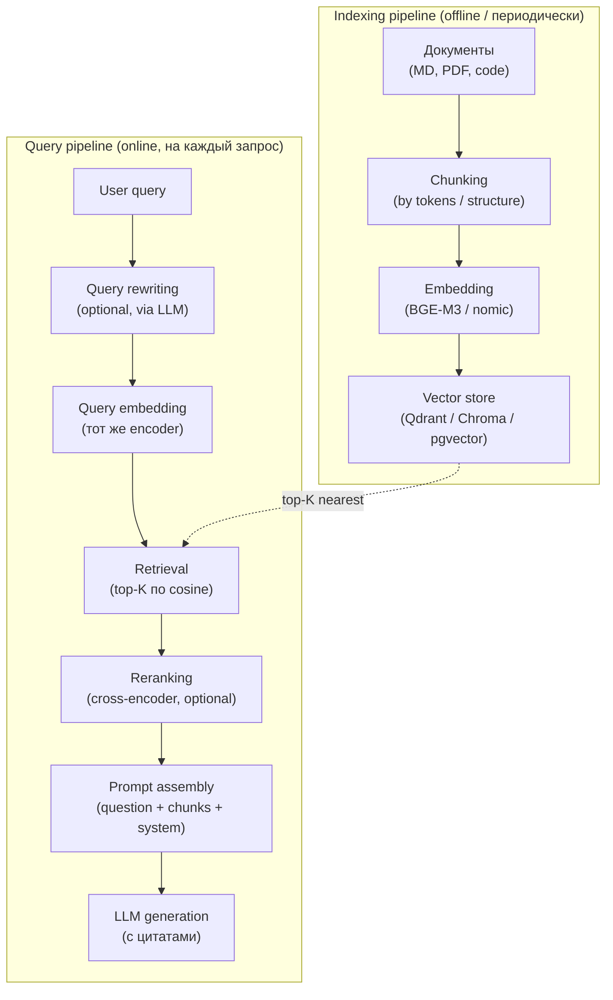

# Глава 8. RAG: Retrieval-Augmented Generation

> «RAG — не способ обучить модель вашим данным; это способ дать ей контекст, который уже есть в репозитории».

## Зачем эта глава

Локальные и облачные модели сталкиваются с общей проблемой: knowledge cutoff и отсутствие специфики вашего проекта. Эта глава посвящена RAG — инженерному паттерну поиска по документации и коду с последующей генерацией ответа. Мы разберём embedding-модели, chunking, vector stores, hybrid search, reranking, code-RAG, evaluation suite, MCP и безопасность retrieval-систем.

Целевой уровень — middle/senior, знакомый с базовым LLM-стеком и желающий построить grounded AI-ассистента над внутренними знаниями.

---
## 8.1 RAG: анатомия Retrieval-Augmented Generation

> **TL;DR.** RAG — паттерн, в котором LLM получает в контекст релевантные фрагменты из внешнего источника (документы, код, БД), извлечённые до генерации. Это **не файнтюнинг**: модель не учится; меняется только вход. Анатомия pipeline'а: `chunking → embedding → indexing → query embedding → retrieval → reranking → prompt assembly → generation → citation`. Каждый шаг — отдельная инженерная задача с отдельными failure mode'ами; качество финального ответа = произведение качеств шагов, поэтому слабое звено бьёт по всему pipeline. RAG не решает проблему галлюцинаций «магически»: модель всё ещё может проигнорировать retrieval и сочинить ответ. Решает grounding (привязку к источнику) и cutoff (свежие документы). Минимальный полезный RAG — `chunking + embedding + dense retrieval + naive prompt`. Production RAG — добавляет hybrid search, reranking, query rewriting, citation grounding и evaluation suite.

### Зачем нужен RAG: три проблемы LLM, которые он закрывает

> **Definition.** **Retrieval-Augmented Generation (RAG)** — Lewis et al., 2020: паттерн, при котором LLM получает в промпт релевантные документы, извлечённые до генерации, и отвечает с опорой на них. Контраст с **parametric knowledge** (то, что модель «знает» из обучения) — RAG даёт **non-parametric knowledge** в контекст-окне.

Три проблемы, которые RAG закрывает:

1. **Knowledge cutoff.** Модель не знает событий и документов после её training cutoff. RAG даёт свежий контекст.
2. **Privacy.** Модель никогда не видела вашу внутреннюю документацию. RAG даёт её в промпт без обучения.
3. **Grounding и citation.** Модель может привязать ответ к конкретному фрагменту документа, что снижает галлюцинации и даёт пользователю проверяемость.

Что RAG **не** делает:

- **Не учит модель.** Модель не запоминает retrieved документы между запросами.
- **Не магически устраняет галлюцинации.** Модель может проигнорировать retrieval и сочинить (вероятность снижается с правильным промптом, не до нуля).
- **Не решает мультидокументное рассуждение.** Сложные ответы, требующие синтеза 10+ источников, RAG даёт хуже, чем отдельные fine-tuning или агентский подход с многоступенчатым retrieval.

### Анатомия RAG-pipeline'а



Каждый прямоугольник — отдельный инженерный решённый вопрос. Слабое звено бьёт по всему pipeline:

- Плохое chunking → retrieval даёт фрагменты без контекста.
- Плохой embedder → retrieval не находит релевантное.
- Плохой rerank → top-K релевантных не упорядочен правильно.
- Плохой prompt → модель игнорирует retrieved chunks.

### Шаг 1: Chunking

> **Definition.** **Chunking** — разбиение документа на фрагменты фиксированного или переменного размера для индексирования. Размер фрагмента — компромисс: слишком маленький (200 токенов) теряет контекст; слишком большой (2000+) размывает relevance, и top-K не помещается в context window. Типовые значения 2026 — 256–800 токенов для документации, 50–300 токенов для кода (по функциям/классам).

Стратегии chunking:

| Стратегия | Когда применять | Плюсы | Минусы |
|-----------|-----------------|-------|--------|
| **Fixed-size (by tokens)** | Простые тексты | Просто, предсказуемо | Режет посреди предложения / функции |
| **Recursive (by markdown headings, code AST)** | MD-документация, код | Сохраняет структуру | Сложнее реализация |
| **Semantic (by topic shift)** | Длинные смысловые тексты | Семантически целостно | Требует extra LLM-вызовов |
| **Hybrid (recursive + size limit)** | Reality 80% случаев | Баланс | Чуть сложнее |

> **Pitfall.** «Я возьму chunk size 1500 токенов — больше контекста». Это работает, пока chunks помещаются в context window LLM при top-K=5. На code-RAG с 32k контекстом и top-K=10 — это 15k токенов только на retrieval, без места для prompt'а и истории. Стандартный sweet spot — 400–600 токенов на chunk + top-K 5–10.

#### Overlap

Чтобы предложение / абзац на границе chunk'а не терялся, добавляется **overlap** — пересечение между соседними chunks (10–20% размера). Это удваивает индекс по объёму, но снижает «обрезание» релевантного фрагмента надвое.

### Шаг 2: Embedding

См. §7.2 — топ-уровень embedding-моделей. Ключевые вопросы при выборе:

- **Размерность.** 384 / 768 / 1024 / 3072. Чем больше — тем точнее retrieval, тем дороже хранилище и cosine-вычисления. Для большинства dev-сценариев — 768 / 1024 sweet spot.
- **Контекст encoder'а.** Старые модели (BGE-large-en) — 512 токенов; современные (BGE-M3, nomic-embed-text-v1.5) — 8192. Если ваш chunk size = 800, нужен encoder с контекстом ≥ 800.
- **Multilingual или English-only.** Если документы / код на нескольких языках — multilingual обязательна.

> **Definition.** **Cosine similarity** — мера близости двух векторов: `cos(θ) = (a · b) / (||a|| × ||b||)`. Диапазон [-1, 1]; для нормализованных embedding-векторов (норма = 1) — то же, что dot product. Стандартная метрика для retrieval. Альтернативы: L2 distance (евклидово), inner product.

### Шаг 3: Vector store

> **Definition.** **Vector store / vector database** — специализированная БД для хранения и поиска по векторам. Поддерживает **ANN (Approximate Nearest Neighbor)** алгоритмы (HNSW, IVF, ScaNN) для быстрого поиска top-K в больших коллекциях.

Рынок vector store'ов 2026:

| Решение | Тип | Лицензия | Когда применять |
|---------|-----|----------|------------------|
| **Chroma** | Embedded / standalone | Apache 2.0 | Прототип, single-machine, до 10M docs |
| **Qdrant** | Standalone / cloud | Apache 2.0 | Production, до 1B docs, отличное API |
| **Weaviate** | Standalone / cloud | BSD-3 | Production, GraphQL-API, hybrid search built-in |
| **pgvector** | PostgreSQL extension | PostgreSQL | Уже есть Postgres, нужны 1–100M docs, joins с relational |
| **Milvus** | Standalone / cloud | Apache 2.0 | Очень большие коллекции (100M+), distributed |
| **FAISS** | Library (in-process) | MIT | Не БД, библиотека для in-memory ANN; для продвинутых |
| **LanceDB** | Embedded / column-store | Apache 2.0 | Read-heavy workloads, pandas-friendly |
| **OpenSearch / Elasticsearch** | Full-text + vector | Apache 2.0 / SSPL | Уже есть ES, нужен hybrid поиск |

> **Definition.** **HNSW (Hierarchical Navigable Small World)** — алгоритм ANN, использующий многоуровневый граф ближайших соседей. Запрос идёт сверху вниз по графу, на каждом уровне приближаясь к ответу. Default-алгоритм в большинстве vector store'ов 2026.

> **Definition.** **`Qdrant`** _[as of 2026]_ — open-source vector database на Rust. Поддерживает HNSW + filtering, payload (метаданные на каждом векторе), quantization, gRPC + REST API. Стандарт de facto для production-RAG в 2025–2026 за пределами enterprise-сегмента.

> **Definition.** **`Chroma`** _[as of 2026]_ — embedded vector database на Python, оптимизированная под прототипирование. Хранит данные в `parquet` + SQLite, опционально клиент-серверный режим. Стандарт для «начать RAG за час».

> **Definition.** **`pgvector`** — PostgreSQL extension для хранения и поиска по векторам. Поддерживает HNSW и IVF. Применяется, когда документация уже в Postgres и нужен hybrid SQL+vector поиск без отдельного сервиса.

### Шаг 4: Retrieval

Базовый retrieval — top-K по cosine similarity к query embedding. Расширения:

#### Hybrid search

> **Definition.** **Hybrid search** — комбинация dense retrieval (по векторам) и sparse retrieval (BM25, full-text). Финальный ranking — линейная комбинация или Reciprocal Rank Fusion (RRF). Hybrid обычно даёт +5–15% recall на доменах с редкими терминами (имена функций, идентификаторы продуктов).

#### Metadata filtering

Фильтрация по метаданным до cosine-search: «только chunks из docs/v2/», «только Python-файлы», «только обновлённые после 2025-01». В Qdrant это первоклассное API; в Chroma — через `where`-фильтр.

#### Query rewriting

LLM-вызов до retrieval, переформулирующий запрос: «Как сделать idempotency?» → «Idempotency-Key header POST endpoint deduplication». Помогает, когда пользователь формулирует расплывчато; добавляет latency (один extra LLM-вызов).

### Шаг 5: Reranking

> **Definition.** **Reranking** — второй проход top-K-кандидатов через **cross-encoder**: модель, принимающую query+document одновременно и оценивающую relevance score. Cross-encoder точнее bi-encoder'а (тот, что использовался в embedding), но в N× медленнее, потому что не векторизуется. Поэтому: bi-encoder retrieval до top-50 → cross-encoder rerank до top-5.

Стандартные open-weights rerankers _(as of 2026)_:

| Модель | Размер | Применение |
|--------|--------|------------|
| **bge-reranker-v2-m3** | 568M | Multilingual, баланс quality/speed |
| **bge-reranker-large** | 335M | English, проверенный |
| **mxbai-rerank-large-v1** | 435M | Apache 2.0, сильный |
| **cohere/rerank-3** (cloud) | API | Топ по качеству, но cloud |

Reranking даёт +10–25% precision@5 над сырым retrieval; добавляет 50–200 ms latency.

### Шаг 6: Prompt assembly

Финальный prompt комбинирует system instruction + retrieved chunks + query:

```text
[SYSTEM]
You are a documentation assistant for OrderService.
Answer ONLY using the provided context. If the answer is not in the context, say "I don't know."
Cite sources by [doc_id].

[CONTEXT]
[1] (docs/api/idempotency.md, chunk 3):
"Idempotency is implemented via Idempotency-Key header. Server stores (key, response) for 24h."

[2] (docs/adr/0007-idempotency.md, chunk 1):
"We chose Stripe-style Idempotency-Key over content-based dedup because..."

[3] (src/orders/api.py, chunk 5):
"@app.post('/orders'); idempotency_key = request.headers.get('Idempotency-Key')..."

[QUESTION]
How does the order service handle duplicate POST requests?

[ANSWER]
```

Ключевые элементы:

- Явное «answer ONLY using context» — снижает галлюцинации.
- Явное «say I don't know» — даёт модели легальный способ не сочинять.
- Citation format `[doc_id]` — даёт пользователю проверяемость.
- Метаданные источника (file, chunk index) — для click-through на полный документ.

### Шаг 7: Citation grounding

> **Definition.** **Citation grounding** — практика, при которой каждое утверждение в ответе LLM сопровождается ссылкой на источник из retrieved chunks. Цель — сделать ответ проверяемым: пользователь может пройти по ссылке и убедиться, что фрагмент действительно говорит то, что цитирует модель.

Простейшая форма — `[1]`, `[2]` в тексте + список источников снизу. Продвинутая — структурированный ответ:

```json
{
  "answer": "POST /orders accepts Idempotency-Key header [1]. Server stores response for 24h [1][2].",
  "citations": [
    {"id": 1, "source": "docs/api/idempotency.md", "lines": "12-25"},
    {"id": 2, "source": "docs/adr/0007-idempotency.md", "lines": "30-45"}
  ],
  "confidence": "high"
}
```

Это формат, который IDE-агенты (Cursor RAG-mode, Continue) рендерят как кликабельные ссылки.

### Что AI делает хорошо и плохо в RAG

**Хорошо:**

- Извлекать конкретные факты из документов («какой default-таймаут?» → ответ из README).
- Сводить ответ из 2–3 источников.
- Цитировать источники, если промпт явно требует.

**Плохо без специальной подготовки:**

- Многошаговое рассуждение по 5–10 документам — нужен агентский подход.
- Counterfactual queries («что было бы, если?») — модель часто галлюцинирует поверх контекста.
- Запросы вне retrieved scope — без явного «say I don't know» модель сочиняет.

### Что это значит для практика

RAG — не «магия для устранения галлюцинаций», а инженерный pipeline из 7+ шагов, каждый со своими failure mode'ами. Минимально полезный RAG (chunking + embedding + dense retrieval + naive prompt) собирается за день и закрывает 60–70% задач documentation Q&A. Production-grade (hybrid search + reranking + citation + evaluation) — недельный проект, дающий 85–95% precision на хорошо подготовленных корпусах. RAG не заменяет файнтюнинг (для adapt'a модели под стиль); решает grounding и cutoff. Без evaluation suite (§8.5) RAG-pipeline — чёрный ящик; команда не знает, какое улучшение реально помогло, а какое — регрессия.

> **See also.** §8.2 (детали embedding в RAG-контексте) · §8.3 (end-to-end пример сборки) · §8.4 (RAG над кодом) · §8.5 (как измерять RAG) · Глава 1, §1.x (галлюцинации как свойство next-token prediction) · Глава 6, §6.9 (документация как источник для RAG).

---

## 8.2 Эмбеддинги и retrieval: инженерный выбор

> **TL;DR.** Качество retrieval = качество embedding × качество chunking × качество ranking. На 2026 год open-weights `BGE-M3` (multilingual, 8k context, multi-functional dense+sparse+colbert) — стандартная рабочая лошадка. Для English-only с малыми коллекциями — `bge-large-en-v1.5` или `nomic-embed-text-v1.5`. Размерность embedding'а — экономический выбор: 1024 — sweet spot, 384 — экономит storage в 2.5×, 3072 — даёт +2–5% precision ценой 3× storage. Обновление индекса: incremental (per-document) для активной документации, full re-index при смене encoder'а. Hybrid search (dense + BM25) обязателен на корпусах с уникальной терминологией (имена функций, product SKU); добавляет +5–15% recall.

### Выбор embedding-модели: матрица решений

| Сценарий | Рекомендация _(as of 2026)_ |
|----------|------------------------------|
| English-only, документация ≤ 10k docs | `nomic-embed-text-v1.5` (137M, 768d, 8k ctx, Apache 2.0) |
| English-only, production, ≤ 100k docs | `bge-large-en-v1.5` (335M, 1024d, 512 ctx) |
| Multilingual, RU/EN/CN/ES | `BGE-M3` (568M, 1024d, 8k ctx) |
| Code-search | `Qwen2.5-Coder-Embed` (если есть) или `BGE-M3` |
| Маленький бюджет VRAM | `all-MiniLM-L6-v2` (23M, 384d, 256 ctx) — старый, но работает |
| Топ качества за любую цену | `GTE-Qwen2-7B-instruct` (7B, 3584d, 32k ctx) — медленный |
| Всё в Postgres, 1M+ docs | `bge-large-en-v1.5` + pgvector HNSW |

> **Pitfall.** Смена embedding-модели требует **полного re-index'а коллекции**. Старые embedding'и не совместимы с новыми (другая размерность, другое distribution). Это дорогая операция: для 1M chunks на BGE-M3 — 2–6 часов на single GPU. Планируйте embedder как «решение на 12+ месяцев»; не меняйте по prerелизам.

### Качество retrieval: метрики и эмпирические числа

> **Definition.** **Recall@K** — доля «правильных» документов (ground truth) среди top-K результатов retrieval. Recall@5 = 0.8 означает: в среднем 80% из релевантных доков попадают в top-5.

> **Definition.** **MRR (Mean Reciprocal Rank)** — среднее значение `1/rank`, где rank — позиция первого релевантного документа в результатах. MRR=1.0 — идеал; MRR=0.5 — релевантный обычно второй.

> **Definition.** **nDCG@K (Normalized Discounted Cumulative Gain)** — взвешенная метрика, учитывающая и наличие релевантных документов, и их порядок. Стандарт для оценки ranking-систем.

Эмпирические числа на типовых dev-документациях _(approximate, by published RAG benchmarks 2025–2026)_:

| Конфигурация | Recall@5 | MRR | nDCG@10 |
|--------------|----------|-----|----------|
| Naive: BM25 (sparse only) | 0.55–0.70 | 0.45 | 0.55 |
| Naive dense: nomic-embed | 0.65–0.78 | 0.58 | 0.66 |
| Strong dense: BGE-M3 | 0.72–0.85 | 0.66 | 0.74 |
| Hybrid (BGE-M3 + BM25 RRF) | 0.78–0.90 | 0.72 | 0.80 |
| Hybrid + cross-encoder rerank | 0.82–0.93 | 0.78 | 0.85 |

Каждый шаг даёт +3–8% recall; накопленный эффект — разница между «работающим» и «болтающимся на 60%» RAG'ом.

### Chunking detail: примеры

#### Markdown-документация

```python
from langchain_text_splitters import MarkdownHeaderTextSplitter, RecursiveCharacterTextSplitter

headers_to_split_on = [
    ("#", "h1"),
    ("##", "h2"),
    ("###", "h3"),
]
md_splitter = MarkdownHeaderTextSplitter(headers_to_split_on=headers_to_split_on)
docs_by_section = md_splitter.split_text(markdown_content)

char_splitter = RecursiveCharacterTextSplitter(
    chunk_size=600,
    chunk_overlap=80,
    separators=["\n\n", "\n", ". ", " ", ""],
)
final_chunks = []
for d in docs_by_section:
    pieces = char_splitter.split_text(d.page_content)
    for p in pieces:
        final_chunks.append({
            "text": p,
            "metadata": {**d.metadata, "source": "docs/api/idempotency.md"}
        })
```

Двухуровневый split: сначала по структуре (заголовки), потом по размеру. Это сохраняет семантические единицы и одновременно ограничивает размер.

#### Код

Код режется иначе — по AST (функции, классы), а не по токенам:

```python
from tree_sitter_languages import get_parser

parser = get_parser("python")
def chunk_python_file(source: str, file_path: str) -> list[dict]:
    tree = parser.parse(source.encode())
    chunks = []
    for node in tree.root_node.children:
        if node.type in ("function_definition", "class_definition"):
            start, end = node.start_byte, node.end_byte
            text = source[start:end]
            chunks.append({
                "text": text,
                "metadata": {
                    "source": file_path,
                    "node_type": node.type,
                    "start_line": node.start_point[0] + 1,
                    "end_line": node.end_point[0] + 1,
                }
            })
    return chunks
```

> **Definition.** **`tree-sitter`** — open-source библиотека для построения parse trees из исходного кода более чем для 100 языков. Используется в IDE-агентах, linter'ах и RAG-системах для structural chunking кода. Стандарт для AST-based code analysis в 2024–2026.

### Hybrid search: dense + BM25

> **Definition.** **BM25 (Best Matching 25)** — Robertson, 1994: классическая формула информационного поиска, оценивающая релевантность по term frequency × inverse document frequency. Хорошо работает на запросах с редкими специфичными терминами (например, «`asyncpg.UniqueViolationError`»). Слабо — на парафразах и семантических запросах.

> **Definition.** **Reciprocal Rank Fusion (RRF)** — Cormack et al., 2009: способ комбинации нескольких ranking'ов. `RRF_score(d) = Σ 1/(k + rank_i(d))`, типично k=60. Простой, robust, не требует калибровки scores разных систем.

Минимальная hybrid search через `Qdrant`:

```python
from qdrant_client import QdrantClient
from qdrant_client.models import SparseVector, NamedVector, Prefetch, Query, FusionQuery, Fusion

client = QdrantClient(url="http://localhost:6333")

results = client.query_points(
    collection_name="docs",
    prefetch=[
        Prefetch(
            query=dense_vector,
            using="dense",
            limit=50,
        ),
        Prefetch(
            query=SparseVector(indices=bm25_indices, values=bm25_values),
            using="sparse",
            limit=50,
        ),
    ],
    query=FusionQuery(fusion=Fusion.RRF),
    limit=10,
)
```

`Qdrant` поддерживает sparse + dense в одной коллекции; RRF — встроенный fusion-алгоритм.

### Что это значит для практика

Embedding-выбор — решение на 12+ месяцев, не меняется per-release. Для большинства dev-сценариев `BGE-M3` или `nomic-embed-text-v1.5` — robust default. Размерность 768–1024 — sweet spot. Hybrid search обязателен, как только в корпусе есть уникальные термины (имена функций, идентификаторы, версии библиотек). Reranking — недорогое (50–200 ms) +10–25% precision; включается, когда базовый pipeline стабилизирован. Без regular evaluation (§8.5) изменения «улучшил chunking» / «поменял rerank» — это слепые ходы.

> **See also.** §8.1 (RAG pipeline в целом) · §8.3 (полный пример сборки) · §8.5 (custom eval-сюит для retrieval) · Глава 6, §6.9 (`source of truth` как принцип, выгодный для chunking).

---

## 8.3 Сборка RAG для документации: end-to-end пример

> **TL;DR.** Минимальный полезный RAG для проектной документации собирается за один рабочий день: ~250 строк Python, локальный `Ollama` для генерации, `nomic-embed-text` для эмбеддинга, `Chroma` для индекса. Этот пример работает на laptop'е без GPU при размере корпуса до 5–10k chunks. Для production-нагрузок добавляются: `Qdrant` вместо `Chroma`, hybrid search, reranking, citation grounding с verification, evaluation suite. Эта секция — пошаговая сборка с реальным кодом и пояснениями каждого тула.

### Артефакт демо: AI-assistant над `docs/` репозитория

Цель — собрать CLI-утилиту `ragchat`, которая:

1. Индексирует все Markdown-документы из `docs/` (включая ADR, runbook, architecture).
2. Принимает вопрос пользователя.
3. Извлекает top-5 релевантных фрагментов через hybrid search.
4. Передаёт их в локальную LLM с явной инструкцией цитировать источники.
5. Возвращает ответ с маркерами `[1]`, `[2]` и списком файлов-источников.

Стек:

- **Python 3.12** — runtime.
- **`Ollama`** — локальный LLM-runner (модель: `qwen2.5:14b-instruct-q4_K_M` или `llama3.1:8b-instruct-q4_K_M`).
- **`nomic-embed-text`** через Ollama — embedding-модель (137M, 768d, 8k context, Apache 2.0).
- **`chromadb`** — embedded vector store.
- **`langchain-text-splitters`** — chunking Markdown'а.
- **`rank-bm25`** — sparse retrieval для hybrid search.

> **Definition.** **`langchain-text-splitters`** _[as of 2026]_ — Python-пакет с реализациями типовых стратегий chunking: `RecursiveCharacterTextSplitter`, `MarkdownHeaderTextSplitter`, `PythonCodeTextSplitter`, и т.д. Часть экосистемы LangChain, но используется stand-alone без полного LangChain.

> **Definition.** **`rank-bm25`** — лёгкая Python-реализация BM25 без внешних зависимостей. Применяется в hybrid-search pipeline'ах, когда полноценный full-text engine (Elasticsearch / OpenSearch / Tantivy) — overkill.

### Подготовка окружения

```bash
ollama pull llama3.1:8b-instruct-q4_K_M
ollama pull nomic-embed-text

python -m venv .venv && source .venv/bin/activate
pip install \
    chromadb==0.5.5 \
    langchain-text-splitters==0.3.1 \
    rank-bm25==0.2.2 \
    httpx==0.27 \
    pydantic==2.8 \
    typer==0.12
```

Проверка `Ollama`:

```bash
curl http://localhost:11434/api/tags
curl -X POST http://localhost:11434/api/embeddings \
  -d '{"model":"nomic-embed-text","prompt":"hello"}' | jq '.embedding | length'
```

Должно вернуть 768.

### Шаг 1: Сборка проекта

```text
ragchat/
├── pyproject.toml
├── ragchat/
│   ├── __init__.py
│   ├── config.py
│   ├── chunking.py
│   ├── indexing.py
│   ├── retrieval.py
│   ├── generation.py
│   └── cli.py
└── data/
    └── chroma/        # vector store on disk
```

### Шаг 2: Конфигурация

```python
# ragchat/config.py
from pathlib import Path
from pydantic import BaseModel

class Config(BaseModel):
    docs_root: Path = Path("docs")
    chroma_path: Path = Path("data/chroma")
    collection_name: str = "project_docs"
    
    embed_model: str = "nomic-embed-text"
    llm_model: str = "llama3.1:8b-instruct-q4_K_M"
    ollama_url: str = "http://localhost:11434"
    
    chunk_size: int = 600
    chunk_overlap: int = 80
    top_k_dense: int = 20
    top_k_sparse: int = 20
    top_k_final: int = 5
    
    rrf_k: int = 60
```

### Шаг 3: Chunking — Markdown с двухуровневым split'ом

```python
# ragchat/chunking.py
from pathlib import Path
from langchain_text_splitters import (
    MarkdownHeaderTextSplitter,
    RecursiveCharacterTextSplitter,
)

HEADERS = [("#", "h1"), ("##", "h2"), ("###", "h3")]

def chunk_markdown_file(path: Path, chunk_size: int, chunk_overlap: int) -> list[dict]:
    text = path.read_text(encoding="utf-8")
    
    md_splitter = MarkdownHeaderTextSplitter(
        headers_to_split_on=HEADERS,
        strip_headers=False,
    )
    sections = md_splitter.split_text(text)
    
    char_splitter = RecursiveCharacterTextSplitter(
        chunk_size=chunk_size,
        chunk_overlap=chunk_overlap,
        separators=["\n\n", "\n", ". ", " ", ""],
        length_function=len,
    )
    
    chunks = []
    for section in sections:
        pieces = char_splitter.split_text(section.page_content)
        for idx, piece in enumerate(pieces):
            chunks.append({
                "text": piece,
                "metadata": {
                    "source": str(path),
                    "h1": section.metadata.get("h1", ""),
                    "h2": section.metadata.get("h2", ""),
                    "h3": section.metadata.get("h3", ""),
                    "chunk_index": idx,
                },
            })
    return chunks


def chunk_repo(docs_root: Path, chunk_size: int, chunk_overlap: int) -> list[dict]:
    chunks = []
    for md_path in docs_root.rglob("*.md"):
        chunks.extend(chunk_markdown_file(md_path, chunk_size, chunk_overlap))
    return chunks
```

Что важно: метаданные сохраняют не только путь к файлу, но и иерархию заголовков. Это позволяет потом цитировать `docs/api/idempotency.md › Implementation › Cache invalidation` вместо просто имени файла.

### Шаг 4: Indexing — Chroma + параллельный BM25

```python
# ragchat/indexing.py
import httpx
import chromadb
from rank_bm25 import BM25Okapi
import pickle
from pathlib import Path
from .config import Config


def embed_texts(texts: list[str], cfg: Config) -> list[list[float]]:
    embeddings = []
    with httpx.Client(timeout=60) as client:
        for text in texts:
            resp = client.post(
                f"{cfg.ollama_url}/api/embeddings",
                json={"model": cfg.embed_model, "prompt": text},
            )
            resp.raise_for_status()
            embeddings.append(resp.json()["embedding"])
    return embeddings


def tokenize_for_bm25(text: str) -> list[str]:
    import re
    return re.findall(r"\b\w+\b", text.lower())


def build_index(chunks: list[dict], cfg: Config) -> None:
    cfg.chroma_path.mkdir(parents=True, exist_ok=True)
    client = chromadb.PersistentClient(path=str(cfg.chroma_path))
    
    try:
        client.delete_collection(cfg.collection_name)
    except Exception:
        pass
    collection = client.create_collection(
        name=cfg.collection_name,
        metadata={"hnsw:space": "cosine"},
    )
    
    texts = [c["text"] for c in chunks]
    metadatas = [c["metadata"] for c in chunks]
    ids = [f"chunk_{i}" for i in range(len(chunks))]
    
    embeddings = embed_texts(texts, cfg)
    
    collection.add(
        documents=texts,
        metadatas=metadatas,
        embeddings=embeddings,
        ids=ids,
    )
    
    tokenized = [tokenize_for_bm25(t) for t in texts]
    bm25 = BM25Okapi(tokenized)
    bm25_path = cfg.chroma_path / "bm25.pkl"
    with bm25_path.open("wb") as f:
        pickle.dump({
            "bm25": bm25,
            "ids": ids,
            "texts": texts,
            "metadatas": metadatas,
        }, f)
```

Что важно:

- Используем `cosine` distance в Chroma (по умолчанию `l2` — менее естественен для нормализованных embedding'ов).
- BM25-индекс хранится отдельно в pickle: для маленьких корпусов (≤ 50k chunks) — допустимо; для больших — Tantivy/Whoosh/Elasticsearch.
- ID'шники одинаковые в обоих индексах: это позволяет потом fuse'ить результаты по ID.

### Шаг 5: Retrieval — hybrid search с RRF

```python
# ragchat/retrieval.py
import pickle
import chromadb
from .config import Config
from .indexing import embed_texts, tokenize_for_bm25


def reciprocal_rank_fusion(
    rankings: list[list[str]],
    k: int = 60,
) -> dict[str, float]:
    scores: dict[str, float] = {}
    for ranking in rankings:
        for rank, doc_id in enumerate(ranking):
            scores[doc_id] = scores.get(doc_id, 0.0) + 1.0 / (k + rank + 1)
    return scores


def hybrid_search(query: str, cfg: Config) -> list[dict]:
    client = chromadb.PersistentClient(path=str(cfg.chroma_path))
    collection = client.get_collection(cfg.collection_name)
    
    query_emb = embed_texts([query], cfg)[0]
    dense_result = collection.query(
        query_embeddings=[query_emb],
        n_results=cfg.top_k_dense,
        include=["documents", "metadatas", "distances"],
    )
    dense_ids = dense_result["ids"][0]
    
    with (cfg.chroma_path / "bm25.pkl").open("rb") as f:
        bm25_data = pickle.load(f)
    bm25 = bm25_data["bm25"]
    all_ids = bm25_data["ids"]
    all_texts = bm25_data["texts"]
    all_metas = bm25_data["metadatas"]
    
    query_tokens = tokenize_for_bm25(query)
    bm25_scores = bm25.get_scores(query_tokens)
    bm25_top_indices = sorted(
        range(len(bm25_scores)),
        key=lambda i: bm25_scores[i],
        reverse=True,
    )[: cfg.top_k_sparse]
    sparse_ids = [all_ids[i] for i in bm25_top_indices]
    
    fused_scores = reciprocal_rank_fusion(
        [dense_ids, sparse_ids],
        k=cfg.rrf_k,
    )
    
    sorted_ids = sorted(fused_scores.keys(), key=lambda i: fused_scores[i], reverse=True)
    top_ids = sorted_ids[: cfg.top_k_final]
    
    id_to_idx = {i: idx for idx, i in enumerate(all_ids)}
    results = []
    for i, doc_id in enumerate(top_ids):
        idx = id_to_idx[doc_id]
        results.append({
            "rank": i + 1,
            "id": doc_id,
            "text": all_texts[idx],
            "metadata": all_metas[idx],
            "score": fused_scores[doc_id],
        })
    return results
```

Что важно:

- RRF fusion — robust, не требует калибровки scores.
- Top-K_final (5) намеренно меньше top-K_dense / top-K_sparse (20): RRF тем эффективнее, чем больший пул кандидатов.
- Метаданные пробрасываются для последующего citation.

### Шаг 6: Generation — prompt assembly + Ollama call

```python
# ragchat/generation.py
import httpx
from .config import Config


SYSTEM_PROMPT = """You are a documentation assistant for the OrderService project.
Answer the user's question using ONLY the provided CONTEXT.
If the answer is not in the context, say "I don't know based on the indexed docs."
Cite sources by their numeric markers like [1], [2].
Be concise: 3-6 sentences unless detail is asked."""


def format_context(retrieved: list[dict]) -> tuple[str, list[dict]]:
    parts = []
    citations = []
    for i, item in enumerate(retrieved, start=1):
        meta = item["metadata"]
        section = " > ".join(filter(None, [meta.get("h1"), meta.get("h2"), meta.get("h3")]))
        header = f"[{i}] ({meta['source']}{' > ' + section if section else ''}):"
        parts.append(f"{header}\n{item['text']}")
        citations.append({
            "id": i,
            "source": meta["source"],
            "section": section,
        })
    return "\n\n".join(parts), citations


def generate_answer(query: str, retrieved: list[dict], cfg: Config) -> dict:
    context, citations = format_context(retrieved)
    user_prompt = f"CONTEXT:\n{context}\n\nQUESTION: {query}\n\nANSWER:"
    
    with httpx.Client(timeout=120) as client:
        resp = client.post(
            f"{cfg.ollama_url}/api/chat",
            json={
                "model": cfg.llm_model,
                "messages": [
                    {"role": "system", "content": SYSTEM_PROMPT},
                    {"role": "user", "content": user_prompt},
                ],
                "stream": False,
                "options": {
                    "temperature": 0.2,
                    "num_ctx": 8192,
                },
            },
        )
        resp.raise_for_status()
        answer = resp.json()["message"]["content"]
    
    return {
        "question": query,
        "answer": answer,
        "citations": citations,
    }
```

Что важно:

- `temperature=0.2` — для документационного RAG нужен детерминированный ответ, не творчество.
- `num_ctx=8192` — достаточно для top-5 chunks по 600 токенов + question + system + ответ.
- Системный промпт явно содержит «say I don't know» — снижает галлюцинации.
- Citations — отдельным полем для UI-рендеринга.

### Шаг 7: CLI

```python
# ragchat/cli.py
import json
import typer
from .config import Config
from .chunking import chunk_repo
from .indexing import build_index
from .retrieval import hybrid_search
from .generation import generate_answer

app = typer.Typer()


@app.command()
def index() -> None:
    cfg = Config()
    chunks = chunk_repo(cfg.docs_root, cfg.chunk_size, cfg.chunk_overlap)
    print(f"Chunked {len(chunks)} pieces from {cfg.docs_root}")
    build_index(chunks, cfg)
    print(f"Index ready: {cfg.chroma_path}")


@app.command()
def ask(question: str) -> None:
    cfg = Config()
    retrieved = hybrid_search(question, cfg)
    result = generate_answer(question, retrieved, cfg)
    
    print(f"\n=== ANSWER ===\n{result['answer']}\n")
    print("=== SOURCES ===")
    for c in result["citations"]:
        section = f" > {c['section']}" if c["section"] else ""
        print(f"  [{c['id']}] {c['source']}{section}")


@app.command()
def ask_json(question: str) -> None:
    cfg = Config()
    retrieved = hybrid_search(question, cfg)
    result = generate_answer(question, retrieved, cfg)
    print(json.dumps(result, ensure_ascii=False, indent=2))


if __name__ == "__main__":
    app()
```

### Шаг 8: Запуск

```bash
python -m ragchat.cli index
python -m ragchat.cli ask "How does idempotency work for POST /orders?"
```

Ожидаемый вывод:

```text
=== ANSWER ===
The OrderService implements idempotency via the Idempotency-Key header [1].
On the first POST /orders request with a given key, the server stores the response
for 24 hours; subsequent requests with the same key and body return the cached
response without DB write [1][2]. Conflicts (same key, different body) return 409.
This was chosen over content-based deduplication to avoid false positives on
legitimate duplicate purchases [2].

=== SOURCES ===
  [1] docs/api/idempotency.md > Implementation
  [2] docs/adr/0007-idempotency.md > Decision Outcome
```

### C# / .NET-эквивалент

Для команд на .NET-стеке тот же сценарий — через `Microsoft.SemanticKernel`, `LangChain.NET` или прямые HTTP-вызовы к Ollama:

```csharp
using OllamaSharp;
using Microsoft.KernelMemory;

var memory = new KernelMemoryBuilder()
    .WithOllamaTextGeneration("llama3.1:8b-instruct-q4_K_M", "http://localhost:11434")
    .WithOllamaTextEmbeddingGeneration("nomic-embed-text", "http://localhost:11434")
    .WithSimpleVectorDb(new SimpleVectorDbConfig { Directory = "data/kernelmemory" })
    .Build<MemoryServerless>();

foreach (var path in Directory.EnumerateFiles("docs", "*.md", SearchOption.AllDirectories))
    await memory.ImportDocumentAsync(path, documentId: path);

var answer = await memory.AskAsync("How does idempotency work?");
Console.WriteLine(answer.Result);
foreach (var c in answer.RelevantSources)
    Console.WriteLine($"  - {c.SourceName}");
```

> **Definition.** **`Microsoft.KernelMemory`** _[as of 2026]_ — open-source библиотека от Microsoft для построения RAG-pipeline'ов на .NET. Поддерживает Ollama, OpenAI, Azure OpenAI, локальные vector stores. Высокоуровневая абстракция: меньше контроля, больше скорости разработки.

> **Definition.** **`Microsoft.SemanticKernel`** _[as of 2026]_ — open-source SDK от Microsoft для AI-orchestration на .NET и Python. Включает RAG, agents, planners, function calling. Конкурент LangChain в .NET-экосистеме.

### Production-уточнения

Этот пример — **dev-grade**. Для production добавить:

| Что | Зачем | Как |
|-----|------|-----|
| `Qdrant` вместо Chroma | Production stability, multi-tenant | Docker + Python-client |
| Inkremental indexing | Не пересобирать всё на каждое изменение | Track file mtime / git diff |
| Reranker (`bge-reranker-v2-m3`) | +10–25% precision | Отдельный Ollama-call |
| Query rewriting | +5–10% recall на коротких запросах | LLM-call перед embedding |
| Citation verification | Защита от hallucinated citations | Match вывода с retrieved chunks |
| Eval suite | Регрессии на изменении pipeline | См. §8.5 |
| Auth + rate limiting | Multi-user inference | Reverse proxy (Caddy/nginx) |
| Telemetry | Monitor recall/MRR в проде | OpenTelemetry + Prometheus |

### Что это значит для практика

Минимально полезный RAG над документацией собирается за ~250 строк кода + один день инжиниринга. Стек 2026 — `Ollama` + `nomic-embed-text` + `Chroma` + `rank-bm25` для прототипа; `Qdrant` + reranker для production. Главное правило: **не пытайтесь собрать «идеальный RAG» с первого подхода**. Сначала простейшая версия → измерение качества (§8.5) → пошаговое усиление слабого звена. Цикл «pipeline change → eval → решение оставить или откатить» — то, что отделяет работающий RAG от чёрного ящика, в который команда верит на честное слово.

> **See also.** §8.1 (анатомия pipeline'а) · §8.2 (детали embedding-выбора) · §8.4 (RAG над кодом — расширение этого примера) · §8.5 (как мерить качество построенного RAG'а) · Глава 6, §6.3 (`README.md` как input для индексации).

---

## 8.4 RAG над кодовой базой: дополнительные сложности

> **TL;DR.** RAG над кодом — не RAG над документацией с поправкой на синтаксис. Код имеет другие свойства релевантности: имена идентификаторов важнее парафраз; cross-file dependencies (импорты, наследование, использование) — основа смысла; chunk-границы должны соответствовать структуре (функции, классы), не токенам. Минимально полезный code-RAG = AST-chunking + dual-embedder (один для имён, один для семантики) + hybrid search с приоритетом BM25 на keyword-запросах. Production-grade добавляет graph-aware retrieval (через call-graph и type-graph), incremental update'ы по git diff, и code-specialized embedders. Качественный разрыв между «RAG над docs» и «RAG над кодом» в 2026 — code-RAG обычно на 15–30% точнее на keyword-задачах, на 10–20% хуже на conceptual-задачах. Стандартный production-инструмент 2026 — комбинация LSP-server + RAG-индекс + LLM, не «RAG над кодом» в чистом виде.

### Чем RAG над кодом отличается от RAG над документацией

| Аспект | Документация | Код |
|--------|--------------|-----|
| Единица смысла | Раздел / параграф | Функция / класс / модуль |
| Importance имён | Низкая | Высокая (`getUserById` ≠ `findUser`) |
| Cross-references | Часто, но неструктурированно | Строго: import, inheritance, usage |
| Эффект chunking-границ | Средний | Большой (резать класс надвое — катастрофа) |
| Лексика | Естественный язык | Mixed: NL комментарии + строгий синтаксис |
| Объём типичный | 100–1000 docs | 10k–100k файлов |
| Update frequency | Низкая | Высокая (на каждый PR) |

Главное следствие: chunking — **обязательно по AST**, не по токенам. И BM25 — критически важен, потому что инженер в 70% случаев ищет конкретное имя, не парафразу.

### AST-chunking через `tree-sitter`

`tree-sitter` (см. §8.2) даёт robust парсер для 100+ языков. Минимальный chunker для Python:

```python
from tree_sitter_languages import get_parser

PY_NODE_TYPES = {"function_definition", "class_definition"}

def chunk_python(source: str, file_path: str) -> list[dict]:
    parser = get_parser("python")
    tree = parser.parse(source.encode("utf-8"))
    
    def walk(node, parent_class: str | None = None):
        results = []
        for child in node.children:
            if child.type == "class_definition":
                name_node = child.child_by_field_name("name")
                cls_name = source[name_node.start_byte:name_node.end_byte] if name_node else "?"
                
                results.append({
                    "text": source[child.start_byte:child.end_byte],
                    "metadata": {
                        "source": file_path,
                        "kind": "class",
                        "name": cls_name,
                        "start_line": child.start_point[0] + 1,
                        "end_line": child.end_point[0] + 1,
                    },
                })
                results.extend(walk(child, parent_class=cls_name))
            elif child.type == "function_definition":
                name_node = child.child_by_field_name("name")
                fn_name = source[name_node.start_byte:name_node.end_byte] if name_node else "?"
                full_name = f"{parent_class}.{fn_name}" if parent_class else fn_name
                
                results.append({
                    "text": source[child.start_byte:child.end_byte],
                    "metadata": {
                        "source": file_path,
                        "kind": "function" if not parent_class else "method",
                        "name": full_name,
                        "parent_class": parent_class,
                        "start_line": child.start_point[0] + 1,
                        "end_line": child.end_point[0] + 1,
                    },
                })
            else:
                results.extend(walk(child, parent_class))
        return results
    
    return walk(tree.root_node)
```

Для C# — аналогичный подход через `tree-sitter-c-sharp`:

```python
parser = get_parser("c_sharp")
NODE_TYPES_CS = {"class_declaration", "method_declaration", "interface_declaration"}
```

#### Включение «контекста выше»

Чтобы метод `process_payment` был осмысленным без класса, к chunk'у метода добавляется **сигнатура родительского класса**:

```text
class PaymentProcessor:
    """Handles Stripe payment captures."""
    
    def __init__(self, stripe_client: StripeClient): ...
    
    # ─── chunk start ───
    async def process_payment(self, order_id: UUID) -> PaymentResult:
        ...
```

Это удваивает 5–10% chunk'ов размером, но критически повышает retrieval relevance (модель видит, что `process_payment` живёт в `PaymentProcessor`, не в случайной функции).

### Dual-embedding: имена и семантика

В hybrid search для кода используется не только dense + BM25, а **три** сигнала:

1. **Dense embedding** — общая семантическая близость.
2. **BM25 (sparse)** — точные имена и keywords.
3. **Identifier index** — отдельный индекс по именам функций, классов, методов с fuzzy matching.

Третий слой даёт «найди функцию `process_payment`» даже когда пользователь напишет `processPayment` или `payment processing`.

### Graph-aware retrieval

> **Definition.** **Code graph** — граф, в котором узлы — символы (функции, классы, файлы), рёбра — отношения (calls, imports, inherits, uses). Строится через LSP (Language Server Protocol) или статический анализ.

Простейший case: пользователь спрашивает «как работает `process_payment`?» — retrieval должен вернуть не только определение, но и:

- Функции, которые её **вызывают** (callers).
- Функции, которые **она вызывает** (callees).
- Тесты для неё.

Это — graph-aware retrieval: поверх vector search применяется graph traversal на 1–2 hop вокруг найденного символа.

> **Definition.** **Language Server Protocol (LSP)** — Microsoft, 2016: протокол между IDE и language server'ом. Сервер даёт `goto-definition`, `find-references`, `hover`, `completion`, `diagnostics`. На 2026 — стандарт-де-факто для всех modern IDE. RAG-системы используют LSP-данные как структурированный indexing-источник.

#### Стек 2026 для code-RAG

| Компонент | Стандартный выбор | Альтернативы |
|-----------|---------------------|--------------|
| AST-chunking | `tree-sitter` | `pygments`, `roslyn` для .NET |
| Embedding | `BGE-M3` или code-specialized | `nomic-embed-code` _(когда вышел)_ |
| Vector store | `Qdrant` или `LanceDB` | `Chroma` для прототипа |
| Sparse / lexical | `Tantivy` или встроенный в Qdrant | `BM25Okapi`, ElasticSearch |
| Graph layer | LSP servers (`pyright`, `ruff-lsp`, `roslyn`, `gopls`) | Кастомный AST-extractor |
| Orchestration | LangChain / LlamaIndex / custom | `Haystack` |

> **Definition.** **`LlamaIndex`** _[as of 2026]_ — open-source Python-фреймворк, специализирующийся на RAG. Сильнее LangChain в indexing/retrieval-частях, имеет готовые connectors для GitHub, Confluence, Notion. Выбор для команд, фокусирующихся именно на RAG, не на general agents.

> **Definition.** **`LangChain`** _[as of 2026]_ — open-source Python/JS фреймворк для AI-приложений: chains, agents, RAG, tool-use, memory. Самый широкий feature set, но и сложность выше; критика-2024 — нестабильное API. К 2026 стабилизировался; стандарт для широкого класса AI-приложений.

> **Definition.** **`Haystack`** _[as of 2026]_ — open-source Python-фреймворк от Deepset для NLP-pipeline'ов с акцентом на retrieval. Pipeline'ы как DAG, сильная evaluation-часть, production-readiness. Конкурент LlamaIndex для retrieval-heavy сценариев.

### Incremental indexing

Кодовая база меняется на каждом PR'е. Полный re-index неприемлем (часы для среднего monorepo). Стратегия:

1. **Хранить mtime / git hash** для каждого файла в индексе.
2. **На запуск indexing**: `git diff` от последнего snapshot — получить список changed files.
3. **Для каждого changed file**: удалить старые chunks (по `metadata.source`), за-индексировать заново.
4. **На git rename / delete**: удалить chunks; на add — за-индексировать.

```python
def incremental_update(repo_path: Path, last_commit: str, cfg: Config) -> None:
    import subprocess
    diff = subprocess.check_output(
        ["git", "diff", "--name-status", last_commit, "HEAD"],
        cwd=repo_path,
    ).decode()
    
    for line in diff.splitlines():
        status, path = line.split("\t", 1)
        if status in ("D", "R"):
            collection.delete(where={"source": path})
        if status in ("A", "M", "R"):
            chunks = chunk_python((repo_path / path).read_text(), path)
            embeddings = embed_texts([c["text"] for c in chunks], cfg)
            collection.upsert(
                documents=[c["text"] for c in chunks],
                embeddings=embeddings,
                metadatas=[c["metadata"] for c in chunks],
                ids=[f"{path}:{c['metadata']['name']}" for c in chunks],
            )
```

Запуск incremental update в CI на каждом merge в main — 10–60 секунд для среднего сервиса; не блокирует PR-flow.

### Cursor / Copilot vs локальный code-RAG

> **Versioned facts.** Cursor (managed) и GitHub Copilot Chat в 2025–2026 имеют встроенный code-RAG над репозиторием с frontier-моделью на бэкенде. Качество выше, чем у self-hosted локального стека, во всех замеренных сценариях. **Но:** код уходит в облако. Команды в compliance-restricted сценариях вынуждены строить локальный аналог; разрыв в качестве — цена за governance, не дефект инструмента.

| Сценарий | Cursor / Copilot | Local code-RAG |
|----------|------------------|----------------|
| Качество retrieval | Высокое (proprietary) | Среднее–высокое (BGE-M3 + AST) |
| Качество generation | Frontier (Claude / GPT-5) | Local 32B (Qwen2.5-Coder) |
| Latency p50 | 0.5–1.5 s | 1–3 s (single GPU) |
| Governance | Зависит от плана | Полное локальное |
| Стоимость | $20–60 / user / month | CapEx + DevOps |
| Готовый UX | Из коробки | Custom-сборка |

### Что это значит для практика

Code-RAG — не «документ-RAG с поправкой на синтаксис», а отдельная инженерная задача с AST-chunking, dual-embedding, graph-aware retrieval и incremental update'ами. Минимально полезная версия — extension примера §8.3 на code: сменить chunker на AST-based, добавить identifier index. Для production-сценариев в compliance-командах — `Qdrant` + LSP-integration + custom indexer. Для не-compliance команд `Cursor` / `Copilot` дают качество выше при меньшей сложности, ценой governance — это инженерный trade-off, а не «правильный/неправильный» выбор.

> **See also.** §7.5 (локальный code review поверх индекса) · §8.3 (базовый pipeline) · §8.5 (как измерять качество code-RAG отдельно от docs-RAG) · Глава 3, §3.x (codegen с контекстом репо).

---

## 8.5 Оценка качества RAG: метрики и custom eval-сюит

> **TL;DR.** RAG-pipeline без evaluation-сюита — чёрный ящик: команда не знает, какие изменения помогают, какие — регрессия. Минимальный полезный eval — 30–80 курируемых вопрос-ответ-источник троек, прогоняемых на каждое изменение pipeline'а. Метрики разделяются на **retrieval-уровень** (Recall@K, MRR, nDCG) и **end-to-end** (faithfulness, answer relevance, citation precision). Faithfulness (галлюцинирует ли модель относительно retrieved context) — самая важная end-to-end метрика; измеряется через LLM-as-judge или human eval. Standard-frameworks 2026: `Ragas`, `DeepEval`, `TruLens`, `LangSmith`, `Phoenix`. Без eval-сюита команда полагается на subjective «работает / не работает», что для RAG — неприемлемо: модель отвечает уверенно даже на сломанном retrieval.

### Зачем eval — в одном предложении

Без eval каждое изменение pipeline'а — слепой ход. С eval — ход с известным эффектом.

Конкретно: команда меняет `chunk_size` с 600 на 800. Без eval — «вроде стало лучше» (или хуже, никто не уверен). С eval — `Recall@5: 0.78 → 0.82`, `Faithfulness: 0.91 → 0.89` — стало точнее retrieval, но модель чуть больше галлюцинирует на больших chunks; решение — оставить новый размер + усилить prompt'ом.

### Метрики retrieval-уровня

| Метрика | Что мерит | Когда применять |
|---------|-----------|------------------|
| **Recall@K** | Доля «правильных» в top-K | Базовая метрика покрытия |
| **MRR** | Средний reciprocal rank первого правильного | Когда важна позиция первого правильного |
| **nDCG@K** | Quality + порядок | Когда есть граде релевантности (1–5) |
| **Hit Rate@K** | 1 если хотя бы один в top-K, иначе 0 | Простой sanity check |

Для измерения нужен **labeled set**: пары `(вопрос, релевантные документы)`. На 30–80 пар — 1–2 человеко-дня курирования.

### Метрики end-to-end (RAG-система целиком)

> **Definition.** **Faithfulness (грaundedness)** — степень, в которой ответ модели опирается на retrieved context, а не на parametric knowledge или галлюцинации. Измеряется автоматически через LLM-as-judge или вручную. Цель — > 0.85 на eval-наборе.

> **Definition.** **Answer relevance** — степень, в которой ответ модели отвечает на заданный вопрос (без учёта корректности). Низкая answer relevance означает уход в сторону. Измеряется LLM-as-judge.

> **Definition.** **Citation precision** — доля цитат в ответе, которые соответствуют действительности (то, что цитата говорит, есть в указанном источнике). Низкая citation precision — hallucinated citations. Измеряется semi-automatically.

> **Definition.** **Context precision** — доля retrieved chunks, реально использованных в ответе. Низкая — pipeline возвращает много лишнего; модель тонет в шуме.

> **Definition.** **Context recall** — доля «правильных» фактов из ground truth, которые присутствуют в retrieved context. Низкая — pipeline пропускает релевантные документы.

Композитная метрика 2026 — **RAG triad** (Truelens):

1. Context relevance (chunks vs question).
2. Groundedness (answer vs chunks).
3. Answer relevance (answer vs question).

Если все три > 0.8 — RAG работает; если хотя бы одна < 0.6 — слабое звено выявлено.

### Eval-фреймворки

> **Definition.** **`Ragas`** _[as of 2026]_ — open-source Python-фреймворк для оценки RAG-систем. Метрики: faithfulness, answer relevance, context precision/recall, answer correctness. Использует LLM-as-judge (по умолчанию OpenAI; можно подменить на Ollama). Стандарт de facto для RAG-eval в 2024–2026.

> **Definition.** **`DeepEval`** _[as of 2026]_ — open-source фреймворк для LLM-eval, включая RAG. Похож на pytest по синтаксису: тесты как функции с assertions. Сильная интеграция с CI.

> **Definition.** **`TruLens`** — open-source observability + eval для LLM-приложений. RAG triad — встроенная метрика. Сильно в наблюдении (tracing запросов).

> **Definition.** **`Phoenix`** (Arize) — open-source observability + eval с фокусом на production. Сильнее в production-debugging, чем в pre-deploy eval.

> **Definition.** **`LangSmith`** _[as of 2026]_ — proprietary платформа от LangChain Inc для observability + eval LLM-приложений. SaaS, не self-hosted; используется когда LangChain — основной стек.

### Минимальный eval-сюит на Ragas

```python
from ragas import evaluate
from ragas.metrics import (
    Faithfulness,
    AnswerRelevancy,
    ContextPrecision,
    ContextRecall,
)
from datasets import Dataset

eval_data = {
    "question": [
        "How does idempotency work for POST /orders?",
        "What is the default cache TTL?",
        "Which database does OrderService use?",
    ],
    "answer": [...],
    "contexts": [...],
    "ground_truth": [
        "Idempotency-Key header, 24h TTL, 409 on conflict.",
        "Cache TTL is 24 hours by default.",
        "PostgreSQL 16.",
    ],
}
ds = Dataset.from_dict(eval_data)

result = evaluate(
    ds,
    metrics=[Faithfulness(), AnswerRelevancy(), ContextPrecision(), ContextRecall()],
)
print(result)
```

`Ragas` по умолчанию делает LLM-вызовы в OpenAI; для full-local eval — указать Ollama-endpoint:

```python
from langchain_community.chat_models import ChatOllama
from langchain_community.embeddings import OllamaEmbeddings
from ragas.run_config import RunConfig

llm = ChatOllama(model="llama3.1:70b-instruct-q4_K_M", base_url="http://localhost:11434")
emb = OllamaEmbeddings(model="nomic-embed-text", base_url="http://localhost:11434")

result = evaluate(
    ds,
    metrics=[Faithfulness(llm=llm), ...],
    embeddings=emb,
)
```

> **Pitfall.** LLM-as-judge даёт **предвзятые** оценки, если judge-модель = generation-модель. Faithfulness, измеренный той же llama3.1, что и сгенерировала ответ, систематически завышен. Антидот — judge-модель **другого семейства** (например, generation — Llama 3, judge — Qwen3) или независимый человеческий sampling 5–10% результатов.

### Курирование labeled-сета

Минимальный labeled-сет (30–50 троек):

| ID | Question | Relevant docs | Expected answer (key facts) |
|----|----------|----------------|------------------------------|
| Q01 | How does idempotency work? | docs/api/idempotency.md, docs/adr/0007 | Idempotency-Key, 24h TTL, 409 on conflict |
| Q02 | What's the default DB? | docs/architecture.md | PostgreSQL 16 |
| ... | ... | ... | ... |

Категории вопросов в сете:

- **Factual.** Прямой ответ из одного документа.
- **Multi-hop.** Ответ требует двух+ документов (определение в одном, пример в другом).
- **Negative.** Вопрос, ответа на который НЕТ в индексе — модель должна сказать "I don't know".
- **Adversarial.** Вопрос с misleading формулировкой, провоцирующей галлюцинацию.

Минимальная пропорция — 60% factual, 20% multi-hop, 10% negative, 10% adversarial.

### Continuous eval в CI

Eval-сюит запускается:

- **На каждом изменении** retrieval-pipeline'а (chunking, embedder, ranker).
- **Еженедельно** в main — drift detection (новые документы могли сломать retrieval старых вопросов).
- **При релизах** RAG-сервиса — gate'ом на metrics.

Минимальный CI-job:

```yaml
name: rag-eval
on: [pull_request]
jobs:
  eval:
    runs-on: self-hosted-with-gpu
    steps:
      - uses: actions/checkout@v4
      - run: pip install -r requirements.txt
      - run: python -m ragchat.cli index
      - run: pytest tests/eval/ --benchmark-json=eval.json
      - run: python scripts/check_eval_thresholds.py eval.json --min-faithfulness 0.85 --min-recall 0.75
```

`check_eval_thresholds.py` падает (exit 1) при регрессии — PR не мерджится.

### Что это значит для практика

RAG без eval — система, в которую команда верит. RAG с eval — система, которую команда измеряет. Минимальный eval — 30–50 курируемых троек + Ragas-прогон в CI. Это 2–3 человеко-дня инвестиции с окупаемостью на первом же изменении pipeline'а: команда видит, что новый chunker дал +5% recall и -3% faithfulness, и принимает осознанное решение. Без этого — каждое изменение pipeline'а — лотерея, и через 6 месяцев никто в команде не знает, как достичь предыдущего baseline'а.

> **See also.** §8.1 (анатомия pipeline'а — что мерим) · §8.3 (на каком pipeline применять eval) · §7.6 (eval как часть SLO) · Глава 5, §5.x (eval-дисциплина в LLM-системах в общем).

---

## 8.6 MCP: Model Context Protocol

> **TL;DR.** **Model Context Protocol (MCP)** — открытый протокол, представленный Anthropic в ноябре 2024 и быстро ставший де-факто стандартом 2025–2026 для подключения LLM-приложений к внешним источникам данных и инструментам. Архитектура: **MCP-клиент** (LLM-приложение: Claude Desktop, Cursor, Codex CLI, Continue) ↔ **MCP-сервер** (поставщик ресурсов: GitHub, Postgres, файловая система, Jira, Slack, корпоративный wiki) через JSON-RPC 2.0 поверх stdio или HTTP с Server-Sent Events. Сервер декларирует три типа возможностей: **resources** (read-only данные, как файлы и записи), **tools** (выполняемые действия, как «создать issue»), **prompts** (шаблоны рабочих процессов). На Q2 2026 MCP поддерживается всеми ведущими IDE-агентами; параллельно появляются конкурирующие подходы: Google **A2A** (Agent-to-Agent протокол для общения агентов между собой), OpenAI **Apps SDK** для встраивания приложений в ChatGPT, корпоративные расширения IDE-агентов через приватные tool-API. Знание MCP в 2026 — обязательный навык для продуктовых команд: это «USB-C для AI», и подключение нового источника данных к агенту перестаёт быть индивидуальной интеграцией.

### Зачем нужен MCP

До MCP типичная схема интеграции LLM с источниками данных выглядела так:

```text
Cursor   ──custom────► GitHub API
Cursor   ──custom────► Postgres
Cursor   ──custom────► Jira
Claude   ──custom────► GitHub (другая интеграция)
Claude   ──custom────► Postgres (другая интеграция)
Claude   ──custom────► Jira (другая интеграция)
Copilot  ──custom────► ...
```

**N клиентов × M источников = N×M интеграций**, каждая со своим форматом, аутентификацией, error-handling. Каждый IDE-агент изобретал велосипед заново; добавление нового источника данных требовало работы со всеми клиентами отдельно.

MCP сводит это к N+M:

```text
Cursor   ──MCP──┐
Claude   ──MCP──┤    ┌──MCP── github-server
Codex    ──MCP──┼────┼──MCP── postgres-server
Cline    ──MCP──┤    ├──MCP── jira-server
custom   ──MCP──┘    └──MCP── corporate-wiki-server
```

Каждый клиент реализует MCP-протокол один раз; каждый источник реализует MCP-сервер один раз; они комбинируются произвольно. Это та же декомпозиция, которую LSP (Language Server Protocol) сделал для IDE-инструментария в 2016: до LSP — каждая IDE имела свой парсер для каждого языка, после — N+M вместо N×M.

> **Definition.** **Model Context Protocol (MCP)** _[as of Q2 2026]_ — открытая спецификация (Anthropic, 2024-11), описывающая, как LLM-приложение (клиент) может стандартно подключаться к источникам контекста и инструментов (серверам). Использует JSON-RPC 2.0 как транспортный формат; работает поверх stdio (для локальных серверов как процессов) или HTTP+SSE (для удалённых). Спецификация и эталонные SDK (TypeScript, Python, Java, Kotlin, Rust, C#) — open-source. Сравнение с LSP уместно: MCP «как LSP, но для AI-контекста».

### Архитектура: клиент, сервер, транспорт

```text
┌──────────────────┐                    ┌─────────────────────┐
│   MCP Client     │                    │   MCP Server        │
│  (Cursor / Claude│                    │ (github / postgres  │
│   Desktop / ...) │ ◄─── JSON-RPC ───► │  / file-system / ...)│
│                  │      stdio         │                     │
│  - LLM           │      или HTTP+SSE  │  - resources        │
│  - chat UI       │                    │  - tools            │
│  - tool router   │                    │  - prompts          │
└──────────────────┘                    └─────────────────────┘
        │                                        │
        │                                        ▼
        │                            ┌──────────────────────┐
        │                            │  Подключаемая       │
        │                            │  система:           │
        │                            │  GitHub API,        │
        │                            │  PostgreSQL DB,     │
        │                            │  локальный FS,      │
        │                            │  Slack, Jira ...    │
        │                            └──────────────────────┘
        ▼
  Frontier-модель
  (Claude / GPT / Gemini)
  получает context
  от сервера
  через клиента
```

**Транспорты** _(as of Q2 2026)_:

- **stdio** — клиент запускает сервер как дочерний процесс, общение через stdin/stdout. Использование: локальные сервера (file-system, локальный git, локальная БД). Просто, безопасно, без сети.
- **HTTP + SSE (Server-Sent Events)** — для удалённых серверов. С 2025 года появилась версия `Streamable HTTP`, заменяющая SSE на одностороннюю стримящую HTTP-сессию.
- **WebSocket** — экспериментально, не каноничен.

**Аутентификация** _(as of Q2 2026)_:

- Локальный stdio — наследует разрешения пользователя.
- Удалённый HTTP — OAuth 2.1 с PKCE стал каноном с весны 2025; раньше встречались bearer-токены.
- Capabilities (что разрешено) согласовываются на handshake.

### Три типа возможностей сервера

> **Definition.** **Resource** в MCP — read-only артефакт, к которому модель может получить доступ: содержимое файла, запись в БД, страница вики, конкретный API-ответ. Идентифицируется URI (`file:///...`, `github://repo/issue/42`, `postgres://table/users/123`). Аналог — «файл, открытый в IDE».
>
> **Definition.** **Tool** в MCP — действие, которое модель может вызвать с побочным эффектом или вычислением: создать issue, выполнить SQL-запрос, отправить сообщение в Slack, запустить тест, записать файл. Аналог — function calling в OpenAI/Anthropic API, но стандартизованный и discoverable. Каждый tool описан JSON-схемой входных параметров и описанием для модели.
>
> **Definition.** **Prompt** в MCP — шаблон рабочего процесса, экспонируемый сервером для использования клиентом. Например, `code-review-prompt` от github-server'а оборачивает промпт «проведи code-review на этом PR» вместе с уже инжектированным контекстом diff'а. Это переиспользуемые «recipes» от serverо́в, а не от пользователя.

Эти три типа покрывают подавляющее большинство интеграций:

| Что нужно | MCP-механизм | Пример |
|---|---|---|
| Прочитать данные | Resource | Содержимое файла из репозитория, запись в БД |
| Сделать действие | Tool | Создать PR, выполнить SQL, запустить тест |
| Дать готовый workflow | Prompt | «Сделай code-review этого PR» с auto-инжекцией контекста |

### Жизненный цикл сессии MCP

```text
1. handshake / initialize
   client → server: { protocolVersion, capabilities, clientInfo }
   server → client: { protocolVersion, capabilities, serverInfo }

2. discovery (резервы / инструменты / промпты)
   client → server: list_resources / list_tools / list_prompts
   server → client: каталог с описаниями

3. usage
   client → server: read_resource(uri)         → возвращает содержимое
   client → server: call_tool(name, args)      → выполняет действие
   client → server: get_prompt(name, args)     → возвращает промпт-шаблон

4. notifications (опционально)
   server → client: resources_updated, tool_progress, etc.

5. shutdown
   client → server: shutdown
```

Каждый шаг — JSON-RPC сообщение. Дескрипторы tools и resources содержат человекочитаемые описания, которые **попадают в контекст модели**: модель видит «у тебя доступен tool `github.create_issue(repo, title, body)` — используй, если пользователь просит создать issue».

### Минимальный MCP-сервер: пример на Python

Для иллюстрации того, что MCP-сервер — это маленький сервис, а не сложная инфраструктура:

```python
# mcp-tasks-server/server.py
from mcp.server.fastmcp import FastMCP

mcp = FastMCP("tasks")

@mcp.resource("tasks://all")
def list_tasks() -> str:
    """Все активные задачи проекта."""
    return open("tasks.json").read()

@mcp.tool()
def create_task(title: str, priority: str = "medium") -> dict:
    """Создать новую задачу с заголовком и приоритетом."""
    task = {"title": title, "priority": priority, "status": "open"}
    return task

@mcp.prompt()
def daily_standup() -> str:
    """Шаблон промпта для генерации daily standup из задач."""
    return (
        "Ты — scrum-мастер. На основе списка задач из ресурса tasks://all "
        "сгенерируй структурированный daily standup в формате: "
        "1) что сделано вчера, 2) что планируется сегодня, 3) blockers."
    )

if __name__ == "__main__":
    mcp.run()
```

Регистрация в Claude Desktop / Cursor / Continue / Codex CLI — одна запись в конфиге:

```jsonc
// ~/.cursor/mcp.json (формат иллюстративный, см. документацию инструмента)
{
  "mcpServers": {
    "tasks": {
      "command": "python",
      "args": ["/path/to/mcp-tasks-server/server.py"]
    }
  }
}
```

После рестарта клиента модель в чате видит resource `tasks://all`, tool `create_task`, prompt `daily_standup`. Все три появляются в её контексте автоматически — никаких дополнительных промптов от пользователя.

### Где живут готовые серверы

> **Definition.** **MCP registry / marketplace** — публичные и частные каталоги MCP-серверов. На Q2 2026: официальный каталог **modelcontextprotocol.io**, **mcp.so**, **Smithery** (community-маркетплейс), GitHub Awesome-MCP-Servers. Серверы публикуются как npm/pip/cargo-пакеты или Docker-образы.

На Q2 2026 публично доступны MCP-серверы для:

- разработка: GitHub, GitLab, Bitbucket, git, file-system, Docker;
- БД: Postgres, MySQL, SQLite, Redis, MongoDB, Pinecone, Qdrant;
- продуктивность: Slack, Notion, Jira, Linear, Asana, Google Drive, Google Calendar;
- наблюдаемость: Grafana, Datadog, Sentry, Honeycomb;
- браузер / web: Playwright, Puppeteer, web-search (Brave / Tavily);
- AWS / GCP / Azure cloud-API через специализированные серверы.

Свой server для корпоративных систем (внутренний wiki, билинговая система, internal API) — типовая первая задача интеграционной команды; на это уходит 1–3 рабочих дня для прототипа, неделя для production-grade с auth и логированием.

### Безопасность MCP-серверов

> **Pitfall.** MCP-сервер — это код, который выполняет произвольные действия по запросу LLM. Враждебный сервер может слить данные, выполнить arbitrary code execution на машине пользователя, инжектировать prompt injection через resource-content. На Q2 2026 это **#1 surface атаки** в AI-разработке.

Базовые правила:

1. **Whitelist серверов в `~/.cursor/mcp.json` или эквиваленте.** Не запускайте сторонние серверы без аудита кода или контейнеризации.
2. **Принцип наименьших привилегий.** Tool, который читает БД, не должен иметь право `DROP TABLE`. Сервер с `git` не должен иметь доступа к `~/.ssh`.
3. **Sandbox-исполнение.** Серверы запускаются в Docker с ограничениями файловой системы и сети.
4. **Indirect prompt injection** (см. §7.6) применим и к resource-content из серверов: вредоносный issue в GitHub может попасть в контекст модели и инжектировать инструкции.
5. **Аудит-лог tool calls.** В корпоративном контуре — обязательная логирование всех tool calls с user-id и параметрами.
6. **OAuth scope minimization.** При использовании HTTP-серверов с OAuth — минимальные scopes (`read-only` где возможно).

### MCP vs альтернативы _(as of Q2 2026)_

> **Definition.** **A2A (Agent-to-Agent)** — открытый протокол, представленный Google в апреле 2025 для общения **агентов между собой**, а не между агентом и инструментами. Дополняет MCP, не заменяет: MCP — «агент ↔ ресурсы и tools», A2A — «агент ↔ агент». Использует agent-cards (декларация возможностей) и стандартизованные task-сообщения. Поддерживается Google Agentspace, IBM watsonx Orchestrate, Salesforce Agentforce, отдельными open-source реализациями.
>
> **Definition.** **OpenAI Apps SDK** _[as of Q2 2026]_ — фреймворк для встраивания приложений-«App» в ChatGPT и другие OpenAI-продукты. Концептуально пересекается с MCP, но фокус — pre-built UX-блоки и вызов внешних сервисов из ChatGPT, а не универсальный context-протокол. Внутри использует MCP как один из транспортов с 2025 года.
>
> **Definition.** **Function calling / structured outputs** — оригинальный механизм OpenAI/Anthropic API для tool use внутри одного API-вызова. MCP можно рассматривать как «function calling, вынесенный в отдельный сервер»; они не конкурируют, а дополняют — сервер MCP может внутри себя использовать function calling, чтобы сообщить LLM о своих tools.

Сравнение направлений:

| Аспект | MCP | A2A | Apps SDK | Function calling |
|---|---|---|---|---|
| Кто общается | Агент ↔ ресурсы/tools | Агент ↔ агент | ChatGPT ↔ внешний app | LLM ↔ tool в одном вызове |
| Транспорт | JSON-RPC over stdio/HTTP | HTTP/2, gRPC | HTTPS + MCP | Часть API-сообщения |
| Открытость | Открытый, multi-vendor | Открытый, multi-vendor | OpenAI-specific | Vendor-специфичный |
| Зрелость 2026 | Stable, де-факто стандарт | Растущий | Новый | Зрелый |
| Случаи применения | Все интеграции | Multi-agent оркестрация | ChatGPT-marketplace | Локальный tool use |

Что приходит «на смену» MCP — формулировка не вполне точная. На Q2 2026 MCP не вытесняется, а **дополняется**:

- **A2A** покрывает то, что MCP не покрывает (общение между агентами в multi-agent системах).
- **OpenAI Apps SDK** надстраивается над MCP, не заменяет его.
- Внутри корпораций появляются **gateway-паттерны**: один корпоративный MCP-gateway-сервер, скрывающий за собой 20+ внутренних API с единой auth и аудит-логом. Это операционный паттерн, не альтернатива MCP.

Ожидать «убийцу MCP» в 2026 не стоит: MCP занял ту же роль, что HTTP в web или LSP в IDE — стандарт, на который выгодно опираться, потому что на нём опираются все остальные.

### MCP в RAG-сценариях

MCP и RAG (§§8.1–7.8) — комплементарны:

- **RAG** — паттерн «модель ищет в индексе», работает поверх vector store, embedding'ов, retrieve-augment-generate цикла. Хорош для **больших корпусов** документации/кода/постмортемов.
- **MCP** — протокол подключения к **операционным системам**: GitHub, БД, мониторинг, Slack. Хорош для **точечных интеграций** с реальными бизнес-системами.

Граница: RAG достаёт **знание**, MCP даёт доступ к **системам**. На практике зрелый AI-ассистент использует оба: RAG для архитектурного контекста («как устроена аутентификация в этом проекте»), MCP для актуальных данных («какие issue открыты в этом репо сейчас»).

Корпоративный RAG-сервер сам может быть MCP-сервером: команда заворачивает retriever в MCP-tool `search_internal_docs(query)` и экспонирует его всем IDE-агентам в компании единообразно.

### Что это значит для практика

Команда, не использующая MCP в Q2 2026, тратит время на индивидуальные интеграции, которые уже стандартизованы. Команда, использующая MCP без security-дисциплины, открывает class атак на разработческие машины. Минимальная зрелость 2026:

1. На каждом dev-стенде whitelist 2–5 MCP-серверов: file-system + git + GitHub + БД + корпоративный wiki.
2. Все серверы — из доверенных registry (modelcontextprotocol.io, корпоративный internal registry) или прошедшие code review.
3. Корпоративный gateway-сервер для внутренних API; внутри — централизованная auth, rate-limit, аудит.
4. Eval-сюит для tool-calling сценариев (см. §8.5): команда измеряет, не повреждает ли модель данные через MCP-tools.

Это инвестиция размером 1–2 человеко-недель на инициализации; окупаемость — каждое следующее подключение нового источника, которое теперь занимает часы вместо дней.

> **See also.** §7.3 (Ollama / LM Studio как клиентский слой, который тоже может быть MCP-клиентом через стороннюю надстройку) · §8.1–§8.3 (RAG как комплементарный паттерн к MCP) · §7.6 (governance MCP-серверов как часть data-policy) · Глава 1, §1.6 (агенты и tool use в общем) · Глава 3, §3.8a (skills и hooks как клиентский слой над MCP-tools).

---

## 8.7 Демонстрационные сценарии (для занятия)

> **TL;DR.** Четыре демо за 90 минут практики, плюс домашнее задание на 150 минут (см. программу модуля). Демо: (1) запуск локальной модели через Ollama с замером latency и качества vs cloud; (2) локальный code review через Aider/Continue с count'ом true positives / false positives; (3) сборка минимального RAG-pipeline'а из §8.3 над `docs/` курса; (4) измерение качества RAG через Ragas. Каждое демо — Python (основной); RAG-демо адаптировано и под C# через `Microsoft.KernelMemory` или `Microsoft.SemanticKernel`.

### Демо 1. Локальный запуск + сравнение с облаком

**Задача.** За 18 минут поднять локальную модель и сравнить её с frontier-моделью на 5 одинаковых промптах.

Setup:

- `ollama pull llama3.1:8b-instruct-q4_K_M` (для всех)
- `ollama pull qwen2.5-coder:32b-instruct-q4_K_M` (если железо позволяет)
- Доступ к Cursor / Claude Code / OpenAI API для cloud-сравнения.

Прогон:

1. **5 промптов** (3 мин). Подобраны: 1 факт-вопрос, 1 рефакторинг, 1 unit-тест, 1 архитектурный вопрос, 1 объяснение алгоритма.
2. **Локальный прогон** через `curl` к Ollama (5 мин). Зафиксировать TTFT и t/s.
3. **Cloud прогон** на тех же промптах (5 мин). То же — latency.
4. **Сравнение качества** subjective rating 1–5 (5 мин). Зафиксировать в shared spreadsheet.

Что показать:

- На factual-задачах разрыв 0–10%: локалка достаточна.
- На рефакторинге — 15–30% (frontier лучше).
- На архитектурных — 40–60% (frontier заметно лучше).
- На unit-тестах с простой логикой — 5–15% (локалка приемлема).
- Latency: cloud TTFT 0.5–1.5 s, local 0.3–0.8 s (выигрыш на short-prompt'ах).

### Демо 2. Локальный code review через Aider

**Задача.** За 15 минут провести локальный review одного модуля и подсчитать precision / recall.

Setup:

- Файл `src/orders/service.py` (~150 строк) с **известными** 6 проблемами (вставлены namrenно).
- `aider --model ollama/qwen2.5-coder:32b-instruct-q4_K_M`.

Прогон:

1. **Запуск review** (3 мин). `aider /review src/orders/service.py`. Получить замечания.
2. **Сравнение с ground truth** (5 мин). Из 6 known issues — сколько найдено? Сколько false positives?
3. **Frontier-сравнение** (5 мин). То же через Cursor / Claude Code.
4. **Анализ результата** (2 мин). Где локалка упустила, где сработала.

Что показать:

- Локалка находит 4–5 из 6 (recall 65–85%).
- False positives: 2–4 на файл (precision 60–75%).
- Frontier: recall 5–6 / 6 (85–100%), false positives 1–2 (precision 80–90%).
- Локалка приемлема как первый pass; не заменяет frontier на сложных PR'ах.

### Демо 3. Сборка минимального RAG над `docs/`

**Задача.** За 25 минут построить RAG-ассистента над `docs/` курса по примеру §8.3.

Setup:

- Готовая папка `docs/` курса (главы 1–6 в сокращённой форме, ADR-примеры, README).
- Заготовка кода `ragchat/` (см. §8.3) с TODO-маркерами в ключевых местах.

Прогон:

1. **Установка зависимостей** (3 мин). `pip install -r requirements.txt`.
2. **Заполнение TODO** в `chunking.py` (5 мин). Двухуровневый split.
3. **Заполнение TODO** в `indexing.py` (5 мин). Embedding + Chroma + BM25.
4. **Заполнение TODO** в `retrieval.py` (5 мин). RRF fusion.
5. **Запуск indexing** (1 мин). `python -m ragchat.cli index`.
6. **Тестовые вопросы** (5 мин). 5 заранее подготовленных вопросов, фиксация ответа и источников.
7. **Анализ** (1 мин). Качество ответов; где модель отвечает correct, где hallucinate.

Что показать:

- Pipeline работает на CPU без GPU (для llama3.1:8b q4).
- Latency end-to-end: 3–8 s на typical question.
- На 5 вопросах: 4 correct с правильными цитатами, 1 — модель сказала "I don't know" (negative case).
- Модель **может** галлюцинировать на adversarial вопросе → переход к §8.5.

### Демо 4. Измерение качества RAG через Ragas

**Задача.** За 12 минут пройти RAG из демо 3 через Ragas и получить метрики.

Setup:

- Готовый labeled-сет на 10 троек (вопрос-ответ-релевантные доки) для индексированных `docs/`.
- `pip install ragas datasets`.

Прогон:

1. **Запуск RAG** на 10 вопросах (4 мин). Сохранить пары `(question, answer, contexts)`.
2. **Запуск Ragas** (4 мин). Faithfulness, AnswerRelevancy, ContextPrecision, ContextRecall.
3. **Анализ** (4 мин). Какая метрика самая слабая? Пример падения и предположение, что чинить.

Что показать:

- Faithfulness обычно 0.85–0.95 на простом сценарии (модель в основном опирается на context).
- Context precision — слабее (0.6–0.75): retrieved 5, но реально использовано 2–3.
- Это указывает на overrepresentation top-K; уменьшение до 3 даст +5–10% precision при -2–5% recall — типичный trade-off.

### C# / .NET-адаптация демо 3

```csharp
using Microsoft.KernelMemory;

var memory = new KernelMemoryBuilder()
    .WithOllamaTextGeneration("qwen2.5-coder:32b-instruct-q4_K_M", "http://localhost:11434")
    .WithOllamaTextEmbeddingGeneration("nomic-embed-text", "http://localhost:11434")
    .WithSimpleVectorDb(new SimpleVectorDbConfig { Directory = "data/km" })
    .Build<MemoryServerless>();

foreach (var f in Directory.EnumerateFiles("docs", "*.md", SearchOption.AllDirectories))
    await memory.ImportDocumentAsync(f, documentId: Path.GetRelativePath("docs", f));

var answer = await memory.AskAsync("How does idempotency work?");
Console.WriteLine($"Answer: {answer.Result}");
foreach (var src in answer.RelevantSources)
    Console.WriteLine($"  - {src.SourceName} ({src.Partitions.First().Relevance:F2})");
```

`Microsoft.KernelMemory` даёт более высокоуровневую абстракцию; trade-off — меньше контроля над chunking / retrieval-параметрами.

### Метрики занятия

После всех демо — таблица в shared spreadsheet:

| Демо | Стек | Время на сборку | Качество (subj. 1–5) | Latency p50 | Замечания |
|------|------|------------------|------------------------|--------------|-----------|
| 1 | Ollama llama3.1:8b | … | … | … | … |
| 2 | Aider + Qwen-Coder | … | … | … | … |
| 3 | RAG Python | … | … | … | … |
| 3 | RAG C# (KernelMemory) | … | … | … | … |
| 4 | Ragas | … | … | … | … |

Это калибровка: команда выходит с ответом «локальный AI-стек закрывает 70–85% задач, его сборка — 1 рабочий день; production-grade — 1–2 недели».

> **See also.** §7.5, §8.3, §8.5 (методические основания каждого демо) · §7.6 (governance-фрейм для production-сценариев).

---

## 8.8 Контрольные вопросы для самопроверки

1. Перечислите пять осей trade-off'а при выборе «локально vs облако» (§7.1). Какая ось чаще всего ведёт к решению локального стека в продуктовых командах?
2. Что такое **open-weights model**, и чем она отличается от **open-source model**? Какие лицензионные ограничения есть у Llama 3.3, Qwen, DeepSeek?
3. Опишите три сегмента open-weights рынка-2026 (frontier-class, mid-tier, code-specialized). Приведите по одной репрезентативной модели для каждого сегмента и её VRAM в q4-квантизации.
4. Что такое **`Ollama`**? Какие задачи он решает, какие — не решает? В каких сценариях стоит выбрать `vLLM` вместо `Ollama`?
5. Что такое **`llama.cpp`**, и как он связан с Ollama, LM Studio, llama-cpp-python? Какой формат файлов он использует?
6. Объясните VRAM-арифметику: сколько VRAM нужно для Qwen2.5-Coder-32B в q4_K_M на 16k контексте? Опишите три слагаемых (веса, KV-cache, overhead).
7. Сравните квантизации q4_K_M, q5_K_M, q8 по соотношению качества к размеру. Почему q3_K_M рискованнее на code-задачах, чем на чат-задачах?
8. Перечислите три уровня замечаний code review (L1, L2, L3). На каких уровнях локальная модель 32B q4 приемлема как замена frontier? На каких — нет?
9. Что такое **RAG (Retrieval-Augmented Generation)**? Какие три проблемы LLM он закрывает, какие — не закрывает?
10. Опишите 7 шагов RAG-pipeline'а. Какой шаг чаще всего оказывается слабым звеном на dev-grade корпусах документации?
11. Что такое **chunking**, и какие 4 стратегии применяются? Как выбрать chunk size для документации vs для кода?
12. Что такое **embedding model**, и чем она отличается от LLM-генератора? Назовите три open-weights embedding-модели и их применимость.
13. Сравните `Chroma`, `Qdrant`, `pgvector` как vector store. В каких сценариях каждый — оптимальный выбор?
14. Что такое **hybrid search** и **Reciprocal Rank Fusion (RRF)**? Сколько процентов recall'а даёт hybrid над чистым dense retrieval?
15. Что такое **reranking**, и почему cross-encoder точнее bi-encoder'а? Какие open-weights rerankers рекомендуются на 2026?
16. Опишите AST-chunking для кода. Почему по-токенный chunking неприемлем для code-RAG?
17. Что такое **graph-aware retrieval**? Какую роль играет LSP в production-grade code-RAG?
18. Перечислите метрики оценки RAG retrieval-уровня (Recall@K, MRR, nDCG) и end-to-end (faithfulness, answer relevance, citation precision). Какая end-to-end-метрика самая важная?
19. Что такое **`Ragas`**, и как он применяется в CI? Какой подводный камень есть у LLM-as-judge оценки?
20. Какие документы НЕ должны попадать в RAG-индекс? Какие инструменты помогают отфильтровывать секреты до индексации?
21. Что такое **indirect prompt injection** через RAG-индекс? Опишите три митигации.
22. Сравните TCO локального AI-стека и cloud-API на 24-месячном горизонте для команды 10 инженеров. На каком масштабе локальный стек становится экономически выгодным?
23. Какова дисциплина обновления локальной модели в production? Что такое **migration window**, и зачем нужен **rollback plan**?

---

## 8.9 Связь со следующими модулями

Эта глава — финальный технический модуль курса. Она замыкает цикл:

1. **Глава 1** — что такое LLM.
2. **Глава 2** — как формулировать промпты.
3. **Глава 3** — как строить с AI.
4. **Глава 4** — как диагностировать.
5. **Глава 5** — как тестировать.
6. **Глава 6** — как документировать.
7. **Глава 7** — локальные модели и governance.
8. **Глава 8** — RAG и grounded ассистенты.

Сквозная идея: AI — параметрический компонент системы, эффективный только в рамках инженерной дисциплины. Владея облачными frontier-моделями, локальными open-weights и RAG, команда может выбирать инструмент под контекст, а не подгонять задачу под единственный доступный LLM.

### Что делать после курса

- Освоить локальный стек: Ollama + Continue.
- Собрать RAG над собственной документацией (§8.3).
- Внедрить eval-suite (§8.5) и регулярный review правил.
- Проводить quarterly modeling review.

---

## 8.10 Quick reference

Сжатая шпаргалка по главе. Для тех, у кого нет 25 минут на повторное чтение.

### Пять осей trade-off'а «локально vs облако»

Governance · Latency · Стоимость владения · Качество · Специализация

### Open-weights ландшафт-2026 _(as of 2026)_

| Сегмент | Примеры | VRAM (q4) |
|---------|---------|-----------|
| Frontier-class | DeepSeek-V3 671B, Llama 3.3 405B, Qwen3-235B | 8× H100 |
| Mid-tier | Llama 3.3 70B, Qwen3-32B, Mistral Large | 19–40 ГБ |
| Code-specialized | Qwen2.5-Coder-32B, DeepSeek-Coder-V2, Codestral | 8–19 ГБ |
| Embedding | BGE-M3, nomic-embed-text-v1.5, GTE-Qwen2-7B | < 4 ГБ |

### VRAM-эвристики

- fp16 ≈ 2 ГБ / 1B params
- q4_K_M ≈ 0.55–0.6 ГБ / 1B params
- KV-cache на 32k контекст ≈ 5–10 ГБ для 30–70B моделей
- Overhead ≈ 1–3 ГБ

### Когда какой runner

| Сценарий | Runner |
|----------|--------|
| Один разработчик, laptop / workstation | `Ollama` |
| GUI-only пользователь | `LM Studio` |
| Production multi-user, GPU-сервер | `vLLM` |
| Embedded в Python-сервис | `llama-cpp-python` |
| Air-gapped с DevOps | `vLLM` + reverse proxy |

### Стандартный квантизатор для dev

`q4_K_M` для 30–70B моделей; `q5_K_M` или `q8` для маленьких моделей (≤ 14B), где экономия не оправдывает потерю качества.

### RAG-pipeline (7 шагов)

Chunking → Embedding → Indexing → Query embedding → Retrieval → Reranking → Prompt assembly → Generation → Citation

### Standard local RAG-stack 2026

| Слой | Прототип | Production |
|------|----------|------------|
| Generation | Ollama + llama3.1:8b | vLLM + Qwen2.5-Coder-32B |
| Embedding | Ollama + nomic-embed-text | vLLM/BGE-M3 |
| Vector store | Chroma | Qdrant |
| Sparse | rank-bm25 | Tantivy / OpenSearch |
| Reranking | (опц.) bge-reranker-v2-m3 | Same, dedicated |
| Orchestration | custom Python | LangChain / LlamaIndex |
| Eval | Ragas | Ragas + LangSmith |

### Размеры chunk'ов

| Тип | Chunk size (токены) | Overlap |
|-----|----------------------|---------|
| Markdown docs | 400–800 | 50–100 |
| Code (per AST node) | 50–500 (variable) | 0 (по структуре) |
| Long-form articles | 800–1500 | 100–200 |

### RAG-метрики

| Уровень | Метрики | Минимум |
|---------|---------|---------|
| Retrieval | Recall@5, MRR, nDCG@10 | Recall@5 ≥ 0.75 |
| End-to-end | Faithfulness, Answer relevance, Context precision | Faithfulness ≥ 0.85 |
| Триадa | Context relevance + groundedness + answer relevance | Все ≥ 0.80 |

### Что НЕ индексировать

`.env*` · keys / certs · PII / customer data · production logs · secrets-folders · backups БД

### TCO ориентиры (24 мес, команда 10 инженеров) _(as of 2026)_

| Стек | Стоимость |
|------|-----------|
| Cloud API + Cursor/Copilot | $12k–22k |
| Self-hosted single-GPU + DevOps | $50k–80k |

Перелом в пользу self-hosted: 50+ инженеров или жёсткие governance-требования.

### Frameworks: что для чего

| Задача | Стандарт-2026 | Альтернативы |
|--------|---------------|--------------|
| RAG general orchestration | LlamaIndex / LangChain | Haystack, custom |
| RAG eval | Ragas | DeepEval, TruLens, Phoenix |
| .NET RAG | Microsoft.KernelMemory | Semantic Kernel |
| IDE-agent | Continue, Aider | Cursor (cloud), Cody |
| AST-chunking | tree-sitter | language-specific (roslyn, jdt) |

### Что делегируется AI и что нет

| Делегируется | Не делегируется |
|--------------|------------------|
| Indexing-pipeline (chunking, embedding) | Что включать в индекс (governance) |
| Retrieval верхнего уровня | Eval labeled-сет |
| Prompt assembly | System prompt с anti-injection |
| Initial response generation | Verification of citations |
| RAG-метрики (Ragas-as-judge) | Human sampling 5–10% результатов |
| Drift detection | Решение о перезапуске индексации |

### Антидоты по типам ошибок

| Анти-паттерн | Антидот |
|--------------|---------|
| RAG без eval-сюита | Ragas в CI на каждое изменение pipeline'а |
| Фиксированная локальная модель «навсегда» | Quarterly review + migration window |
| Все документы в одной коллекции | Per-tenant collection или metadata filtering |
| Секреты в индексе | gitleaks / trufflehog pre-indexing |
| Hallucinated citations | Citation verification = match с retrieved chunks |
| q3 на code-задачах | q4_K_M или q5_K_M минимум |
| LLM-as-judge той же моделью, что генерила | Judge другого семейства или human sample |
| Overrepresentation top-K | Eval с context_precision; снижение до 3–5 |
| Indirect prompt injection через документ | Sanitization + strong system prompt + isolation |
| Один embedder, частая смена | Embedder — решение на 12+ месяцев |
| Cторонний MCP-сервер без аудита | Whitelist + sandbox + аудит-лог tool calls |
| «Open-weights = можно всё» | Legal review лицензии модели до commercial use |

### Hugging Face Hub: cheat sheet

| Что нужно | Где искать |
|---|---|
| Официальные веса | `huggingface.co/<vendor>/<model>` (Qwen, meta-llama, mistralai, google) |
| GGUF-квантизации | `bartowski/...`, `QuantFactory/...`, `mradermacher/...` |
| Датасеты для eval | `openai_humaneval`, `mbpp`, `princeton-nlp/SWE-bench` |
| Тестовый запуск без скачивания | HF Inference Providers / Inference API |
| Бесплатное demo на shared GPU | HF Spaces |

Прямой запуск из HF без registry: `ollama run hf.co/<author>/<model>:<quant>`

### MCP: cheat sheet

| Понятие | Что это |
|---|---|
| MCP | Model Context Protocol (Anthropic, Nov 2024) — стандарт «агент ↔ ресурсы/tools» |
| Транспорт | JSON-RPC 2.0 over stdio (локально) или HTTP+SSE (удалённо) |
| Аутентификация | OAuth 2.1 + PKCE для удалённых серверов |
| Resources | Read-only данные (URI), доступные модели |
| Tools | Действия (function calling, стандартизованный) |
| Prompts | Готовые workflow-шаблоны от сервера |
| Регистры серверов | modelcontextprotocol.io, mcp.so, Smithery |
| Конфиг клиента | `~/.cursor/mcp.json` или `~/.claude/mcp.json` |
| Альтернативы / комплементы | A2A (Google, агент↔агент), OpenAI Apps SDK, function calling |

> Команда без MCP в 2026 — N×M интеграций. Команда с MCP — N+M. Команда с MCP без security-дисциплины — N×RCE.

---

## 8.11 Глоссарий главы

Минимальный набор определений главы. Термины — в логике главы, не по алфавиту.

**Open-weights model** — модель с опубликованными весами, но не обязательно training data, кодом или коммерческой лицензией. **Не синоним open-source.**

**Mixture of Experts (MoE)** — архитектура с разделёнными FFN-экспертами; на токен активируется только K из N. На инференс важны `active params`, не `total`. Примеры — DeepSeek-V3 (671B/37B), Qwen3-235B.

**Fill-In-the-Middle (FIM)** — формат training, в котором модель учится восстанавливать пропущенный кусок кода между prefix и suffix. Ключевая способность для autocomplete-моделей.

**`llama.cpp`** — C++ inference-движок (Georgi Gerganov, 2023+) для CPU/GPU/Metal/Vulkan. Стандарт для локального запуска LLM на потребительском железе. Формат — GGUF.

**GGUF (GGML Unified Format)** — файловый формат `llama.cpp` для квантизованных моделей. Веса + tokenizer + metadata в одном файле; mmap-загрузка.

**`Ollama`** _[as of 2026]_ — open-source runner поверх `llama.cpp` с Docker-подобным CLI и OpenAI-compatible API. Стандарт de facto для локального dev-сценария.

**`LM Studio`** _[as of 2026]_ — desktop-GUI для локальных LLM на базе `llama.cpp`. Closed-source. Free для personal, лицензия для коммерческого использования.

**`llama-cpp-python`** — Python-биндинги к `llama.cpp`. Применяется для embedded-агентов и batch-обработки.

**`vLLM`** — open-source production-grade inference-сервер с PagedAttention. GPU-only. Стандарт для multi-user shared inference.

**PagedAttention** — управление KV-cache по аналогии с OS-страничной памятью; снимает ограничение «контекст × batch ≤ VRAM минус веса».

**Continue.dev** — open-source IDE-плагин (VSCode/JetBrains) с подключаемым backend'ом. Open-source аналог Cursor / Copilot для local-only стека.

**Aider** — open-source CLI-агент для AI-assisted coding с git-интеграцией. Бэкенд — любая OpenAI-compatible API.

**Cursor local mode** _[as of 2026]_ — режим Cursor с локальным OpenAI-compatible endpoint'ом. Качество ниже cloud Cursor; даёт air-gapped возможность.

**Quantization** — снижение разрядности весов (fp16 → int8 / int4 / int3 / int2). Эффект: размер падает в 2–8×, скорость растёт; качество — нелинейно.

**`q4_K_M`** — стандартный для dev формат квантизации в `llama.cpp`-стеке. ~0.55 ГБ на 1B параметров, потеря качества vs fp16 — 2–6%.

**AWQ (Activation-aware Weight Quantization)** — int4-квантизация для GPU-инференса с сохранением «важных» весов в высокой точности. Стандарт для vLLM на 32B+ моделях.

**GPTQ** — посттренировочная квантизация с минимизацией ошибки реконструкции. Конкурент AWQ.

**KV-cache** — ключи и значения attention для всех предыдущих токенов. Растёт линейно с контекстом и batch'ем; типично 1–10 ГБ на запрос для 30–70B моделей.

**Hugging Face Hub** _[as of Q2 2026]_ — крупнейший публичный registry моделей, датасетов и Spaces. Источник официальных весов и community-квантизаций (`bartowski/...`, `QuantFactory/...`). Лицензии разнообразны — обязательная legal review перед commercial use.

**HF Inference Providers** _[as of Q2 2026]_ — federated managed inference от Hugging Face: единый API для моделей у Together, Fireworks, Replicate, Hyperbolic, SambaNova и др. Полезен для тестирования моделей до закупки железа.

**HF Open LLM Leaderboard** — публичная sortable-таблица результатов open-weights моделей на стандартных бенчмарках. Используется как первый фильтр при выборе модели; не заменяет custom eval (§8.5).

**Model Context Protocol (MCP)** _[as of Q2 2026]_ — открытый протокол (Anthropic, ноябрь 2024) для подключения LLM-приложений к источникам контекста и инструментов. JSON-RPC 2.0 поверх stdio или HTTP+SSE. Декларирует три типа возможностей: resources, tools, prompts. Де-факто стандарт 2025–2026.

**MCP-сервер** — реализация MCP-протокола, экспонирующая ресурсы / tools / prompts для LLM-клиентов. Запускается локально (stdio) или удалённо (HTTP). Выполняет код от имени пользователя — требует security-дисциплины.

**MCP-клиент** — LLM-приложение, потребляющее MCP-серверы: Claude Desktop, Cursor, Codex CLI, Cline, Continue, custom. Управляет lifecycle серверов и роутингом tool calls.

**A2A (Agent-to-Agent)** _[as of Q2 2026]_ — открытый протокол (Google, апрель 2025) для общения **агентов между собой**. Дополняет MCP, не заменяет: MCP — «агент ↔ ресурсы», A2A — «агент ↔ агент».

**Indirect prompt injection** — атака, при которой вредоносный текст попадает в индекс или MCP-resource через документ (issue, wiki, импорт), и потом инжектируется в LLM-промпт. Один из основных surface атак для AI-разработки 2026.

**TTFT (Time-To-First-Token)** — задержка от отправки промпта до первого токена ответа. Критично < 500 ms для autocomplete; < 2 s для chat.

**t/s (tokens per second, decode)** — скорость генерации после prefill-стадии. ≥ 15 t/s — комфортный chat; ≥ 30 t/s — приемлемый autocomplete.

**Retrieval-Augmented Generation (RAG)** — Lewis et al., 2020: паттерн, при котором LLM получает в промпт релевантные документы, извлечённые до генерации. Закрывает knowledge cutoff, privacy и grounding; не заменяет файнтюнинг.

**Parametric vs non-parametric knowledge** — то, что модель «знает» из обучения (parametric), vs то, что подаётся в context-окно (non-parametric). RAG — способ давать non-parametric.

**Chunking** — разбиение документа на фрагменты для индексирования. Типичный размер — 256–800 токенов для документации, 50–500 — для кода (по AST).

**Overlap** — пересечение между соседними chunks (10–20%) для сохранения граничных предложений / абзацев.

**Embedding model** — нейросеть, преобразующая текст в плотный вектор (типично 384/768/1024/3072). Отличается от LLM-генератора: меньше, bidirectional, оптимизирована под кодирование, не генерацию.

**`BGE-M3`** _[as of 2026]_ — multilingual embedding-модель (568M, 1024d, 8k context, multi-functional). Стандарт de facto для production RAG в 2025–2026.

**`nomic-embed-text-v1.5`** — open-source English-focused embedding (137M, 768d, 8k context, Apache 2.0). Лёгкий dev-default.

**Cosine similarity** — мера близости двух векторов; стандарт для RAG-retrieval. Для нормализованных векторов = dot product.

**Vector store / vector database** — БД для хранения и поиска по векторам. Поддерживает ANN-алгоритмы.

**ANN (Approximate Nearest Neighbor)** — приближённый поиск ближайших соседей. Стандарт-алгоритм-2026 — HNSW.

**HNSW (Hierarchical Navigable Small World)** — многоуровневый граф ближайших соседей. Default-алгоритм в большинстве vector stores 2026.

**`Chroma`** _[as of 2026]_ — embedded vector store, оптимизированный под прототипы. Apache 2.0, Python-native, хранение в parquet+SQLite.

**`Qdrant`** _[as of 2026]_ — production-grade vector database на Rust. HNSW + filtering + payload + sparse, gRPC + REST. Стандарт для production self-hosted RAG.

**`Weaviate`** — production vector database с GraphQL-API и встроенным hybrid search. BSD-3.

**`pgvector`** — PostgreSQL extension для векторов. Применяется при наличии Postgres и потребности в hybrid SQL+vector.

**`Milvus`** — distributed vector store для очень больших коллекций (100M+).

**`FAISS`** — Facebook AI Similarity Search: библиотека (не БД) для in-memory ANN. Применяется в advanced-сценариях.

**`LanceDB`** — embedded vector store на column-store-формате. Apache 2.0, pandas-friendly.

**Hybrid search** — комбинация dense (vector) и sparse (BM25) retrieval. Даёт +5–15% recall, обязательна на корпусах с уникальной терминологией.

**BM25 (Best Matching 25)** — Robertson, 1994: классическая term-frequency × inverse-document-frequency формула. Сильно на keyword-запросах.

**Reciprocal Rank Fusion (RRF)** — Cormack et al., 2009: способ объединения нескольких ranking'ов. `Σ 1/(k + rank_i)`, типично k=60.

**Reranking** — второй проход top-K через cross-encoder для повышения precision. +10–25% precision@5; +50–200 ms latency.

**Cross-encoder** — модель, оценивающая pair `(query, document)` совместно. Точнее bi-encoder'а (embedding'а), медленнее в N×.

**`bge-reranker-v2-m3`** — open-source multilingual reranker (568M).

**Citation grounding** — практика, при которой каждое утверждение в ответе LLM сопровождается ссылкой на источник. Делает ответ проверяемым.

**`tree-sitter`** — open-source библиотека для построения parse trees из исходного кода более чем для 100 языков. Стандарт для AST-based code analysis 2024–2026.

**Language Server Protocol (LSP)** — Microsoft, 2016: протокол между IDE и language server'ом. Стандарт для всех modern IDE; источник графовых данных для code-RAG.

**Code graph** — граф символов кода (calls, imports, inherits, uses). Строится через LSP / AST.

**Graph-aware retrieval** — retrieval, использующий не только векторное сходство, но и структурные связи (call-graph, type-graph).

**Incremental indexing** — обновление индекса по diff'у (git changes), без полной пересборки. Критично для активных репозиториев.

**`LangChain`** _[as of 2026]_ — широкоспектровый Python/JS-фреймворк для AI-приложений: chains, agents, RAG, tool-use.

**`LlamaIndex`** _[as of 2026]_ — Python-фреймворк, специализирующийся на RAG. Сильнее LangChain в indexing/retrieval.

**`Haystack`** — open-source NLP-pipeline-фреймворк с акцентом на retrieval (Deepset).

**`Microsoft.SemanticKernel`** _[as of 2026]_ — open-source SDK от Microsoft для AI-orchestration на .NET и Python.

**`Microsoft.KernelMemory`** _[as of 2026]_ — высокоуровневая RAG-библиотека от Microsoft на .NET. Связана с Semantic Kernel.

**Faithfulness (groundedness)** — доля ответов, опирающихся на retrieved context, а не на parametric knowledge или галлюцинации. Цель ≥ 0.85.

**Answer relevance** — степень соответствия ответа поставленному вопросу.

**Citation precision** — доля цитат, реально соответствующих источнику.

**Context precision** — доля retrieved chunks, использованных в ответе.

**Context recall** — доля fact'ов из ground truth, представленных в retrieved context.

**RAG triad (TruLens)** — context relevance + groundedness + answer relevance. Все ≥ 0.8 — RAG работает.

**`Ragas`** _[as of 2026]_ — open-source Python-фреймворк для оценки RAG. Использует LLM-as-judge.

**LLM-as-judge** — использование LLM для автоматической оценки ответов другой LLM. Pitfall — bias, если judge = generation model.

**`DeepEval`** _[as of 2026]_ — open-source LLM-eval-фреймворк, pytest-style.

**`TruLens`** — open-source observability + eval для LLM-приложений.

**`Phoenix` (Arize)** — open-source observability + eval с акцентом на production-debugging.

**`LangSmith`** _[as of 2026]_ — proprietary платформа от LangChain Inc для observability + eval.

**`gitleaks`** — open-source CLI-сканер секретов в коде. Применяется как pre-indexing-фильтр для RAG.

**Indirect prompt injection** — атака, при которой вредоносный текст попадает в индекс через документ и инжектируется в LLM-промпт во время retrieval.

**Per-tenant collection** — изоляция RAG-индексов между tenants для access control.

**TCO (Total Cost of Ownership)** — суммарная стоимость владения за период; для self-hosted = CapEx + OpEx + DevOps + амортизация.

**Migration window** — период параллельной работы старой и новой модели для smooth-перехода (2–4 недели).

**Quarterly modeling review** — практика квартального пересмотра доступных open-weights моделей и их eval против текущей.

---

## Дополнительные материалы (опционально)

**Ключевые источники:**

- Lewis, P. et al., «Retrieval-Augmented Generation for Knowledge-Intensive NLP Tasks», NeurIPS, 2020 — оригинальная работа по RAG.
- Vaswani, A. et al., «Attention Is All You Need», NeurIPS, 2017 — фундамент трансформера, на котором стоят все локальные модели.
- Touvron, H. et al., «Llama 2 / Llama 3 Technical Report», Meta AI, 2023–2024 — открытая methodology для open-weights.
- Bai, J. et al., «Qwen Technical Report», Alibaba, 2023+ — техреспонден Qwen, в том числе Qwen-Coder.
- Liu, A. et al., «DeepSeek-V3 Technical Report», DeepSeek AI, 2024 — методология MoE, эффективного обучения и инференса.
- Khattab, O., Zaharia, M., «ColBERT: Efficient and Effective Passage Search via Contextualized Late Interaction over BERT», SIGIR, 2020 — основа multi-vector retrieval.
- Frantar, E. et al., «GPTQ: Accurate Post-Training Quantization for Generative Pre-trained Transformers», ICLR, 2023.
- Lin, J. et al., «AWQ: Activation-aware Weight Quantization for LLM Compression and Acceleration», MLSys, 2024.
- Kwon, W. et al., «Efficient Memory Management for Large Language Model Serving with PagedAttention», SOSP, 2023 — vLLM paper.
- Cormack, G., Clarke, C., Buettcher, S., «Reciprocal Rank Fusion outperforms Condorcet and individual Rank Learning Methods», SIGIR, 2009.
- Robertson, S., Zaragoza, H., «The Probabilistic Relevance Framework: BM25 and Beyond», Foundations and Trends in Information Retrieval, 2009.
- Es, S. et al., «Ragas: Automated Evaluation of Retrieval Augmented Generation», EACL, 2024.

**Регулярные источники:**

- [HuggingFace Open LLM Leaderboard](https://huggingface.co/spaces/open-llm-leaderboard/open_llm_leaderboard) — независимая оценка open-weights моделей.
- [LMSYS Chatbot Arena](https://lmarena.ai) — pairwise human preference rankings.
- [MTEB Leaderboard](https://huggingface.co/spaces/mteb/leaderboard) — benchmark для embedding-моделей.
- [SWE-bench](https://www.swebench.com) — оценка моделей на реальных GitHub-issues.
- [LiveCodeBench](https://livecodebench.github.io) — code-eval с защитой от contamination.
- [Ollama Library](https://ollama.com/library) — каталог моделей для Ollama.
- [Awesome Local LLMs](https://github.com/vince-lam/awesome-local-llms) — сообщество-курируемый список.
- [r/LocalLLaMA](https://reddit.com/r/LocalLLaMA) — самое активное community для локальных моделей.
- [Continue.dev docs](https://docs.continue.dev) — IDE-агент для локального стека.
- [LangChain](https://python.langchain.com) и [LlamaIndex](https://docs.llamaindex.ai) — RAG-фреймворки.
- [Ragas docs](https://docs.ragas.io) — RAG eval.

**Шаблоны для копирования (этот курс):**

- `templates/rag-minimal/` — структура из §8.3.
- `templates/eval-suite/` — Ragas-сюит из §8.5.
- `templates/.ragignore` — allow/deny-list для индексации.
- `prompts/local-code-review.md` — §7.5.
- `prompts/rag-system.md` — §8.3.
- `prompts/devil-injection-test.md` — §7.6 indirect prompt injection eval.
- `templates/AGENTS.md.local-only` — конвенция для air-gapped команд.

**Конфиги и инструменты:**

- [Ollama install](https://ollama.com/download) — все платформы.
- [vLLM Docker](https://docs.vllm.ai/en/latest/serving/deploying_with_docker.html) — production setup.
- [Qdrant Docker](https://qdrant.tech/documentation/quick-start/) — local Qdrant.
- [Continue config](https://docs.continue.dev/customize/config) — для VSCode/JetBrains.
- [tree-sitter parsers](https://github.com/tree-sitter) — список языков.
- [gitleaks](https://github.com/gitleaks/gitleaks) — secret scanning.

---

> **Главная мысль главы.** RAG — не обучение модели и не устранение галлюцинаций; это способ давать модели grounded контекст из ваших документов и кода. Production-grade RAG — pipeline из chunking, embedding, hybrid search, reranking, citation grounding и evaluation suite. Без регулярного измерения качества RAG быстро превращается в уверенно звучащий чёрный ящик. Команда, которая владеет этим pipeline'ом, получает AI-ассистента, который действительно опирается на внутренние знания, а не на усреднённый индустриальный guess.